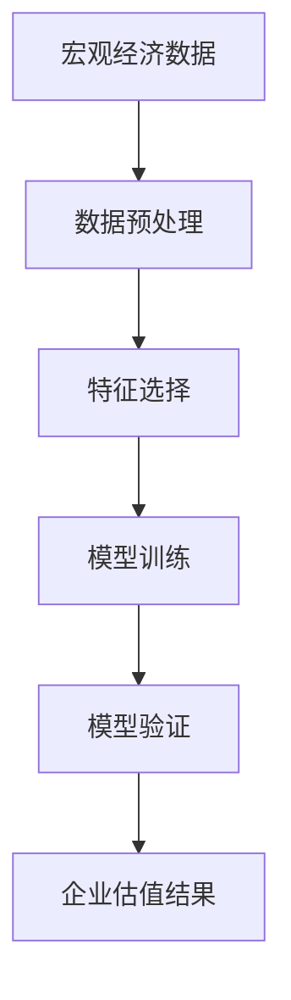
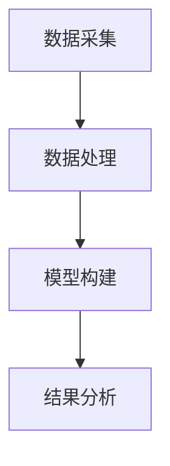
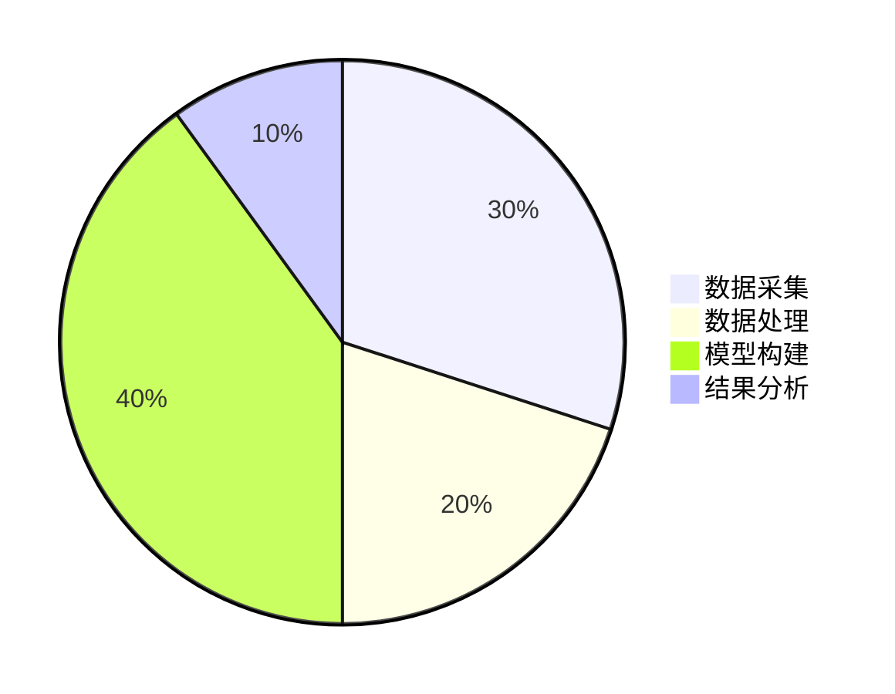
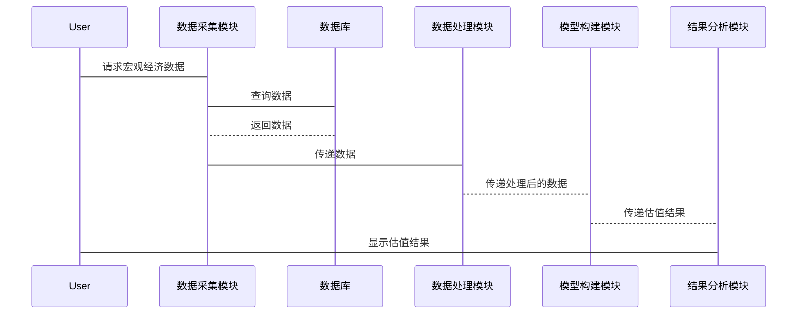

                 


# 如何在企业估值中考虑宏观经济因素

> 关键词：企业估值、宏观经济因素、GDP、利率、通货膨胀、经济周期、企业价值

> 摘要：本文详细探讨了在企业估值过程中如何考虑宏观经济因素。通过分析GDP、利率、通货膨胀等宏观经济指标对企业收入、成本和利润的影响，结合数学模型和实际案例，展示了如何将宏观经济因素融入企业估值模型中。文章还介绍了系统架构设计和项目实战，帮助读者全面理解和应用宏观经济因素对企业估值的影响。

---

## 第1章: 宏观经济对企业估值的影响

### 1.1 宏观经济对企业估值的核心作用

#### 1.1.1 宏观经济对企业估值的定义与范围
宏观经济因素是指影响整个经济体系的各种因素，如GDP增长率、利率、通货膨胀率、失业率等。这些因素通过影响企业的收入、成本和利润，进而影响企业的估值。

#### 1.1.2 宏观经济因素对企业价值的具体影响
- **收入影响**：宏观经济状况直接影响企业的销售收入。例如，在经济繁荣时期，消费者需求增加，企业收入增长；在经济衰退时期，需求下降，收入减少。
- **成本影响**：通货膨胀会导致企业成本上升，从而压缩利润空间。
- **利润影响**：宏观经济因素通过影响收入和成本，最终影响企业的净利润，从而影响企业估值。

#### 1.1.3 宏观经济与企业估值的内在联系
企业估值是基于未来现金流的折现，而宏观经济因素直接影响未来现金流的大小和时间价值。因此，宏观经济因素是企业估值的重要组成部分。

### 1.2 宏观经济因素的分类与特征

#### 1.2.1 宏观经济因素的主要分类
- **总量指标**：GDP增长率、失业率。
- **价格指标**：通货膨胀率。
- **利率指标**：基准利率、贷款利率。
- **市场指标**：消费者信心指数、投资信心指数。

#### 1.2.2 各类宏观经济因素的特征对比
| 宏观经济因素 | 特征描述 |
|--------------|-----------|
| GDP增长率    | 经济整体增长情况 |
| 通货膨胀率    | 货币购买力变化 |
| 利率          | 资金成本变化 |
| 失业率        | 劳动力市场情况 |

#### 1.2.3 宏观经济因素对企业估值的综合影响
宏观经济因素通过影响企业的经营环境、市场需求和成本结构，最终影响企业的盈利能力和估值。

---

## 第2章: 宏观经济因素对企业估值的具体影响机制

### 2.1 宏观经济因素对收入的影响

#### 2.1.1 GDP增长率对企业收入的影响
GDP增长率是衡量经济整体增长的重要指标。当GDP增长时，企业销售收入通常会增加。

#### 2.1.2 通货膨胀对企业收入的传导机制
通货膨胀会导致企业产品价格上涨，从而影响销售收入。然而，如果成本也上升，企业利润可能不会显著增加。

#### 2.1.3 利率对企业投资行为的影响
利率上升会增加企业的融资成本，降低投资意愿，从而影响销售收入。

### 2.2 宏观经济因素对成本的影响

#### 2.2.1 通货膨胀对企业成本的直接影响
通货膨胀会导致原材料、劳动力和运营成本上升，从而增加企业的总成本。

#### 2.2.2 利率对企业融资成本的影响
利率上升会增加企业的贷款成本，从而影响企业的整体成本结构。

#### 2.2.3 外部经济环境对企业供应链的影响
宏观经济环境的变化会影响企业的供应链稳定性，从而间接影响企业的成本。

### 2.3 宏观经济因素对利润的影响

#### 2.3.1 利润与GDP增长率的关系
GDP增长通常会带来企业利润的增加，但这也取决于成本的变化。

#### 2.3.2 通货膨胀对企业利润的双重影响
通货膨胀可能导致企业销售收入增加，但同时也会增加成本，因此对企业利润的影响是复杂的。

#### 2.3.3 利率对企业净利润的影响
利率上升会增加企业的融资成本，从而降低净利润。

---

## 第3章: 宏观经济因素在企业估值中的数学模型

### 3.1 宏观经济因素与企业估值的数学关系

#### 3.1.1 线性回归模型
企业估值（V）与宏观经济因素（X）之间的关系可以用线性回归模型表示：
$$ V = \beta_0 + \beta_1 X_1 + \beta_2 X_2 + \cdots + \beta_n X_n + \epsilon $$
其中，$X_i$ 是宏观经济因素，$\beta_i$ 是回归系数，$\epsilon$ 是误差项。

#### 3.1.2 多元回归模型
$$ V = \beta_0 + \beta_1 GDP + \beta_2 inflation + \beta_3 interest + \epsilon $$

### 3.2 宏观经济因素对企业估值的影响机制

#### 3.2.1 数据预处理
- 数据清洗：处理缺失值、异常值。
- 数据标准化：对不同量纲的宏观经济指标进行标准化处理。

#### 3.2.2 特征选择
- 选择与企业估值高度相关的宏观经济指标，如GDP增长率和通货膨胀率。

#### 3.2.3 模型训练
- 使用历史数据训练模型，确定回归系数。

#### 3.2.4 模型验证
- 使用交叉验证评估模型的准确性。

### 3.3 宏观经济因素与企业估值的流程图



### 3.4 宏观经济因素与企业估值的Python代码实现

```python
import pandas as pd
import numpy as np
from sklearn.linear_model import LinearRegression
from sklearn.metrics import mean_squared_error

# 加载数据
data = pd.read_csv('macroeconomic_factors.csv')

# 数据预处理
data.dropna(inplace=True)
data = data[["GDP", "inflation", "interest", "valuation"]]

# 特征选择
X = data[["GDP", "inflation", "interest"]]
y = data["valuation"]

# 模型训练
model = LinearRegression()
model.fit(X, y)

# 模型预测
predictions = model.predict(X)
print("均方误差:", mean_squared_error(y, predictions))
```

---

## 第4章: 宏观经济因素与企业估值的系统架构设计

### 4.1 系统功能设计

#### 4.1.1 系统功能模块
- 数据采集模块：采集宏观经济数据和企业数据。
- 数据处理模块：清洗和标准化数据。
- 模型构建模块：建立宏观经济因素与企业估值的关系模型。
- 结果分析模块：输出企业估值结果和宏观经济因素的影响分析。

#### 4.1.2 系统功能流程图



### 4.2 系统架构设计

#### 4.2.1 系统架构图



#### 4.2.2 系统接口设计
- 数据接口：与宏观经济数据库对接。
- 模型接口：与企业估值模型对接。
- 结果接口：输出企业估值结果。

### 4.3 系统交互设计

#### 4.3.1 系统交互序列图



---

## 第5章: 宏观经济因素与企业估值的项目实战

### 5.1 环境安装

#### 5.1.1 安装Python环境
```bash
pip install python
pip install numpy
pip install pandas
pip install scikit-learn
```

#### 5.1.2 数据集准备
```bash
# 下载宏观经济数据
wget https://example.com/macroeconomic_factors.csv
```

### 5.2 核心实现

#### 5.2.1 数据预处理
```python
import pandas as pd
import numpy as np

data = pd.read_csv('macroeconomic_factors.csv')
data.dropna(inplace=True)
```

#### 5.2.2 模型构建
```python
from sklearn.linear_model import LinearRegression

X = data[['GDP', 'inflation', 'interest']]
y = data['valuation']

model = LinearRegression()
model.fit(X, y)
```

#### 5.2.3 模型验证
```python
from sklearn.metrics import mean_squared_error

predictions = model.predict(X)
mse = mean_squared_error(y, predictions)
print("均方误差:", mse)
```

### 5.3 案例分析

#### 5.3.1 数据分析
假设我们有以下数据：
| GDP增长率 | 通货膨胀率 | 利率 | 企业估值 |
|----------|------------|------|----------|
| 3%       | 2%         | 5%   | 100亿    |
| 4%       | 3%         | 6%   | 120亿    |

#### 5.3.2 模型训练
通过训练模型，我们得到回归系数：
$$ V = 80 + 4 \times GDP + 2 \times inflation - 1 \times interest $$

#### 5.3.3 结果解读
当GDP增长率为5%，通货膨胀率为4%，利率为7%时：
$$ V = 80 + 4 \times 5 + 2 \times 4 - 1 \times 7 = 80 + 20 + 8 - 7 = 101亿 $$

---

## 第6章: 宏观经济因素与企业估值的最佳实践

### 6.1 小结
- 宏观经济因素是企业估值的重要组成部分。
- 通过数学模型和系统架构设计，可以有效考虑宏观经济因素的影响。

### 6.2 注意事项
- 数据质量是模型准确性的关键。
- 模型需要定期更新，以反映最新的宏观经济变化。

### 6.3 未来趋势
- 随着人工智能和大数据技术的发展，宏观经济因素在企业估值中的应用将更加智能化。

---

## 附录

### 附录A: 数据来源
- 宏观经济数据来源：国家统计局、央行等。

### 附录B: 工具推荐
- Python、Pandas、Scikit-learn。

### 附录C: 参考文献
- Smith, J. (2020). Macroeconomic Factors and Enterprise Valuation.

---

作者：AI天才研究院/AI Genius Institute & 禅与计算机程序设计艺术/Zen And The Art of Computer Programming

