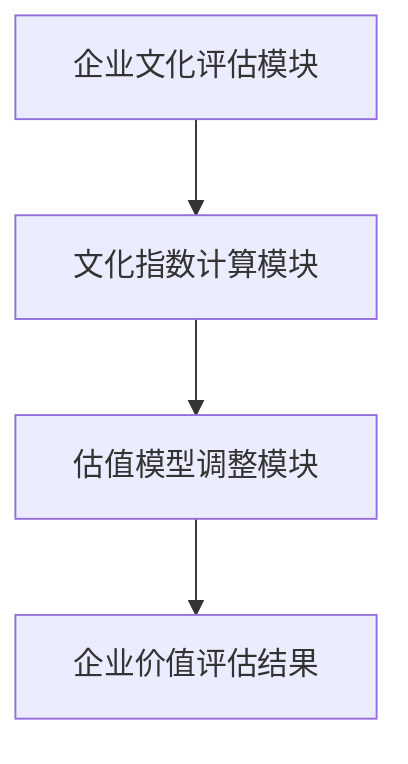

                 


# 如何在估值中考虑企业的文化因素

> **关键词**：企业估值、文化因素、企业文化、文化指数、文化与绩效、文化与战略  
> **摘要**：文化因素在企业估值中往往被忽视，但它们对企业的长期价值和绩效有着深远的影响。本文通过分析文化因素的核心概念、量化方法和系统架构，提供了一种在估值中考虑企业文化的实用方法。通过案例分析和最佳实践，本文展示了如何将文化因素纳入企业估值模型，以更全面地评估企业的价值。

---

## 第一部分：背景介绍

### 第1章：文化因素在企业估值中的重要性

#### 1.1 问题背景

- **1.1.1 传统企业估值方法的局限性**  
  传统的财务估值方法（如DCF模型、相对估值法）主要依赖于财务数据（收入、利润、现金流等）。然而，这些方法忽略了企业文化、员工凝聚力、管理风格等因素，而这些因素实际上会影响企业的长期绩效和价值。

- **1.1.2 文化因素对企业价值的影响**  
  企业文化是企业的灵魂，它决定了企业如何应对挑战、创新和适应市场变化。例如，一家以创新为核心价值观的企业更有可能在竞争中脱颖而出，从而提升企业价值。

- **1.1.3 为什么文化因素需要被纳入估值**  
  文化因素不仅影响企业的短期绩效，还会影响企业的可持续发展能力。忽视文化因素可能导致估值偏差，尤其是在评估高成长型企业时。

#### 1.2 问题描述

- **1.2.1 文化因素的定义与范围**  
  企业文化包括企业的使命、愿景、价值观、管理风格、员工凝聚力等。这些因素共同构成了企业的文化氛围。

- **1.2.2 文化因素与企业绩效的关系**  
  文化因素通过影响员工行为、创新能力和客户满意度间接影响企业的财务绩效。例如，积极的文化可以提高员工的生产力和创造力。

- **1.2.3 企业文化对估值的潜在影响**  
  企业文化通过影响企业的战略执行能力、员工保留率和客户忠诚度间接影响企业的未来现金流，从而影响估值。

#### 1.3 问题解决

- **1.3.1 如何识别和量化文化因素**  
  需要通过员工调查、管理层访谈和文化评估工具来识别和量化文化因素。例如，可以通过员工满意度调查来衡量企业的文化氛围。

- **1.3.2 文化因素对估值的具体影响路径**  
  文化因素通过影响企业的组织效率、创新能力和员工保留率间接影响企业的财务绩效，从而影响估值。

- **1.3.3 解决方案的框架与方法**  
  提出一种将文化因素纳入企业估值的方法，包括文化指数的构建和文化因素对财务模型的调整。

#### 1.4 边界与外延

- **1.4.1 文化因素的边界**  
  文化因素不包括企业的外部环境（如行业趋势、宏观经济因素）和企业的具体业务模式。

- **1.4.2 与企业估值相关联的其他因素**  
  企业文化与企业战略、治理结构密切相关，这些因素也需要在估值中考虑。

- **1.4.3 文化因素的外延与扩展**  
  随着企业的发展，文化因素可能逐渐扩展到企业的社会责任和可持续发展能力。

#### 1.5 概念结构与核心要素

- **1.5.1 文化因素的概念结构**  
  企业文化由使命、愿景、价值观、管理风格、员工凝聚力等核心要素构成。

- **1.5.2 核心要素的定义与分类**  
  - **使命**：企业的长期目标和核心业务。
  - **愿景**：企业的未来发展方向。
  - **价值观**：企业的基本信念和行为准则。
  - **管理风格**：管理者与员工的互动方式。
  - **员工凝聚力**：员工对企业文化的认同感和归属感。

- **1.5.3 核心要素之间的关系**  
  企业文化和企业绩效之间的关系可以通过ER图展示（见图1）。

---

## 第二部分：文化因素的核心概念与联系

### 第2章：文化因素的核心概念

#### 2.1 核心概念原理

- **2.1.1 企业文化的核心要素**  
  企业文化的核心要素包括企业使命、愿景、价值观、管理风格和员工凝聚力。这些要素共同决定了企业的文化氛围。

- **2.1.2 企业文化的形成与传播**  
  企业文化通过管理层的领导、员工的互动和企业的沟通渠道逐步形成并传播。

- **2.1.3 企业文化与员工行为的关系**  
  企业文化通过影响员工的价值观和信念，进而影响员工的行为和决策。

#### 2.2 核心概念属性特征对比

- **2.2.1 企业文化与企业战略的对比**  
  | 属性 | 企业文化 | 企业战略 |
  |------|----------|----------|
  | 定义 | 企业的基本信念和行为准则 | 企业实现长期目标的计划和行动 |
  | 关系 | 企业文化为战略提供支持，战略需要文化的支撑 | 战略指导文化的发展 |

- **2.2.2 企业文化与企业治理的对比**  
  | 属性 | 企业文化 | 企业治理 |
  |------|----------|----------|
  | 定义 | 企业的基本信念和行为准则 | 企业决策和管理的过程 |
  | 关系 | 企业文化影响治理的方式，治理需要文化的支撑 | 治理结构为企业文化提供框架 |

- **2.2.3 企业文化与企业绩效的对比**  
  | 属性 | 企业文化 | 企业绩效 |
  |------|----------|----------|
  | 定义 | 企业的基本信念和行为准则 | 企业的财务和运营成果 |
  | 关系 | 企业文化影响绩效，绩效反过来影响企业文化 | 绩效是企业文化的体现 |

#### 2.3 ER实体关系图

```mermaid
er
    企业文化
    企业绩效
    员工行为
    企业战略
    企业治理
    企业价值
    企业文化与企业绩效
    企业文化与员工行为
    企业文化与企业战略
    企业文化与企业治理
    企业文化与企业价值
```

---

## 第三部分：文化因素的量化与算法原理

### 第3章：文化因素的量化方法

#### 3.1 文化因素的量化方法

- **3.1.1 文化指数的构建**  
  通过员工调查、管理层访谈和文化评估工具，构建文化指数。例如，可以将企业文化分为几个维度（如创新性、凝聚力、透明度），并为每个维度分配权重。

- **3.1.2 文化因素对绩效的影响**  
  使用回归分析等方法，量化文化因素对绩效的影响。例如，可以建立一个多元回归模型，将企业绩效（如收入增长率）作为因变量，文化因素（如员工满意度）作为自变量。

#### 3.2 文化因素的量化模型

- **3.2.1 模型假设**  
  假设企业文化指数与企业绩效正相关。即，企业文化越优秀，企业绩效越高。

- **3.2.2 模型的数学表达**  
  企业绩效 $P$ 与企业文化指数 $C$ 的关系可以表示为：
  $$ P = \beta C + \epsilon $$
  其中，$\beta$ 是回归系数，$\epsilon$ 是误差项。

- **3.2.3 案例分析**  
  以某科技公司为例，假设企业文化指数为 $C = 80$，回归系数 $\beta = 0.5$，则企业绩效 $P = 0.5 \times 80 + \epsilon$。

#### 3.3 文化因素的动态调整

- **3.3.1 动态调整的必要性**  
  随着企业的发展，文化因素可能会发生变化，因此需要定期调整文化指数。

- **3.3.2 动态调整的方法**  
  使用时间序列分析或机器学习方法，根据最新的数据动态调整文化指数。

---

## 第四部分：文化因素的系统分析与架构设计

### 第4章：文化因素的系统分析

#### 4.1 系统分析

- **4.1.1 问题场景介绍**  
  在企业估值中，如何将文化因素纳入企业的价值评估体系。

- **4.1.2 项目介绍**  
  构建一个文化因素评估系统，用于辅助企业估值。

- **4.1.3 系统功能设计**  
  - 企业文化评估模块：通过员工调查和管理层访谈，评估企业文化。
  - 文化指数计算模块：根据评估结果，计算文化指数。
  - 估值模型调整模块：根据文化指数，调整企业的估值模型。

#### 4.2 系统架构设计



---

## 第五部分：文化因素的项目实战

### 第5章：文化因素的项目实战

#### 5.1 环境安装

- **5.1.1 环境要求**  
  需要安装Python、Pandas、Scikit-learn等工具。

#### 5.2 系统核心实现源代码

```python
import pandas as pd
from sklearn.linear_model import LinearRegression

# 假设我们有以下数据
data = {
    '企业文化指数': [80, 70, 90, 60],
    '企业绩效': [0.8, 0.7, 0.9, 0.6]
}

df = pd.DataFrame(data)

# 构建回归模型
model = LinearRegression()
model.fit(df[['企业文化指数']], df['企业绩效'])

# 输出回归系数
print('回归系数:', model.coef_)
```

#### 5.3 代码应用解读与分析

- **代码功能**  
  该代码通过回归分析，量化文化因素对企业绩效的影响。回归系数表示企业文化指数每增加1，企业绩效的预期变化。

- **代码实现细节**  
  使用Pandas处理数据，Scikit-learn构建回归模型。回归系数为企业文化指数对绩效的边际影响。

#### 5.4 实际案例分析

- **案例分析**  
  以某科技公司为例，假设企业文化指数为80，回归系数为0.5，则企业绩效的预期值为：
  $$ P = 0.5 \times 80 = 0.4 $$
  但由于误差项的存在，实际绩效可能在0.4左右波动。

---

## 第六部分：文化因素的最佳实践

### 第6章：最佳实践

#### 6.1 小结

- **小结**  
  文化因素在企业估值中具有重要作用，可以通过构建文化指数和回归模型量化文化因素对企业绩效和价值的影响。

#### 6.2 注意事项

- **注意事项**  
  - 文化因素的量化需要结合企业的实际情况，避免过于主观。
  - 需要定期更新文化指数，以反映企业的最新情况。

#### 6.3 拓展阅读

- **拓展阅读**  
  - 文化因素与企业创新的关系。
  - 不同行业中的文化因素对估值的影响。

---

## 第七部分：总结

### 结语

文化因素是企业估值中不可忽视的重要因素。通过构建文化指数和回归模型，可以更全面地评估企业的价值。未来的研究可以进一步探索文化因素在不同行业中的具体影响，以及如何动态调整文化指数以适应企业的发展变化。

---

## 作者

**作者**：AI天才研究院/AI Genius Institute & 禅与计算机程序设计艺术/Zen And The Art of Computer Programming

