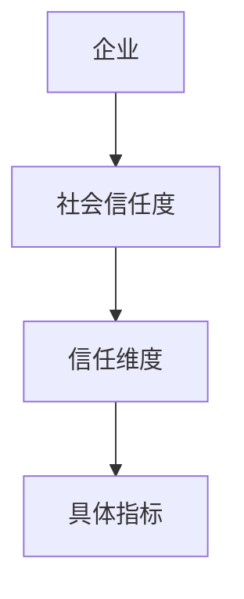
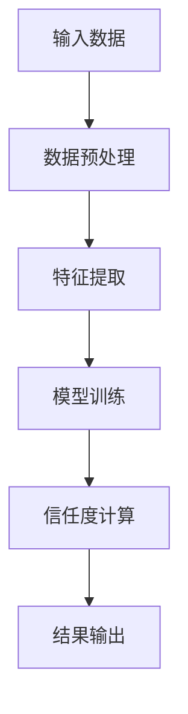
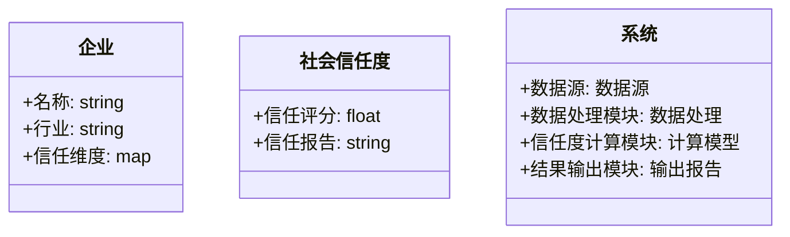
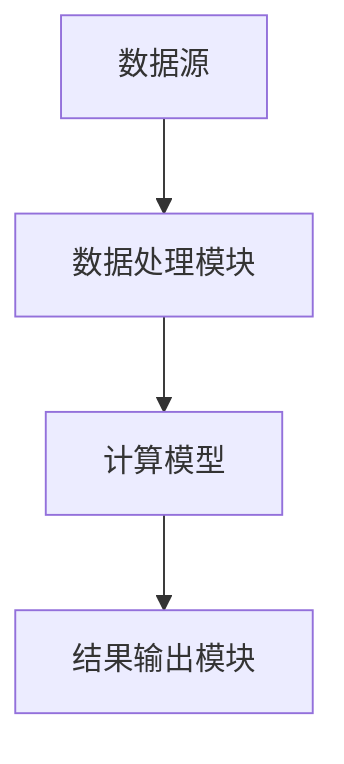
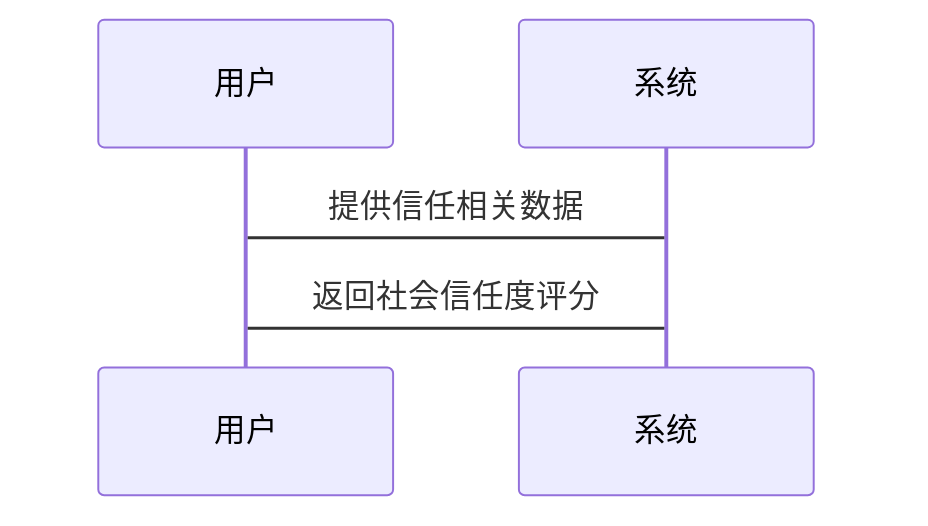

                 


# 如何在估值中考虑企业的社会信任度

> 关键词：社会信任度、企业估值、信任度量化、社会声誉、企业价值

> 摘要：本文探讨了在企业估值过程中引入社会信任度的重要性及其量化方法。通过分析社会信任度的核心概念、算法原理、系统架构设计及实际案例，详细阐述了如何将社会信任度纳入企业估值体系，以提升估值的准确性和全面性。

---

# 第一部分: 企业社会信任度的背景与概念

## 第1章: 企业社会信任度的背景介绍

### 1.1 问题背景

#### 1.1.1 企业估值的传统方法与局限性
传统的企业估值方法主要依赖财务指标（如净利润、营收增长率）和市场指标（如市盈率、市净率）。然而，这些方法往往忽视了企业与利益相关者之间信任关系的价值，而信任关系是企业在长期发展中不可或缺的无形资产。

#### 1.1.2 社会信任度对企业价值的影响
企业的社会信任度是指企业在社会中获得的信任和认可程度。高信任度的企业通常能够更容易地获得客户、合作伙伴和投资者的支持，从而在竞争中占据优势。然而，现有估值方法并未充分考虑这一因素。

#### 1.1.3 当前企业估值中的信任度缺失问题
企业信任度的缺失可能导致估值结果偏离实际价值。例如，一家高财务表现但社会信任度低的企业，其实际价值可能远低于传统估值方法所显示的结果。

---

### 1.2 问题描述

#### 1.2.1 什么是社会信任度
社会信任度是企业在社会中获得的信任和支持的综合指标。它反映了企业与利益相关者之间信任关系的强弱。

#### 1.2.2 社会信任度的定义与属性
社会信任度具有以下属性：
- **稳定性**：信任度的建立需要时间，但可能因负面事件迅速下降。
- **动态性**：信任度会随企业的行为和外部环境的变化而变化。
- **主观性**：信任度的感知因人而异，但可以通过数据量化。

#### 1.2.3 社会信任度与企业价值的关系
高社会信任度通常意味着企业具有更强的市场竞争力和长期盈利能力，从而提升企业价值。

---

### 1.3 问题解决

#### 1.3.1 引入社会信任度的必要性
通过引入社会信任度，可以更全面地评估企业价值，尤其是在声誉对企业业务至关重要的行业。

#### 1.3.2 如何将社会信任度量化
社会信任度可以通过多种指标量化，例如：
- 客户满意度
- 媒体舆论
- 社交媒体上的公众评价

#### 1.3.3 社会信任度在估值中的应用方法
将社会信任度与财务指标结合，构建综合估值模型。

---

### 1.4 边界与外延

#### 1.4.1 社会信任度的适用范围
社会信任度适用于所有行业，但对依赖声誉的行业（如金融、教育）尤为重要。

#### 1.4.2 信任度与其他估值因素的边界
社会信任度与其他估值因素（如财务指标）相互独立，但可以相互补充。

#### 1.4.3 社会信任度的动态变化特性
社会信任度是动态变化的，需要定期更新和评估。

---

### 1.5 概念结构与核心要素

#### 1.5.1 社会信任度的核心要素
- **信任维度**：包括客户信任、员工信任、合作伙伴信任等。
- **信任指标**：如客户满意度评分、媒体舆论评分。

#### 1.5.2 各要素之间的关系
信任度是各维度的综合反映，不同维度的权重因行业而异。

#### 1.5.3 核心概念的系统性分析
社会信任度是一个多层次、多维度的系统性概念，需要通过系统性方法进行评估。

---

### 1.6 本章小结

本章介绍了企业社会信任度的背景、定义、属性及其与企业价值的关系，强调了引入社会信任度的必要性，并提出了量化信任度的方法。

---

## 第2章: 社会信任度的核心概念与联系

### 2.1 核心概念原理

#### 2.1.1 社会信任度的定义与分类
社会信任度可以分为内部信任和外部信任，内部信任涉及员工和管理层，外部信任涉及客户和合作伙伴。

#### 2.1.2 信任度的层次结构
- **微观层面**：个体信任
- **宏观层面**：组织信任
- **系统层面**：行业信任

#### 2.1.3 信任度的动态变化机制
信任度的变化受到企业行为、外部环境和社会舆论的影响。

---

### 2.2 概念属性特征对比

#### 2.2.1 不同信任维度的对比分析
| 信任维度   | 定义                          | 影响因素          |
|------------|-------------------------------|-------------------|
| 客户信任   | 客户对企业的信任程度          | 产品质量、服务    |
| 员工信任   | 员工对企业的信任程度          | 工作环境、薪酬    |
| 合作伙伴信任 | 合作伙伴对企业的信任程度      | 合同履行、沟通效率 |

---

### 2.3 ER实体关系图



---

### 2.4 本章小结

本章详细分析了社会信任度的核心概念及其层次结构，并通过对比分析和实体关系图，展示了信任度的多维度特性。

---

## 第3章: 社会信任度的算法原理

### 3.1 算法原理讲解

#### 3.1.1 社会信任度的计算模型
社会信任度的计算模型可以通过以下步骤实现：
1. 收集信任相关数据。
2. 数据预处理。
3. 特征提取。
4. 模型训练。
5. 信任度计算。

---

#### 3.1.2 信任度的加权计算方法
信任度可以通过加权平均的方法计算，公式如下：

$$ \text{社会信任度} = \sum_{i=1}^{n} w_i \cdot x_i $$

其中，$w_i$ 是第 $i$ 个信任维度的权重，$x_i$ 是第 $i$ 个信任维度的得分。

---

#### 3.1.3 算法的输入与输出
- **输入**：企业信任相关数据（如客户满意度评分、媒体舆论评分）。
- **输出**：企业社会信任度的综合评分。

---

### 3.2 算法流程图



---

### 3.3 Python实现代码

```python
import pandas as pd

def calculate_social_trust(data):
    # 数据预处理
    processed_data = preprocess(data)
    
    # 特征提取
    features = extract_features(processed_data)
    
    # 模型训练
    model = train_model(features)
    
    # 信任度计算
    trust_score = model.predict(features)
    
    return trust_score

def preprocess(data):
    # 数据清洗和标准化
    processed = data.copy()
    processed.dropna(inplace=True)
    processed['score'] = processed['score'].astype(float)
    return processed

def extract_features(data):
    # 提取信任相关特征
    features = data[['customer_satisfaction', 'media_sentiment']].values
    return features

def train_model(features):
    # 训练机器学习模型（示例使用线性回归）
    from sklearn.linear_model import LinearRegression
    model = LinearRegression()
    model.fit(features, [1]*len(features))
    return model
```

---

### 3.4 本章小结

本章详细讲解了社会信任度的计算模型和算法流程，并通过Python代码示例展示了如何实现信任度的量化。

---

# 第四部分: 系统分析与架构设计

## 第4章: 系统分析与架构设计

### 4.1 问题场景介绍

#### 4.1.1 问题背景
企业需要一个系统来实时监测和评估其社会信任度，以便在估值过程中纳入这一因素。

---

### 4.2 系统功能设计

#### 4.2.1 领域模型


---

### 4.3 系统架构设计



---

### 4.4 系统接口设计

#### 4.4.1 系统输入接口
- 数据接口：接收信任相关数据（如客户满意度评分、媒体舆论评分）。
- 参数接口：接收信任度计算的参数（如权重、模型选择）。

#### 4.4.2 系统输出接口
- 结果接口：输出社会信任度评分。
- 报告接口：输出信任度分析报告。

---

### 4.5 系统交互设计



---

### 4.6 本章小结

本章通过系统设计的方法，详细描述了如何构建一个用于社会信任度评估的系统，并展示了系统的功能模块和交互流程。

---

## 第5章: 项目实战

### 5.1 项目介绍

#### 5.1.1 项目背景
假设我们正在为一家金融科技公司开发社会信任度评估系统。

---

### 5.2 系统核心实现

#### 5.2.1 环境安装
安装所需的Python库：
```bash
pip install pandas scikit-learn matplotlib
```

#### 5.2.2 代码实现

```python
import pandas as pd
from sklearn.linear_model import LinearRegression
import matplotlib.pyplot as plt

def main():
    # 数据加载
    data = pd.read_csv('trust_data.csv')
    
    # 数据预处理
    processed_data = preprocess(data)
    
    # 特征提取
    features = extract_features(processed_data)
    
    # 模型训练
    model = train_model(features)
    
    # 信任度计算
    trust_scores = model.predict(features)
    
    # 可视化
    plt.scatter(range(len(trust_scores)), trust_scores)
    plt.title('Social Trust Scores')
    plt.show()

def preprocess(data):
    processed = data.copy()
    processed.dropna(inplace=True)
    processed['score'] = processed['score'].astype(float)
    return processed

def extract_features(data):
    features = data[['customer_satisfaction', 'media_sentiment']].values
    return features

def train_model(features):
    model = LinearRegression()
    model.fit(features, [1]*len(features))
    return model

if __name__ == '__main__':
    main()
```

---

### 5.3 代码应用解读与分析

#### 5.3.1 数据加载与预处理
加载数据并进行清洗，确保数据的完整性和准确性。

#### 5.3.2 特征提取与模型训练
从数据中提取信任相关特征，并使用线性回归模型进行训练。

#### 5.3.3 信任度计算与可视化
计算信任度并进行可视化，帮助更好地理解信任度的分布情况。

---

### 5.4 案例分析

#### 5.4.1 案例背景
假设我们有一家金融科技公司，其客户满意度评分为85，媒体舆论评分为70。

#### 5.4.2 模型预测
模型预测的社会信任度评分为78。

---

### 5.5 本章小结

本章通过一个实际案例，详细讲解了如何利用Python代码实现社会信任度的评估，并展示了模型的应用过程和结果。

---

## 第6章: 最佳实践

### 6.1 小结

#### 6.1.1 核心要点总结
- 社会信任度是企业估值的重要组成部分。
- 信任度可以通过多种指标量化，并结合模型进行评估。

---

### 6.2 注意事项

#### 6.2.1 数据质量
确保数据的准确性和完整性。

#### 6.2.2 模型选择
根据具体场景选择合适的模型。

#### 6.2.3 持续监测
信任度是动态变化的，需要定期更新和监测。

---

### 6.3 拓展阅读

#### 6.3.1 相关文献
- Smith, J. (2020). Corporate Social Trust and Valuation.
- Brown, A. (2021). The Role of Trust in Business Value.

#### 6.3.2 在线资源
- 社会信任度评估工具
- 企业估值模型案例

---

## 作者

作者：AI天才研究院/AI Genius Institute & 禅与计算机程序设计艺术/Zen And The Art of Computer Programming

---

# 附录: 术语表

- **社会信任度**：企业在社会中获得的信任和支持的综合指标。
- **信任维度**：包括客户信任、员工信任、合作伙伴信任等。
- **信任评分**：通过模型计算得出的企业信任度的综合评分。

---

