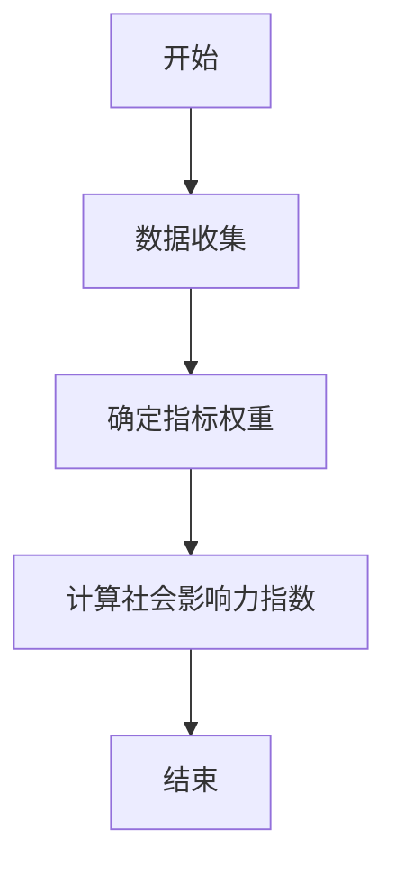
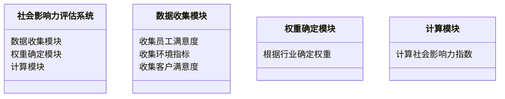

                 


# 如何在估值中考虑企业的社会影响力

## 关键词

企业估值、社会影响力、ESG投资、可持续发展、社会价值

## 摘要

在当前全球经济环境下，企业估值不仅仅是对财务表现的关注，更需要考虑企业的社会影响力。随着可持续发展和ESG投资理念的兴起，企业的社会影响力已成为投资者和企业管理者关注的重要指标。本文将从理论到实践，详细分析如何在企业估值中考虑社会影响力，并提供具体的实施方法和案例。

---

## 第1章: 问题背景与研究意义

### 1.1 企业社会影响力的概念与背景

#### 1.1.1 企业社会影响力的基本定义

企业社会影响力是指企业在经营过程中对社会、环境和利益相关者所产生的正面或负面的影响。它不仅包括企业的经济贡献，还包括企业在社会责任、可持续发展、员工福祉、环境保护等方面的作为。

#### 1.1.2 社会影响力与企业价值的关系

社会影响力能够影响企业的品牌形象、客户忠诚度、员工满意度以及风险管理能力。积极的社会影响力通常会带来更高的企业价值，而负面的社会影响力则可能导致企业价值的下降。

#### 1.1.3 当前社会影响力在估值中的重要性

随着全球对可持续发展的关注增加，投资者越来越关注企业的社会影响力。将社会影响力纳入估值模型可以帮助投资者更全面地评估企业的长期价值。

### 1.2 问题描述与研究目标

#### 1.2.1 传统企业估值的局限性

传统的估值方法主要依赖财务指标，如净利润、营业收入和资产规模等，忽视了企业在社会、环境和治理方面的表现。

#### 1.2.2 引入社会影响力对估值的影响

通过引入社会影响力，可以更全面地评估企业的长期风险和机会，从而为投资者提供更准确的估值依据。

#### 1.2.3 研究目标与意义

本文的目标是提出一种将社会影响力纳入企业估值模型的方法，并通过实际案例验证其可行性和有效性。

### 1.3 问题解决与边界条件

#### 1.3.1 如何将社会影响力纳入估值模型

通过定义社会影响力的关键指标，并将其与财务指标相结合，构建综合估值模型。

#### 1.3.2 边界与外延：社会影响力在估值中的适用范围

社会影响力适用于所有行业，但其权重在不同行业中的重要性可能有所不同。例如，在环保行业，社会影响力可能比在传统制造业更重要。

#### 1.3.3 核心要素与组成结构

社会影响力包括以下核心要素：员工福祉、环境保护、社会责任、员工参与度、客户满意度和供应链管理。

---

## 第2章: 社会影响力的核心概念与原理

### 2.1 社会影响力的定义与属性特征

#### 2.1.1 社会影响力的多维度分析

社会影响力可以从以下几个方面进行分析：

1. **员工层面**：员工的工作满意度、职业发展机会和工作环境。
2. **客户层面**：客户满意度、品牌忠诚度和客户关系管理。
3. **环境层面**：碳排放、资源消耗和环保措施。
4. **治理层面**：公司治理结构、透明度和风险管理能力。

#### 2.1.2 核心概念对比表（社会影响力与财务绩效的对比）

| 属性       | 社会影响力                | 财务绩效                |
|------------|--------------------------|-------------------------|
| 时间维度   | 长期影响为主              | 短期和长期影响          |
| 数据来源    | 非财务指标（如员工满意度） | 财务指标（如净利润）    |
| 影响范围    | 广泛影响企业内外部关系    | 主要影响企业的财务状况  |

#### 2.1.3 用Mermaid图展示ER关系

```mermaid
erDiagram
    actor 社会影响力评估者 {
        string 员工满意度
        string 环境影响指标
        string 客户满意度
    }
    actor 企业 {
        string 财务指标
        string 治理结构
    }
    社会影响力评估者 --> 企业 : 评估社会影响力
```

### 2.2 社会影响力与企业价值的关系

#### 2.2.1 社会影响力对企业声誉的影响

积极的社会影响力可以提升企业的品牌形象，增强市场竞争力。

#### 2.2.2 社会影响力对长期财务表现的影响

良好的社会影响力通常与较高的客户忠诚度和员工留存率相关，从而提升企业的长期盈利能力。

#### 2.2.3 社会影响力对风险评估的作用

负面的社会影响力可能导致声誉风险和法律风险，进而影响企业的估值。

---

## 第3章: 社会影响力评估的算法原理

### 3.1 算法原理概述

#### 3.1.1 社会影响力评估的基本步骤

1. **数据收集**：收集企业的社会影响力相关数据，包括员工满意度、环境指标等。
2. **指标权重确定**：根据行业特点和企业战略，确定各项社会影响力指标的权重。
3. **评分计算**：根据指标权重和评分标准，计算企业的社会影响力指数。

#### 3.1.2 算法流程图（Mermaid）



### 3.2 数学模型与公式

#### 3.2.1 社会影响力指数计算公式

$$ S = \sum_{i=1}^{n} w_i \cdot s_i $$

其中，\( w_i \) 为第i个社会影响力的权重，\( s_i \) 为第i个社会影响力的评分。

#### 3.2.2 示例计算

假设某企业有三个社会影响力指标：

- 员工满意度（权重0.4，评分80）
- 环境影响（权重0.3，评分70）
- 客户满意度（权重0.3，评分85）

则社会影响力指数为：

$$ S = 0.4 \times 80 + 0.3 \times 70 + 0.3 \times 85 = 32 + 21 + 25.5 = 78.5 $$

### 3.3 举例说明

通过上述公式，我们可以将社会影响力指数与财务指标相结合，构建综合估值模型。

---

## 第4章: 系统分析与架构设计

### 4.1 问题场景介绍

社会影响力评估系统的应用场景包括企业自评估、投资者决策支持和政策制定等。

### 4.2 系统功能设计

#### 4.2.1 领域模型（Mermaid类图）



#### 4.2.2 系统架构设计（Mermaid架构图）

```mermaid
container 社会影响力评估系统 {
    actor 用户
    actor 企业
    actor 投资者
}
    用户 --> 数据收集模块 : 提供数据
    企业 --> 数据收集模块 : 提供数据
    投资者 --> 数据收集模块 : 提供数据
    数据收集模块 --> 权重确定模块 : 传递数据
    权重确定模块 --> 计算模块 : 传递数据
    计算模块 --> 用户 : 提供社会影响力指数
```

---

## 第5章: 项目实战

### 5.1 项目介绍

以某科技企业为例，分析如何将社会影响力纳入其估值模型。

### 5.2 环境安装

安装必要的软件和工具，如Python、Pandas、Matplotlib等。

### 5.3 核心代码实现

```python
import pandas as pd

# 定义社会影响力指数计算函数
def calculate_social_influence(weights, scores):
    return sum(weights[i] * scores[i] for i in range(len(weights)))

# 示例数据
weights = [0.4, 0.3, 0.3]
scores = [80, 70, 85]

# 计算社会影响力指数
social_influence = calculate_social_influence(weights, scores)
print(f"社会影响力指数：{social_influence}")
```

### 5.4 案例分析

通过具体案例分析，展示社会影响力指数对企业估值的影响。

### 5.5 项目小结

总结项目实施的关键步骤和经验教训。

---

## 第6章: 总结与展望

### 6.1 本章小结

本文详细介绍了如何在企业估值中考虑社会影响力，并提出了具体的实施方法和案例。

### 6.2 未来研究方向

未来可以进一步研究如何将社会影响力与ESG投资相结合，构建更全面的估值模型。

### 6.3 注意事项

在实际应用中，需要注意数据获取的难度和模型的复杂性。

### 6.4 拓展阅读

推荐相关书籍和论文，供读者进一步学习。

---

## 作者：AI天才研究院/AI Genius Institute & 禅与计算机程序设计艺术 /Zen And The Art of Computer Programming

---

通过本文的详细分析，读者可以全面了解如何在企业估值中考虑社会影响力，并能够在实际中应用这些方法。

