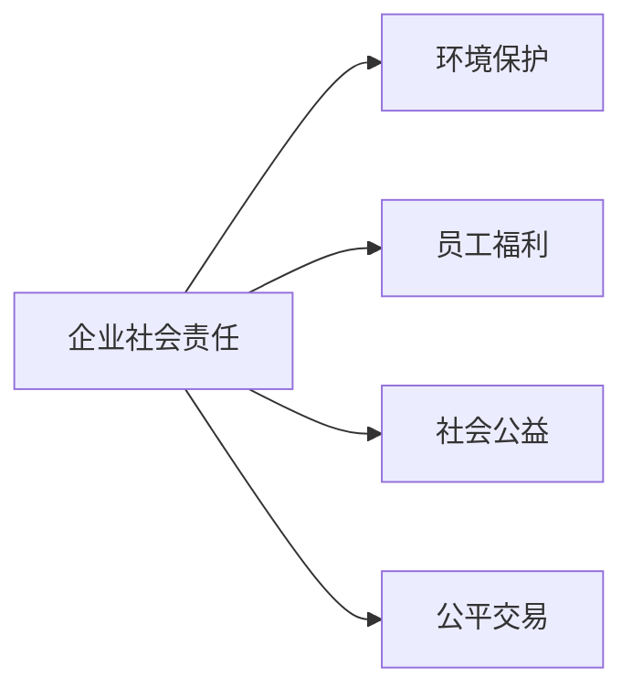
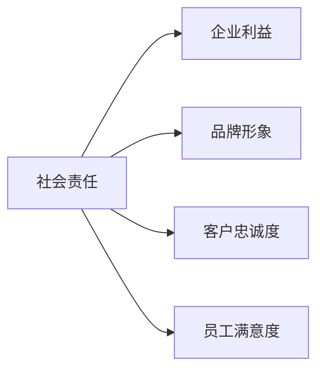

                 


# 如何在估值中考虑企业的社会责任

## 关键词：企业社会责任、企业估值、ESG因素、可持续发展、财务模型、社会影响、治理结构

## 摘要：  
随着全球对企业社会责任（Corporate Social Responsibility, CSR）的关注不断增加，企业在追求经济效益的同时，也需要承担起对社会和环境的责任。然而，传统的企业估值方法往往忽视了社会责任的重要性。本文将探讨如何在企业估值中考虑社会责任，分析其对企业价值的影响，并提出一种将社会责任因素纳入估值模型的方法。通过案例分析和数学模型，本文为投资者和企业管理者提供了一个全新的视角，以更全面地评估企业的长期价值。

---

## 第1章：背景介绍

### 1.1 问题背景

#### 1.1.1 企业社会责任的定义与内涵  
企业社会责任（Corporate Social Responsibility, CSR）是指企业在追求经济效益的同时，还需要关注环境保护、员工福利、社会公益、公平交易等方面的责任。企业社会责任不仅包括企业对员工、客户和社会的义务，还包括对环境的保护和资源的可持续利用。

#### 1.1.2 传统企业估值的局限性  
传统的企业估值方法（如市盈率、市净率、 discounted cash flow model 等）主要关注企业的财务指标，如收入、利润、现金流等。然而，这些方法往往忽视了企业在社会责任方面的表现，未能全面反映企业的长期价值和风险。

#### 1.1.3 社会责任对企业价值的影响  
企业的社会责任表现直接影响其品牌形象、员工稳定性、客户忠诚度和社会声誉。此外，社会责任良好的企业通常在风险管理和可持续发展方面表现更优，这些因素都能提升企业的长期价值。

---

### 1.2 问题描述

#### 1.2.1 社会责任在企业估值中的重要性  
社会责任是企业长期成功的关键因素之一。企业通过履行社会责任，可以降低经营风险，增强社会信任，从而提升市场价值。

#### 1.2.2 当前企业估值中社会责任的缺失  
大多数企业估值模型未将社会责任因素纳入考量，导致企业的真实价值被低估或高估。

#### 1.2.3 社会责任对企业长期价值的影响  
社会责任表现优秀的企业通常具有更高的品牌价值、客户忠诚度和员工满意度，这些因素都能为企业创造更大的长期价值。

---

### 1.3 问题解决

#### 1.3.1 引入社会责任作为估值新维度  
将社会责任作为企业估值的一个重要维度，构建一个更加全面的估值模型。

#### 1.3.2 建立社会责任与企业价值的关联模型  
通过分析社会责任对企业财务指标的影响，建立一个能够量化社会责任贡献的模型。

#### 1.3.3 提供社会责任影响企业估值的方法论  
本文将提出一种基于社会责任的加权评分系统，并将其纳入企业估值模型中。

---

### 1.4 边界与外延

#### 1.4.1 社会责任的适用范围  
社会责任适用于所有行业，但不同行业对社会责任的关注点可能有所不同。例如，制造业可能更关注环境保护，而金融行业可能更关注公平交易。

#### 1.4.2 企业社会责任与企业估值的边界  
社会责任的范围包括环境保护、员工福利、社会公益等方面，但企业估值主要关注其对财务绩效的影响。

#### 1.4.3 相关概念的区分与联系  
社会责任与企业治理（Governance）、企业伦理（Ethics）密切相关。企业治理是社会责任的一部分，而企业伦理则影响社会责任的表现。

---

### 1.5 概念结构与核心要素

#### 1.5.1 概念结构图  


#### 1.5.2 核心要素分析  
企业社会责任的核心要素包括：  
1. 环境保护：减少碳排放、资源节约等。  
2. 员工福利：员工待遇、工作条件、职业发展等。  
3. 社会公益：慈善捐赠、社区支持等。  
4. 公平交易：供应链透明度、公平定价等。

---

## 第2章：社会责任的核心概念与联系

### 2.1 核心概念原理

#### 2.1.1 企业社会责任的分类  
企业社会责任可以分为以下几类：  
1. 环境责任：减少污染、节约能源等。  
2. 社会责任：员工福利、社区支持等。  
3. 治理责任：公司治理、透明度等。

#### 2.1.2 社会责任与企业利益的关系  
社会责任与企业利益并非对立关系。履行社会责任可以提升企业的品牌形象、客户忠诚度和员工满意度，从而为企业创造更大的价值。

---

### 2.2 概念属性特征对比

#### 2.2.1 表格对比：社会责任与企业利益的属性特征  
| 特性               | 社会责任              | 企业利益              |
|--------------------|----------------------|-----------------------|
| 关注点             | 环境、社会、治理      | 财务绩效、市场表现     |
| 影响范围           | 社会、环境、员工      | 股东、客户、管理层     |
| 目标               | 减少负面影响，提升社会福祉 | 最大化利润，提升市场价值 |

#### 2.2.2 图表展示：社会责任与企业利益的关系  


---

## 第3章：社会责任影响企业估值的算法原理

### 3.1 算法原理

#### 3.1.1 基于社会责任的加权评分系统  
社会责任评分系统将企业的社会责任表现量化为一个分数，该分数可以作为企业估值的调整因子。

#### 3.1.2 社会责任对企业价值的影响模型  
企业价值 = 基础估值 + 社会责任评分 × 调整系数

#### 3.1.3 算法流程图  


---

### 3.2 算法实现

#### 3.2.1 Python代码示例：社会责任评分系统  
```python
def calculate_social Responsibility_score(enterprise):
    score = 0
    # 环境责任评分
    score += enterprise.environment_score * 0.4
    # 社会责任评分
    score += enterprise.social_score * 0.3
    # 治理责任评分
    score += enterprise.governance_score * 0.3
    return score
```

#### 3.2.2 代码解读  
上述代码将企业的环境、社会和治理责任评分分别赋予不同的权重（环境40%，社会30%，治理30%），并计算出综合的社会责任评分。

---

## 第4章：系统分析与架构设计

### 4.1 问题场景介绍

#### 4.1.1 系统功能设计  
系统功能包括：社会责任数据收集、社会责任评分计算、企业估值计算、结果可视化等。

#### 4.1.2 系统架构设计  


---

## 第5章：项目实战

### 5.1 环境安装

#### 5.1.1 系统环境  
需要安装Python、相关库（如numpy、pandas）和Mermaid工具。

#### 5.1.2 安装步骤  
```bash
pip install numpy pandas
```

---

### 5.2 核心代码实现

#### 5.2.1 Python代码示例：社会责任评分系统  
```python
import numpy as np
import pandas as pd

def calculate_social Responsibility_score(enterprise):
    score = 0
    score += enterprise.environment_score * 0.4
    score += enterprise.social_score * 0.3
    score += enterprise.governance_score * 0.3
    return score

# 示例数据
data = {
    'environment_score': [0.8, 0.7, 0.9],
    'social_score': [0.6, 0.8, 0.7],
    'governance_score': [0.7, 0.6, 0.8]
}
df = pd.DataFrame(data)

# 计算社会责任评分
social_scores = []
for index in df.index:
    enterprise = df.iloc[index]
    score = calculate_social Responsibility_score(enterprise)
    social_scores.append(score)

print("社会责任评分：", social_scores)
```

---

### 5.3 代码应用解读与分析

#### 5.3.1 代码解读  
上述代码将企业的环境、社会和治理责任评分分别赋予不同的权重，并计算出综合的社会责任评分。

#### 5.3.2 代码分析  
通过代码可以发现，企业社会责任评分是通过多因素加权计算得出的，这有助于将社会责任量化，并将其纳入企业估值模型。

---

## 第6章：最佳实践与小结

### 6.1 小结

#### 6.1.1 核心观点总结  
企业在追求经济效益的同时，必须履行社会责任，这不仅有助于提升企业的品牌形象，还能降低经营风险，提升长期价值。

#### 6.1.2 方法论总结  
本文提出了一种基于社会责任的加权评分系统，并将其纳入企业估值模型中，为投资者和企业管理者提供了一个全新的视角。

---

### 6.2 注意事项

#### 6.2.1 数据收集的挑战  
社会责任数据的收集可能面临困难，尤其是中小企业可能缺乏相关数据。

#### 6.2.2 指标权重的调整  
不同行业对社会责任的关注点不同，因此在实际应用中需要根据具体情况调整指标的权重。

---

### 6.3 拓展阅读

#### 6.3.1 相关书籍  
1. 《Corporate Social Responsibility》  
2. 《The Triple Bottom Line》  

#### 6.3.2 相关博客  
1. [社会责任与企业治理](#)  
2. [可持续发展与企业价值](#)  

---

## 作者：AI天才研究院/AI Genius Institute & 禅与计算机程序设计艺术 /Zen And The Art of Computer Programming

