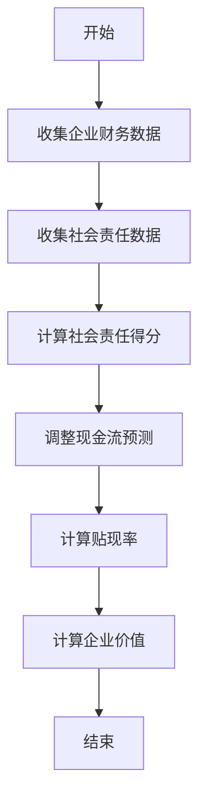
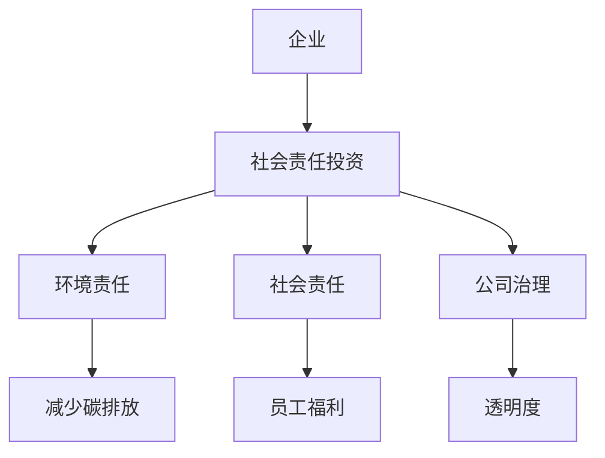

                 


# 如何在估值中考虑企业的社会责任投资

> 关键词：企业社会责任投资, 企业估值, 贴现现金流模型, 可持续发展, 社会价值

> 摘要：本文探讨了如何在企业估值过程中考虑社会责任投资。通过分析社会责任投资的定义、特征及其对传统估值方法的影响，本文提出了一种将社会责任投资因素纳入企业估值模型的方法，并通过具体案例展示了其应用。

---

## 第一部分：背景介绍

### 第1章：社会责任投资的背景与问题背景

#### 1.1 问题背景

- **1.1.1 可持续发展与企业责任的兴起**
  - 随着全球对可持续发展的关注增加，企业社会责任（Corporate Social Responsibility, CSR）投资逐渐成为资本市场的重要组成部分。
  - 投资者越来越关注企业在创造经济价值的同时，是否也在创造社会价值。

- **1.1.2 传统估值方法的局限性**
  - 传统的企业估值方法主要基于财务指标（如净利润、现金流等）进行评估，忽略了企业在社会责任方面的投入和成果。
  - 这种单一的估值方法可能导致企业价值被低估，尤其是在社会责任表现优异的企业中。

- **1.1.3 社会责任投资对企业价值的影响**
  - 社会责任投资（ESG投资）越来越受到投资者的青睐，企业如果在环境、社会和治理方面表现良好，通常会获得更高的估值。

#### 1.2 问题描述

- **1.2.1 企业社会责任投资的核心概念**
  - 企业社会责任投资是指企业在追求经济利益的同时，积极履行社会责任，包括环境保护、员工福利、社区贡献等方面。

- **1.2.2 企业社会责任投资与传统投资的区别**
  - 传统投资主要关注财务回报，而社会责任投资同时关注社会和环境影响。
  - 传统估值方法忽略了社会责任因素，而社会责任投资要求将这些因素纳入估值模型。

- **1.2.3 社会责任投资对企业估值的挑战**
  - 如何量化社会责任投资的成果，将其与企业价值联系起来。
  - 如何在传统估值模型中引入社会责任因素，使其成为影响企业价值的重要组成部分。

#### 1.3 问题解决

- **1.3.1 引入社会责任投资的必要性**
  - 社会责任投资能够反映企业的综合价值，包括经济、社会和环境价值。
  - 通过引入社会责任投资，可以更全面地评估企业的长期发展潜力。

- **1.3.2 如何将社会责任投资因素纳入企业估值**
  - 在传统估值模型中，引入社会责任相关的指标（如碳排放、员工满意度、社会公益支出等）。
  - 将社会责任表现与企业未来的现金流相结合，进行调整和预测。

- **1.3.3 社会责任投资对股东价值的影响**
  - 良好的社会责任表现可以提升企业的品牌形象，增强客户忠诚度，从而间接提高企业价值。
  - 在某些情况下，社会责任投资可以带来直接的经济回报，例如通过减少环境成本或提升员工效率。

#### 1.4 边界与外延

- **1.4.1 社会责任投资的范围界定**
  - 社会责任投资的范围包括企业在环境保护、社会责任、公司治理等方面的所有活动。
  - 这些活动可能包括减少碳排放、提高员工福利、支持社区发展等。

- **1.4.2 企业社会责任投资的边界条件**
  - 企业社会责任投资需要与企业的核心业务相结合，避免脱离实际业务。
  - 社会责任投资的成果需要可量化，以便与企业价值联系起来。

- **1.4.3 社会责任投资与企业核心业务的关系**
  - 社会责任投资不是企业核心业务的替代，而是其重要组成部分。
  - 通过社会责任投资，企业可以在提升社会价值的同时，增强自身的竞争力。

#### 1.5 核心概念与组成

- **1.5.1 社会责任投资的定义与特征**
  - 定义：企业社会责任投资是指企业在追求经济利益的同时，积极参与环境保护、社会责任和公司治理等活动。
  - 特征：可持续性、可量化、可比较。

- **1.5.2 企业社会责任投资的核心要素**
  - 环境责任：减少碳排放、节约资源。
  - 社会责任：提高员工福利、支持社区发展。
  - 治理责任：完善公司治理结构、提升透明度。

- **1.5.3 社会责任投资的结构化模型**
  - 结构化模型将社会责任投资分解为具体指标，如碳排放强度、员工满意度、社会公益支出等。
  - 这些指标可以与企业的财务指标结合，形成综合估值模型。

---

## 第二部分：核心概念与联系

### 第2章：社会责任投资的核心概念与联系

#### 2.1 核心概念原理

- **2.1.1 社会责任投资的基本原理**
  - 企业社会责任投资通过在环境保护、社会责任和公司治理等方面的投资，实现社会价值的最大化。
  - 这种投资不仅有助于提升企业的社会形象，还能增强企业的长期竞争力。

- **2.1.2 社会责任投资与企业价值的关系**
  - 社会责任投资可以提升企业的品牌价值，增强客户和员工的忠诚度，从而间接提升企业价值。
  - 在某些情况下，社会责任投资可以直接带来经济回报，例如通过减少环境成本或提升员工效率。

- **2.1.3 社会责任投资的经济与社会双重效益**
  - 经济效益：通过优化资源利用，降低运营成本。
  - 社会效益：通过改善环境、提高员工福利，促进社会和谐。

#### 2.2 核心概念属性特征对比

- **2.2.1 表格对比：社会责任投资与传统投资的特征对比**

| 特征                | 传统投资                   | 社会责任投资                 |
|---------------------|---------------------------|-----------------------------|
| 投资目标            | 追求财务回报               | 追求财务回报和社会价值       |
| 估值方法            | 基于财务指标               | 基于财务指标和社会责任指标   |
| 关注点               | 现金流、利润                | 现金流、利润、社会责任表现   |

- **2.2.2 图表分析：社会责任投资的核心属性特征**
  - 使用柱状图展示社会责任投资在不同方面的表现，例如环境、社会和治理方面的得分。

#### 2.3 ER实体关系图

- **2.3.1 Mermaid流程图：社会责任投资的实体关系图**


---

## 第三部分：算法原理讲解

### 第3章：社会责任投资的估值算法

#### 3.1 算法原理

- **3.1.1 社会责任投资的估值模型**
  - 在传统的贴现现金流模型中，加入社会责任相关的调整因子。
  - 例如，根据企业的社会责任表现，调整未来的现金流预测。

- **3.1.2 贴现现金流模型的调整方法**
  - 使用社会责任指标（如碳排放强度、员工满意度）对现金流进行调整。
  - 通过回归分析或其他方法，确定社会责任指标与现金流之间的关系。

- **3.1.3 社会责任投资对现金流的影响**
  - 良好的社会责任表现可以提升企业的品牌形象，间接增加未来的现金流。
  - 在某些情况下，社会责任投资可以直接带来现金流的增加，例如通过减少环境成本。

#### 3.2 算法流程图

- **3.2.1 Mermaid流程图：社会责任投资的估值算法**



#### 3.3 Python代码实现

- **3.3.1 代码示例：社会责任投资的估值模型**

```python
import numpy as np

# 假设企业社会责任得分为S，贴现率为r，现金流为CF
def social_responsibility_valuation(S, r, CF):
    # 根据社会责任得分调整现金流
    adjusted_CF = CF * (1 + S/100)
    # 计算企业价值
    enterprise_value = np.irr(adjusted_CF)
    return enterprise_value

# 示例数据
S = 80  # 社会责任得分为80分
r = 0.08  # 贴现率为8%
CF = [100, 150, 200, 250]  # 现金流预测

# 调用函数计算企业价值
value = social_responsibility_valuation(S, r, CF)
print("企业价值：", value)
```

---

## 第四部分：数学模型与公式

### 第4章：社会责任投资的数学模型

#### 4.1 数学模型

- **4.1.1 贴现现金流模型的调整公式**
  - 调整后的现金流公式：
  $$CF_t = CF_t^{base} \times (1 + \alpha \times S_t)$$
  其中，$\alpha$ 是调整系数，$S_t$ 是第$t$年的社会责任得分。

- **4.1.2 社会责任投资的回报率计算公式**
  - 企业价值公式：
  $$V = \sum_{t=1}^{n} \frac{CF_t}{(1 + r)^t}$$
  其中，$CF_t$ 是调整后的现金流，$r$ 是贴现率。

#### 4.2 公式解读

- **4.2.1 现金流调整公式**
  - 通过引入社会责任得分$S_t$，调整基本现金流$CF_t^{base}$，反映企业在社会责任方面的表现。
  - 调整系数$\alpha$可以根据企业的行业和具体社会责任表现进行调整。

- **4.2.2 企业价值公式**
  - 使用调整后的现金流进行贴现，计算企业价值。
  - 通过比较不同企业的调整后现金流，可以更全面地评估企业的价值。

---

## 第五部分：系统分析与架构设计

### 第5章：社会责任投资的系统分析与架构设计

#### 5.1 系统功能设计

- **5.1.1 领域模型**
  - 使用Mermaid类图展示社会责任投资的领域模型。


- **5.1.2 系统架构设计**
  - 使用Mermaid架构图展示系统的整体架构。



#### 5.2 系统接口设计

- **5.2.1 接口定义**
  - 输入接口：企业社会责任数据、财务数据。
  - 输出接口：调整后的现金流、企业价值。

#### 5.3 系统交互设计

- **5.3.1 Mermaid序列图**
  - 展示系统交互过程。

```mermaid
sequenceDiagram
    调用者 -> 企业：提供财务数据
    调用者 -> 社会责任投资：提供社会责任数据
    社会责任投资 -> 调整现金流模型：计算调整后的现金流
    调整现金流模型 -> 贴现模型：计算企业价值
    贴现模型 -> 调用者：返回企业价值
```

---

## 第六部分：项目实战

### 第6章：社会责任投资的项目实战

#### 6.1 项目介绍

- **6.1.1 项目目标**
  - 在传统贴现现金流模型中引入社会责任投资因素，评估企业价值。

#### 6.2 核心代码实现

- **6.2.1 Python代码实现**

```python
import numpy as np

def social_responsibility_valuation(S, r, CF):
    adjusted_CF = [cf * (1 + S/100) for cf in CF]
    enterprise_value = np.npv(r, adjusted_CF)
    return enterprise_value

# 示例数据
S = 80  # 社会责任得分为80分
r = 0.08  # 贴现率为8%
CF = [100, 150, 200, 250]  # 现金流预测

# 调用函数计算企业价值
value = social_responsibility_valuation(S, r, CF)
print("企业价值：", value)
```

#### 6.3 代码应用解读与分析

- **6.3.1 代码解读**
  - 代码通过调整现金流，反映企业的社会责任表现。
  - 使用NPV函数计算企业价值。

- **6.3.2 案例分析**
  - 通过具体案例，展示如何将社会责任投资纳入企业估值模型。
  - 分析社会责任表现对现金流和企业价值的影响。

#### 6.4 项目小结

- **6.4.1 项目总结**
  - 引入社会责任投资可以更全面地评估企业价值。
  - 社会责任投资不仅是道德要求，也可以带来经济回报。

---

## 第七部分：最佳实践

### 第7章：社会责任投资的最佳实践

#### 7.1 最佳实践 tips

- **7.1.1 小结**
  - 社会责任投资是企业估值的重要组成部分。
  - 在传统模型中引入社会责任因素，可以更全面地评估企业价值。

- **7.1.2 注意事项**
  - 确保社会责任数据的准确性和可比性。
  - 合理选择调整系数，避免过度调整。

- **7.1.3 拓展阅读**
  - 阅读相关学术论文，了解社会责任投资的最新研究成果。
  - 关注行业动态，了解社会责任投资的趋势和发展。

---

## 作者：AI天才研究院/AI Genius Institute & 禅与计算机程序设计艺术 /Zen And The Art of Computer Programming

---

通过以上结构，我们可以系统地分析和解决如何在估值中考虑企业的社会责任投资。从背景介绍到最佳实践，每一步都详细展开，确保读者能够全面理解并应用这些方法。

