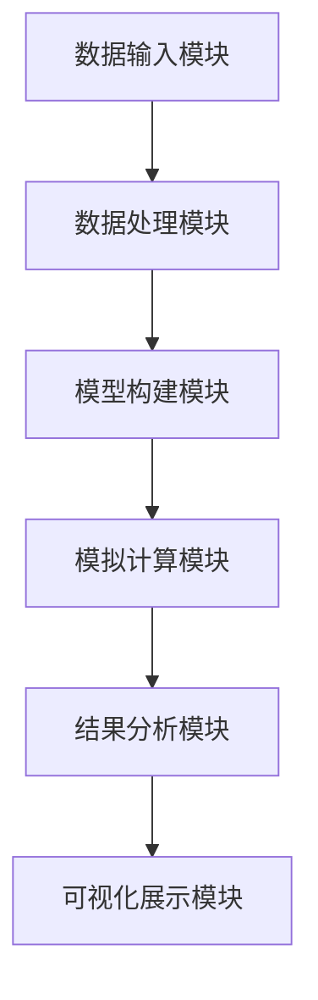

                 


# 如何处理企业估值中的不确定性

> 关键词：企业估值、不确定性、蒙特卡洛模拟、概率分布、贝叶斯分析

> 摘要：在企业估值过程中，不确定性是一个不可忽视的重要因素。本文详细探讨了如何在企业估值中处理不确定性，涵盖了从基本概念到实际应用的全过程，包括不确定性评估的核心概念、算法原理、系统架构设计以及项目实战案例。通过本文，读者可以全面理解并掌握如何在企业估值中有效处理不确定性。

---

# 第一部分: 企业估值中的不确定性概述

## 第1章: 不确定性与企业估值的基本概念

### 1.1 不确定性在企业估值中的重要性

#### 1.1.1 不确定性的基本概念
在企业估值中，不确定性指的是由于市场波动、经济环境变化、企业管理层决策等多种因素导致的企业未来经营结果的不确定性。这些不确定性可能影响企业的收入、成本、资产价值和负债等方面，进而影响企业的整体估值。

#### 1.1.2 企业估值中的不确定性来源
- **市场风险**：市场需求变化、竞争状况等。
- **财务风险**：财务预测的不准确性、资产减值等。
- **政策风险**：政策法规的变化对企业的影响。
- **管理风险**：企业管理层的战略决策和执行能力。

#### 1.1.3 不确定性对企业估值的影响
- 不确定性可能导致估值结果的偏差。
- 不确定性会影响估值模型的稳定性和可靠性。
- 通过合理处理不确定性，可以提高估值结果的可信度和决策的有效性。

### 1.2 企业估值的基本方法

#### 1.2.1 资产负债表分析
通过分析企业的资产负债表，评估企业的资产和负债状况，进而估算企业价值。

#### 1.2.2 现金流折现法
通过预测企业未来的现金流，并将其折现为现值，以估算企业价值。常用的方法包括股利折现模型（DDM）和自由现金流模型（FCFF）。

#### 1.2.3 市盈率与市净率法
通过比较企业的市盈率（P/E）和市净率（P/B）与行业平均水平的差异，来估算企业价值。

### 1.3 不确定性在估值模型中的表现

#### 1.3.1 财务预测的不确定性
企业在未来经营中的收入、成本、利润等财务指标的预测存在不确定性。

#### 1.3.2 折现率的不确定性
折现率的选取（如无风险利率和风险溢价）受到市场环境和企业风险的影响，具有不确定性。

#### 1.3.3 行业风险与市场波动
行业整体风险和市场波动也会对企业的估值产生影响。

## 1.4 本章小结
本章介绍了不确定性在企业估值中的重要性，分析了不确定性来源及其对估值的影响，并总结了常用的企业估值方法。

---

# 第二部分: 不确定性评估的核心概念与联系

## 第2章: 不确定性评估的核心概念与联系

### 2.1 不确定性评估的基本原理

#### 2.1.1 概率论与统计学基础
不确定性评估通常基于概率论和统计学方法。概率论用于描述事件发生的可能性，统计学用于分析数据和模型的不确定性。

#### 2.1.2 不确定性评估的数学模型
常用模型包括概率分布模型、蒙特卡洛模拟和贝叶斯分析等。

#### 2.1.3 不确定性与风险的关联
不确定性是风险的来源之一，风险可以通过对不确定性的量化来评估。

### 2.2 不确定性评估的核心要素

#### 2.2.1 数据来源与质量
数据的准确性和完整性直接影响不确定性评估的结果。

#### 2.2.2 模型假设与限制
模型的假设条件和限制条件需要明确，以避免偏差。

#### 2.2.3 结果解释与决策影响
评估结果需要能够为决策提供可靠的依据。

### 2.3 不确定性评估的流程与框架

#### 2.3.1 数据收集与清洗
收集相关数据，并对数据进行清洗和预处理。

#### 2.3.2 模型构建与校准
根据数据构建模型，并对模型进行校准和验证。

#### 2.3.3 结果分析与优化
对评估结果进行分析，并根据需要优化模型。

## 2.4 本章小结
本章详细讲解了不确定性评估的核心概念，分析了其基本原理、核心要素和评估流程。

---

# 第三部分: 不确定性评估的算法原理与实现

## 第3章: 不确定性评估的算法原理与实现

### 3.1 蒙特卡洛模拟算法

#### 3.1.1 蒙特卡洛模拟的基本原理
蒙特卡洛模拟是一种通过随机采样来估计系统行为的方法。它通过多次模拟来估计不确定性的影响。

#### 3.1.2 算法实现步骤
1. 确定输入变量及其概率分布。
2. 生成随机样本。
3. 计算输出结果。
4. 统计分析结果。

#### 3.1.3 代码实现示例

```python
import numpy as np

def monte_carlo_simulation(n_simulations):
    np.random.seed(42)
    simulations = []
    for _ in range(n_simulations):
        # 假设收入服从正态分布
        revenue = np.random.normal(100, 10)
        # 假设成本服从均匀分布
        cost = np.random.uniform(50, 70)
        # 计算净利润
        net_income = revenue - cost
        simulations.append(net_income)
    return simulations

simulations = monte_carlo_simulation(1000)
print("平均净利润:", np.mean(simulations))
```

### 3.2 概率分布模型

#### 3.2.1 常见概率分布的比较
- 正态分布：适用于连续型变量。
- 二项分布：适用于伯努利试验。
- 均匀分布：适用于等概率的连续型变量。

#### 3.2.2 选择合适的分布模型
根据数据的特征选择合适的概率分布模型。

#### 3.2.3 模型参数估计方法
使用最大似然估计（MLE）或矩估计法来估计概率分布的参数。

### 3.3 贝叶斯分析方法

#### 3.3.1 贝叶斯定理的原理
贝叶斯定理通过先验概率和条件概率来更新后验概率。

#### 3.3.2 在不确定性评估中的应用
贝叶斯分析可以用于估计模型参数和预测未来结果。

#### 3.3.3 实例分析与代码实现

```python
from scipy.stats import norm

# 假设先验分布为正态分布，均值为100，标准差为15
prior = norm(100, 15)

# 观测数据，样本均值为110，样本容量为25
observed_mean = 110
n = 25
observed_std = 10

# 计算后验分布的参数
posterior_mean = (prior.mean() * n + observed_mean * 1) / (n + 1)
posterior_std = np.sqrt((prior.var() * n + observed_std**2 * 1) / (n + 1))

print(f"后验均值: {posterior_mean}, 后验标准差: {posterior_std}")
```

### 3.4 本章小结
本章介绍了蒙特卡洛模拟、概率分布模型和贝叶斯分析方法的基本原理和实现步骤。

---

# 第四部分: 不确定性评估的系统架构与设计

## 第4章: 不确定性评估的系统架构与设计

### 4.1 系统功能模块设计

#### 4.1.1 数据输入与处理模块
负责接收和处理输入的数据，包括清洗和转换。

#### 4.1.2 模型构建与模拟模块
根据数据构建不确定性评估模型，并进行模拟计算。

#### 4.1.3 结果分析与可视化模块
对模拟结果进行统计分析，并生成可视化图表。

### 4.2 系统架构设计

#### 4.2.1 模块化架构图


#### 4.2.2 数据流与交互关系
数据从输入模块进入，经过处理后传递给模型构建模块，模拟结果返回给结果分析模块，并最终展示在可视化模块。

#### 4.2.3 系统接口设计
系统提供API接口，方便与其他系统进行数据交互。

### 4.3 本章小结
本章描述了不确定性评估系统的功能模块和系统架构设计。

---

# 第五部分: 项目实战——企业估值中的不确定性分析

## 第5章: 项目实战——企业估值中的不确定性分析

### 5.1 项目背景与目标

#### 5.1.1 项目背景介绍
以一家科技初创企业为例，评估其未来三年的估值不确定性。

#### 5.1.2 项目目标设定
通过蒙特卡洛模拟评估企业估值的不确定性范围。

#### 5.1.3 数据来源与准备
收集企业的历史财务数据、市场数据和行业信息。

### 5.2 系统核心实现

#### 5.2.1 环境配置与安装
安装必要的Python库，如NumPy、Matplotlib和Pandas。

#### 5.2.2 核心代码实现

```python
import numpy as np
import matplotlib.pyplot as plt

# 模拟收入和成本的不确定性
revenue = np.random.normal(100, 10, 1000)
cost = np.random.uniform(50, 70, 1000)
net_income = revenue - cost

# 绘制收入和净利润的分布图
plt.figure(figsize=(12, 6))
plt.subplot(121)
plt.hist(revenue, bins=30, alpha=0.7)
plt.title('收入分布')
plt.xlabel('收入')
plt.ylabel('频数')

plt.subplot(122)
plt.hist(net_income, bins=30, alpha=0.7)
plt.title('净利润分布')
plt.xlabel('净利润')
plt.ylabel('频数')

plt.show()
```

#### 5.2.3 代码解读与分析
上述代码通过蒙特卡洛模拟生成收入和成本的随机样本，计算净利润，并绘制分布图。

### 5.3 实例分析与详细讲解

#### 5.3.1 案例分析
假设企业未来三年的收入和成本存在不确定性，通过蒙特卡洛模拟评估企业净利润的分布。

#### 5.3.2 结果解读
通过分析净利润的分布，可以确定企业估值的可能范围和概率。

### 5.4 项目小结
本章通过实际案例展示了如何在企业估值中应用不确定性评估的方法，并通过模拟结果为决策提供支持。

---

# 第六部分: 总结与注意事项

## 6.1 最佳实践 tips

- 在选择模型时，需根据具体情况选择合适的方法。
- 数据的准确性和完整性是模型的基础。
- 结果的解释需结合实际业务背景。

## 6.2 小结
本文详细探讨了企业估值中的不确定性问题，从基本概念到实际应用进行了全面分析，为读者提供了理论和实践指导。

## 6.3 注意事项

- 不要忽视数据的质量和来源。
- 模型的假设需合理且明确。
- 结果需结合实际情况进行解释。

## 6.4 拓展阅读

- 《蒙特卡洛方法在金融中的应用》
- 《贝叶斯统计分析入门》
- 《企业风险管理与内部控制》

---

# 作者信息

作者：AI天才研究院 & 禅与计算机程序设计艺术

--- 

本文通过详细讲解企业估值中的不确定性问题，从基本概念到实际应用进行了全面分析，为读者提供了理论和实践指导。希望本文能帮助读者更好地理解和处理企业估值中的不确定性。

