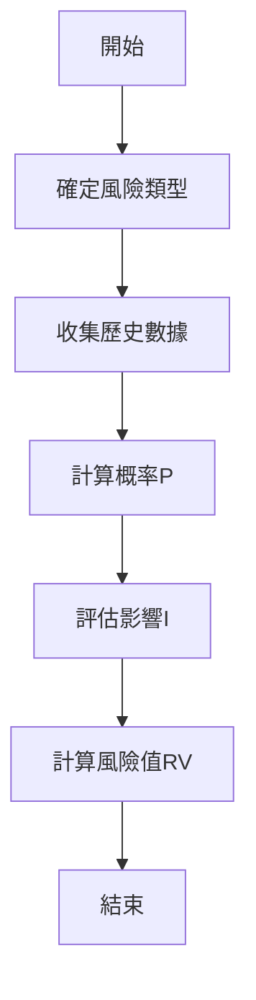

                 


# 如何处理企业估值中的跨境业务风险

## 关键词：跨境业务风险、企业估值、风险管理、数学模型、系统架构

## 摘要：  
本文深入探讨了如何在企业估值过程中有效处理跨境业务风险。通过分析跨境业务的风险类型、量化方法和系统架构，结合实际案例和数学模型，提供了一套完整的解决方案。本文旨在帮助企业更好地理解跨境业务风险的复杂性，并掌握应对策略。

---

## 第一部分：背景介绍

### 第1章：跨境业务风险的背景与重要性

#### 1.1 跨境業務的基本概念

- **1.1.1 跨境業務的定義**  
  跨境業務是指企業跨越不同國家或地區進行的商業活動，涉及跨國貿易、投資、市場進入等。  

- **1.1.2 跨境業務的歷史發展**  
  隨著全球化進程的加速，跨境業務從20世紀末開始迅速增長，如今已成為全球經濟的重要組成部分。  

- **1.1.3 跨境業務的現狀與未來趨勢**  
  現今，跨境電商、��國併購等活動日益頻繁，未來將進一步受到數字化和技術進步的推動。

#### 1.2 企業估值的基本概念

- **1.2.1 企業估值的定義**  
  企業估值是指對企業整體價值進行評估，通常基於財務報表和市場數據。  

- **1.2.2 企業估值的主要方法**  
  常用方法包括現金流折現法（DCF）、可比公司法、股東自由現金流法等。  

- **1.2.3 企業估值的重要性**  
  正確的估值幫助企業做出戰略決策，並影響融資、併購等重大事項。

#### 1.3 跨境業務風險的基本概念

- **1.3.1 風險的定義**  
  風險是指在特定情景下，可能对企业價值造成不利影響的事件或因素。  

- **1.3.2 跨境業務風險的類型**  
  包括政治風險、經濟風險、法律風險、稅務風險和市場風險。  

- **1.3.3 跨境業務風險的影響**  
  風險可能導致企業估值下降、融資成本增加，甚至影響企業的可持續性。

#### 1.4 跨境業務風險與企業估值的關聯

- **1.4.1 跨境業務風險对企业估值的影響**  
  風險增加折現率，影響未來現金流的價值。  

- **1.4.2 跨境業務風險对企业價值的折現影響**  
  高風險導致高折現率，使未來現金流價值降低。  

- **1.4.3 跨境業務風險对企业融资成本的影響**  
  風險增加融資成本，影響企業的融資能力。

#### 1.5 本書的研究方法與工具

- **1.5.1 研究方法**  
  基於案例分析和定量分析，結合金融模型。  

- **1.5.2 分析工具**  
  使用數據分析工具（如Excel、Python）和金融模型（如DCF模型）。  

- **1.5.3 数据來源**  
  來自國際機構報告、企業財務報表和公開數據庫。

---

## 第二部分：核心概念與聯系

### 第2章：跨境業務風險的核心概念與原理

#### 2.1 跨境業務風險的分類

- **2.1.1 政治風險**  
  政府政策變化、法律法規修改等。  

- **2.1.2 經濟風險**  
  外匯波動、通脹壓力等。  

- **2.1.3 法律風險**  
  知識產權保護、合規性要求等。  

- **2.1.4 稅務風險**  
  稅率差異、稅務規劃複雜性等。  

- **2.1.5 市場風險**  
  消費者行為、競爭狀況等。

#### 2.2 跨境業務風險的屬性對比表

| 風險類型 | 影響範圍 | 具體影響 | 管理難度 | 常見國家 |
|----------|----------|----------|----------|----------|
| 政治風險 | 地區性    | 政策變化 | 高       | 新興市場 |
| 經濟風險 | 全球性    | 外匯波動 | 中       | 所有國家 |
| 法律風險 | 地區性    | 合規要求 | 中       | 法律繁雜國家 |
| 稅務風險 | 地區性    | 稅率差異 | 高       | 稅制嚴峻國家 |
| 市場風險 | 地區性或全球性 | 消費者行為 | 中       | 所有國家 |

#### 2.3 跨境業務風險的ER實體關係圖

```mermaid
erDiagram
    customer[customerId, name, country] {
    }
    product[productId, name, category] {
    }
    order[orderId, orderDate, totalAmount] {
    }
    risk[ riskId, riskType, riskLevel ] {
    }
    customer --> order : has
    product --> order : contains
    order --> risk : associatedWith
```

---

## 第三部分：算法原理與數學模型

### 第3章：跨境業務風險的量化與評估算法

#### 3.1 跨境業務風險的量化方法

##### 3.1.1 風險概率模型

- **風險概率公式**  
  $$ P(risk) = \frac{\text{歷史風險事件數}}{\text{總樣本數}} $$  

- **風險影響程度公式**  
  $$ I(risk) = \text{影響範圍} \times \text{影響力度} $$  

##### 3.1.2 風險量化算法



##### 3.1.3 Python實現

```python
import pandas as pd
import numpy as np

def calculate_risk_probabilities(risk_type, data):
    mask = data['risk_type'] == risk_type
    probability = data[mask]['occurred'].mean()
    return probability

data = pd.DataFrame({
    'risk_type': ['political', 'economic', 'legal', 'tax', 'market'],
    'occurred': [1, 0, 1, 0, 1]
})

risk_type = 'political'
prob = calculate_risk_probabilities(risk_type, data)
print(f"Risk Probability for {risk_type}: {prob}")
```

---

## 第四部分：數學模型與公式

### 第4章：跨境業務風險的數學模型

#### 4.1 貝葉斯模型在風險評估中的應用

- **貝葉斯公式**  
  $$ P(A|B) = \frac{P(B|A)P(A)}{P(B)} $$  

- **應用場景**  
  計算特定風險事件在不同國家的條件概率。

#### 4.2 線性回歸模型

- **簡單線性回歸公式**  
  $$ y = \beta_0 + \beta_1x + \epsilon $$  

- **應用場景**  
  分析外匯波動对企业估值的影響。

#### 4.3 超額收益模型

- **CAPM模型**  
  $$ E(r) = R_f + \beta (R_m - R_f) $$  

- **應用場景**  
  評估跨境業務的風險溢价。

---

## 第五部分：系統分析與架構設計

### 第5章：跨境業務風險評估系統的設計與實現

#### 5.1 系統功能設計

- **需求分析**  
  支持多種風險類型的評估，提供數據可視化功能。  

- **功能模塊**  
  数据收集、風險評估、報告生成、數據可視化。  

- **領域模型**  
  ```mermaid
  classDiagram
      class RiskEvaluator {
          -risk_types
          -data
          -models
          +evaluate_risk()
          +generate_report()
      }
      class DataSource {
          -data
          +fetch_data()
      }
      class Visualizer {
          -data
          +create_visualization()
      }
      RiskEvaluator --> DataSource : uses
      RiskEvaluator --> Visualizer : uses
  ```

#### 5.2 系統架構設計

- **分層架構**  
  表示層、業務邏輯層、數據存儲層。  

- **架構圖**  
  ```mermaid
  architecture
      [表示層] --> [業務邏輯層] : 用戶請求
      [業務邏輯層] --> [數據存儲層] : 数据訪問
      [數據存儲層] --> [業務邏輯層] : 数据響應
      [業務邏輯層] --> [表示層] : 獨佔請求
  ```

#### 5.3 系統接口設計

- **REST API定義**  
  ```http
  GET /risk/evaluate?type=political
  POST /risk/train
  ```

---

## 第六部分：項目實戰

### 第6章：跨境業務風險評估的實際案例

#### 6.1 環境安裝

- **安裝 dependencies**  
  ```bash
  pip install numpy pandas matplotlib
  ```

#### 6.2 核心實現

- **數據處理**  
  ```python
  import pandas as pd

  def load_data(file_path):
      return pd.read_csv(file_path)

  data = load_data('risk_data.csv')
  ```

- **風險評估**  
  ```python
  def assess_risk(data):
      # 計算風險指數
      risk_index = data['political_risk'] * 0.3 + data['economic_risk'] * 0.4
      return risk_index

  risk_scores = assess_risk(data)
  ```

#### 6.3 案例分析

- **數據可視化**  
  ```python
  import matplotlib.pyplot as plt

  plt.hist(risk_scores, bins=10)
  plt.xlabel('Risk Score')
  plt.ylabel('Frequency')
  plt.title('Distribution of Risk Scores')
  plt.show()
  ```

---

## 第七部分：最佳實踐與總結

### 第7章：最佳實踐與風險管理策略

#### 7.1 最佳實踐

- **持續監測**  
  定期更新數據，跟蹤風險變化。  

- **多樣化策略**  
  分散投資、投保保險等。  

- **專業團隊**  
  與法律顧問和稅務專家合作。

#### 7.2 小結

本文通過理論分析和實踐案例，詳細介紹了跨境業務風險的評估與管理方法。企業可根據自身需求，選擇適合的模型和策略。

#### 7.3 注意事項

- 确保數據來源可靠。  
- 選擇合適的模型。  
- 定期更新風險評估。

#### 7.4 擴展閱讀

- 貝葉斯網絡在風險評估中的應用。  
- 跨境業務中的 tax haven 战略。  
- 全球化背景下的供應鏈風險管理。

---

## 作者：AI天才研究院 & 禪與計算機程序設計藝術

---

**作者信息**：  
AI天才研究院（AI Genius Institute）和「禪與計算機程序設計藝術」團隊，致力於人工智能與程序設計的研究與實踐，提供專業的技術諮詢與解決方案。

