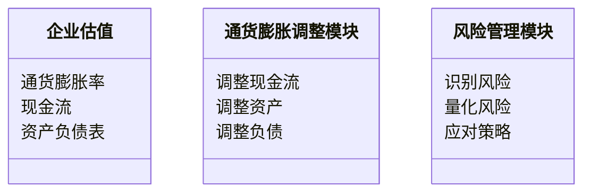

                 


# 如何处理企业估值中的通货膨胀影响

> **关键词**：企业估值、通货膨胀、现金流折现模型、风险管理、数学模型  
> **摘要**：本文探讨了通货膨胀对企业估值的影响，分析了其对收入、成本和利润的具体影响，提出了在估值模型中进行通货膨胀调整的方法，并通过数学模型和系统设计提供了实践指导。

---

## 第1章 引言

### 1.1 通货膨胀的基本概念

#### 1.1.1 通货膨胀的定义与原因

通货膨胀是指物价总水平在一段时间内持续上涨，导致货币购买力下降的经济现象。其主要原因是货币供给增加、需求拉动、成本推动以及预期因素等。

#### 1.1.2 通货膨胀对企业的影响

通货膨胀对企业的影响体现在收入、成本和利润三个方面。收入可能因价格调整而增加，但成本上升可能导致利润减少，进而影响企业估值。

### 1.2 企业估值的基本概念

企业估值是通过财务指标和模型对企业价值进行评估的过程。常用的方法包括现金流折现模型（DCF）、可比公司分析等。通货膨胀会影响这些模型的输入参数，进而影响估值结果。

---

## 第2章 通货膨胀对企业财务状况的影响

### 2.1 通货膨胀对企业收入的影响

#### 2.1.1 收入的定义与通货膨胀的关系

收入是企业在一定时期内通过销售产品或服务获得的总收入。通货膨胀可能导致产品价格上涨，从而增加收入。

#### 2.1.2 通货膨胀对企业收入的具体影响

例如，假设企业销售产品，通货膨胀导致产品价格上涨10%，但销量可能下降，影响收入增长。

### 2.2 通货膨胀对企业成本的影响

#### 2.2.1 成本的定义与通货膨胀的关系

成本是企业在生产过程中发生的各项支出。通货膨胀可能导致原材料价格上涨，增加生产成本。

#### 2.2.2 通货膨胀对企业成本的具体影响

例如，原材料价格上涨导致生产成本增加，企业可能需要调整售价，影响利润率。

### 2.3 通货膨胀对企业利润的影响

#### 2.3.1 利润的定义与通货膨胀的关系

利润是企业收入减去成本后的净收益。通货膨胀可能导致收入增加，但成本上升，利润可能减少。

#### 2.3.2 通货膨胀对企业利润的具体影响

例如，收入增长5%，成本增加6%，导致利润下降1%。

---

## 第3章 通货膨胀对企业估值模型的影响

### 3.1 现金流折现模型（DCF）

#### 3.1.1 DCF模型的定义与核心假设

DCF模型通过折现未来现金流评估企业价值。其核心假设是未来现金流可以预测，并且折现率合理。

#### 3.1.2 通货膨胀对DCF模型的影响

通货膨胀可能导致未来现金流预测偏差，影响折现率的计算。

### 3.2 资产重置成本

#### 3.2.1 资产重置成本的定义

资产重置成本是指在未来替换现有资产所需的成本。

#### 3.2.2 通货膨胀对资产重置成本的影响

通货膨胀可能导致未来资产重置成本上升，影响企业估值模型的准确性。

---

## 第4章 通货膨胀调整方法

### 4.1 现金流调整

#### 4.1.1 现金流调整的定义

现金流调整是通过调整未来现金流，反映通货膨胀的影响。

#### 4.1.2 现金流调整的具体方法

例如，将未来现金流按通货膨胀率调整，确保预测的准确性。

### 4.2 资产与负债调整

#### 4.2.1 资产调整的定义

资产调整是通过调整资产负债表中的资产价值，反映通货膨胀的影响。

#### 4.2.2 负债调整的定义

负债调整是通过调整负债的未来偿还金额，反映通货膨胀的影响。

### 4.3 敏感性分析

#### 4.3.1 敏感性分析的定义

敏感性分析是通过改变输入参数，评估模型输出的变化。

#### 4.3.2 通货膨胀敏感性分析的具体步骤

例如，调整通货膨胀率，观察企业估值的变化，评估其敏感性。

---

## 第5章 通货膨胀风险管理

### 5.1 通货膨胀风险识别

#### 5.1.1 风险识别的定义

风险识别是通过分析潜在风险因素，识别通货膨胀对企业的影响。

#### 5.1.2 通货膨胀风险的具体表现

例如，成本上升导致利润率下降，影响企业估值。

### 5.2 通货膨胀风险量化

#### 5.2.1 风险量化的方法

通过数学模型量化通货膨胀对企业估值的具体影响。

#### 5.2.2 通货膨胀风险量化示例

例如，假设通货膨胀率为5%，企业估值可能下降2%。

### 5.3 通货膨胀风险应对策略

#### 5.3.1 应对策略的定义

应对策略是通过调整企业战略，降低通货膨胀的影响。

#### 5.3.2 具体应对策略

例如，调整产品价格，优化成本结构，增强议价能力。

---

## 第6章 数学模型与公式

### 6.1 通货膨胀对现金流的影响模型

#### 6.1.1 现金流折现公式

$$DCF = \sum_{t=1}^{n} \frac{CF_t}{(1 + r)^t}$$

其中，$r$ 是折现率，需考虑通货膨胀的影响。

### 6.2 资产重置成本公式

$$重置成本 = \sum_{t=1}^{n} \frac{C_t}{(1 + r)^t}$$

其中，$C_t$ 是第t年的重置成本，$r$ 是折现率。

### 6.3 敏感性分析公式

$$敏感性 = \frac{\Delta 估值}{\Delta 通货膨胀率}$$

---

## 第7章 系统分析与架构设计

### 7.1 系统功能设计

#### 7.1.1 领域模型类图



### 7.2 系统架构设计


### 7.3 系统交互设计

```mermaid
sequenceDiagram
    actor 用户
    调用 企业数据输入模块
    调用 通货膨胀调整模块
    调用 风险管理模块
    调用 估值结果输出模块
```

---

## 第8章 项目实战

### 8.1 环境安装

#### 8.1.1 安装Python与相关库

```bash
pip install numpy pandas matplotlib
```

### 8.2 核心代码实现

#### 8.2.1 现金流调整代码

```python
import numpy as np
def adjust_cash_flow(cash_flow, inflation_rate):
    return np.array(cash_flow) * (1 + inflation_rate)
```

#### 8.2.2 资产重置成本计算代码

```python
def calculate_replacement_cost(asset_value, inflation_rate):
    return asset_value * (1 + inflation_rate)
```

### 8.3 案例分析

#### 8.3.1 案例背景

假设一家制造企业面临5%的通货膨胀率，需调整其现金流和资产重置成本。

#### 8.3.2 调整过程

调整后的现金流和资产价值用于更新DCF模型，评估企业价值。

### 8.4 项目小结

通过实际案例，展示了通货膨胀调整方法在企业估值中的应用。

---

## 第9章 最佳实践与总结

### 9.1 小结

通货膨胀对企业估值的影响不容忽视，需通过调整模型和风险管理降低影响。

### 9.2 注意事项

在实际操作中，需结合企业具体情况，灵活调整模型参数。

### 9.3 拓展阅读

推荐阅读《企业估值模型》和《通货膨胀与经济分析》。

---

## 作者

**作者：AI天才研究院/AI Genius Institute & 禅与计算机程序设计艺术/Zen And The Art of Computer Programming**

---

通过以上结构，我们详细探讨了通货膨胀对企业估值的影响，并提供了理论和实践指导，帮助读者有效应对通货膨胀带来的挑战。

