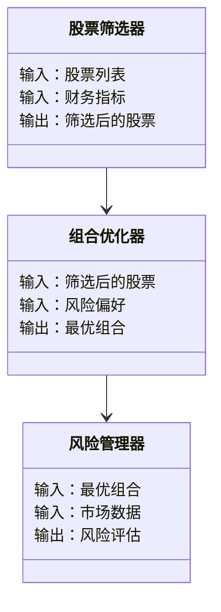
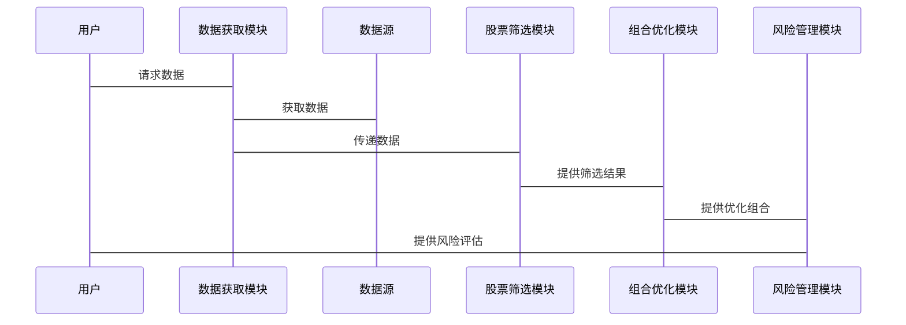

                 


# 如何实践彼得·林奇的投资策略

## 关键词：彼得·林奇，投资策略，价值投资，股票分析，风险管理，投资组合

## 摘要：本文将详细介绍如何实践彼得·林奇的投资策略。通过分析其核心理念、选股标准、数学模型、风险管理方法和系统架构，帮助读者理解并应用这一策略。文章结合实际案例和代码示例，深入探讨如何在现代市场环境下优化投资组合，实现长期稳定的收益。

---

# 第一部分：彼得·林奇投资策略概述

## 第1章：彼得·林奇投资策略的核心理念

### 1.1 彼得·林奇投资策略的背景与起源

#### 1.1.1 彼得·林奇的生平与投资经历
彼得·林奇（Peter Lynch）是美国著名的投资经理，曾管理富达麦哲伦基金（Fidelity Magellan），创造了卓越的投资业绩。他强调长期投资和价值发现，倡导深入研究公司基本面，避免短期市场波动的干扰。

#### 1.1.2 价值投资的核心理念
价值投资的核心在于寻找市场低估的股票，通过分析公司的财务状况、行业地位和成长性，找到具有长期投资价值的公司。

#### 1.1.3 彼得·林奇策略的哲学基础
林奇的投资哲学强调“以合理的价格买入优秀的公司”。他注重公司基本面分析，避免情绪化决策，并倡导分散投资以降低风险。

### 1.2 彼得·林奇投资策略的核心要素

#### 1.2.1 长期投资与价值发现
长期投资是指持有优质股票数年，而非频繁交易。价值发现是指通过分析公司基本面，寻找市场价格低于内在价值的股票。

#### 1.2.2 市场情绪与投资机会
市场情绪波动为投资者提供了机会。当市场恐慌时，优质股票可能被低估；当市场狂热时，可能隐藏着风险。

#### 1.2.3 股票估值与成长性分析
股票估值是确定其内在价值的过程，成长性分析是评估公司未来收益潜力的关键。

### 1.3 彼得·林奇策略的适用场景与限制

#### 1.3.1 适合的市场环境
适用于相对稳定的市场环境，尤其适合寻找长期成长的公司。

#### 1.3.2 策略的局限性与不足
在极端市场波动或经济危机时，策略可能面临挑战。此外，策略依赖于深入的公司研究，对个人能力要求较高。

#### 1.3.3 现代市场环境下的策略调整
在现代市场中，彼得·林奇策略可结合量化分析和风险管理，提高适应性。

---

## 第2章：彼得·林奇选股标准与分析框架

### 2.1 彼得·林奇选股的核心标准

#### 2.1.1 公司基本面分析
分析公司财务报表，关注收入、利润、负债等指标。例如，通过利润表分析公司盈利能力。

#### 2.1.2 财务指标评估
关键指标包括市盈率（P/E）、市净率（P/B）、股息率等。例如，市盈率公式为：

$$ \text{市盈率} = \frac{\text{股价}}{\text{每股收益}} $$

#### 2.1.3 行业地位与竞争优势
评估公司在行业中的地位，分析其竞争优势，如技术壁垒、品牌影响力等。

### 2.2 投资组合的构建逻辑

#### 2.2.1 股票筛选流程
步骤包括：明确投资目标、筛选行业、分析公司基本面、评估估值指标。

#### 2.2.2 投资组合的分散化原则
分散投资以降低风险，避免过度集中于某一行业或公司。

#### 2.2.3 个股权重分配策略
根据股票的估值和成长性，合理分配权重。例如，低估股票可分配更高权重。

### 2.3 彼得·林奇风格的量化分析

#### 2.3.1 估值指标的数学模型
市盈率模型：

$$ \text{合理股价} = \text{每股收益} \times \text{合理市盈率} $$

#### 2.3.2 成长性评估的量化方法
使用复合年增长率（CAGR）评估公司收益成长性。

#### 2.3.3 风险调整后的收益分析
考虑波动率和相关性，优化投资组合收益。

---

## 第3章：彼得·林奇投资策略的数学模型与算法原理

### 3.1 股票估值的核心公式

#### 3.1.1 市盈率（P/E）模型
$$ \text{P/E} = \frac{\text{股价}}{\text{每股收益}} $$

#### 3.1.2 市净率（P/B）模型
$$ \text{P/B} = \frac{\text{股价}}{\text{每股净资产}} $$

#### 3.1.3 股息率与股息增长模型
$$ \text{股息率} = \frac{\text{股息支付率}}{\text{股价}} $$

### 3.2 投资组合优化的数学框架

#### 3.2.1 马科维茨均值-方差模型
目标：在给定风险下最大化收益，或在给定收益下最小化风险。

#### 3.2.2 现实中的简化模型
考虑实际交易成本和税费，调整优化模型。

#### 3.2.3 风险调整后的收益计算
使用夏普比率衡量风险调整后收益：

$$ \text{夏普比率} = \frac{\text{超额收益}}{\text{收益标准差}} $$

### 3.3 算法实现与代码示例

#### 3.3.1 基于Python的股票筛选代码
```python
import pandas as pd

# 假设df为股票数据，包含'PE'和'PEG'列
def select_stocks(df, max_pe=15, max_peg=2):
    return df[(df['PE'] <= max_pe) & (df['PEG'] <= max_peg)]

# 示例数据
data = {'PE': [12, 18, 10, 20], 'PEG': [1.5, 2.5, 1.2, 3]}
df = pd.DataFrame(data)
selected = select_stocks(df)
print(selected)
```

#### 3.3.2 投资组合优化的代码实现
```python
import numpy as np
from scipy.optimize import minimize

def portfolio_optimization(returns, weights):
    n = len(returns)
    # 定义优化问题：最小化波动率，即标准差
    def objective(weights):
        return np.var(weights @ returns)
    # 约束：权重之和为1
    cons = [{'type': 'eq', 'fun': lambda w: np.sum(w) - 1}]
    # 初始权重
    init_weights = np.array([1.0/n]*n)
    # 求解
    result = minimize(objective, init_weights, constraints=cons, bounds=[(0,1)]*n)
    return result.x

# 示例数据
returns = np.array([0.1, 0.15, 0.08])
weights = portfolio_optimization(returns)
print(weights)
```

---

## 第4章：彼得·林奇策略的风险管理与仓位控制

### 4.1 风险管理的核心原则

#### 4.1.1 风险的定义与分类
市场风险、流动性风险、公司特有风险等。

#### 4.1.2 风险与收益的平衡
通过风险调整后的收益指标（如夏普比率）进行平衡。

#### 4.1.3 风险分散化策略
通过投资多样化资产或行业降低非系统性风险。

### 4.2 仓位控制的数学模型

#### 4.2.1 基于波动率的仓位调整
$$ \text{目标仓位} = \frac{\text{风险承受能力}}{\text{波动率}} $$

#### 4.2.2 基于估值的动态调整
根据市场变化调整持仓比例，避免过度偏离初始策略。

#### 4.2.3 风险承受能力的评估
通过风险承受能力测试或问卷评估投资者的风险偏好。

### 4.3 管理层风险与公司治理分析

#### 4.3.1 管理层的诚信与能力
评估管理层的过往表现和道德记录。

#### 4.3.2 公司治理结构的优化
良好的治理结构有助于减少公司特有风险。

#### 4.3.3 内部控制与风险管理
有效的内部控制体系可以降低操作风险。

---

## 第5章：彼得·林奇投资策略的系统架构与实现

### 5.1 问题场景介绍

#### 5.1.1 投资目标设定
明确投资目标和风险偏好。

#### 5.1.2 数据获取与处理
收集并处理历史数据，包括价格、财务指标等。

#### 5.1.3 系统功能需求
股票筛选、组合优化、风险评估、绩效分析。

### 5.2 系统功能设计（领域模型）



### 5.3 系统架构设计

```mermaid
rectangle 系统边界 {
    组件：数据获取模块
    组件：股票筛选模块
    组件：组合优化模块
    组件：风险管理模块
    组件：用户界面
}
```

### 5.4 系统接口设计

#### 5.4.1 数据接口
从数据源获取股票数据，格式为CSV或数据库。

#### 5.4.2 用户接口
提供用户友好的界面，方便输入参数和查看结果。

#### 5.4.3 输出接口
生成报告，包括筛选结果、优化组合、风险评估等。

### 5.5 系统交互设计



---

## 第6章：彼得·林奇策略的项目实战

### 6.1 环境安装

#### 6.1.1 安装Python和相关库
安装Python 3.x，以及pandas、numpy、scipy等库。

#### 6.1.2 数据源选择
使用Yahoo Finance或其它金融数据源。

### 6.2 系统核心实现

#### 6.2.1 股票筛选器实现
基于财务指标和估值指标筛选股票。

#### 6.2.2 组合优化器实现
使用优化算法生成最优投资组合。

#### 6.2.3 风险管理器实现
计算波动率、夏普比率等指标，评估风险。

### 6.3 代码实现与应用解读

#### 6.3.1 股票筛选代码
```python
import pandas as pd
import yfinance as yf

# 下载股票数据
tickers = ['AAPL', 'MSFT', 'GOOGL']
data = yf.download(tickers, start='2020-01-01', end='2023-01-01')

# 计算市盈率
pe_ratio = data['Adj Close'].iloc[-1] / data['EPS'].iloc[-1]
selected = pe_ratio[pe_ratio < 15].index
print(selected)
```

#### 6.3.2 组合优化代码
```python
import numpy as np
from scipy.optimize import minimize

# 示例收益矩阵
returns = np.array([[0.1, 0.05, 0.08],
                    [0.05, 0.12, 0.06],
                    [0.08, 0.06, 0.15]])

# 定义优化问题
def objective(weights):
    return -np.sum(weights * returns)

# 约束
cons = [{'type': 'eq', 'fun': lambda w: np.sum(w) - 1},
        {'type': 'ineq', 'fun': lambda w: w >= 0}]

# 初始权重
init_weights = np.array([1/3, 1/3, 1/3])

# 求解
result = minimize(objective, init_weights, constraints=cons)
optimal_weights = result.x
print(optimal_weights)
```

### 6.4 实际案例分析

#### 6.4.1 案例背景
假设我们有三只股票，目标是构建一个低风险、高收益的投资组合。

#### 6.4.2 数据分析与筛选
计算每只股票的市盈率和市净率，筛选出低估股票。

#### 6.4.3 组合优化
使用优化算法确定每只股票的权重，生成最优组合。

#### 6.4.4 风险评估
计算组合的波动率和夏普比率，评估风险水平。

### 6.5 项目小结

#### 6.5.1 项目成果
成功构建了一个基于彼得·林奇策略的投资组合。

#### 6.5.2 经验总结
深入分析公司基本面、合理分散投资、动态调整仓位是成功的关键。

---

## 第7章：彼得·林奇策略的最佳实践与小结

### 7.1 最佳实践 tips

#### 7.1.1 持续学习与研究
保持对市场的敏感性，不断更新知识和技能。

#### 7.1.2 纪律性投资
坚持策略，避免情绪化决策。

#### 7.1.3 定期回顾与调整
定期评估投资组合，根据市场变化进行调整。

### 7.2 注意事项

#### 7.2.1 风险控制
避免过度集中投资，合理分散风险。

#### 7.2.2 选股标准
严格按照基本面分析和估值指标筛选股票。

#### 7.2.3 市场环境
根据市场环境调整策略，灵活应对变化。

### 7.3 拓展阅读

#### 7.3.1 经典书籍
- 《彼得·林奇的投资艺术》
- 《投资学基础》

#### 7.3.2 相关研究
- 基于机器学习的投资策略研究
- 数据驱动的投资组合优化方法

### 7.4 本章小结

彼得·林奇的投资策略强调长期投资、价值发现和风险管理。通过深入分析公司基本面和合理分散投资，投资者可以在长期实现稳定的收益。然而，策略的成功需要纪律性、持续学习和灵活应对市场变化。

---

## 作者：AI天才研究院/AI Genius Institute & 禅与计算机程序设计艺术 /Zen And The Art of Computer Programming

---

以上是《如何实践彼得·林奇的投资策略》的完整目录和部分章节内容。通过系统化的分析和实际案例，读者可以深入理解并实践彼得·林奇的投资策略，结合技术方法和实际操作，优化投资组合，实现长期稳健的投资收益。

