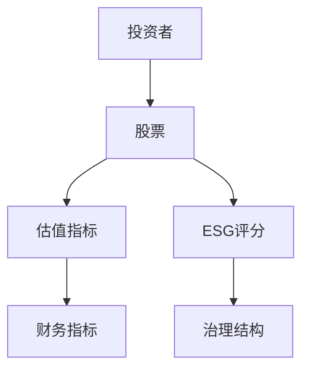
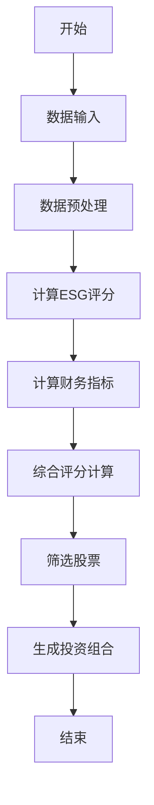
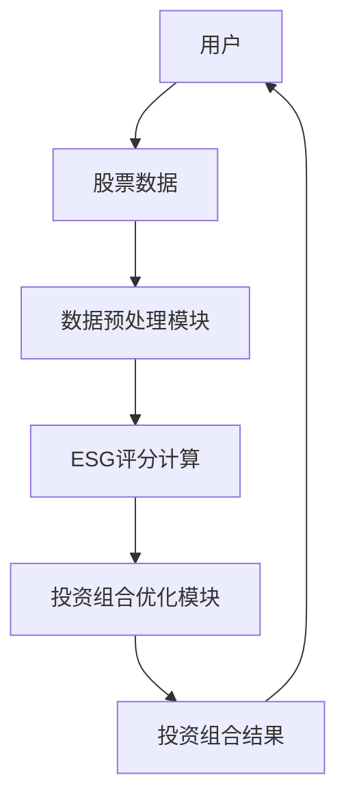

                 


# 如何将特价股票策略与可持续发展目标投资结合

## 关键词：特价股票策略、可持续发展目标投资、ESG评分、投资组合优化、多目标优化

## 摘要：  
本文探讨了如何将特价股票策略与可持续发展目标投资相结合，通过分析两者的定义、特点及相互关系，提出了基于ESG评分的多目标优化算法，并结合实际案例展示了如何在投资决策中实现财务回报与可持续性目标的双赢。

---

## 第一部分：特价股票策略与可持续发展目标投资的背景与核心概念

### 第1章：特价股票策略与可持续发展目标投资的背景

#### 1.1 特价股票策略的定义与特点  
特价股票策略是一种以低于其内在价值的价格购买优质股票的投资策略。其核心在于寻找市场低估的股票，通过长期持有实现超额收益。  
- **定义**：寻找市场价格低于内在价值的股票，通常关注低市盈率、低市净率等指标。  
- **特点**：  
  - **逆向思维**：在市场恐慌时买入低估资产。  
  - **长期导向**：注重企业基本面，追求长期价值。  
  - **风险可控**：通过估值指标降低投资风险。  

#### 1.2 可持续发展目标投资的定义与特点  
可持续发展目标投资（ESG投资）是指在投资决策中考虑环境、社会和公司治理因素的投资策略。  
- **定义**：通过筛选符合ESG标准的企业，实现可持续发展和投资收益的双赢。  
- **特点**：  
  - **社会价值**：关注企业的社会责任和治理结构。  
  - **环境友好**：优先选择环保型企业。  
  - **长期视角**：通过ESG评分降低投资风险，提升长期回报。  

#### 1.3 特价股票策略与可持续发展目标投资的结合背景  
- **背景**：随着全球可持续发展目标的推进，投资者越来越关注企业的社会责任和环境表现。同时，特价股票策略因其低估值特性，为企业提供了较高的安全边际，与ESG投资的长期价值理念高度契合。  
- **契合点**：  
  - 两者都注重长期价值，避免短期波动。  
  - 可持续发展目标投资通过ESG评分筛选优质企业，而特价股票策略通过低估值寻找潜在收益。  

---

### 第2章：特价股票策略与可持续发展目标投资的核心概念与联系

#### 2.1 核心概念原理  
- **特价股票策略的数学模型**：  
  $$ V = \frac{E}{k} $$
  其中，$V$ 是内在价值，$E$ 是企业盈利，$k$ 是折现率。  
- **可持续发展目标投资的数学模型**：  
  $$ S = aE + bS + cG $$
  其中，$S$ 是ESG评分，$E$ 是环境因素，$S$ 是社会因素，$G$ 是治理因素，$a$、$b$、$c$ 是权重系数。  

#### 2.2 核心概念属性特征对比  
通过对比分析，明确特价股票策略与可持续发展目标投资的异同：  
| 特性 | 特价股票策略 | 可持续发展目标投资 |  
|------|--------------|-------------------|  
| 核心指标 | 估值指标（市盈率、市净率） | ESG评分 |  
| 投资目标 | 低估值、高安全边际 | 可持续性、社会责任 |  
| 适用场景 | 市场恐慌、低估资产 | 环境友好、社会责任 |  

#### 2.3 ER实体关系图  


---

## 第二部分：特价股票策略与可持续发展目标投资的算法原理

### 第3章：特价股票策略与可持续发展目标投资的算法原理

#### 3.1 算法原理讲解  
- **多目标优化算法**：在投资决策中，同时优化财务回报和ESG评分。  
  $$ \text{Maximize } R = \alpha V + \beta S $$
  其中，$R$ 是综合回报率，$\alpha$ 和 $\beta$ 是权重系数，$V$ 是估值指标，$S$ 是ESG评分。  

- **基于ESG评分的股票筛选算法**：通过动态调整权重，平衡财务回报与可持续性目标。  
  $$ \text{Score} = w_1 V + w_2 S $$
  其中，$w_1$ 和 $w_2$ 是权重系数，根据市场环境动态调整。  

- **组合优化算法**：通过优化投资组合，最大化收益，最小化风险。  
  $$ \text{Minimize } \sigma^2 $$
  $$ \text{Subject to } E[R] \geq R_{target} $$

#### 3.2 算法流程图  


#### 3.3 代码实现  
```python
def calculate_esg_score(stocks):
    # 计算ESG评分
    esg_scores = []
    for stock in stocks:
        e = stock['环境']
        s = stock['社会']
        g = stock['治理']
        score = 0.4 * e + 0.3 * s + 0.3 * g
        esg_scores.append(score)
    return esg_scores

def multi_objective_optimization(stocks, esg_scores):
    # 多目标优化算法
    import numpy as np
    from sklearn.metrics import pairwise_distances
    from sklearn.cluster import KMeans

    portfolio = []
    n = len(stocks)
    weights = [0.5, 0.5]  # 权重系数
    for i in range(n):
        score = weights[0] * stocks[i]['估值指标'] + weights[1] * esg_scores[i]
        portfolio.append((stocks[i]['名称'], score))

    # K-means聚类筛选最优组合
    portfolio = sorted(portfolio, key=lambda x: -x[1])
    selected = portfolio[:int(n/2)]
    return selected
```

---

## 第三部分：系统分析与架构设计方案

### 第4章：系统分析与架构设计方案

#### 4.1 系统功能设计  
- **数据采集模块**：收集股票的财务数据和ESG评分。  
- **数据预处理模块**：清洗数据，计算综合评分。  
- **投资组合优化模块**：基于多目标优化算法筛选股票。  

#### 4.2 系统架构设计  


#### 4.3 系统接口设计  
- **输入接口**：股票数据、财务指标、ESG评分。  
- **输出接口**：优化后的投资组合、综合评分。  

#### 4.4 系统交互设计  


---

## 第四部分：项目实战与案例分析

### 第5章：项目实战与案例分析

#### 5.1 项目背景与目标  
- **背景**：开发一个基于ESG评分的特价股票筛选系统。  
- **目标**：实现财务回报与可持续性目标的双重优化。  

#### 5.2 项目核心实现  
```python
def main():
    import pandas as pd
    stocks = pd.read_csv('stock_data.csv')
    esg_scores = calculate_esg_score(stocks)
    selected_stocks = multi_objective_optimization(stocks, esg_scores)
    print(selected_stocks)

if __name__ == "__main__":
    main()
```

#### 5.3 实际案例分析  
- **案例**：假设某科技公司ESG评分为85，估值指标为0.8，计算其综合评分为：  
  $$ \text{Score} = 0.5 \times 0.8 + 0.5 \times 85 = 42.5 $$  
  综合评分较高，符合投资标准。  

#### 5.4 项目小结  
- **经验总结**：动态调整权重系数，结合市场环境优化投资组合。  
- **注意事项**：数据质量和模型的局限性是需要重点关注的问题。  

---

## 第五部分：最佳实践与总结

### 第6章：最佳实践与总结

#### 6.1 最佳实践  
- **数据质量**：确保ESG数据来源可靠。  
- **模型优化**：动态调整权重系数，适应市场变化。  
- **风险管理**：定期评估投资组合，及时调整。  

#### 6.2 小结  
- **总结**：通过将特价股票策略与可持续发展目标投资结合，投资者可以在追求财务回报的同时，实现可持续发展目标。  
- **未来展望**：随着ESG投资的普及，多目标优化算法将在投资领域发挥更大的作用。  

---

## 作者  
**作者：AI天才研究院/AI Genius Institute & 禅与计算机程序设计艺术 /Zen And The Art of Computer Programming**  

---

通过以上步骤，我们详细探讨了如何将特价股票策略与可持续发展目标投资结合，并通过数学模型、算法和实际案例展示了实现这一目标的具体方法。

