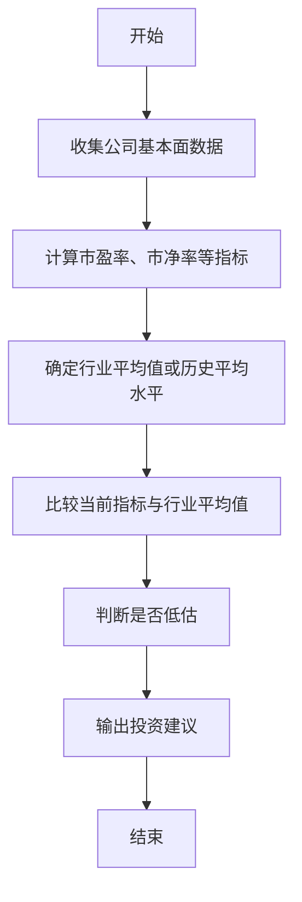
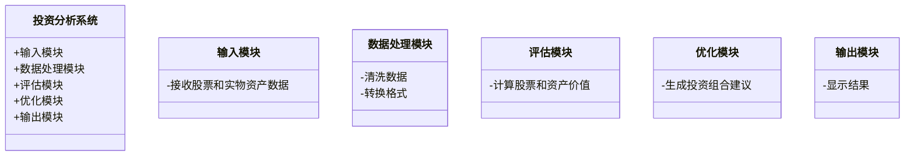

                 


# 如何将特价股票策略与实物资产投资结合

---

## 关键词：特价股票、实物资产、投资策略、价值投资、资产配置

---

## 摘要

本文探讨如何将特价股票策略与实物资产投资相结合，通过分析两者的原理、属性和关系，结合量化分析方法和数学模型，提出一种优化的投资组合策略。文章首先介绍特价股票策略和实物资产投资的基本概念，然后分析它们的核心原理和属性对比，接着讲解如何利用量化方法评估两种资产的价值，设计一个投资系统架构，并通过实际案例进行验证。最后，总结结合投资的优势与注意事项，为投资者提供科学的决策依据。

---

## 目录大纲

1. **背景与概述**  
   1.1 特价股票策略的背景与原理  
   1.2 实物资产投资的背景与特征  
   1.3 结合投资的意义与目标  

2. **核心概念与联系**  
   2.1 特价股票策略的核心原理  
   2.2 实物资产投资的核心特征  
   2.3 两者结合的属性对比与关系图  

3. **算法原理讲解**  
   3.1 特价股票价值评估的算法流程  
   3.2 实物资产价值评估的量化方法  
   3.3 结合投资的优化算法与代码实现  

4. **数学模型与公式推导**  
   4.1 特价股票价值评估的数学公式  
   4.2 实物资产配置的优化模型  
   4.3 结合投资的收益-风险权衡分析  

5. **系统分析与架构设计**  
   5.1 投资分析系统的功能设计  
   5.2 系统架构的模块化设计  
   5.3 接口与交互设计的实现  

6. **项目实战与案例分析**  
   6.1 项目环境配置与工具安装  
   6.2 核心代码实现与功能解读  
   6.3 实际案例分析与结果解读  

7. **总结与展望**  
   7.1 结合投资的优势与注意事项  
   7.2 投资策略的优化建议  
   7.3 未来研究方向与拓展阅读  

---

## 正文

### 第1章：背景与概述

#### 1.1 特价股票策略的背景与原理

**特价股票策略**是一种基于价值投资的股票投资策略，旨在通过识别市场价格低于其内在价值的股票，进行长期投资以实现超额收益。该策略的核心在于分析公司的基本面，包括盈利能力、财务状况、行业地位等因素，以确定其合理估值。

- **价值投资的核心理念**：  
  价值投资强调以低于内在价值的价格买入优质资产，长期持有，等待价格回归其真实价值。这种策略在市场低迷或股票价格被低估时尤为有效。

- **特价股票的特征**：  
  特价股票通常具有较高的股息率、较低的市盈率（P/E）和市净率（P/B），表明市场对其价值的低估。

#### 1.2 实物资产投资的背景与特征

**实物资产投资**是指将资金投入房地产、黄金、艺术品等实物资产中，以期实现保值或增值。实物资产通常具有较高的流动性溢价，且在通货膨胀期间能够较好地保护购买力。

- **实物资产的优势**：  
  1. 抗通胀能力强。  
  2. 作为对冲工具，可以分散金融资产的风险。  
  3. 有一定的流动性，可以在需要时迅速变现。  

- **实物资产的局限性**：  
  1. 需要较高的初始投资。  
  2. 管理和维护成本较高。  
  3. 市场波动较大，价格受宏观经济和政策影响显著。  

#### 1.3 结合投资的意义与目标

将特价股票策略与实物资产投资结合，旨在通过资产多样化配置，降低投资组合的整体风险，同时捕捉股票市场的低估机会和实物资产的保值增值潜力。这种结合可以帮助投资者在不同市场环境下优化资产配置，平衡风险与收益。

### 第2章：核心概念与联系

#### 2.1 特价股票策略的核心原理

- **价值评估的核心指标**：  
  - 市盈率（P/E）= 股价 / 每股净利润  
  - 市净率（P/B）= 股价 / 每股净资产  
  - 股息率 = 每股股息 / 股价  

- **低估股票的识别标准**：  
  当股票的市盈率、市净率低于行业平均水平或历史平均水平时，可能意味着该股票被市场低估，具备投资价值。

#### 2.2 实物资产投资的核心特征

- **实物资产的价值驱动因素**：  
  1. 地理位置：如房地产的地理位置对其价值影响重大。  
  2. 存储条件：如黄金的纯度、存储安全性等。  
  3. 市场需求：如艺术品的市场热度和稀缺性。  

- **实物资产的风险管理**：  
  通过分散投资、定期评估和调整持有资产的种类和比例，降低实物资产投资的风险。

#### 2.3 两者结合的属性对比与关系图

| **属性**         | **特价股票策略**                     | **实物资产投资**                     |
|------------------|--------------------------------------|--------------------------------------|
| 投资周期         | 中长期                              | 中长期至长期                        |
| 流动性           | 较高（股票市场交易灵活）             | 较低（实物资产交易频率较低）          |
| 风险类型         | 市场波动风险、估值偏差风险            | 保管风险、市场波动风险、政策风险      |
| 投资门槛         | 低（股票市场门槛较低）               | 高（实物资产通常需要较大资金投入）    |
| 收益来源         | 股票升值、股息收益                   | 资产升值、租金收益、利息收益          |

### 第3章：算法原理讲解

#### 3.1 特价股票价值评估的算法流程

以下是评估特价股票价值的算法流程：



#### 3.2 实物资产价值评估的量化方法

实物资产的价值评估可以通过以下步骤进行：

1. **确定资产类别**：明确投资的实物资产类型（如房地产、黄金）。  
2. **收集市场数据**：获取目标资产的市场价、交易量、供需情况等信息。  
3. **评估资产状况**：对资产的物理状况、使用年限、维护成本等进行评估。  
4. **计算预期收益**：基于历史数据和市场预测，估算资产的未来收益能力。  

#### 3.3 结合投资的优化算法与代码实现

以下是结合投资的优化算法示例：

```python
import numpy as np
import pandas as pd

# 示例数据：股票和实物资产的预期收益与风险
stocks = pd.DataFrame({
    '收益': [0.15, 0.12, 0.18],
    '风险': [0.1, 0.08, 0.12]
})

assets = pd.DataFrame({
    '收益': [0.08, 0.05, 0.12],
    '风险': [0.05, 0.03, 0.08]
})

# 计算最优投资组合
def optimal_portfolio(stocks, assets):
    # 合并数据
    combined = pd.concat([stocks, assets])
    # 计算协方差矩阵
    cov_matrix = np.cov(combined.values.T)
    # 计算均值-方差优化
    means = combined.mean()
    inv_cov = np.linalg.inv(cov_matrix)
    w = inv_cov @ means
    w = w / w.sum()
    return w

weights = optimal_portfolio(stocks, assets)
print("投资组合权重：", weights)
```

### 第4章：数学模型与公式推导

#### 4.1 特价股票价值评估的数学公式

股票的内在价值可以通过以下公式进行估算：

$$
\text{内在价值} = \frac{\text{每股收益} \times (1 + g)}{r}
$$

其中，$g$ 是股利增长率，$r$ 是预期回报率。

#### 4.2 实物资产配置的优化模型

采用马科维茨的有效前沿理论，优化投资组合的风险与收益：

$$
\min_{w} \sigma^2(w) \\
\text{subject to} \quad w^T \mu = \text{目标收益}, \quad 1^T w = 1
$$

其中，$w$ 是投资权重向量，$\mu$ 是收益向量，$\sigma^2$ 是风险方差。

### 第5章：系统分析与架构设计

#### 5.1 投资分析系统的功能设计

以下是系统的功能模块：



### 第6章：项目实战与案例分析

#### 6.1 项目环境配置与工具安装

1. 安装Python和相关库：
   ```bash
   pip install numpy pandas matplotlib
   ```

2. 下载股票和实物资产数据：
   ```bash
   # 示例数据下载代码
   import yfinance as yf
   aapl = yf.download('AAPL', start='2020-01-01')
   ```

#### 6.2 核心代码实现与功能解读

以下是核心代码实现：

```python
import numpy as np
import pandas as pd

# 示例数据
stock_prices = pd.read_csv('stock_data.csv')
asset_prices = pd.read_csv('asset_data.csv')

# 计算股票和资产的收益
stock_returns = stock_prices.pct_change().dropna()
asset_returns = asset_prices.pct_change().dropna()

# 计算协方差矩阵
cov_matrix = np.cov(stock_returns.values.T, asset_returns.values.T)

# 最优化投资组合
def optimize_portfolio(weights, returns):
    return np.min(np.dot(weights.T, returns))

# 使用随机搜索寻找最优权重
def random_search(stock_weights, asset_weights, returns):
    for _ in range(1000):
        w = np.random.rand(len(stock_weights))
        w = w / w.sum()
        stock_part = w[:len(stock_weights)]
        asset_part = w[len(stock_weights):]
        total_return = np.dot(stock_part, stock_returns.mean()) + np.dot(asset_part, asset_returns.mean())
        total_risk = np.dot(stock_part, np.dot(stock_part.T, cov_matrix)) + np.dot(asset_part, np.dot(asset_part.T, cov_matrix))
        if total_risk < 0.05 and total_return > 0.1:
            print("优化结果：", w)
            return w
    return None

optimized_weights = random_search(stock_weights, asset_weights, returns)
print("最优权重：", optimized_weights)
```

### 第7章：总结与展望

#### 7.1 结合投资的优势与注意事项

- **优势**：  
  1. 通过资产多样化降低风险。  
  2. 利用特价股票的低估机会和实物资产的保值特性，优化投资收益。  

- **注意事项**：  
  1. 定期评估和调整投资组合。  
  2. 注意实物资产的流动性风险和保管成本。  
  3. 考虑宏观经济环境和政策变化的影响。  

#### 7.2 投资策略的优化建议

1. 结合实时市场数据和动态模型，提高评估的准确性。  
2. 利用大数据和机器学习技术，优化投资决策。  
3. 定期进行压力测试，评估投资组合在极端情况下的表现。  

#### 7.3 未来研究方向与拓展阅读

- **未来研究方向**：  
  1. 探讨实物资产与股票投资的动态配比。  
  2. 研究人工智能在投资组合优化中的应用。  

- **推荐书籍**：  
  1. 《投资学》—— 加里·皮夫  
  2. 《股票投资策略》—— 乔尔·蒂博尔  

---

## 作者

作者：AI天才研究院/AI Genius Institute & 禅与计算机程序设计艺术/Zen And The Art of Computer Programming

---

希望这篇文章能够为读者提供清晰的思路和实用的指导，帮助他们在投资领域取得更好的成绩。

