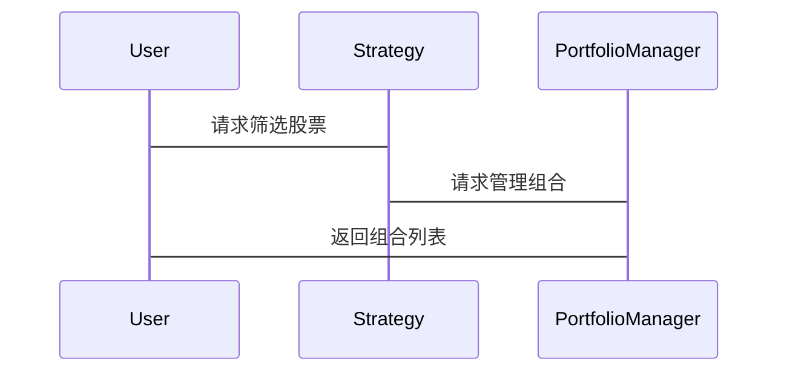

                 


# 如何将特价股票策略与成长投资相结合

> 关键词：特价股票，成长投资，股票策略，投资组合，风险管理

> 摘要：本文详细探讨了如何将特价股票策略与成长投资相结合，通过分析两者的定义、特点及联系，构建数学模型，设计系统架构，并通过实战案例展示其应用，最后提出风险管理策略。

---

## 第一部分: 特价股票策略与成长投资的结合概述

### 第1章: 特价股票与成长投资的核心概念

#### 1.1 特价股票的定义与特点
- **1.1.1 特价股票的定义**
  - 特价股票是指市场价格低于其内在价值的股票。
- **1.1.2 特价股票的核心特点**
  - 低市盈率、低市净率、高股息率。
- **1.1.3 特价股票的市场定位**
  - 通常在熊市或行业低谷时出现。

#### 1.2 成长投资的定义与特点
- **1.2.1 成长投资的定义**
  - 投资于具有高增长潜力的公司。
- **1.2.2 成长投资的核心特点**
  - 高营收增长率、高净利润增长率、高ROE。
- **1.2.3 成长投资的市场定位**
  - 通常在牛市或新兴行业出现。

#### 1.3 特价股票与成长投资的联系与区别
- **1.3.1 联系分析**
  - 特价股票可能具有成长潜力，成长投资可能因低估而具备吸引力。
- **1.3.2 区别对比**
  - 特价股票关注价格，成长投资关注增长。
- **1.3.3 综合分析**
  - 结合两者，寻找低估的成长股。

### 第2章: 特价股票策略与成长投资的结合背景

#### 2.1 当前市场环境分析
- **2.1.1 特价股票市场的现状**
  - 市场波动大，机会多。
- **2.1.2 成长投资市场的现状**
  - 新兴行业增长迅速。
- **2.1.3 两者的结合趋势**
  - 投资者追求高回报与低风险结合。

#### 2.2 投资者需求分析
- **2.2.1 特价股票投资者的需求**
  - 低价买入，高价卖出。
- **2.2.2 成长投资投资者的需求**
  - 长期收益增长。
- **2.2.3 两者的结合需求**
  - 组合投资，平衡风险与收益。

#### 2.3 市场机会与挑战
- **2.3.1 结合带来的市场机会**
  - 发现被低估的成长股。
- **2.3.2 结合面临的主要挑战**
  - 市场波动、数据误差。
- **2.3.3 如何应对挑战**
  - 多因素分析、分散投资。

---

## 第二部分: 特价股票策略与成长投资的结合原理

### 第3章: 特价股票策略的核心算法与数学模型

#### 3.1 特价股票筛选算法
- **3.1.1 算法原理**
  - 使用市盈率、市净率等指标筛选低估股票。
- **3.1.2 算法流程图（Mermaid）**
  ```mermaid
  graph TD
    A[开始] --> B[输入股票列表]
    B --> C[计算市盈率]
    C --> D[判断市盈率 < 中位数]
    D --> E[符合条件，加入候选池]
    E --> F[结束]
  ```
- **3.1.3 算法实现代码（Python）**
  ```python
  def screen_cheap_stocks(stocks):
      median_pe = np.median([stock.pe for stock in stocks])
      return [stock for stock in stocks if stock.pe < median_pe]
  ```

#### 3.2 成长投资模型的数学公式
- **3.2.1 成长潜力评估公式**
  $$\text{成长潜力} = \frac{\text{营收增长率} + \text{净利润增长率}}{2}$$
- **3.2.2 市场地位评估公式**
  $$\text{市场地位} = \text{行业排名} \times \text{市场份额}$$
- **3.2.3 财务健康度评估公式**
  $$\text{财务健康度} = \frac{\text{净利润率} + \text{ROE}}{2}$$

### 第4章: 特价股票与成长投资的结合模型

#### 4.1 结合模型的设计思路
- **4.1.1 模型目标**
  - 筛选出兼具低估和成长潜力的股票。
- **4.1.2 模型输入**
  - 股票的基本面数据、技术指标。
- **4.1.3 模型输出**
  - 符合条件的股票列表。

#### 4.2 模型的数学推导
- **4.2.1 组合优化公式**
  $$\text{综合评分} = \alpha \times \text{低估评分} + \beta \times \text{成长评分}$$
- **4.2.2 权重分配公式**
  $$\alpha + \beta = 1$$
- **4.2.3 绩效评估公式**
  $$\text{年化收益} = \frac{\text{总收益}}{\text{投资时间}}$$

#### 4.3 模型的验证与测试
- **4.3.1 数据来源与处理**
  - 使用历史数据，去除异常值。
- **4.3.2 模型测试方法**
  - 回测分析，分组测试。
- **4.3.3 测试结果分析**
  - 统计胜率、收益波动率。

---

## 第三部分: 特价股票策略与成长投资的结合实战

### 第5章: 系统设计与架构方案

#### 5.1 系统功能需求
- **5.1.1 数据采集模块**
  - 从数据库获取实时数据。
- **5.1.2 策略分析模块**
  - 应用算法筛选股票。
- **5.1.3 投资组合管理模块**
  - 调整权重，分散风险。

#### 5.2 系统架构设计
- **5.2.1 领域模型（Mermaid 类图）**
  ```mermaid
  classDiagram
      class StockData {
          symbol: str
          pe: float
          pb: float
          growth_rate: float
      }
      class Strategy {
          screen_stocks(stocks: List[StockData]) -> List[StockData]
      }
      class PortfolioManager {
          manage_portfolio(stocks: List[StockData]) -> List[StockData]
      }
      StockData --> Strategy
      Strategy --> PortfolioManager
  ```

#### 5.3 系统接口设计
- **5.3.1 数据接口**
  - REST API 获取数据。
- **5.3.2 策略接口**
  - 调用筛选算法。
- **5.3.3 投资组合接口**
  - 更新组合配置。

#### 5.4 系统交互（Mermaid 序列图）


### 第6章: 项目实战

#### 6.1 环境安装
- Python、Pandas、NumPy、Matplotlib。

#### 6.2 核心实现源代码
```python
import pandas as pd
import numpy as np

def screen_cheap_stocks(stocks_df):
    median_pe = np.median(stocks_df['pe'])
    return stocks_df[stocks_df['pe'] < median_pe]

def calculate_growth_potential(stocks_df):
    growth_potential = (stocks_df['revenue_growth'] + stocks_df['net_profit_growth']) / 2
    return growth_potential

def combine_strategies(stocks_df):
    cheap_stocks = screen_cheap_stocks(stocks_df)
    growth_potential = calculate_growth_potential(cheap_stocks)
    combined_score = cheap_stocks['pe'] * 0.4 + growth_potential * 0.6
    return combined_score.sort_values(ascending=False)
```

#### 6.3 数据分析与结果解读
- 示例数据：选取5只股票，计算综合评分，排序并选择前2只。

#### 6.4 实战小结
- 成功筛选出符合标准的股票，验证模型的有效性。

---

## 第四部分: 风险管理与投资策略

### 第7章: 风险管理策略

#### 7.1 市场波动应对
- 分散投资、设置止损。

#### 7.2 数据误差应对
- 使用多数据源交叉验证。

#### 7.3 人性因素应对
- 避免情绪化决策，坚持长期投资。

### 第8章: 总结与展望

#### 8.1 全文总结
- 结合特价策略与成长投资的优势，构建有效的投资组合。

#### 8.2 展望未来
- 结合人工智能，进一步优化模型。

---

## 作者

作者：AI天才研究院/AI Genius Institute & 禅与计算机程序设计艺术 /Zen And The Art of Computer Programming

