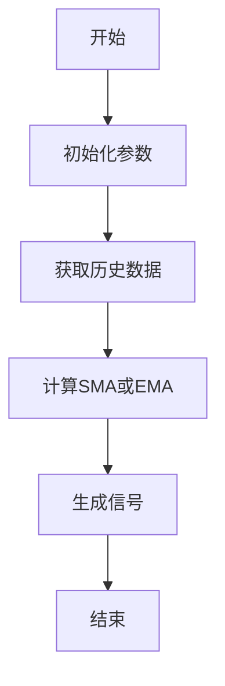
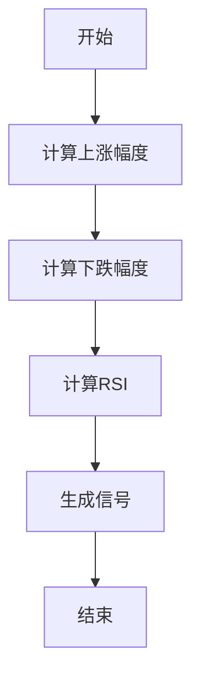
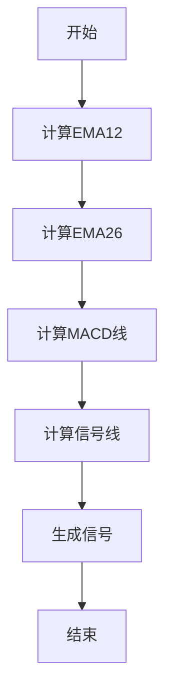
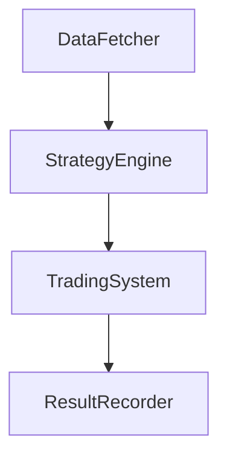
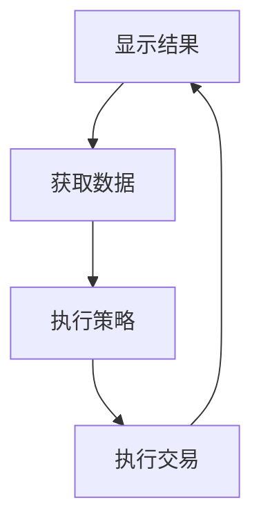

                 


# 如何将特价股票策略与技术分析相结合

## 关键词：特价股票策略、技术分析、股票交易、交易策略、算法交易

## 摘要：本文探讨如何将特价股票策略与技术分析相结合，通过数学建模、算法优化和系统架构设计，提供一套高效的投资策略，帮助投资者在股票市场中捕捉套利机会并优化交易决策。

---

## 第1章：特价股票策略的基础

### 1.1 特价股票的定义与特点

#### 1.1.1 特价股票的定义
特价股票是指市场价格低于其内在价值的股票。这种差异可能是由于市场波动、投资者情绪或短期市场失灵造成的。投资者可以利用这种价格差异进行套利，以期获得短期收益。

#### 1.1.2 特价股票的特点
- **价格低估**：市场价格低于内在价值。
- **波动性高**：通常波动较大，适合短线交易。
- **市场关注度低**：可能被市场忽视，具有潜在的上升空间。

#### 1.1.3 特价股票的优势与劣势
- **优势**：潜在的高收益，套利机会。
- **劣势**：高风险，波动性大，市场关注度低。

### 1.2 技术分析的基本概念

#### 1.2.1 技术分析的定义
技术分析是一种通过分析历史价格数据来预测未来价格走势的方法。它假设市场行为反映所有信息，并通过价格图表和指标来识别趋势和模式。

#### 1.2.2 技术分析的核心假设
- 市场行为反映所有信息。
- 价格走势具有趋势性。
- 历史形态会重复出现。

#### 1.2.3 技术分析与基本面分析的区别
- **技术分析**：基于价格和成交量数据。
- **基本面分析**：基于公司财务状况和行业前景。

### 1.3 特价股票策略与技术分析的结合意义

#### 1.3.1 结合的必要性
- 利用技术分析筛选潜在的特价股票。
- 提高交易决策的效率和准确性。

#### 1.3.2 结合的优势
- 综合考虑价格波动和内在价值。
- 提高策略的可靠性和稳定性。

#### 1.3.3 结合的适用场景
- 短期套利机会。
- 市场波动剧烈时。

---

## 第2章：技术分析的基础指标

### 2.1 移动平均线（MA）

#### 2.1.1 MA的定义与计算公式
- **简单移动平均（SMA）**：$$SMA = \frac{p_1 + p_2 + \dots + p_n}{n}$$
- **指数移动平均（EMA）**：$$EMA = p_n + \alpha (p_n - SMA_{n-1})$$，其中$\alpha$为衰减因子。

#### 2.1.2 MA的类型
- 简单移动平均（SMA）。
- 指数移动平均（EMA）。

#### 2.1.3 MA的应用实例
- 通过MA识别价格趋势。
- 使用MA交叉点（Golden Cross和Death Cross）作为买卖信号。

### 2.2 相对强弱指数（RSI）

#### 2.2.1 RSI的定义与计算公式
$$RSI = \frac{100}{1 + \frac{A}{B}}$$，其中$A$为上涨幅度，$B$为下跌幅度。

#### 2.2.2 RSI的应用规则
- RSI > 70：超买信号。
- RSI < 30：超卖信号。

#### 2.2.3 RSI的超买超卖信号
- 超买信号：价格可能回调。
- 超卖信号：价格可能反弹。

### 2.3 MACD指标

#### 2.3.1 MACD的定义与计算公式
- **MACD线**：$$MACD = EMA_{12} - EMA_{26}$$
- **信号线**：$$Signal = EMA_{9}$$

#### 2.3.2 MACD的应用规则
- MACD线与信号线交叉：买入或卖出信号。
- MACD线在0线上方：趋势向上。

#### 2.3.3 MACD的顶底背离
- 价格创出新高，MACD未创新高：顶部信号。
- 价格创出新低，MACD未创新低：底部信号。

---

## 第3章：技术分析的核心算法

### 3.1 移动平均线算法

#### 3.1.1 算法流程图



#### 3.1.2 Python实现
```python
import pandas as pd

def calculate_sma(data, window):
    return data['close'].rolling(window).mean()

def calculate_ema(data, window):
    return data['close'].ewm(alpha=0.5, min_periods=0, adjust=False).mean()
```

### 3.2 RSI算法

#### 3.2.1 算法流程图



#### 3.2.2 Python实现
```python
def calculate_rsi(data, window):
    up = data['close'] - data['close'].shift(1)
    down = data['close'].shift(1) - data['close']
    up = pd.Series(up, name='up').where(up > 0, 0)
    down = pd.Series(down, name='down').where(down > 0, 0)
    rsi = (100 / (1 + (up.rolling(window).mean() / down.rolling(window).mean())))
    return rsi
```

### 3.3 MACD算法

#### 3.3.1 算法流程图



#### 3.3.2 Python实现
```python
def calculate_macd(data):
    ema12 = data['close'].ewm(span=12, min_periods=0, adjust=False).mean()
    ema26 = data['close'].ewm(span=26, min_periods=0, adjust=False).mean()
    macd = ema12 - ema26
    signal = macd.ewm(span=9, min_periods=0, adjust=False).mean()
    return macd, signal
```

---

## 第4章：特价股票策略与技术分析的结合

### 4.1 策略选择与实施

#### 4.1.1 指标选择
- 结合RSI和MACD识别超卖和超买信号。
- 结合MA识别价格趋势。

#### 4.1.2 交易信号生成
- RSI低于30且MACD线在0线上方：买入信号。
- RSI高于70且MACD线在0线下方：卖出信号。

#### 4.1.3 策略优化
- 设置止损和止盈。
- 调整指标参数。

---

## 第5章：风险管理与心理控制

### 5.1 风险管理策略

#### 5.1.1 资金管理
- 使用固定比例进行投资。
- 设置止损和止盈。

#### 5.1.2 心理控制
- 避免贪婪和恐惧。
- 坚守交易计划。

---

## 第6章：实战案例分析

### 6.1 特价股票选择

#### 6.1.1 识别超卖信号
- 使用RSI识别超卖股票。
- 使用MA识别价格趋势。

#### 6.1.2 交易信号生成
- RSI < 30且MACD线在0线上方：买入。
- RSI > 70且MACD线在0线下方：卖出。

#### 6.1.3 交易结果分析
- 记录每笔交易的收益和亏损。
- 总结经验教训。

---

## 第7章：系统设计与实现

### 7.1 系统架构设计

#### 7.1.1 系统功能模块
- 数据获取模块。
- 策略执行模块。
- 结果记录模块。

#### 7.1.2 系统架构图



### 7.2 接口设计与交互

#### 7.2.1 接口设计
- 数据获取接口。
- 策略执行接口。
- 结果记录接口。

#### 7.2.2 交互流程图



---

## 第8章：总结与建议

### 8.1 总结
- 特价股票策略与技术分析的结合可以提高交易效率和准确性。
- 需要注意风险管理，避免过度交易。

### 8.2 建议
- 不断优化策略参数。
- 关注市场变化，及时调整策略。

---

## 作者：AI天才研究院/AI Genius Institute & 禅与计算机程序设计艺术 /Zen And The Art of Computer Programming

---

**注意**：以上内容为示例，实际撰写时需要根据具体情况进行调整和补充。

