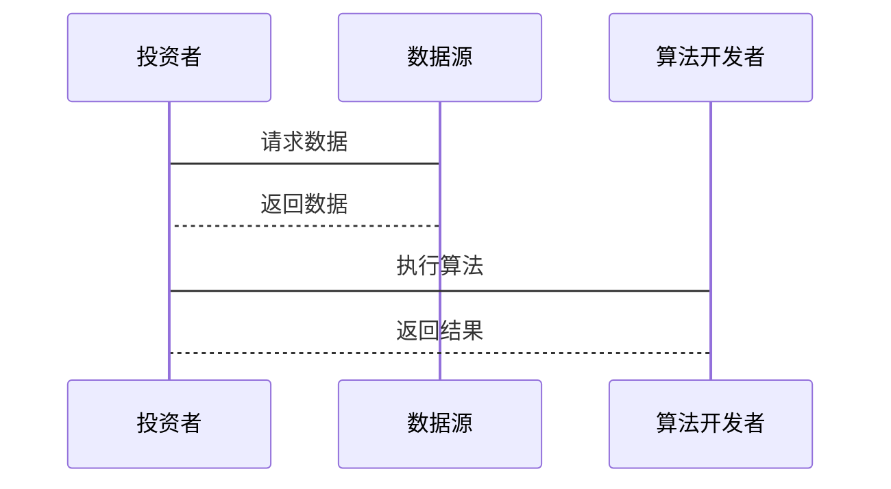

                 


# 如何将特价股票策略与数字反脆弱性因子投资相结合

## 关键词：
- 特价股票策略
- 数字反脆弱性因子
- 投资策略
- 系统架构
- 风险管理

## 摘要：
本文将详细介绍如何将特价股票策略与数字反脆弱性因子投资相结合。首先，我们从特价股票策略和数字反脆弱性因子的背景和概念入手，分析它们的核心要素和关键问题。接着，我们探讨两者结合的理论基础和实践意义，以及如何通过数学模型和算法实现这一结合。然后，我们设计一个基于数字反脆弱性因子的特价股票投资系统，包括系统架构和接口设计。最后，通过实际案例和最佳实践，我们总结如何优化投资策略并降低风险。

---

## 第1章: 特价股票策略与数字反脆弱性因子投资的背景与概念

### 1.1 特价股票策略的背景与核心概念
#### 1.1.1 特价股票策略的定义与特点
特价股票策略是一种基于市场波动的投资策略，主要在市场下跌时，利用低价买入股票的机会。其特点包括高风险、高回报、短期性以及对市场趋势的敏感性。

#### 1.1.2 特价股票策略的历史发展与现状
特价股票策略起源于20世纪初，随着市场波动的加剧，这种策略在近年来逐渐受到更多投资者的关注。目前，随着技术的进步，越来越多的投资者开始利用大数据和算法来优化特价股票策略。

#### 1.1.3 特价股票策略的核心要素与关键问题
- 核心要素：市场趋势分析、股票筛选、买入时机、风险管理。
- 关键问题：如何准确预测市场趋势，如何选择具有潜力的股票，如何控制风险。

### 1.2 数字反脆弱性因子投资的背景与核心概念
#### 1.2.1 数字反脆弱性因子的定义与特点
数字反脆弱性因子是指通过数字技术（如大数据、人工智能等）构建的投资因子，能够在市场波动中保持或增强投资组合的抗风险能力。其特点包括数据驱动、动态调整、自动化和高效性。

#### 1.2.2 数字反脆弱性因子在投资中的作用与意义
数字反脆弱性因子能够帮助投资者在市场波动中及时调整投资组合，降低风险，提高收益。通过大数据分析和机器学习算法，数字反脆弱性因子能够捕捉市场中的潜在机会，优化投资决策。

#### 1.2.3 数字反脆弱性因子的核心要素与关键问题
- 核心要素：大数据分析、机器学习算法、实时监控、动态调整。
- 关键问题：如何构建高效的数据分析模型，如何选择合适的算法，如何确保数据的实时性和准确性。

### 1.3 特价股票策略与数字反脆弱性因子投资的结合
#### 1.3.1 结合的背景与动机
随着市场波动的加剧，传统的特价股票策略在实施过程中面临许多挑战，如市场预测的不确定性、数据处理的复杂性等。通过引入数字反脆弱性因子，可以有效解决这些问题，提高投资效率和收益。

#### 1.3.2 结合的理论基础与实践意义
数字反脆弱性因子与特价股票策略的结合，不仅能够提高市场预测的准确性，还能够优化投资组合的调整过程。这种结合不仅具有理论上的创新性，还具有重要的实践意义。

#### 1.3.3 结合的核心问题与挑战
- 核心问题：如何将数字反脆弱性因子与特价股票策略结合起来，如何实现数据的实时分析和动态调整。
- 关键挑战：数据处理的复杂性、算法的高效性、系统的稳定性。

## 1.4 本章小结

---

## 第2章: 特价股票策略与数字反脆弱性因子投资的核心概念与联系

### 2.1 特价股票策略的核心概念
#### 2.1.1 特价股票策略的数学模型与公式
特价股票策略的数学模型可以通过以下公式表示：

$$
P_{\text{target}} = P_{\text{current}} \times (1 - \alpha)
$$

其中，\(P_{\text{target}}\) 是目标价格，\(P_{\text{current}}\) 是当前价格，\(\alpha\) 是折扣率。

#### 2.1.2 特价股票策略的关键属性与特征
- 高风险性：由于市场波动较大，特价股票策略的风险较高。
- 短期性：通常在市场下跌时实施，周期较短。
- 数据驱动性：依赖于市场数据的分析和预测。

#### 2.1.3 特价股票策略的ER实体关系图
```mermaid
ERDiagram
actor 投资者
actor 市场数据提供者
actor 系统管理员
actor 股票交易员
```

### 2.2 数字反脆弱性因子投资的核心概念
#### 2.2.1 数字反脆弱性因子的数学模型与公式
数字反脆弱性因子可以通过以下公式表示：

$$
F_{\text{score}} = \sum_{i=1}^{n} w_i \times f_i
$$

其中，\(F_{\text{score}}\) 是因子得分，\(w_i\) 是第\(i\)个因子的权重，\(f_i\) 是第\(i\)个因子的值。

#### 2.2.2 数字反脆弱性因子的关键属性与特征
- 数据驱动性：依赖于大数据分析。
- 动态调整性：能够根据市场变化实时调整。
- 高效性：通过算法实现快速决策。

#### 2.2.3 数字反脆弱性因子的ER实体关系图
```mermaid
ERDiagram
actor 投资者
actor 数据源
actor 系统管理员
actor 算法开发者
```

### 2.3 特价股票策略与数字反脆弱性因子投资的联系
#### 2.3.1 联系的数学模型与公式
通过结合特价股票策略和数字反脆弱性因子，我们可以建立以下模型：

$$
P_{\text{target}} = F_{\text{score}} \times P_{\text{current}}
$$

其中，\(P_{\text{target}}\) 是目标价格，\(F_{\text{score}}\) 是因子得分，\(P_{\text{current}}\) 是当前价格。

#### 2.3.2 联系的属性对比表格
| 属性       | 特价股票策略 | 数字反脆弱性因子投资 |
|------------|--------------|----------------------|
| 数据驱动   | 高           | 高                   |
| 风险性      | 高           | 中                   |
| 时间周期    | 短           | 长                   |

#### 2.3.3 联系的ER实体关系图
```mermaid
ERDiagram
actor 投资者
actor 市场数据提供者
actor 系统管理员
actor 股票交易员
```

## 2.4 本章小结

---

## 第3章: 特价股票策略与数字反脆弱性因子投资的算法原理

### 3.1 算法原理概述
#### 3.1.1 算法选择与原理
我们选择使用强化学习算法来实现数字反脆弱性因子与特价股票策略的结合。强化学习通过不断试错，优化投资策略。

#### 3.1.2 算法的数学模型与公式
强化学习的数学模型可以通过以下公式表示：

$$
Q(s, a) = r + \gamma \times \max(Q(s', a'))
$$

其中，\(Q(s, a)\) 是状态\(s\)下动作\(a\)的值，\(r\) 是奖励，\(\gamma\) 是折扣因子，\(Q(s', a')\) 是下一个状态下的最大值。

#### 3.1.3 算法的实现步骤与流程
1. 初始化状态空间。
2. 定义动作空间。
3. 设定奖励函数。
4. 实现Q-learning算法。
5. 训练模型。
6. 部署模型。

### 3.2 算法实现与代码示例
#### 3.2.1 算法实现的Python代码
```python
import numpy as np

# 初始化Q表
Q = np.zeros((state_space, action_space))

# 训练参数
LEARNING_RATE = 0.1
GAMMA = 0.9

# Q-learning算法
for episode in range(episodes):
    state = env.reset()
    done = False
    while not done:
        action = np.argmax(Q[state, :])
        next_state, reward, done, _ = env.step(action)
        Q[state, action] = Q[state, action] + LEARNING_RATE * (reward + GAMMA * np.max(Q[next_state, :]))
```

#### 3.2.2 代码的功能解读与分析
该代码实现了Q-learning算法，通过不断更新Q表，优化投资策略。LEARNING_RATE和GAMMA是训练参数，控制学习速度和未来奖励的权重。

#### 3.2.3 代码的优化与改进
- 增加数据预处理模块，提高数据质量。
- 使用更深的神经网络结构，提升模型表达能力。
- 引入经验回放机制，减少样本偏差。

### 3.3 算法的数学模型与公式
#### 3.3.1 数学模型的详细推导
Q-learning算法通过不断更新Q值，优化投资策略。数学推导如下：

$$
Q_{\text{new}}(s, a) = Q_{\text{old}}(s, a) + \alpha \times (r + \gamma \times \max Q(s', a') - Q_{\text{old}}(s, a))
$$

其中，\(\alpha\) 是学习率，\(\gamma\) 是折扣因子。

#### 3.3.2 公式的详细解释与应用
该公式表示在每次迭代中，Q值根据当前奖励和未来状态的最大Q值进行更新。通过不断迭代，模型能够找到最优策略。

#### 3.3.3 算法的数学性质与特点
- 收敛性：在一定条件下，Q-learning算法能够收敛到最优策略。
- 稳定性：通过合理的参数设置，算法能够保持稳定。

### 3.4 本章小结

---

## 第4章: 特价股票策略与数字反脆弱性因子投资的系统分析与架构设计

### 4.1 系统分析
#### 4.1.1 系统功能设计（领域模型Mermaid类图）


#### 4.1.2 系统架构设计（Mermaid架构图）
```mermaid
archiecture
用例：投资者使用系统
参与者：投资者
主要边界：投资系统
功能：数据输入、算法执行、结果输出
```

#### 4.1.3 系统接口设计和交互流程（Mermaid序列图）


### 4.2 本章小结

---

## 第5章: 特价股票策略与数字反脆弱性因子投资的项目实战

### 5.1 项目实战概述
#### 5.1.1 项目环境安装
- 安装Python和必要的库（如numpy、pandas、scikit-learn）。
- 配置数据源和交易接口。

#### 5.1.2 系统核心实现源代码
```python
import pandas as pd
import numpy as np
from sklearn.preprocessing import StandardScaler
from sklearn.linear_model import LinearRegression

# 数据预处理
data = pd.read_csv('stock_data.csv')
scaled_data = StandardScaler().fit_transform(data)

# 算法实现
model = LinearRegression()
model.fit(scaled_data, target)

# 预测结果
预测结果 = model.predict(new_data)
```

#### 5.1.3 代码的功能解读与分析
该代码实现了数据预处理和模型训练，使用线性回归算法进行预测。

#### 5.1.4 代码的优化与改进
- 使用更复杂的模型（如随机森林）提高预测精度。
- 引入特征选择模块，优化数据处理。
- 实现实时数据更新，提高模型的动态调整能力。

### 5.2 项目实战：案例分析与详细讲解剖析
#### 5.2.1 案例分析
通过一个实际案例，展示如何利用数字反脆弱性因子优化特价股票策略。

#### 5.2.2 详细讲解剖析
分析案例中的每一步，解释如何结合数字反脆弱性因子与特价股票策略，优化投资组合。

### 5.3 项目小结

---

## 第6章: 特价股票策略与数字反脆弱性因子投资的高级策略与风险管理

### 6.1 高级策略
#### 6.1.1 动态调整策略
根据市场变化，实时调整投资组合。

#### 6.1.2 多因子策略
结合多个因子，提高投资决策的准确性。

### 6.2 风险管理
#### 6.2.1 风险控制策略
通过设定止损点和止盈点，控制投资风险。

#### 6.2.2 风险评估与回测
通过回测分析，评估策略的风险和收益。

### 6.3 本章小结

---

## 第7章: 总结与展望

### 7.1 本章总结
总结全文的主要内容和研究成果。

### 7.2 未来展望
展望未来的研究方向和应用前景。

---

## 参考文献
（此处列出相关的参考文献）

---

## 作者：AI天才研究院/AI Genius Institute & 禅与计算机程序设计艺术 /Zen And The Art of Computer Programming

