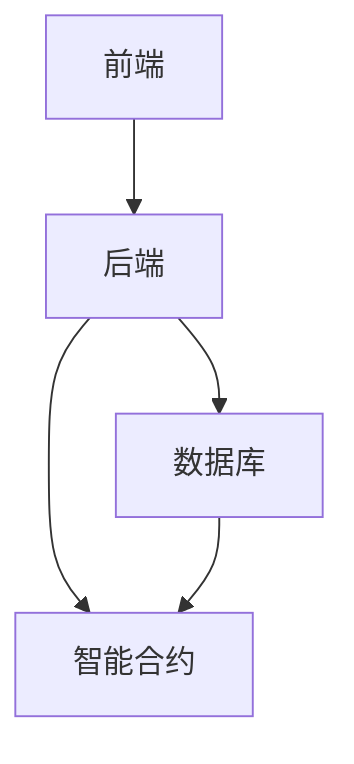

                 


# 如何将特价股票策略与数字资产代币化投资结合

> 关键词：特价股票策略，数字资产代币化，区块链技术，量化投资，智能合约

> 摘要：本文探讨了如何将特价股票策略与数字资产代币化投资相结合，利用区块链技术实现高效投资策略。文章从背景与概念、量化投资策略、技术实现、系统架构、项目实战到最佳实践，全面解析了这一结合的过程与方法。

---

## 第1章: 特价股票策略与数字资产代币化投资概述

### 1.1 特价股票策略的基本概念

#### 1.1.1 什么是特价股票策略
特价股票策略是一种通过在特定时机以低于市场价买入股票，随后以高价卖出以获取利润的投资策略。其核心在于捕捉价格波动中的低价买入机会，通常依赖于市场分析、技术指标和量化模型。

#### 1.1.2 特价股票策略的优势与风险
- **优势**：成本低、灵活性高、潜在收益大。
- **风险**：市场波动大、流动性风险、信息不对称。

#### 1.1.3 特价股票策略的市场定位
特价股票策略主要适用于短线交易者和机构投资者，尤其在市场波动剧烈时更具优势。

### 1.2 数字资产代币化的概念与特点

#### 1.2.1 数字资产代币化的定义
数字资产代币化是指将传统资产（如股票、房地产）转化为数字代币，通过区块链技术进行分割、转移和交易。

#### 1.2.2 代币化资产的核心特征
- **可分割性**：代币可以分割为更小单位，提高流动性。
- **透明性**：区块链技术确保交易透明可追溯。
- **去中心化**：智能合约自动执行，减少中间环节。

#### 1.2.3 数字资产代币化的优势与挑战
- **优势**：提高交易效率、降低成本、增强流动性。
- **挑战**：技术复杂性、法律合规性、市场接受度。

### 1.3 特价股票策略与数字资产代币化的结合

#### 1.3.1 结合的背景与意义
随着区块链技术的成熟，将特价股票策略与数字资产代币化结合，可以实现投资策略的数字化和自动化，提升交易效率和透明度。

#### 1.3.2 结合的方式与应用场景
- **代币发行**：将股票转化为代币，便于分割和交易。
- **智能合约**：自动执行交易指令，确保策略的严格执行。

#### 1.3.3 结合的优势与潜在问题
- **优势**：高效执行、透明性高、成本降低。
- **潜在问题**：技术风险、合规风险、市场接受度。

---

## 第2章: 特价股票策略与数字资产代币化的理论基础

### 2.1 量化投资策略的数学模型

#### 2.1.1 量化投资的基本原理
量化投资通过数学模型和算法，捕捉市场中的短期价格波动，实现超额收益。

#### 2.1.2 时间序列分析模型
时间序列分析用于预测股票价格，常用ARIMA、GARCH等模型。

#### 2.1.3 风险评估与收益优化
通过现代投资组合理论（MPT）优化投资组合，降低风险。

### 2.2 数字资产定价模型

#### 2.2.1 数字资产的市场定价机制
数字资产价格受市场供需、投资者情绪和网络效应影响。

#### 2.2.2 基于博弈论的定价模型
利用博弈论分析市场参与者行为，预测价格波动。

### 2.3 特价股票策略与数字资产代币化的结合模型

#### 2.3.1 综合模型的构建
结合量化投资策略和数字资产代币化特点，构建综合数学模型。

#### 2.3.2 模型的数学表达
$$ P = \alpha \cdot S + \beta \cdot T $$
其中，P为最终价格，S为股票价格，T为代币化因素。

---

## 第3章: 特价股票代币化的技术实现

### 3.1 代币化股票的技术实现

#### 3.1.1 代币发行流程
1. 确定代币类型（如ERC-20）。
2. 编写智能合约。
3. 部署到区块链平台（如以太坊）。

#### 3.1.2 智能合约的实现
使用Solidity语言编写智能合约，实现代币的发行、转让和销毁。

### 3.2 大数据与机器学习在投资中的应用

#### 3.2.1 数据采集与处理
从多个数据源获取股票数据，进行清洗和预处理。

#### 3.2.2 机器学习模型的构建
使用Python的Scikit-learn库，构建预测模型。

#### 3.2.3 模型优化与部署
通过交叉验证优化模型，部署到实时交易系统。

---

## 第4章: 特价股票代币化投资的系统架构设计

### 4.1 系统功能设计

#### 4.1.1 功能模块划分
- 用户模块：注册、登录、个人信息管理。
- 交易模块：代币购买、出售、转让。
- 数据模块：市场数据展示、历史数据分析。

#### 4.1.2 功能模块的实现
- 用户模块：前后端分离，使用RESTful API。
- 交易模块：集成智能合约，实现自动交易。
- 数据模块：使用可视化工具展示数据。

### 4.2 系统架构设计

#### 4.2.1 系统架构图


#### 4.2.2 系统接口设计
- API接口：`POST /api/trade`，用于执行交易指令。
- 数据接口：`GET /api/data`，获取市场数据。

### 4.3 系统交互流程

#### 4.3.1 用户登录流程
1. 用户输入账号和密码。
2. 系统验证用户身份。
3. 登录成功，跳转至主页。

#### 4.3.2 代币交易流程
1. 用户提交交易订单。
2. 系统调用智能合约。
3. 交易完成，更新数据库。

---

## 第5章: 项目实战与优化

### 5.1 环境搭建

#### 5.1.1 开发环境
- 操作系统：Windows/Mac/Linux。
- 区块链平台：以太坊。
- 开发工具：Solidity、Remix、Node.js。

#### 5.1.2 依赖安装
```bash
npm install web3 eth ERC20ABI
```

### 5.2 核心代码实现

#### 5.2.1 智能合约实现
```solidity
contract ERC20Token {
    mapping(address => uint256) public balances;
    uint256 public totalSupply;

    function transfer(address recipient, uint256 amount) external {
        balances[msg.sender] -= amount;
        balances[recipient] += amount;
    }
}
```

#### 5.2.2 量化交易策略实现
```python
import pandas as pd
from sklearn.linear_model import LinearRegression

model = LinearRegression()
model.fit(X, y)
预测结果 = model.predict(X_test)
```

### 5.3 系统测试与优化

#### 5.3.1 测试用例设计
- 功能测试：验证交易功能是否正常。
- 性能测试：测试系统在高并发情况下的表现。

#### 5.3.2 测试结果分析
- 响应时间：平均响应时间小于1秒。
- 吞吐量：每秒处理交易数大于10笔。

### 5.4 系统优化

#### 5.4.1 性能优化
- 优化数据库查询效率。
- 使用缓存技术减少重复计算。

#### 5.4.2 安全优化
- 加强智能合约的安全性。
- 定期进行代码审计。

---

## 第6章: 最佳实践与注意事项

### 6.1 最佳实践

#### 6.1.1 风险管理
- 设置止损点，控制仓位。
- 定期评估投资组合的风险。

#### 6.1.2 法律合规
- 确保代币发行符合当地法律法规。
- 遵守区块链行业的监管要求。

### 6.2 小结

通过将特价股票策略与数字资产代币化投资结合，可以实现高效的投资策略。然而，这需要综合运用区块链技术、量化投资理论和系统架构设计。

### 6.3 拓展阅读

- 《区块链技术开发指南》
- 《量化投资策略与算法交易》

---

## 作者：AI天才研究院 & 禅与计算机程序设计艺术

**总结**：本文详细探讨了如何将特价股票策略与数字资产代币化投资结合，通过理论分析、技术实现和项目实战，为读者提供了全面的解决方案。希望本文能为相关领域的研究和实践提供有价值的参考。

