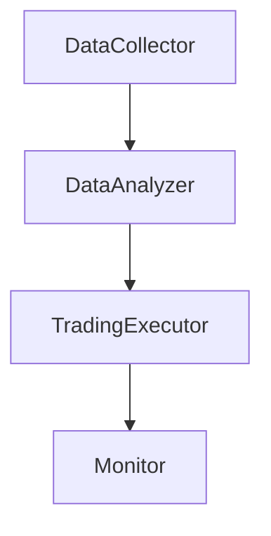

                 


```markdown
# 如何将特价股票策略与数字资产投资结合

> 关键词：特价股票策略、数字资产投资、量化交易、技术分析、机器学习

> 摘要：本文探讨如何将特价股票策略与数字资产投资相结合，利用技术分析和机器学习优化投资策略，提升投资收益。

---

## 第一部分: 特价股票策略与数字资产投资的背景与概念

### 第1章: 特价股票策略概述

#### 1.1 特价股票策略的定义与特点
##### 1.1.1 特价股票的定义
特价股票是指低于市场价的股票，通常在市场波动、公司业绩不佳或市场情绪影响下出现。

##### 1.1.2 特价股票策略的核心特点
- **低买高卖**：利用价格波动，在低价买入，高价卖出。
- **市场敏感**：依赖市场波动和公司基本面变化。
- **风险较高**：价格波动大，投资风险较高。

##### 1.1.3 特价股票策略的应用场景
- **短期投资**：适合短期交易者，利用价格波动获利。
- **市场下跌周期**：在市场低迷时，寻找被低估的股票。

---

### 第2章: 数字资产投资概述

#### 2.1 数字资产的定义与特点
##### 2.1.1 数字资产的定义
数字资产是指基于区块链技术的虚拟货币，如比特币、以太坊等。

##### 2.1.2 数字资产的核心特点
- **去中心化**：交易不受传统金融体系控制。
- **高度波动**：价格波动剧烈，适合高风险投资者。
- **技术驱动**：依赖区块链技术和社区共识。

##### 2.1.3 数字资产的投资场景
- **长期投资**：基于技术进步和社区发展。
- **短期投机**：利用价格波动快速获利。

---

### 第3章: 特价股票策略与数字资产投资的结合

#### 3.1 结合的背景与意义
##### 3.1.1 当前市场背景
- **市场波动加剧**：传统股票和数字资产价格波动大。
- **技术进步**：大数据和人工智能为投资策略提供新工具。

##### 3.1.2 结合的意义与价值
- **风险分散**：通过多元化投资降低风险。
- **收益提升**：利用技术分析优化投资决策。

#### 3.2 结合的核心概念与联系
##### 3.2.1 核心概念对比分析

| 特性       | 特价股票策略                     | 数字资产投资                     |
|------------|----------------------------------|----------------------------------|
| 资产类型    | 股票                            | 数字货币                        |
| 交易频率    | 短期至中期                      | 短期至长期                      |
| 风险等级    | 中高风险                        | 高风险                          |
| 分析方法    | 技术分析、基本面分析            | 技术分析、市场情绪分析          |

##### 3.2.2 结合的实体关系图
```mermaid
er
    title 特价股票策略与数字资产投资的核心关系
    Entity1: 特价股票策略
    Entity2: 数字资产投资
    E
    Entity1 --> Entity2: 战略结合
```

---

## 第二部分: 算法原理与数学模型

### 第4章: 技术分析指标

#### 4.1 移动平均线（MA）
##### 4.1.1 MA的定义
移动平均线是将一定时期内的价格平均值连接起来，形成价格趋势线。

##### 4.1.2 MA的计算公式
$$ MA_n = \frac{1}{n} \sum_{i=1}^{n} P_i $$
其中，$P_i$ 是第i天的价格，$n$ 是天数。

##### 4.1.3 MA的应用
- **趋势判断**：价格在MA线上方为上升趋势，线下方为下降趋势。
- **买卖信号**：价格突破MA线时产生买卖信号。

#### 4.2 相对强弱指数（RSI）
##### 4.2.1 RSI的定义
RSI衡量资产价格的超买或超卖状态。

##### 4.2.2 RSI的计算公式
$$ RSI = 100 - \frac{100}{1 + \frac{A}{B}} $$
其中，$A$ 是上涨幅度，$B$ 是下跌幅度。

##### 4.2.3 RSI的应用
- **超买信号**：RSI > 70，价格可能回调。
- **超卖信号**：RSI < 30，价格可能反弹。

---

### 第5章: 机器学习模型

#### 5.1 K-近邻算法（KNN）
##### 5.1.1 KNN的定义
KNN是一种分类算法，基于距离最近的邻居进行分类。

##### 5.1.2 KNN的应用
- **预测价格**：通过历史价格数据预测未来价格。
- **分类交易信号**：根据市场状态分类交易信号。

#### 5.2 数学模型
##### 5.2.1 回归分析
$$ y = \beta_0 + \beta_1x + \epsilon $$
其中，$y$ 是目标变量，$x$ 是自变量，$\epsilon$ 是误差项。

##### 5.2.2 时间序列分析
$$ ARIMA(p, d, q) $$
其中，$p$ 是自回归阶数，$d$ 是差分阶数，$q$ 是移动平均阶数。

---

## 第三部分: 系统分析与架构设计

### 第6章: 系统架构

#### 6.1 系统功能模块
- **数据采集模块**：收集股票和数字资产数据。
- **数据分析模块**：应用技术指标和机器学习模型进行分析。
- **交易执行模块**：根据分析结果执行交易。

#### 6.2 系统架构图


---

## 第四部分: 项目实战

### 第7章: 环境安装与核心代码实现

#### 7.1 环境安装
```bash
pip install pandas numpy matplotlib scikit-learn
```

#### 7.2 核心代码实现
##### 7.2.1 数据采集
```python
import pandas as pd

def get_stock_data(ticker):
    data = pd.read_csv(f'{ticker}.csv')
    return data
```

##### 7.2.2 技术分析
```python
def calculate_ma(data, window):
    return data['Close'].rolling(window).mean()
```

##### 7.2.3 机器学习模型
```python
from sklearn.neighbors import KNeighborsClassifier

def train_knn_model(X, y):
    model = KNeighborsClassifier()
    model.fit(X, y)
    return model
```

---

### 第8章: 实际案例分析

#### 8.1 案例分析
##### 8.1.1 案例背景
分析某段时间内比特币价格走势，结合特价股票策略进行投资。

##### 8.1.2 数据分析
使用移动平均线和RSI指标判断买卖信号。

##### 8.1.3 模型预测
应用KNN模型预测价格走势。

---

## 第五部分: 最佳实践与总结

### 第9章: 最佳实践

#### 9.1 经验总结
- **风险管理**：合理控制仓位，设置止损止盈。
- **技术优化**：持续优化算法模型，提升预测精度。

#### 9.2 小结
结合特价股票策略与数字资产投资，利用技术分析和机器学习，可以有效提升投资收益。

#### 9.3 注意事项
- **市场风险**：价格波动大，需谨慎操作。
- **技术风险**：算法模型需持续优化。

---

## 作者

作者：AI天才研究院/AI Genius Institute & 禅与计算机程序设计艺术 /Zen And The Art of Computer Programming
```

