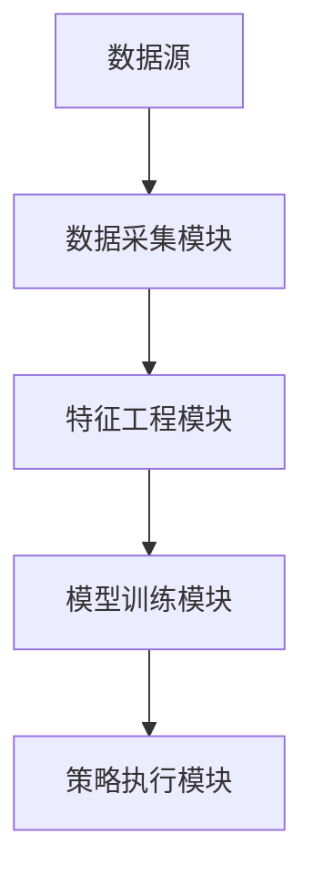

                 


# 《如何将特价股票策略与机器学习资产配置相结合》

---

## 关键词  
- 特价股票策略  
- 机器学习  
- 资产配置  
- 金融投资  
- 数据驱动决策  

---

## 摘要  
本文探讨如何将特价股票策略与机器学习资产配置相结合，通过数据驱动的方法优化投资决策。文章首先介绍特价股票策略和机器学习的基本概念，分析其在金融投资中的应用潜力。接着，详细阐述机器学习在资产配置中的核心算法和数学模型，包括线性回归、支持向量机（SVM）、随机森林等。随后，结合实际案例，展示如何设计一个完整的系统架构，从数据采集到特征工程，再到模型训练和策略部署。最后，通过项目实战，读者可以学习如何将理论应用于实际投资场景，并总结经验教训，展望未来的发展方向。

---

# 第一部分: 特价股票策略与机器学习资产配置的背景与概念  

## 第1章: 特价股票策略的背景与核心概念  

### 1.1 特价股票策略的定义与特点  
- **特价股票的定义**: 以低于市场价买入股票，通过短期波动获利。  
- **特点**: 高风险、高收益、短期性、依赖市场情绪。  

### 1.2 机器学习在金融投资中的作用  
- **数据驱动决策**: 利用历史数据预测未来走势。  
- **非线性关系建模**: 捕捉复杂市场规律。  
- **自动化交易**: 实现高频交易和算法交易。  

### 1.3 特价股票策略与机器学习结合的意义  
- **提高交易效率**: 利用算法快速识别低价股票。  
- **降低人为干扰**: 通过机器学习模型减少情绪化决策。  
- **优化资产配置**: 根据市场变化动态调整投资组合。  

---

## 第2章: 机器学习在资产配置中的核心概念  

### 2.1 资产配置的基本原理  
- **投资组合理论**: 如何通过分散投资降低风险。  
- **有效前沿**: 在给定风险下实现最大收益的资产组合。  

### 2.2 机器学习在资产配置中的优势  
- **复杂模式识别**: 捕捉传统方法难以发现的市场规律。  
- **实时更新**: 根据最新数据动态调整模型。  
- **个性化策略**: 根据投资者风险偏好定制投资方案。  

---

# 第二部分: 机器学习在资产配置中的算法与数学模型  

## 第3章: 机器学习的核心算法  

### 3.1 线性回归模型  
- **数学公式**:  
  $$ y = \beta_0 + \beta_1x + \epsilon $$  
- **应用场景**: 预测股票价格趋势。  

### 3.2 支持向量机（SVM）  
- **数学公式**:  
  $$ \text{max} \{ \frac{1}{2} \lVert w \rVert^2 \} $$  
- **应用场景**: 分类股票涨跌。  

### 3.3 随机森林  
- **数学原理**: 通过多个决策树投票决定最终结果。  
- **应用场景**: 处理高维金融数据。  

---

## 第4章: 资产配置的数学模型  

### 4.1 均值-方差模型  
- **目标**: 在给定风险下最大化收益。  
- **公式**:  
  $$ \min \sigma^2 \quad \text{subject to} \quad \mu \geq \text{target return} $$  

### 4.2 基于机器学习的资产配置模型  
- **步骤**: 数据预处理 → 特征选择 → 模型训练 → 策略回测。  

---

# 第三部分: 系统架构与项目实战  

## 第5章: 系统架构设计  

### 5.1 功能模块划分  
- **数据采集模块**: 从金融数据源获取实时数据。  
- **特征工程模块**: 提取有用的特征（如技术指标、市场情绪）。  
- **模型训练模块**: 使用机器学习算法训练预测模型。  
- **策略执行模块**: 根据模型输出执行交易指令。  

### 5.2 系统架构图  



---

## 第6章: 项目实战  

### 6.1 环境安装  
- **工具**: Python、Pandas、Scikit-learn、TensorFlow。  

### 6.2 核心代码实现  
```python  
# 示例代码：基于线性回归的股票价格预测  
import pandas as pd  
from sklearn.linear_model import LinearRegression  

data = pd.read_csv('stock_data.csv')  
X = data[['open', 'close', 'volume']]  
y = data['next_day_price']  

model = LinearRegression()  
model.fit(X, y)  
predicted_price = model.predict(X)  
```

### 6.3 案例分析  
- **案例背景**: 利用历史数据训练模型，预测某只股票的未来价格。  
- **结果分析**: 对比实际价格与预测价格，评估模型的准确性。  

---

## 第7章: 总结与展望  

### 7.1 本章小结  
- 特价股票策略与机器学习资产配置的结合，能够显著提升投资效率和收益。  

### 7.2 未来展望  
- 更复杂的模型（如深度学习）在股票预测中的应用。  
- 实时交易系统的开发与优化。  

---

## 作者  
作者：AI天才研究院 & 禅与计算机程序设计艺术

