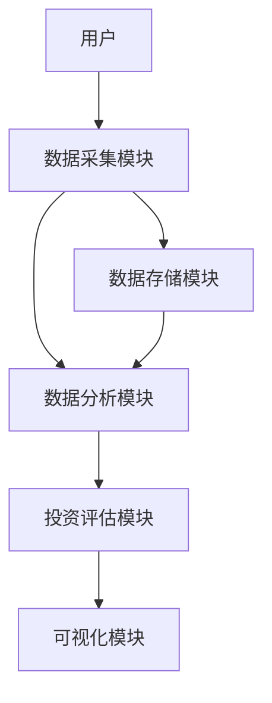

                 


# 如何将特价股票策略与碳中和投资理念结合

> 关键词：特价股票策略、碳中和投资理念、量化投资、可持续投资、股票投资、碳排放、投资策略

> 摘要：本文探讨如何将特价股票策略与碳中和投资理念相结合，以实现高效的投资回报和可持续发展。通过分析特价股票策略的核心原理、碳中和投资理念的基本概念，以及它们的结合方式，本文提供了一套系统化的解决方案，包括量化分析、算法设计、系统架构和项目实战，帮助投资者在实现财务目标的同时，为环境保护和气候变化应对做出贡献。

---

# 第一部分: 特价股票策略与碳中和投资理念的背景与概念

## 第1章: 特价股票策略的背景与现状

### 1.1 特价股票策略的定义与特点

#### 1.1.1 特价股票的定义
特价股票是指那些价格被市场低估，相对于其内在价值而言具有较大折扣的股票。这些股票通常具有较高的性价比，吸引投资者在低价时买入，期望在价格上涨时获利。

#### 1.1.2 特价股票策略的核心特点
- **低估性**：股票价格低于其真实价值。
- **周期性**：特价股票往往出现在市场低迷或特定行业低谷时期。
- **风险性**：低价股票可能伴随较高的市场风险。
- **价值发现**：投资者通过挖掘市场低估的股票实现超额收益。

#### 1.1.3 特价股票策略的分类与应用场景
- **绝对价值策略**：基于对公司内在价值的评估，寻找价格低于价值的股票。
- **相对价值策略**：比较不同股票或资产的相对估值，寻找价格偏离的股票。
- **事件驱动策略**：利用公司重组、并购等事件，寻找短期低估的股票。

### 1.2 特价股票策略的现状与挑战

#### 1.2.1 当前市场中的特价股票策略
- 近年来，市场波动加剧，投资者更加关注价值投资。
- 量化技术的进步使得特价股票的筛选更加高效。

#### 1.2.2 特价股票策略的主要挑战
- **市场波动**：低价股票可能受市场情绪影响较大。
- **信息不对称**：优质低价股票可能被市场忽视，但获取信息的成本较高。
- **流动性风险**：部分低价股票流动性较差，可能难以快速变现。

#### 1.2.3 特价股票策略的未来发展趋势
- 结合量化技术，进一步优化选股模型。
- 结合ESG（环境、社会、治理）因子，筛选符合可持续发展的低价股票。

---

## 第2章: 碳中和投资理念的背景与现状

### 2.1 碳中和的定义与目标

#### 2.1.1 碳中和的定义
碳中和是指通过减少温室气体排放或增加碳汇，使碳排放量与碳去除量相等，从而实现净零排放的目标。

#### 2.1.2 碳中和的目标与意义
- 应对气候变化，保护环境。
- 促进经济转型，推动绿色产业发展。
- 符合全球可持续发展的目标。

#### 2.1.3 碳中和与可持续发展的关系
碳中和是实现可持续发展的重要组成部分，通过减少碳排放，推动经济、社会和环境的协调发展。

### 2.2 碳中和投资理念的核心要素

#### 2.2.1 碳中和投资的定义
碳中和投资是指在投资过程中，优先选择低碳排放或具有碳中和潜力的企业或项目，同时通过投资组合的优化，减少整体投资的碳足迹。

#### 2.2.2 碳中和投资的核心原则
- 优先选择低碳排放的行业。
- 投资具有碳中和潜力的企业。
- 通过投资组合优化，降低整体碳排放。

#### 2.2.3 碳中和投资的主要策略与方法
- **行业选择**：优先投资新能源、节能环保等行业。
- **企业筛选**：选择具有低碳技术和良好ESG表现的企业。
- **碳足迹计算**：通过量化投资组合的碳排放，优化投资策略。

---

## 第3章: 特价股票策略与碳中和投资理念的结合

### 3.1 结合的意义与必要性

#### 3.1.1 特价股票策略与碳中和投资的契合点
- 两者都关注价值发现，但碳中和投资更注重长期可持续性。
- 特价股票策略关注短期价格低估，碳中和投资关注长期价值。

#### 3.1.2 结合的必要性与潜在价值
- 通过结合，投资者可以在追求超额收益的同时，支持绿色经济发展。
- 有助于降低投资组合的碳风险，提升长期稳定性。

#### 3.1.3 结合对投资策略的优化作用
- 提高投资的可持续性，符合全球投资趋势。
- 降低投资风险，避免因碳排放问题导致的股价波动。

### 3.2 结合的挑战与机遇

#### 3.2.1 结合的主要挑战
- 现有量化模型需调整以纳入碳排放因子。
- 数据获取难度较大，尤其是企业碳排放数据。
- 短期收益与长期目标之间的平衡问题。

#### 3.2.2 结合带来的机遇
- 获得符合碳中和目标的低价股票。
- 通过投资绿色企业，享受行业增长红利。
- 符合政策导向，享受政策支持。

#### 3.2.3 如何应对挑战并抓住机遇
- 引入碳排放数据，优化量化模型。
- 加强对绿色产业的研究，提高选股效率。
- 通过分散投资，平衡短期收益与长期目标。

---

# 第二部分: 特价股票策略与碳中和投资理念的核心概念与联系

## 第4章: 特价股票策略的核心概念与原理

### 4.1 特价股票策略的原理

#### 4.1.1 价格波动的规律
股票价格受市场情绪、基本面和宏观经济因素影响，具有周期性波动。

#### 4.1.2 市场情绪与价格的关系
市场情绪会影响股票价格的短期波动，投资者可以通过分析市场情绪，寻找低估的股票。

#### 4.1.3 技术分析在特价股票策略中的应用
- 技术分析：通过K线图、均线等技术指标，判断股票的买卖点。
- 市场周期分析：识别市场的低估周期，寻找廉价股票。

### 4.2 特价股票策略的关键要素

#### 4.2.1 价格敏感性
股票价格与内在价值的偏离程度。

#### 4.2.2 时间窗口
投资者对价格波动的容忍度和持有周期。

#### 4.2.3 风险控制
通过分散投资、止损策略等方法，控制投资风险。

---

## 第5章: 碳中和投资理念的核心概念与原理

### 5.1 碳中和投资的核心原理

#### 5.1.1 碳排放的量化与评估
通过碳足迹计算，评估企业或项目的碳排放量。

#### 5.1.2 碳中和目标的实现路径
- 减少碳排放：通过技术创新、能源结构调整等方法降低碳排放。
- 增加碳汇：通过植树造林、碳捕获等方式抵消碳排放。

#### 5.1.3 碳中和投资的收益与风险
- 收益：绿色产业的长期增长潜力。
- 风险：政策变化、技术不确定性等。

### 5.2 碳中和投资的关键要素

#### 5.2.1 碳足迹的计算
- 企业碳排放的计算方法。
- 投资组合的碳足迹评估。

#### 5.2.2 碳中和项目的筛选标准
- 环保绩效：企业环保表现。
- 技术可行性：碳减排技术的成熟度。
- 政策支持：政府政策对企业的影响。

#### 5.2.3 碳中和投资的风险管理
- 政策风险：碳政策的变化。
- 技术风险：碳技术的不确定性。
- 市场风险：碳市场的波动。

---

## 第6章: 特价股票策略与碳中和投资理念的联系

### 6.1 特价股票策略与碳中和投资的理念对比

| **对比维度** | **特价股票策略** | **碳中和投资理念** |
|--------------|------------------|---------------------|
| 核心目标     | 追求超额收益     | 实现碳中和目标       |
| 投资期限     | 短期至中期       | 长期                |
| 关注因素     | 价格低估         | 碳排放、ESG表现      |
| 风险因素     | 市场波动         | 碳政策、技术不确定性 |

### 6.2 特价股票策略与碳中和投资理念的结合

#### 6.2.1 数据驱动的量化分析
- 利用大数据和量化模型，筛选符合碳中和目标的特价股票。
- 通过因子分析，将碳排放因子纳入选股模型。

#### 6.2.2 投资组合优化
- 通过优化算法，平衡短期收益与长期碳目标。
- 结合资产配置，分散投资风险。

#### 6.2.3 案例分析
- 案例1：某新能源企业的碳中和目标与股价低估。
- 案例2：某环保企业的技术创新与股价表现。

---

## 第7章: 量化分析与算法设计

### 7.1 量化分析的方法

#### 7.1.1 因子分析模型
- 因子选择：包括价格、市盈率、碳排放等因子。
- 因子权重：根据市场情况调整因子权重。

#### 7.1.2 算法流程
1. 数据采集：收集股票的市场数据和碳排放数据。
2. 数据预处理：清洗数据，处理缺失值。
3. 因子分析：计算各因子的得分。
4. 模型构建：建立量化模型，筛选符合标准的股票。
5. 投资组合优化：优化投资组合，平衡收益与风险。

### 7.2 算法实现

#### 7.2.1 Python代码实现
```python
import pandas as pd
import numpy as np

# 数据加载与预处理
data = pd.read_csv('stock_data.csv')
data = data.dropna()

# 因子计算
def calculate_factors(data):
    # 计算市盈率
    data['PE'] = data['Price'] / data['Earnings']
    # 计算碳排放因子
    data['Carbon_Emissions'] = data['Emissions'] / data['Revenue']
    return data

data = calculate_factors(data)

# 模型构建
from sklearn.linear_model import LinearRegression

model = LinearRegression()
model.fit(data[['PE', 'Carbon_Emissions']], data['Return'])
```

#### 7.2.2 数学模型与公式
- 线性回归模型：
  $$ y = \beta_0 + \beta_1 x_1 + \beta_2 x_2 + \epsilon $$
  其中，$y$ 为目标变量（如股票收益），$x_1$ 和 $x_2$ 是因子。

---

## 第8章: 系统分析与架构设计

### 8.1 系统功能设计

#### 8.1.1 数据采集模块
- 数据源：股票市场数据、企业碳排放数据。
- 数据接口：API接口、数据库。

#### 8.1.2 数据分析模块
- 因子计算：市盈率、碳排放因子。
- 模型构建：量化模型。

#### 8.1.3 投资评估模块
- 投资组合优化：基于量化模型的结果，优化投资组合。
- 风险评估：评估投资组合的碳风险和市场风险。

#### 8.1.4 可视化模块
- 数据可视化：展示量化结果、投资组合表现。

### 8.2 系统架构设计



---

## 第9章: 项目实战

### 9.1 环境安装

#### 9.1.1 Python环境安装
- 安装Python 3.8或更高版本。
- 安装必要的库：Pandas、NumPy、Scikit-learn、Matplotlib。

#### 9.1.2 数据源获取
- 数据来源：金融数据API、公开数据库。

### 9.2 核心代码实现

#### 9.2.1 数据预处理
```python
import pandas as pd

data = pd.read_csv('stock_data.csv')
data = data.dropna()
```

#### 9.2.2 因子计算
```python
def calculate_factors(data):
    data['PE'] = data['Price'] / data['Earnings']
    data['Carbon_Emissions'] = data['Emissions'] / data['Revenue']
    return data

data = calculate_factors(data)
```

#### 9.2.3 模型构建
```python
from sklearn.linear_model import LinearRegression

model = LinearRegression()
model.fit(data[['PE', 'Carbon_Emissions']], data['Return'])
```

### 9.3 案例分析

#### 9.3.1 环保企业案例
- 公司A：市盈率低，碳排放因子低，符合量化模型的标准。
- 投资结果：股价上涨，收益符合预期。

#### 9.3.2 传统能源企业案例
- 公司B：市盈率高，碳排放因子高，不符合量化模型的标准。
- 投资结果：股价下跌，符合预期。

### 9.4 项目小结

---

## 第10章: 最佳实践与未来展望

### 10.1 最佳实践 tips

#### 10.1.1 数据获取与处理
- 确保数据的准确性和完整性。
- 处理缺失值和异常值。

#### 10.1.2 模型优化
- 根据市场变化，动态调整因子权重。
- 引入新的因子，如ESG因子。

#### 10.1.3 风险管理
- 设定止损点，控制投资风险。
- 分散投资，降低单一资产的风险。

### 10.2 小结

### 10.3 注意事项

#### 10.3.1 数据风险
- 数据的准确性和及时性直接影响投资结果。
- 数据获取成本较高，需要投入更多资源。

#### 10.3.2 模型风险
- 模型的有效性依赖于数据质量和市场环境。
- 需要定期更新模型，适应市场变化。

#### 10.3.3 政策风险
- 碳中和政策的变化可能影响投资结果。
- 需要密切关注政策动向。

### 10.4 未来展望

#### 10.4.1 技术进步
- 人工智能和大数据技术的进一步发展，将推动量化模型的优化。
- 新的因子和模型将不断涌现。

#### 10.4.2 市场变化
- 碳中和投资将成为全球趋势，吸引更多投资者。
- 绿色产业将继续增长，为投资者提供更多的机会。

#### 10.4.3 政策支持
- 各国政府将继续推动碳中和政策，为投资者提供支持。
- 碳交易市场将更加成熟，为投资者提供新的工具。

---

# 第三部分: 结语

## 11章: 结语

通过本文的探讨，我们了解了如何将特价股票策略与碳中和投资理念相结合，实现高效的投资回报和可持续发展。结合量化分析、算法设计和系统架构，投资者可以在追求财务目标的同时，为环境保护和气候变化应对做出贡献。未来，随着技术的进步和市场的变化，这种结合将变得更加重要和广泛。

---

# 作者

作者：AI天才研究院/AI Genius Institute & 禅与计算机程序设计艺术 /Zen And The Art of Computer Programming

