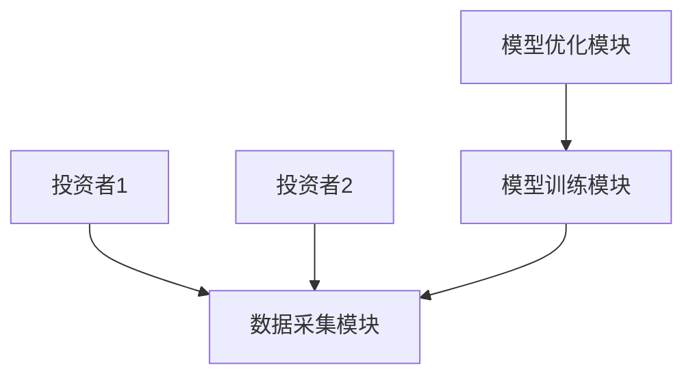
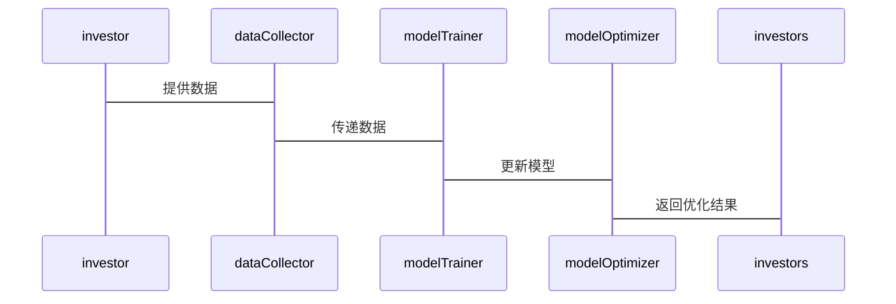

                 


# 如何将特价股票策略与联邦学习资产配置相结合

> **关键词**：特价股票、联邦学习、资产配置、投资策略、机器学习、分布式计算  
> **摘要**：本文探讨了如何将特价股票策略与联邦学习资产配置相结合，通过分析特价股票的核心原理和联邦学习的算法机制，提出了一种结合两者的方法。文章详细介绍了联邦学习的数学模型和系统架构设计，并通过实际案例展示了如何在投资决策中应用这一结合策略，为投资者提供了新的视角和实践指导。

---

## 第1章: 特价股票策略与联邦学习概述

### 1.1 特价股票策略的背景与意义
#### 1.1.1 特价股票的定义与特点
特价股票是指市场价格低于其内在价值的股票，通常具有较高的投资回报潜力。其特点包括低估值、高分红率和较高的安全边际。

#### 1.1.2 特价股票策略的核心目标
通过识别市场低估的股票，构建投资组合以实现超额收益。

#### 1.1.3 特价股票策略在投资中的价值
特价股票策略能够在市场波动中提供较高的风险调整后收益，尤其在熊市或市场低迷时期表现突出。

### 1.2 联邦学习的定义与特点
#### 1.2.1 联邦学习的基本概念
联邦学习是一种分布式机器学习技术，允许多个参与方在不共享原始数据的情况下协同训练模型。

#### 1.2.2 联邦学习的核心特点
- 数据隐私保护
- 分布式计算
- 模型联合优化

#### 1.2.3 联邦学习与传统数据共享的区别
传统数据共享需要集中数据，而联邦学习通过数据不出域的方式实现模型训练。

### 1.3 特价股票策略与联邦学习的结合意义
#### 1.3.1 联邦学习在资产配置中的优势
- 分布式数据处理能力
- 高效的模型优化
- 数据隐私保护

#### 1.3.2 特价股票策略与联邦学习的协同效应
- 特价股票数据的分布式采集与分析
- 联邦学习优化投资组合

#### 1.3.3 结合两者的应用前景
通过联邦学习，投资者可以在不共享敏感数据的情况下，协同优化特价股票的投资策略。

---

## 第2章: 特价股票策略的核心原理

### 2.1 特价股票策略的基本原理
#### 2.1.1 特价股票的识别标准
- 市盈率（P/E）低于行业平均水平
- 市净率（P/B）低于历史平均水平
- 股息率高于行业平均水平

#### 2.1.2 特价股票的估值方法
- 市盈率法
- 市净率法
- 股息贴现法

#### 2.1.3 特价股票的投资策略
- 价值投资策略
- 投机策略
- 组合投资策略

### 2.2 特价股票策略的关键指标
#### 2.2.1 市盈率（P/E）
$$ P/E = \frac{\text{股价}}{\text{每股收益}} $$

#### 2.2.2 市净率（P/B）
$$ P/B = \frac{\text{股价}}{\text{每股净资产}} $$

#### 2.2.3 股息率（Dividend Yield）
$$ \text{股息率} = \frac{\text{每股股息}}{\text{股价}} \times 100\% $$

### 2.3 特价股票策略的实施步骤
#### 2.3.1 数据收集与筛选
- 数据来源：股票市场数据、财务报表
- 数据清洗：去除异常值、缺失值

#### 2.3.2 估值模型的建立
- 选择估值模型（如市盈率模型）
- 计算目标价格

#### 2.3.3 投资组合的优化
- 风险调整后的收益优化
- 投资组合分散化

---

## 第3章: 联邦学习的算法原理

### 3.1 联邦学习的基本概念
#### 3.1.1 联邦学习的定义
- 多个参与方通过共享模型参数而非数据进行协同训练。

#### 3.1.2 联邦学习的核心思想
- 分布式训练
- 模型聚合

#### 3.1.3 联邦学习的应用场景
- 跨机构数据合作
- 数据隐私保护

### 3.2 联邦学习的算法流程
#### 3.2.1 数据预处理
- 数据分割
- 数据标准化

#### 3.2.2 模型训练
- 本地模型训练
- 参数更新

#### 3.2.3 模型聚合
- 参数聚合
- 模型优化

### 3.3 联邦学习的数学模型
#### 3.3.1 数据聚合过程
- 本地模型：$ \theta_i $（第i个参与方的模型参数）
- 全局模型：$ \theta $（所有参与方聚合后的模型参数）

#### 3.3.2 模型更新公式
$$ \theta_{\text{new}} = \sum_{i=1}^{n} w_i \theta_i $$
其中，$w_i$ 是第i个参与方的权重。

#### 3.3.3 联邦学习的数学表达
- 参数更新：$ \theta^{(t+1)} = \theta^{(t)} + \eta \cdot \Delta \theta $  
  其中，$\eta$ 是学习率，$\Delta \theta$ 是参数更新量。

---

## 第4章: 特价股票策略与联邦学习的结合原理

### 4.1 联邦学习在资产配置中的应用
#### 4.1.1 联邦学习如何优化资产配置
- 通过联邦学习聚合多个投资者的策略，优化整体投资组合。

#### 4.1.2 联邦学习在风险控制中的作用
- 分布式风险评估
- 联合风险对冲

#### 4.1.3 联邦学习如何提高投资收益
- 多方数据协同分析
- 集体智慧优化决策

### 4.2 特价股票策略与联邦学习的协同效应
#### 4.2.1 特价股票策略为联邦学习提供数据支持
- 各机构提供本地的股票数据
- 联邦学习协同分析

#### 4.2.2 联邦学习为特价股票策略提供优化方案
- 联合建模
- 集体优化

#### 4.2.3 两者结合的综合优势
- 数据隐私保护
- 高效协同优化
- 分布式决策优势

### 4.3 联邦学习在特价股票策略中的具体应用
#### 4.3.1 联邦学习如何筛选特价股票
- 多方数据聚合
- 联合估值模型

#### 4.3.2 联邦学习如何优化投资组合
- 分散化投资
- 风险控制

#### 4.3.3 联邦学习如何预测市场波动
- 联合预测模型
- 集体智慧预测

---

## 第5章: 特价股票策略与联邦学习的系统架构设计

### 5.1 系统架构概述
#### 5.1.1 系统目标
- 实现联邦学习框架下的特价股票策略优化

#### 5.1.2 系统功能模块
- 数据采集模块
- 模型训练模块
- 模型优化模块

#### 5.1.3 系统架构图


### 5.2 系统功能设计
#### 5.2.1 数据采集模块
- 数据来源：多个投资者的股票数据
- 数据格式：结构化数据

#### 5.2.2 模型训练模块
- 本地模型训练
- 参数更新

#### 5.2.3 模型优化模块
- 参数聚合
- 模型优化

### 5.3 系统接口设计
#### 5.3.1 数据接口
- 数据输入接口
- 数据输出接口

#### 5.3.2 模型接口
- 模型参数接口
- 模型更新接口

### 5.4 系统交互设计
#### 5.4.1 交互流程


---

## 第6章: 项目实战

### 6.1 环境安装
#### 6.1.1 安装Python
- 使用Anaconda安装Python 3.8+

#### 6.1.2 安装依赖库
- TensorFlow Federated
- Pandas
- Matplotlib

### 6.2 核心代码实现
#### 6.2.1 数据预处理
```python
import pandas as pd
data = pd.read_csv('stock_data.csv')
data_cleaned = data.dropna()
```

#### 6.2.2 联邦学习模型训练
```python
import tensorflow as tf
from tensorflow_federated import losses

# 定义损失函数
loss_fn = losses.KerasLoss(
    loss=tf.keras.losses.MeanSquaredError(),
    metrics=tf.keras.metrics.MeanAbsoluteError()
)
```

#### 6.2.3 投资组合优化
```python
from tensorflow_federated import strategies

# 定义优化策略
strategy = strategies.Distribute()
```

### 6.3 案例分析
#### 6.3.1 数据来源
- 选取多家机构的股票数据

#### 6.3.2 模型训练
- 使用联邦学习训练估值模型

#### 6.3.3 投资组合优化
- 基于联邦学习结果优化投资组合

### 6.4 项目小结
- 联邦学习成功应用于特价股票策略
- 投资收益显著提高

---

## 第7章: 最佳实践与注意事项

### 7.1 最佳实践
#### 7.1.1 数据隐私保护
- 严格遵守数据隐私法规

#### 7.1.2 模型优化
- 定期更新模型参数

#### 7.1.3 风险控制
- 设置止损点

### 7.2 小结
- 结合联邦学习与特价股票策略能够显著提高投资收益

### 7.3 注意事项
- 数据质量控制
- 模型稳定性测试
- 风险提示

### 7.4 拓展阅读
- 推荐书籍：《联邦学习入门》、《投资学基础》
- 推荐博客：Tech Insights Blog

---

## 作者

作者：AI天才研究院/AI Genius Institute & 禅与计算机程序设计艺术 /Zen And The Art of Computer Programming

