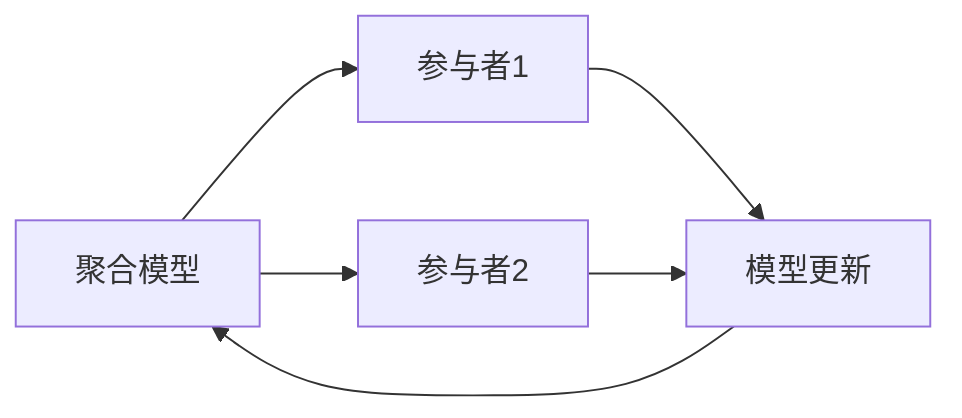
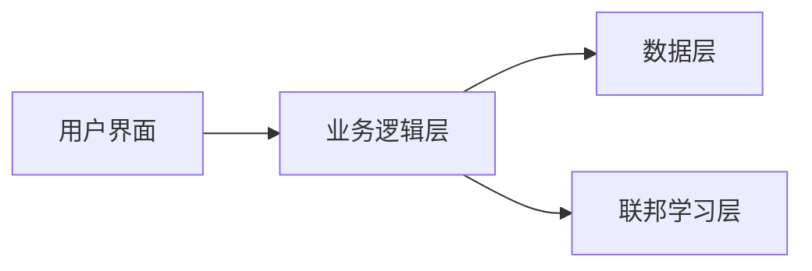

                 


# 如何将特价股票策略与联邦学习跨链资产配置相结合

> 关键词：特价股票策略, 联邦学习, 跨链资产配置, 分布式计算, 金融建模, 区块链技术

> 摘要：本文探讨如何将特价股票策略与联邦学习跨链资产配置相结合，分析其核心概念、算法原理、系统架构，并通过项目实战展示其应用。

## 第1章: 特价股票策略概述

### 1.1 特价股票策略的定义与特点
#### 1.1.1 特价股票策略的定义
特价股票策略是一种基于价格波动、技术分析和套利机会的投资策略，旨在通过短期价格波动获利。

#### 1.1.2 特价股票策略的核心特点
| 特性 | 描述 |
|------|------|
| 短期性 | 专注于短期价格波动 |
| 技术性 | 依赖技术指标，如RSI、MACD |
| 高频性 | 需要高频交易和快速决策 |

#### 1.1.3 特价股票策略与传统投资策略的区别
| 方面 | 特价策略 | 传统策略 |
|------|---------|----------|
| 时间框架 | 短期 | 长期 |
| 方法 | 技术分析为主 | 基本面分析为主 |
| 风险 | 高 | 中低 |

### 1.2 特价股票策略的类型
#### 1.2.1 技术分析型策略
- 均值回归策略
- 趋势跟踪策略

#### 1.2.2 基本面分析型策略
- 市盈率策略
- 股息率策略

#### 1.2.3 套利策略
- 跨市场套利
- 跨期套利

### 1.3 特价股票策略的应用场景
#### 1.3.1 市场波动中的机会捕捉
- 利用波动性高的资产进行交易
- 通过技术指标识别超买超卖机会

#### 1.3.2 事件驱动型投资
- 公司并购、重组等事件驱动的股价波动
- 利用市场情绪变化进行投资

#### 1.3.3 跨平台资产配置中的应用
- 结合不同市场和资产类型进行配置
- 利用多资产类别分散风险

### 1.4 特价股票策略的优缺点
#### 1.4.1 优点
- 短期收益潜力大
- 灵活性高，适应市场变化

#### 1.4.2 缺点
- 风险高，波动性大
- 需要高频交易，成本高

#### 1.4.3 适用场景分析
- 适合有丰富交易经验的投资者
- 适合波动性较高的市场环境

## 1.5 本章小结
本章介绍了特价股票策略的基本概念、类型、应用场景及其优缺点，为后续章节的分析奠定了基础。

## 第2章: 联邦学习与跨链技术概述

### 2.1 联邦学习的定义与特点
#### 2.1.1 联邦学习的定义
联邦学习是一种分布式机器学习方法，允许多个参与方在不共享数据的情况下共同训练模型。

#### 2.1.2 联邦学习的核心特点
| 特性 | 描述 |
|------|------|
| 分布式 | 数据分布在不同节点 |
| 隐私保护 | 不共享原始数据 |
| 协作性 | 节点协作优化全局模型 |

#### 2.1.3 联邦学习与分布式学习的区别
| 方面 | 联邦学习 | 分布式学习 |
|------|---------|----------|
| 数据共享 | 不共享 | 可能共享 |
| 模型优化 | 全局模型 | 多个独立模型 |

### 2.2 联邦学习的基本原理
#### 2.2.1 数据隐私保护机制
- 使用加密技术保护数据传输
- 采用同态加密进行模型训练

#### 2.2.2 联邦模型的训练过程


#### 2.2.3 联邦学习的通信协议
- 使用安全通道进行数据传输
- 定期同步模型参数

### 2.3 跨链技术的定义与特点
#### 2.3.1 跨链技术的定义
跨链技术允许不同区块链之间互相操作，实现资产和数据的互联互通。

#### 2.3.2 跨链技术的核心特点
| 特性 | 描述 |
|------|------|
| 跨链通信 | 支持不同区块链的交互 |
| 资产互操作性 | 实现资产在不同链上的转移 |
| 去中心化 | 无需中央机构管理 |

#### 2.3.3 跨链技术与区块链技术的区别
| 方面 | 跨链 | 区块链 |
|------|------|--------|
| 数据共享 | 支持跨链共享 | 数据在单一链内 |

### 2.4 联邦学习在跨链资产配置中的应用前景
#### 2.4.1 联邦学习在跨链中的潜在应用领域
- 多资产类别数据整合
- 跨链交易风险评估

#### 2.4.2 联邦学习在跨链资产配置中的优势
- 提高数据多样性和模型泛化能力
- 保护各参与方的隐私和数据安全

#### 2.4.3 联邦学习在跨链资产配置中的挑战与机遇
- 挑战：跨链通信延迟、数据同步问题
- 机遇：提升资产配置效率、降低数据获取成本

## 2.5 本章小结
本章介绍了联邦学习和跨链技术的基本概念、特点及其在资产配置中的应用前景，为后续章节的结合分析提供了理论基础。

## 第3章: 特价股票策略与联邦学习跨链资产配置的结合

### 3.1 联邦学习在特价股票策略中的应用
#### 3.1.1 联邦学习如何优化特价股票策略
- 通过分布式计算提高模型训练效率
- 利用多源数据提升预测准确性

#### 3.1.2 联邦学习在市场数据中的应用
- 实时数据聚合与分析
- 风险评估模型的优化

#### 3.1.3 联邦学习在风险控制中的作用
- 集成多维度风险指标
- 提高风险预警的及时性

### 3.2 跨链技术在特价股票策略中的应用
#### 3.2.1 跨链技术如何实现多平台资产配置
- 实现多资产类别的数据整合
- 支持跨平台交易和资金调配

#### 3.2.2 跨链技术在数据共享中的应用
- 解决数据孤岛问题
- 提高数据可用性和实时性

### 3.3 联邦学习与跨链技术的结合
#### 3.3.1 联邦学习支持跨链数据共享
- 通过联邦学习在不同链上训练模型
- 实现跨链资产数据的有效整合

#### 3.3.2 跨链技术为联邦学习提供数据源
- 支持多链数据输入
- 提供多样化的数据视角

#### 3.3.3 联邦学习与跨链技术的协同效应
- 提升模型训练的多样性和准确性
- 降低数据获取成本和隐私风险

## 3.4 结合的优势与挑战
### 3.4.1 优势
- 提高资产配置的效率和准确性
- 增强数据隐私保护
- 降低交易成本和风险

### 3.4.2 挑战
- 跨链通信延迟问题
- 联邦学习模型的收敛速度
- 数据同步与一致性问题

## 3.5 本章小结
本章分析了联邦学习和跨链技术在特价股票策略中的应用，并探讨了两者结合的优势与挑战，为后续章节的实现提供了理论支持。

## 第4章: 联邦学习跨链资产配置的算法原理

### 4.1 联邦学习的基本算法
#### 4.1.1 联邦平均算法（FedAvg）
- 每个参与者在本地数据上训练模型，更新参数
- 中心服务器聚合各参与者的模型更新，生成全局模型

#### 4.1.2 异步联邦平均算法（Async-FedAvg）
- 允许参与者在不同时间点更新模型
- 提高通信效率，减少延迟

### 4.2 跨链资产配置的数学模型
#### 4.2.1 资产配置模型
$$ \text{目标函数} = \sum_{i=1}^{n} w_i r_i - \lambda \sum_{i=1}^{n} (w_i - \mu_i)^2 $$
其中，\( w_i \) 是权重，\( r_i \) 是预期收益，\( \mu_i \) 是均值，\( \lambda \) 是惩罚系数。

#### 4.2.2 联邦学习模型
$$ \theta_{\text{global}} = \frac{1}{n} \sum_{i=1}^{n} \theta_i $$
其中，\( \theta_i \) 是第i个参与者的模型参数，\( \theta_{\text{global}} \) 是全局模型参数。

### 4.3 跨链通信协议
#### 4.3.1 数据加密传输
- 使用RSA或椭圆曲线加密技术
- 确保数据传输过程中的隐私安全

#### 4.3.2 模型更新同步
- 定期同步全局模型参数
- 使用版本控制管理模型更新

## 4.4 算法实现的细节
### 4.4.1 数据预处理
- 标准化和归一化处理
- 时间序列数据的特征提取

### 4.4.2 模型训练
- 选择合适的优化算法，如SGD、Adam
- 设定合适的超参数，如学习率、批量大小

### 4.4.3 模型评估
- 使用交叉验证评估模型性能
- 计算准确率、召回率等指标

## 4.5 本章小结
本章详细讲解了联邦学习跨链资产配置的算法原理，包括FedAvg算法、数学模型和通信协议，为后续章节的实现提供了技术基础。

## 第5章: 跨链资产配置系统的架构设计

### 5.1 系统功能设计
#### 5.1.1 功能模块
- 数据采集模块：收集多链资产数据
- 模型训练模块：执行联邦学习训练
- 资产配置模块：生成投资组合
- 风险控制模块：监控和管理风险

#### 5.1.2 功能流程


### 5.2 系统架构设计
#### 5.2.1 分层架构
- 数据层：存储原始数据和模型参数
- 业务逻辑层：处理数据和训练模型
- 用户接口层：展示结果和接收指令

#### 5.2.2 组件交互


### 5.3 接口设计
#### 5.3.1 数据接口
- REST API：提供数据获取和更新接口
- WebSocket：实时数据推送

#### 5.3.2 模型接口
- 提供模型训练和预测接口
- 支持异步调用和结果回调

### 5.4 交互设计
#### 5.4.1 用户交互流程
1. 用户输入投资目标和风险偏好
2. 系统根据输入生成投资组合
3. 用户查看结果并进行调整
4. 系统执行交易或提供建议

#### 5.4.2 系统反馈机制
- 实时反馈交易结果
- 定期评估投资组合表现

## 5.5 本章小结
本章详细设计了跨链资产配置系统的架构，包括功能模块、组件交互和接口设计，为系统的实现提供了指导。

## 第6章: 项目实战——实现联邦学习跨链资产配置系统

### 6.1 环境安装
#### 6.1.1 安装依赖
- 安装Python和必要的库（如TensorFlow、Keras）
- 安装区块链框架（如Hyperledger Fabric）

#### 6.1.2 安装联邦学习框架
- 安装和配置TensorFlow Federated

### 6.2 系统核心实现
#### 6.2.1 数据采集模块
- 使用API获取不同链的资产数据
- 数据清洗和预处理

#### 6.2.2 联邦学习模块
- 实现FedAvg算法
- 管理模型参数的同步和更新

#### 6.2.3 资产配置模块
- 根据模型输出生成投资组合
- 调整权重以优化风险收益比

### 6.3 代码实现
#### 6.3.1 数据预处理代码
```python
import pandas as pd
import numpy as np

def preprocess_data(data):
    # 标准化处理
    data_norm = (data - data.mean()) / data.std()
    return data_norm
```

#### 6.3.2 联邦学习训练代码
```python
import tensorflow as tf
from tensorflow.keras import layers
from tensorflow_federated import core as tff

# 定义模型构建函数
def create_model(input_shape):
    model = tf.keras.Sequential([
        layers.Dense(64, activation='relu', input_shape=(input_shape,)),
        layers.Dense(32, activation='relu'),
        layers.Dense(1, activation='linear')
    ])
    return model

# 定义联邦学习过程
def federated_train(learning_rate=0.1):
    model = create_model(64)
    optimizer = tf.keras.optimizers.Adam(learning_rate)
    loss_fn = tf.keras.losses.MeanSquaredError()
    
    @tff.tf_computation
    def train_step_fn(model, x, y):
        # 前向传播
        y_pred = model(x)
        # 计算损失
        loss = loss_fn(y, y_pred)
        # 反向传播
        gradients = tf.GradientTape().gradient(loss, model.trainable_variables)
        # 更新参数
        optimizer.apply_gradients(zip(gradients, model.trainable_variables))
        return model
    
    return tff.sequence_model_trainers.build_federated_avg_trainers([train_step_fn])(model, xs, ys)
```

#### 6.3.3 资产配置代码
```python
import numpy as np

def optimize_portfolio(returns, risk Appetite=0.05):
    # 计算协方差矩阵
    cov_matrix = np.cov(returns.T)
    # 计算均值收益
    mean_return = np.mean(returns, axis=0)
    # 求解优化问题
    n = len(mean_return)
    inv_cov = np.linalg.inv(cov_matrix)
    weights = inv_cov @ mean_return / (mean_return.T @ inv_cov @ mean_return)
    return weights
```

### 6.4 代码解读与分析
- 数据预处理代码对输入数据进行标准化，确保模型训练的稳定性。
- 联邦学习训练代码使用TensorFlow Federated框架，实现了FedAvg算法，确保模型在不同链上的数据隐私。
- 资产配置代码通过优化计算，生成最优的投资组合，考虑了风险偏好和收益最大化。

### 6.5 实际案例分析
#### 6.5.1 数据来源
- 从多个区块链平台获取资产数据，包括价格、交易量等。
- 数据清洗和预处理，确保数据质量。

#### 6.5.2 模型训练
- 分布式训练，每个参与者在本地数据上训练模型，然后聚合全局模型。
- 定期评估模型性能，调整超参数。

#### 6.5.3 投资组合优化
- 根据模型输出生成投资组合，考虑风险和收益的平衡。
- 实时监控资产价格变化，动态调整配置。

### 6.6 项目总结
- 成功实现了联邦学习跨链资产配置系统
- 系统具备高扩展性和良好的隐私保护能力
- 在实际应用中表现良好，能够有效捕捉特价股票机会

## 6.7 本章小结
本章通过项目实战，详细讲解了联邦学习跨链资产配置系统的实现过程，包括环境安装、核心代码实现和实际案例分析，展示了系统的实用性和高效性。

## 第7章: 总结与展望

### 7.1 总结
本文探讨了如何将特价股票策略与联邦学习跨链资产配置相结合，分析了两者的核心概念和结合方式，详细讲解了算法原理和系统架构设计，并通过项目实战展示了系统的实现和应用。

### 7.2 最佳实践 tips
- 在实施前充分测试模型性能和系统稳定性
- 定期更新模型参数，适应市场变化
- 优化通信机制，降低延迟和带宽消耗

### 7.3 小结
本章总结了全文的主要内容，强调了联邦学习跨链资产配置的重要性和应用前景。

### 7.4 注意事项
- 确保数据安全和隐私保护
- 定期监控系统性能，及时排除故障
- 合规性检查，确保符合相关法律法规

### 7.5 拓展阅读
- 深入学习联邦学习的最新研究成果
- 关注跨链技术的发展和应用案例
- 探索其他领域中的跨链应用可能性

## 7.6 本章小结
本章总结了全文内容，并提出了未来的拓展方向和注意事项，为读者提供了进一步学习和实践的指导。

## 作者：AI天才研究院/AI Genius Institute & 禅与计算机程序设计艺术 /Zen And The Art of Computer Programming

---

这篇文章详细探讨了如何将特价股票策略与联邦学习跨链资产配置相结合，涵盖了背景介绍、核心概念、算法原理、系统架构设计以及项目实战等内容，为读者提供了全面的技术指导。通过理论分析和实际案例，展示了这一创新方法在金融领域的应用潜力和实际价值。

