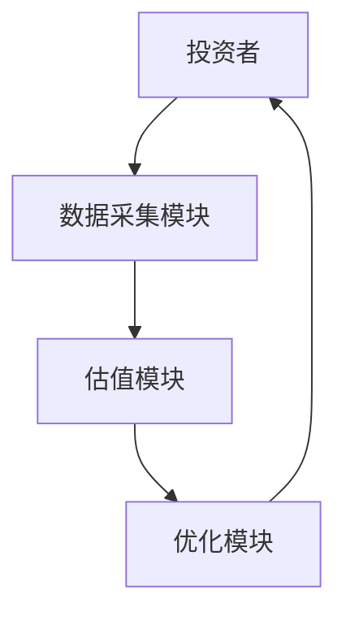

                 


# 如何将特价股票策略与通胀保值资产投资结合

> **关键词**：特价股票策略、通胀保值资产投资、资产配置、投资组合优化、风险管理

> **摘要**：本文探讨如何将特价股票策略与通胀保值资产投资相结合，帮助投资者在通货膨胀的环境下保护和增加财富。通过分析特价股票和通胀保值资产的核心概念、数学模型和系统架构设计，本文提出了一种结合两者的方法，并通过实际案例展示了如何在投资组合中实现这一策略。文章最后提供了最佳实践建议，帮助投资者在实际操作中规避风险。

---

## 引言

在当前经济环境下，通货膨胀对资产价格的影响日益显著。投资者需要找到一种既能抵御通胀风险，又能抓住市场机会的策略。特价股票策略以其低估值和高潜力的特点，为投资者提供了在市场低谷期布局的机会。而通胀保值资产投资则通过选择抗通胀能力强的资产，帮助投资者在通胀周期中保护财富。本文将详细探讨如何将这两种策略结合起来，构建一个高效的投资组合。

---

## 第一章: 特价股票策略与通胀保值资产投资的背景与基础

### 1.1 特价股票策略的定义与特点

#### 1.1.1 特价股票的定义
特价股票是指市场价格低于其内在价值的股票。这类股票通常被市场低估，具有较高的上涨潜力。

#### 1.1.2 特价股票的核心特点
- **低估值**：市场价格低于内在价值。
- **高潜力**：具备较高的增长潜力。
- **周期性**：通常出现在市场低迷时期。

#### 1.1.3 特价股票与普通股票的区别
- 普通股票的价格可能受市场情绪影响较大，而特价股票更注重内在价值。
- 特价股票的投资周期较长，注重长期回报。

### 1.2 通胀保值资产投资的定义与特点

#### 1.2.1 通胀保值资产的定义
通胀保值资产是指在通货膨胀期间，其价值能够随通胀水平上涨的资产，如黄金、房地产和抗通胀债券。

#### 1.2.2 通胀保值资产的核心特点
- **抗通胀能力**：价格上涨幅度高于通胀率。
- **流动性**：部分资产（如黄金）具有较高的流动性。
- **风险分散**：通过多样化投资降低风险。

### 1.3 特价股票策略与通胀保值资产投资的关联性

#### 1.3.1 通胀对股票投资的影响
- 通胀可能导致股票估值下降，但如果企业能够通过提价保持利润，股票可能表现良好。

#### 1.3.2 特价股票在通胀环境下的优势
- 低估值的股票在通胀周期中可能重新定价，带来超额收益。

#### 1.3.3 通胀保值资产与特价股票的协同效应
- 通过组合投资，投资者可以在通胀期间平衡风险和收益。

---

## 第二章: 特价股票策略的核心概念

### 2.1 特价股票的市场定位

#### 2.1.1 特价股票的市场环境分析
- 市场低迷时，许多股票被低估，成为特价股票的良好选择。

#### 2.1.2 特价股票的估值方法
- 市盈率（P/E）：低于行业平均水平。
- 市净率（P/B）：低于1。

#### 2.1.3 特价股票的投资机会识别
- 关注行业龙头股，寻找市场低估的标的。

### 2.2 特价股票的投资策略

#### 2.2.1 价值投资策略
- 长期持有，等待市场重新估值。

#### 2.2.2 技术分析策略
- 使用K线图、均线等技术指标寻找买入机会。

#### 2.2.3 组合投资策略
- 分散投资，降低风险。

---

## 第三章: 通胀保值资产投资的核心概念

### 3.1 通胀对资产价格的影响

#### 3.1.1 通胀对股票价格的影响
- 通胀可能导致企业成本上升，但若企业能够转嫁成本，股票可能表现良好。

#### 3.1.2 通胀对债券价格的影响
- 债券价格通常与利率呈反向关系，通胀上升可能导致债券价格下跌。

#### 3.1.3 通胀对黄金等贵金属的影响
- 黄金被视为保值资产，在通胀期间需求增加。

### 3.2 通胀保值资产的选择标准

#### 3.2.1 资产的抗通胀能力
- 选择历史上在通胀期间表现良好的资产。

#### 3.2.2 资产的流动性
- 确保在需要时能够快速变现。

#### 3.2.3 资产的风险承受能力
- 分散投资，降低单一资产带来的风险。

---

## 第四章: 数学模型与算法

### 4.1 资产回报模型

$$ R_i = \alpha + \beta R_m + \epsilon $$

其中，$R_i$ 是资产的回报率，$R_m$ 是市场回报率，$\alpha$ 是资产的特异回报，$\beta$ 是资产的贝塔系数，$\epsilon$ 是误差项。

### 4.2 通胀影响模型

$$ P_t = P_{t-1} \times (1 + \pi_t) $$

其中，$P_t$ 是时间$t$的物价水平，$\pi_t$ 是时间$t$的通胀率。

### 4.3 投资组合优化模型

$$ \text{最大化 } \mu^T x - \lambda x^T \Sigma x $$

其中，$x$ 是投资组合权重向量，$\mu$ 是资产回报向量，$\Sigma$ 是资产收益的协方差矩阵，$\lambda$ 是风险厌恶系数。

---

## 第五章: 系统架构设计

### 5.1 问题场景介绍

- **目标**：构建一个结合特价股票和通胀保值资产的投资系统。
- **用户角色**：投资者。
- **功能需求**：实时监控市场数据，评估资产价值，优化投资组合。

### 5.2 系统功能设计

- **数据采集模块**：收集市场数据。
- **估值模块**：计算资产估值。
- **优化模块**：生成投资组合建议。

### 5.3 系统架构图



---

## 第六章: 项目实战

### 6.1 环境安装

- 安装Python和相关库（如NumPy、Pandas、Matplotlib）。

### 6.2 核心代码实现

```python
import numpy as np
import pandas as pd

# 示例代码：计算投资组合回报
def portfolio_return(weights, returns):
    return weights.dot(returns.mean())

weights = np.array([0.6, 0.4])
returns = pd.DataFrame({'stock': [0.1, 0.15], 'bond': [0.05, 0.07]})
print(portfolio_return(weights, returns))
```

### 6.3 代码解读与分析

- 代码计算了股票和债券的投资组合回报，权重分别为60%和40%。

---

## 第七章: 最佳实践与总结

### 7.1 总结

- 特价股票和通胀保值资产的结合可以在通胀周期中提供更好的风险调整后收益。

### 7.2 最佳实践

- **风险管理**：分散投资，定期调整组合。
- **长期投资**：避免频繁交易，降低成本。

### 7.3 注意事项

- 定期评估市场环境，调整投资策略。

### 7.4 拓展阅读

- 建议阅读《投资学》和《有效投资组合》。

---

## 结论

通过结合特价股票策略和通胀保值资产投资，投资者可以在复杂多变的经济环境中找到平衡点。本文通过理论分析和实际案例，展示了如何在投资组合中实现这一策略。希望本文能为投资者提供有价值的指导。

---

**作者：AI天才研究院 & 禅与计算机程序设计艺术**

