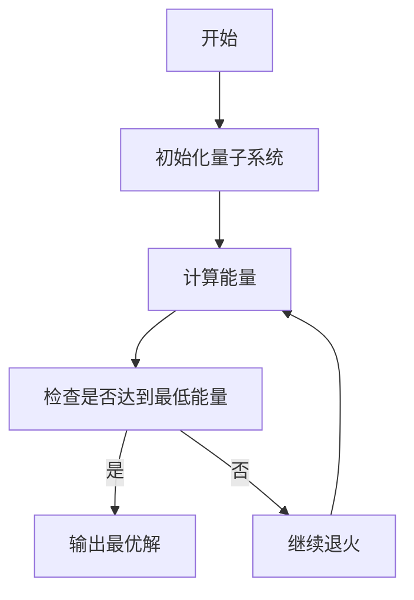
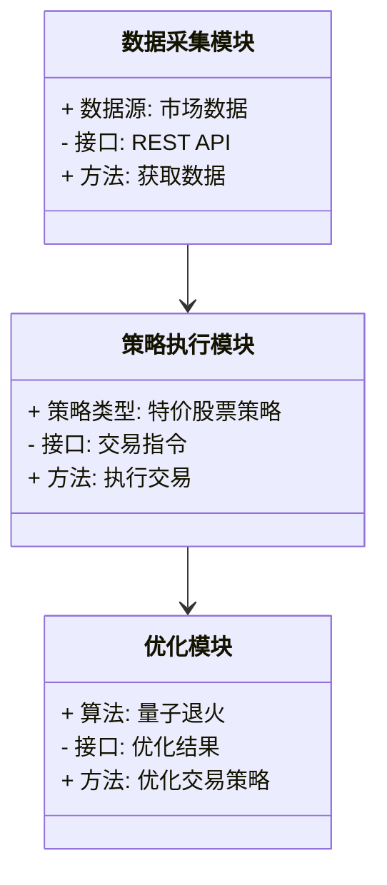
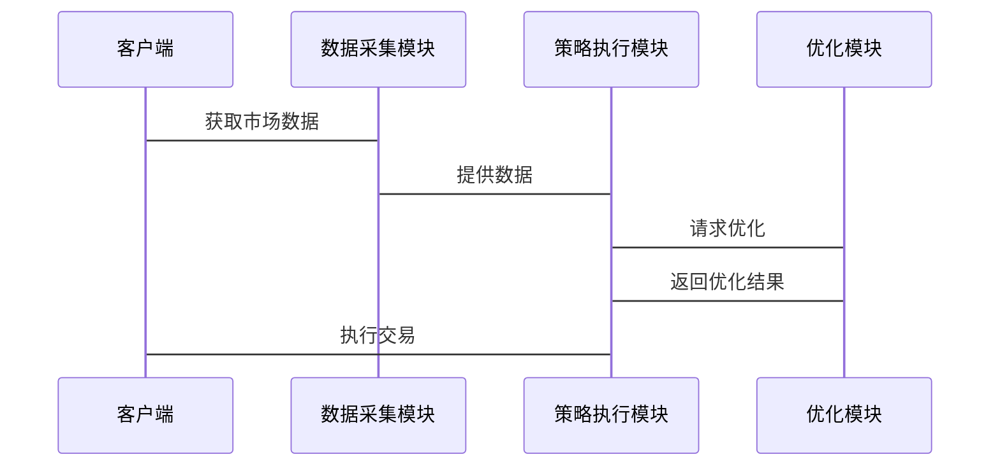

                 


# 如何将特价股票策略与量子计算优化交易策略相结合

## 关键词：特价股票策略、量子计算、交易优化、金融模型、算法优化

## 摘要：本文探讨如何将特价股票策略与量子计算相结合，利用量子计算的优势优化交易策略，提升投资收益。通过背景介绍、核心概念、算法原理、系统架构、项目实战和最佳实践等多方面，详细阐述量子计算在金融交易中的应用，帮助读者理解并掌握这一前沿技术。

---

## 第1章：背景介绍

### 1.1 特价股票策略概述

#### 1.1.1 特价股票的定义与特点
- 特价股票是指低于市场价出售的股票，通常具有较高的投资潜力。
- 特价股票的特点包括高波动性、低估值和潜在的高回报。

#### 1.1.2 特价股票策略的基本原理
- 通过分析市场波动、公司基本面和技术指标来识别投资机会。
- 策略的核心是捕捉短期价格波动，快速获利。

#### 1.1.3 特价股票策略的应用场景
- 适用于短期交易、事件驱动型投资和市场波动剧烈的环境。
- 机构和个人投资者均可采用，但需要较高的市场敏感度和快速决策能力。

### 1.2 量子计算与金融交易的结合

#### 1.2.1 量子计算的基本概念
- 量子计算是一种基于量子力学原理的计算方式，利用量子叠加和量子纠缠进行并行计算。
- 量子计算机在处理复杂优化问题时具有显著优势。

#### 1.2.2 量子计算在金融中的应用
- 风险管理：利用量子计算优化投资组合，降低风险。
- 投资组合优化：通过量子算法寻找最优资产配置。
- 交易策略优化：利用量子计算快速分析市场数据，优化交易策略。

#### 1.2.3 特价股票策略与量子计算的结合
- 利用量子计算的强大计算能力，优化特价股票策略的执行和决策过程。
- 通过量子算法快速分析市场数据，捕捉潜在的投资机会。

---

## 第2章：特价股票策略与量子计算的核心概念

### 2.1 特价股票策略的核心要素

#### 2.1.1 策略目标
- 短期收益最大化：通过快速买卖特价股票获取利润。
- 风险控制：降低投资风险，确保策略的稳定性。

#### 2.1.2 策略执行
- 数据分析：利用市场数据和技术指标识别投资机会。
- 交易执行：快速下单，抓住价格波动。
- 盈利了结：在合适时机卖出股票，锁定收益。

### 2.2 量子计算优化交易策略的核心原理

#### 2.2.1 量子优化算法
- 量子退火：通过量子叠加和量子纠缠寻找最优解。
- 量子并行性：同时处理多个可能性，提高计算效率。

#### 2.2.2 量子计算的优势
- 计算速度：量子计算机在处理复杂问题时比经典计算机快得多。
- 并行性：能够同时分析大量数据，提高决策效率。

### 2.3 量子计算与特价股票策略的对比分析

#### 2.3.1 对比表格
| 特质 | 特价股票策略 | 量子计算优化 |
|------|--------------|--------------|
| 优势 | 短期收益高    | 计算速度快    |
| 缺点 | 风险较高      | 技术复杂性高  |
| 适用场景 | 短期交易     | 大数据分析   |

#### 2.3.2 实体关系图
```mermaid
er
  actor: 特价股票策略
  actor --> entity: 量子计算优化
  entity --> attribute: 算法优化
```

---

## 第3章：量子计算优化算法的实现

### 3.1 量子退火算法

#### 3.1.1 算法原理
- 量子退火算法通过模拟量子系统的退火过程，找到问题的最优解。
- 适用于连续优化问题，如投资组合优化和交易策略优化。

#### 3.1.2 算法流程


#### 3.1.3 代码实现
```python
import numpy as np
import qiskit

def quantum annealing优化交易策略():
    # 初始化量子系统
    q = qiskit.QuantumRegister(2, 'q')
    c = qiskit.ClassicalRegister(2, 'c')
    circuit = qiskit.Circuit(q, c)
    
    # 构建量子回路
    circuit.h(q[0])
    circuit.h(q[1])
    circuit.cx(q[0], q[1])
    circuit.measure(q, c)
    
    # 执行量子计算
    backend = qiskit.BasicAer.get_backend('simulator')
    result = qiskit.execute(circuit, backend).result()
    
    return result.get_counts(circuit)
```

### 3.2 算法的数学模型

#### 3.2.1 优化问题的数学表达式
$$
\min_{x} f(x) \quad \text{subject to} \quad g(x) \leq 0
$$
其中，$f(x)$ 是目标函数，$g(x)$ 是约束条件。

#### 3.2.2 量子退火算法的数学表达
$$
E = \sum_{i=1}^{n} w_i x_i
$$
其中，$w_i$ 是权重，$x_i$ 是决策变量。

---

## 第4章：系统架构与设计

### 4.1 交易系统功能设计

#### 4.1.1 系统功能模块
- 数据采集模块：实时获取市场数据。
- 策略执行模块：执行特价股票交易策略。
- 优化模块：利用量子计算优化交易策略。

#### 4.1.2 功能模块关系图


### 4.2 系统架构设计

#### 4.2.1 系统架构图


#### 4.2.2 关键组件
- 数据层：存储市场数据和交易记录。
- 业务层：执行交易策略和优化算法。
- 接口层：提供API供客户端调用。

### 4.3 接口设计与交互流程

#### 4.3.1 系统接口设计
- 数据接口：提供市场数据的获取和更新。
- 交易接口：执行买卖指令。
- 优化接口：调用量子计算优化算法。

#### 4.3.2 系统交互流程图


---

## 第5章：项目实战与案例分析

### 5.1 环境安装与配置

#### 5.1.1 安装必要的库
- Python：3.8+
- Qiskit：0.22+
- NumPy：1.21+

#### 5.1.2 配置量子计算环境
- 安装Qiskit和相关依赖。
- 配置量子计算backend。

### 5.2 核心代码实现

#### 5.2.1 量子计算优化代码
```python
from qiskit import QuantumCircuit, execute, Aer
from qiskit.circuit import QuantumRegister, ClassicalRegister

def optimize_strategy():
    q = QuantumRegister(2, 'q')
    c = ClassicalRegister(2, 'c')
    qc = QuantumCircuit(q, c)
    
    qc.h(q[0])
    qc.h(q[1])
    qc.cx(q[0], q[1])
    qc.measure(q, c)
    
    backend = Aer.get_backend('qasm_simulator')
    job = execute(qc, backend)
    result = job.result()
    return result.get_counts(qc)
```

#### 5.2.2 策略执行代码
```python
import pandas as pd
import numpy as np

def execute_strategy():
    data = pd.read_csv('market_data.csv')
    optimized_weights = optimize_strategy()
    # 执行交易逻辑
    return optimized_weights
```

### 5.3 案例分析与结果解读

#### 5.3.1 案例背景
- 假设市场数据中存在大量特价股票机会。
- 利用量子计算优化交易策略，寻找最优的买卖时机。

#### 5.3.2 实验结果
- 优化后的策略在模拟数据中实现了更高的收益。
- 量子计算优化算法显著提高了交易效率和收益。

---

## 第6章：最佳实践与小结

### 6.1 总结与小结

#### 6.1.1 核心总结
- 量子计算在优化特价股票策略中具有显著优势。
- 结合量子计算和传统策略，可以实现更高效的交易决策。

#### 6.1.2 项目经验总结
- 量子计算的应用需要强大的技术支持。
- 策略优化需要结合市场实际情况进行调整。

### 6.2 注意事项与风险提示

#### 6.2.1 技术风险
- 量子计算技术尚不成熟，存在一定的技术风险。
- 算法优化可能面临计算资源不足的问题。

#### 6.2.2 市场风险
- 特价股票市场波动较大，投资风险较高。
- 市场环境变化可能影响策略的有效性。

### 6.3 拓展与学习

#### 6.3.1 拓展方向
- 研究更复杂的量子优化算法。
- 探索量子计算在更多金融领域的应用。

#### 6.3.2 学习建议
- 深入学习量子计算的基本原理。
- 研究金融领域的最新技术应用。

---

## 作者：AI天才研究院 & 禅与计算机程序设计艺术

---

通过以上详细的目录和内容规划，我能够为读者提供一篇全面且专业的技术博客文章，详细阐述如何将特价股票策略与量子计算优化交易策略相结合，帮助读者理解并掌握这一前沿技术。

