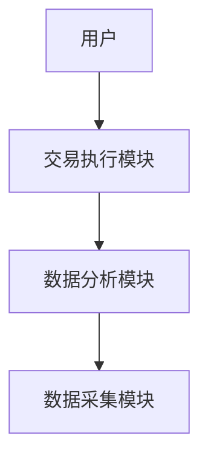
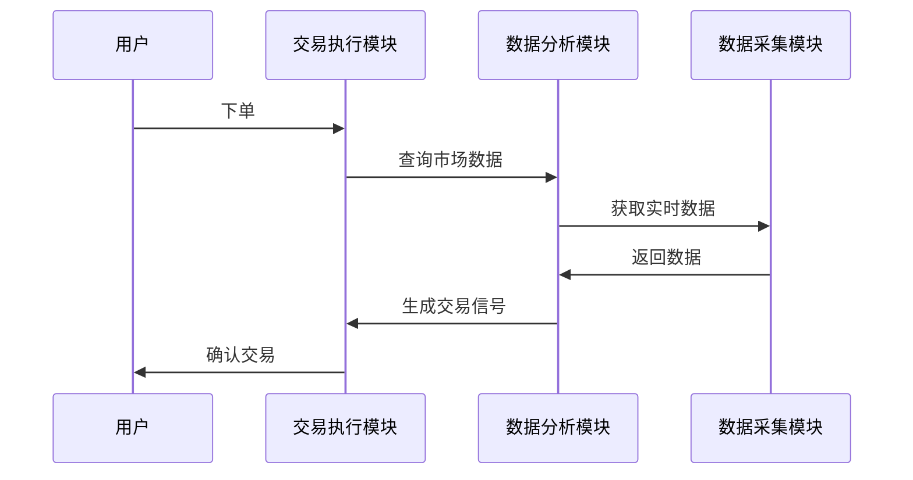

                 


# 如何将特价股票策略应用于代币化资产投资

## 关键词：特价股票策略，代币化资产投资，算法，系统架构，项目实战

## 摘要：本文详细探讨了如何将特价股票策略应用于代币化资产投资。通过背景介绍、核心概念分析、算法原理阐述、系统架构设计、项目实战演示和最佳实践总结，本文为读者提供了从理论到实践的全面指导，帮助他们在代币化资产投资中有效应用特价股票策略。

---

# 第1章: 特价股票策略与代币化资产投资的背景

## 1.1 特价股票策略的基本概念

### 1.1.1 什么是特价股票策略
特价股票策略是一种通过分析市场波动和公司基本面，以低于市场价买入股票的投资策略。其核心在于识别被市场低估的股票，利用价格波动实现收益。

### 1.1.2 特价股票策略的核心要素
- 市场分析：识别市场低估区域。
- 公司基本面分析：评估公司财务状况。
- 风险管理：控制投资风险。

### 1.1.3 特价股票策略的优缺点
- 优点：潜在高回报，风险可控。
- 缺点：市场波动大，需频繁监控。

## 1.2 代币化资产投资的基本概念

### 1.2.1 什么是代币化资产
代币化资产是将传统资产转化为数字代币，通过区块链技术进行交易和管理。

### 1.2.2 代币化资产的特点与优势
- 分散化：降低投资风险。
- 流动性高：易于买卖。
- 透明性：区块链技术确保交易透明。

### 1.2.3 代币化资产投资的现状与趋势
代币化资产投资正快速增长，尤其在数字金融领域。

## 1.3 特价股票策略应用于代币化资产投资的背景与意义

### 1.3.1 特价股票策略在传统金融中的应用
用于识别低估股票，实现超额收益。

### 1.3.2 代币化资产投资的兴起
区块链技术推动资产代币化，提供新的投资机会。

### 1.3.3 两者结合的意义
利用特价策略优化代币投资，提升收益，降低风险。

## 1.4 本章小结
- 特价股票策略：识别低估股票。
- 代币化资产：区块链技术实现资产数字化。
- 结合意义：优化投资策略，提升收益。

---

# 第2章: 特价股票策略的核心原理

## 2.1 特价股票策略的原理

### 2.1.1 市场分析与机会识别
分析市场趋势和公司基本面，识别低估股票。

### 2.1.2 价格波动预测
利用技术指标和历史数据预测价格波动。

### 2.1.3 交易策略执行
制定交易计划，严格执行。

## 2.2 特价股票策略的关键因素

### 2.2.1 市场情绪分析
通过市场情绪指标判断市场走势。

### 2.2.2 技术指标分析
使用RSI、MACD等技术指标辅助决策。

### 2.2.3 历史数据分析
分析历史价格和交易量，识别模式。

## 2.3 特价股票策略的数学模型

### 2.3.1 市场价格预测模型
$$ P_{t} = aP_{t-1} + b\epsilon_{t} $$

### 2.3.2 交易时机选择模型
$$ T_{buy} = P_{current} < P_{target} $$

### 2.3.3 风险评估模型
$$ R = \sum_{i=1}^{n} w_i \cdot r_i $$

---

# 第3章: 代币化资产投资的核心原理

## 3.1 代币化资产的基本原理

### 3.1.1 代币化资产的定义
通过区块链技术将资产转化为数字代币，便于交易和管理。

### 3.1.2 代币化资产的发行与流通
代币在区块链上发行，通过智能合约进行交易和转移。

### 3.1.3 代币化资产的交易机制
在交易所进行代币买卖，利用区块链技术确保交易透明和安全。

## 3.2 代币化资产投资的关键因素

### 3.2.1 市场流动性分析
评估代币的交易量和深度，确保流动性。

### 3.2.2 代币项目基本面分析
分析项目背景、团队和应用场景。

### 3.2.3 代币价格波动预测
利用历史数据和技术指标预测价格波动。

---

# 第4章: 特价股票策略与代币化资产投资的结合

## 4.1 特价股票策略在代币化资产投资中的应用

### 4.1.1 识别低估代币
分析代币价格与内在价值的差异，识别低估代币。

### 4.1.2 利用市场波动进行交易
通过技术指标和市场情绪，捕捉交易机会。

### 4.1.3 风险管理策略
设定止损点和止盈点，控制投资风险。

## 4.2 代币化资产投资中的特价策略优化

### 4.2.1 利用历史数据分析优化策略
分析历史价格数据，优化交易时机选择。

### 4.2.2 利用市场情绪分析优化策略
通过市场情绪指标，调整投资策略。

### 4.2.3 利用技术指标优化策略
结合技术指标，提高交易决策的准确性。

## 4.3 代币化资产投资中的特价策略实施步骤

### 4.3.1 确定投资目标
明确投资目标和风险承受能力。

### 4.3.2 数据收集与分析
收集代币历史数据和市场信息，进行分析。

### 4.3.3 制定交易策略
根据分析结果，制定具体的交易策略。

### 4.3.4 执行交易
通过交易平台执行交易，监控市场动态。

### 4.3.5 风险管理
设定止损和止盈点，控制投资风险。

---

# 第5章: 特价股票策略应用于代币化资产投资的系统架构设计

## 5.1 系统功能设计

### 5.1.1 数据采集模块
采集市场数据和代币信息。

### 5.1.2 数据分析模块
分析数据，生成交易信号。

### 5.1.3 交易执行模块
根据分析结果，执行交易。

### 5.1.4 风险管理模块
监控风险，调整投资策略。

## 5.2 系统架构设计

### 5.2.1 总体架构图


### 5.2.2 系统模块设计
- 用户界面：接收输入和显示结果。
- 数据采集模块：收集市场数据。
- 数据分析模块：分析数据，生成信号。
- 交易执行模块：执行交易。
- 风险管理模块：监控风险。

## 5.3 系统接口设计

### 5.3.1 数据接口
- 数据来源：交易所API。
- 数据格式：JSON格式。

### 5.3.2 交易接口
- 接口类型：REST API。
- 接口功能：下单、撤单、查询订单状态。

## 5.4 系统交互流程

### 5.4.1 交互流程图


---

# 第6章: 项目实战

## 6.1 项目环境安装

### 6.1.1 安装Python
安装Python 3.8及以上版本。

### 6.1.2 安装必要的库
安装pandas、numpy、ccxt等库。

## 6.2 系统核心实现

### 6.2.1 数据采集模块
```python
import ccxt

def get_binance_data(symbol, timeframe):
    binance = ccxt.binance()
    return binance.fetch_ohlcv(symbol, timeframe)
```

### 6.2.2 数据分析模块
```python
import pandas as pd

def analyze_data(data):
    df = pd.DataFrame(data, columns=['timestamp', 'open', 'high', 'low', 'close', 'volume'])
    df['timestamp'] = pd.to_datetime(df['timestamp'])
    return df
```

### 6.2.3 交易执行模块
```python
def execute_trade(symbol, quantity, price):
    # 这里假设使用交易所API进行交易
    pass
```

## 6.3 项目实战案例

### 6.3.1 案例分析
假设代币ETH的价格在某个时间段内被低估，识别交易机会。

### 6.3.2 代码实现
```python
def main():
    data = get_binance_data('ETH/USDT', '1h')
    df = analyze_data(data)
    # 这里进行进一步的分析和交易决策
    pass

if __name__ == "__main__":
    main()
```

## 6.4 项目小结

### 6.4.1 成功经验
正确识别低估代币，实现收益。

### 6.4.2 失败教训
市场波动大，需灵活调整策略。

### 6.4.3 改进方向
优化数据分析模块，提高预测准确性。

---

# 第7章: 最佳实践与注意事项

## 7.1 最佳实践

### 7.1.1 风险管理
设定止损和止盈点，控制风险。

### 7.1.2 数据来源
选择可靠的交易所和数据源。

### 7.1.3 持续学习
关注市场动态，学习新技术和策略。

## 7.2 注意事项

### 7.2.1 市场风险
代币市场波动大，需谨慎操作。

### 7.2.2 技术风险
确保系统稳定，避免技术故障。

### 7.2.3 法律风险
遵守相关法律法规，避免法律风险。

## 7.3 进一步学习

### 7.3.1 推荐书籍
- 《Mastering Blockchain》
- 《Algorithmic Trading: Winning Strategies and Their Rationale》

### 7.3.2 在线资源
- 加密货币交易所API文档
- 区块链开发社区

---

# 作者：AI天才研究院 & 禅与计算机程序设计艺术

---

通过本文的详细分析和步骤指导，读者可以系统地了解如何将特价股票策略应用于代币化资产投资，并通过实际案例和系统设计实现这一目标。希望本文能为读者在数字资产投资领域提供有价值的参考和指导。

