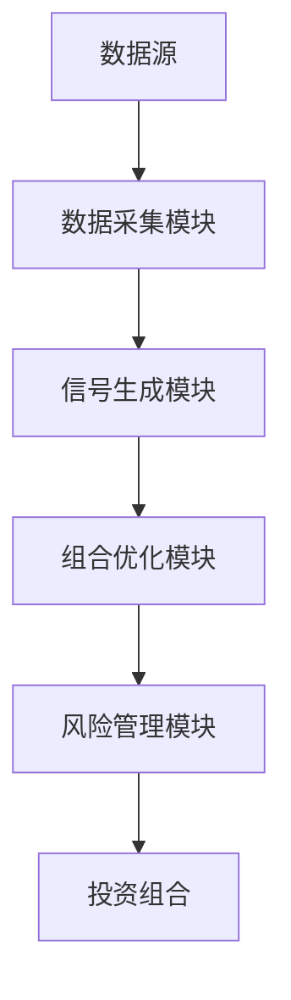

                 


# 如何将特价股票策略应用于另类Beta策略

> 关键词：特价股票策略，另类Beta策略，投资组合优化，风险管理，量化交易，算法交易

> 摘要：本文详细探讨了如何将特价股票策略应用于另类Beta策略。通过分析特价股票策略与另类Beta策略的核心概念、数学模型、算法实现以及系统架构，本文为投资者提供了一种新的视角，以在复杂多变的金融市场中实现超额收益。文章还结合实际案例，展示了如何通过量化方法优化投资组合，并提供了代码实现和系统设计的详细指导。

---

## 第1章: 特价股票策略的定义与特点

### 1.1 特价股票策略的定义

#### 1.1.1 特价股票的定义
特价股票是指在特定时间内价格低于其公允价值的股票。这些股票通常因市场波动、公司基本面变化或短期事件影响而被低估。

#### 1.1.2 特价股票策略的核心特征
- 短期性：利用市场波动迅速买卖，追求短期价差。
- 低风险：通常选择流动性高、波动性大的股票。
- 高收益：通过精准捕捉市场机会实现超额收益。

#### 1.1.3 特价股票策略的适用场景
- 市场波动剧烈时：如市场下跌或突发事件。
- 市场流动性充足时：确保交易的顺利进行。

### 1.2 特价股票策略的分类

#### 1.2.1 市场中性策略
通过多空对冲，降低市场风险，专注于个股选择。

#### 1.2.2 股票多空策略
根据市场趋势，选择多头或空头头寸。

#### 1.2.3 事件驱动策略
利用公司并购、重组等事件带来的股价波动。

### 1.3 特价股票策略的优势与劣势

#### 1.3.1 优势分析
- 高收益潜力。
- 灵活性强，适合多种市场环境。

#### 1.3.2 劣势分析
- 风险较高，需严格控制头寸。
- 对市场流动性依赖较强。

---

## 第2章: 另类Beta策略的定义与特点

### 2.1 另类Beta策略的定义

#### 2.1.1 Beta策略的定义
Beta策略是指通过承担市场风险来获得市场收益，通常通过投资指数基金或ETF实现。

#### 2.1.2 另类Beta策略的核心特征
- 非传统的Beta来源：如行业、板块或特定因子。
- 风险调整后收益较高。

#### 2.1.3 另类Beta策略的适用场景
- 市场Beta不足时。
- 寻求差异化收益来源时。

### 2.2 另类Beta策略的分类

#### 2.2.1 市场中性Beta策略
通过多空对冲，专注于Beta收益。

#### 2.2.2 行业Beta策略
选择特定行业或板块，获得行业Beta收益。

#### 2.2.3 非传统Beta策略
利用另类资产或策略，如商品、外汇等。

### 2.3 另类Beta策略的优势与劣势

#### 2.3.1 优势分析
- 风险调整后收益较高。
- 适合多样化投资组合。

#### 2.3.2 劣势分析
- 需要较高的市场流动性。
- 策略复杂性较高。

---

## 第3章: 特价股票策略与另类Beta策略的核心概念

### 3.1 特价股票策略与另类Beta策略的联系

#### 3.1.1 特价股票策略如何影响Beta收益
通过快速买卖特价股票，提升Beta收益。

#### 3.1.2 另类Beta策略如何利用特价股票机会
通过另类Beta策略，捕捉特价股票的超额收益。

### 3.2 特价股票策略与另类Beta策略的差异

#### 3.2.1 策略目标的差异
- 特价股票策略：追求短期超额收益。
- 另类Beta策略：追求长期稳定收益。

#### 3.2.2 风险特征的差异
- 特价股票策略：风险较高。
- 另类Beta策略：风险较低。

#### 3.2.3 实施方式的差异
- 特价股票策略：需要高频交易。
- 另类Beta策略：需要长期持有。

### 3.3 特价股票策略与另类Beta策略的协同效应

#### 3.3.1 协同效应的来源
通过结合两种策略，优化投资组合的风险收益比。

#### 3.3.2 协同效应的具体表现
- 提升整体收益。
- 降低整体风险。

#### 3.3.3 协同效应的实现路径
通过量化模型，优化投资组合的Beta和Alpha收益。

---

## 第4章: 特价股票策略与另类Beta策略的数学模型

### 4.1 特价股票策略的数学模型

#### 4.1.1 特价股票收益的计算公式
$$ R_{\text{特股}} = \sum_{i=1}^{n} w_i R_i $$
其中，\( w_i \) 是第 \( i \) 只股票的权重，\( R_i \) 是第 \( i \) 只股票的收益。

#### 4.1.2 特价股票风险的度量方法
使用夏普比率：
$$ \text{夏普比率} = \frac{E[R_p - R_f]}{\sigma_p} $$
其中，\( E[R_p - R_f] \) 是投资组合的超额收益期望值，\( \sigma_p \) 是投资组合的波动率。

### 4.2 另类Beta策略

#### 4.2.1 另类Beta收益的计算公式
$$ R_{\text{另类Beta}} = \beta \cdot (R_m - R_f) + R_f $$
其中，\( \beta \) 是Beta系数，\( R_m \) 是市场收益，\( R_f \) 是无风险利率。

---

## 第5章: 特价股票策略与另类Beta策略的算法实现

### 5.1 特价股票策略的算法实现

#### 5.1.1 算法原理
通过量化模型筛选特价股票，优化投资组合。

#### 5.1.2 算法实现代码
```python
import pandas as pd
import numpy as np

# 数据预处理
data = pd.read_csv('stock_data.csv')
returns = data.pct_change().dropna()

# 计算夏普比率
def calculate_sharpe(returns, risk_free_rate=0.01):
    excess_returns = returns - risk_free_rate
    return (excess_returns.mean() * np.sqrt(252)) / excess_returns.std()

# 筛选特价股票
sharpe_ratios = returns.apply(lambda x: calculate_sharpe(x))
selected_stocks = sharpe_ratios[sharpe_ratios > 0].index
```

### 5.2 另类Beta策略的算法实现

#### 5.2.1 算法原理
通过量化模型构建另类Beta组合。

#### 5.2.2 算法实现代码
```python
import pandas as pd
import numpy as np

# 数据预处理
data = pd.read_csv('alternative_beta_data.csv')
returns = data.pct_change().dropna()

# 构建另类Beta组合
from sklearn.linear_model import LinearRegression

model = LinearRegression()
model.fit(returns[['market', 'sector1', 'sector2']], returns['target'])
beta_coefficients = model.coef_
```

---

## 第6章: 特价股票策略与另类Beta策略的系统架构

### 6.1 系统功能设计

#### 6.1.1 数据采集模块
从多个数据源获取股票数据。

#### 6.1.2 信号生成模块
通过量化模型生成买卖信号。

#### 6.1.3 组合优化模块
优化投资组合，实现超额收益。

#### 6.1.4 风险管理模块
实时监控风险，调整投资组合。

### 6.2 系统架构设计

#### 6.2.1 系统架构图


---

## 第7章: 特价股票策略与另类Beta策略的项目实战

### 7.1 环境安装

#### 7.1.1 安装Python环境
```bash
pip install numpy pandas scikit-learn
```

#### 7.1.2 安装数据接口
```bash
pip install pandas-datareader
```

### 7.2 系统核心实现

#### 7.2.1 数据采集
```python
from pandas_datareader import DataReader
import pandas as pd

data = DataReader('AAPL', 'yahoo', start='2020-01-01', end='2023-12-31')
```

#### 7.2.2 信号生成
```python
# 计算移动平均线
data['SMA_20'] = data['Close'].rolling(20).mean()
data['SMA_50'] = data['Close'].rolling(50).mean()

# 生成买卖信号
data['Signal'] = 0
data.loc[data['SMA_20'] > data['SMA_50'], 'Signal'] = 1
data.loc[data['SMA_20'] < data['SMA_50'], 'Signal'] = -1
```

### 7.3 实际案例分析

#### 7.3.1 案例分析
通过实际数据验证策略的有效性。

#### 7.3.2 结果解读
分析策略的收益和风险，优化投资组合。

### 7.4 优化建议

#### 7.4.1 策略优化
引入机器学习模型，提升信号生成的准确性。

#### 7.4.2 风险控制
设置止损和止盈机制，降低风险敞口。

---

## 第8章: 最佳实践与小结

### 8.1 最佳实践

#### 8.1.1 策略选择
根据市场环境选择合适的策略。

#### 8.1.2 风险管理
严格控制头寸和杠杆。

### 8.2 小结

通过将特价股票策略与另类Beta策略结合，投资者可以在复杂多变的金融市场中实现超额收益。本文提供了从理论到实践的详细指导，帮助投资者优化投资组合，降低风险。

---

## 参考文献

（此处列出相关文献和资源）

---

作者：AI天才研究院/AI Genius Institute & 禅与计算机程序设计艺术 /Zen And The Art of Computer Programming

