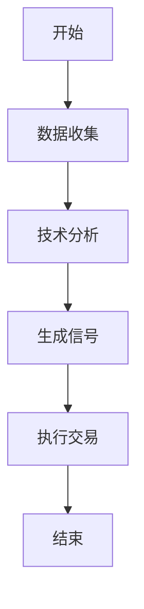
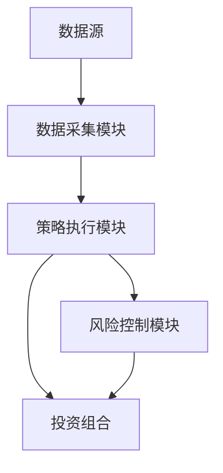

                 


# 如何将特价股票策略应用于另类贝塔捕捉策略

> 关键词：特价股票策略、另类贝塔捕捉策略、股票交易策略、量化交易、算法交易  
> 摘要：本文详细探讨了如何将特价股票策略应用于另类贝塔捕捉策略，通过量化方法捕捉市场机会。从策略背景到算法实现，再到系统架构设计，文章全面分析了两者的结合与应用，为读者提供了一个系统化的解决方案。

---

## 引言

在股票交易中，特价股票策略和另类贝塔捕捉策略是两种截然不同的方法，但它们都旨在帮助投资者在市场中获得超额收益。特价股票策略通常关注市场中的短期价格波动，寻找被低估的股票；而另类贝塔捕捉策略则通过捕捉市场中的非传统机会，实现对市场贝塔系数的偏离。本文将探讨如何将这两种策略结合，利用量化方法和算法交易，实现更高效的市场捕捉。

---

## 第一部分: 特价股票策略的背景与原理

### 1.1 特价股票策略的核心概念

#### 1.1.1 特价股票策略的定义
特价股票策略是指通过分析市场中的短期价格波动，寻找被市场低估的股票进行投资。这种策略通常基于技术分析，关注短期价格变化、成交量和市场情绪等指标。

#### 1.1.2 特价股票策略的核心特点
- **短期性**：关注短期价格波动，通常投资周期较短。
- **技术驱动**：依赖技术分析工具，如K线图、均线、MACD等。
- **高频率交易**：适合算法交易，能够在短时间内完成多次交易。

#### 1.1.3 特价股票策略的应用场景
- **市场波动较大时**：如市场下跌或剧烈震荡时，寻找被低估的股票。
- **短期套利机会**：如事件驱动型的市场波动。

### 1.2 特价股票策略的背景与问题背景

#### 1.2.1 传统股票交易的局限性
传统股票交易依赖于基本面分析，但这种方法通常需要较长的时间周期，难以捕捉短期市场机会。

#### 1.2.2 特价股票策略的兴起
随着算法交易的普及，投资者开始关注短期价格波动，寻找快速获利的机会。

#### 1.2.3 特价股票策略的核心问题与解决方案
- **问题**：如何快速识别被低估的股票并制定交易策略。
- **解决方案**：利用技术分析和算法交易，结合市场数据和情绪分析，快速捕捉市场机会。

---

## 第二部分: 另类贝塔捕捉策略的背景与原理

### 2.1 另类贝塔捕捉策略的核心概念

#### 2.1.1 另类贝塔捕捉策略的定义
另类贝塔捕捉策略是指通过捕捉市场中的非传统机会，偏离市场贝塔系数，从而实现超额收益。这种方法通常关注市场中的特定因子或事件，而非传统的市场趋势。

#### 2.1.2 另类贝塔捕捉策略的核心特点
- **因子驱动**：依赖特定的因子，如动量、价值、波动率等。
- **非传统机会**：关注市场中未被传统策略覆盖的机会。
- **长期性**：投资周期较长，通常基于对因子的长期趋势判断。

#### 2.1.3 另类贝塔捕捉策略的应用场景
- **市场波动较小时**：通过捕捉因子趋势实现超额收益。
- **长期结构性机会**：如价值因子、动量因子等。

### 2.2 另类贝塔捕捉策略的背景与问题背景

#### 2.2.1 传统贝塔策略的局限性
传统贝塔策略依赖于市场趋势，但在市场波动较小或趋势不明显时，难以实现超额收益。

#### 2.2.2 另类贝塔捕捉策略的兴起
随着量化投资的发展，投资者开始关注因子投资，通过捕捉特定因子的长期趋势实现超额收益。

#### 2.2.3 另类贝塔捕捉策略的核心问题与解决方案
- **问题**：如何识别和捕捉市场中的非传统机会。
- **解决方案**：利用因子分析和量化方法，结合长期趋势判断，实现对市场贝塔系数的偏离。

---

## 第三部分: 特价股票策略与另类贝塔捕捉策略的结合

### 3.1 两者的结合逻辑

#### 3.1.1 短期价格波动与长期因子趋势的结合
特价股票策略关注短期价格波动，而另类贝塔捕捉策略关注长期因子趋势。将两者结合，可以在短期捕捉市场机会，同时利用长期趋势实现超额收益。

#### 3.1.2 算法交易的桥梁作用
通过算法交易，可以快速执行特价股票策略，同时结合长期因子趋势，实现对市场贝塔系数的偏离。

### 3.2 结合的具体步骤

#### 3.2.1 数据收集与预处理
- **市场数据**：收集股票的实时价格、成交量等数据。
- **因子数据**：收集动量、价值等因子数据。
- **市场情绪数据**：收集市场情绪指标，如新闻情绪、社交媒体情绪等。

#### 3.2.2 策略设计与实现
- **短期价格波动捕捉**：利用技术分析工具，设计短期交易策略。
- **长期因子趋势捕捉**：基于因子分析，设计长期投资策略。
- **结合策略**：将短期交易策略与长期投资策略结合，利用算法交易快速执行。

#### 3.2.3 策略优化与回测
- **策略优化**：通过回测和参数优化，提高策略的收益和稳定性。
- **风险控制**：设计风险控制机制，如止损、止盈等。

---

## 第四部分: 算法实现与数学模型

### 4.1 特价股票策略的算法实现

#### 4.1.1 算法流程图


#### 4.1.2 关键代码实现
```python
import pandas as pd
import numpy as np

# 数据预处理
data = pd.read_csv('stock_data.csv')
data['短期信号'] = data['收盘价'].rolling(window=5).mean() > data['收盘价'].shift(1)
```

### 4.2 另类贝塔捕捉策略的数学模型

#### 4.2.1 动量因子模型
$$ R_{t} = \alpha + \beta \cdot Momentum_{t-1} + \epsilon $$

其中，$R_{t}$ 是超额收益，$Momentum_{t-1}$ 是动量因子。

#### 4.2.2 风险调整后的收益模型
$$ R_{t} = \alpha + \beta \cdot (Momentum_{t-1} - \beta \cdot RiskPremium) $$

---

## 第五部分: 系统架构设计

### 5.1 系统功能设计

#### 5.1.1 数据采集模块
- 负责收集市场数据，包括价格、成交量、因子数据等。

#### 5.1.2 策略执行模块
- 负责根据策略生成交易信号，并执行交易。

#### 5.1.3 风险控制模块
- 负责监控和管理投资组合的风险。

### 5.2 系统架构图


---

## 第六部分: 项目实战

### 6.1 环境安装与配置
- 安装必要的Python库，如pandas、numpy、pytz等。

### 6.2 系统核心实现
- 实现数据采集模块、策略执行模块和风险控制模块。

### 6.3 实际案例分析
- 分析一个具体市场事件，展示策略的应用和效果。

---

## 第七部分: 最佳实践与注意事项

### 7.1 最佳实践
- 定期回测策略，优化参数。
- 设计合理的风险控制机制。
- 关注市场情绪和突发事件。

### 7.2 注意事项
- 避免过度依赖技术分析，结合基本面分析。
- 注意市场流动性风险。

---

## 总结与展望

通过将特价股票策略与另类贝塔捕捉策略结合，投资者可以利用量化方法和算法交易，实现对市场机会的快速捕捉。未来，随着技术的发展，这种方法将更加高效和精准。

---

## 作者信息

作者：AI天才研究院/AI Genius Institute & 禅与计算机程序设计艺术/Zen And The Art of Computer Programming

