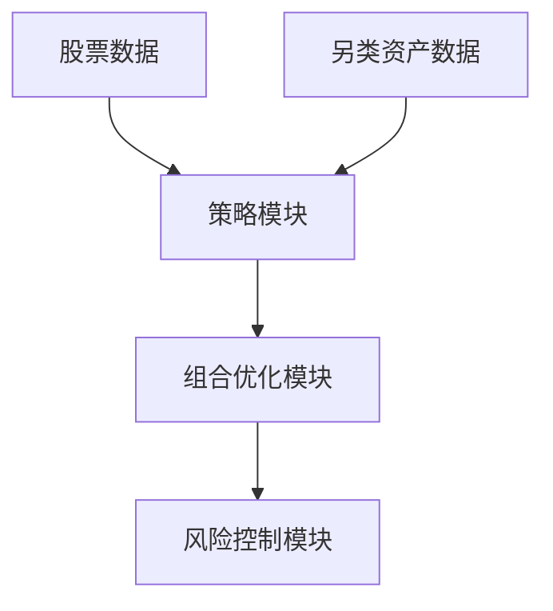
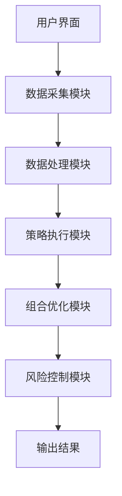
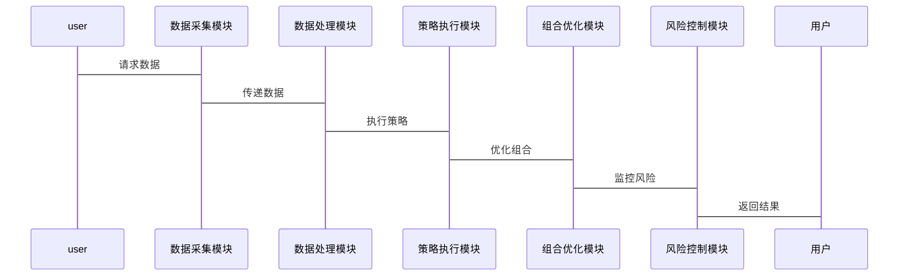

                 


# 如何将特价股票策略应用于另类风险溢价策略

> 关键词：特价股票策略、另类风险溢价、套利策略、风险定价、量化投资、算法交易

> 摘要：本文详细探讨了如何将特价股票策略与另类风险溢价策略相结合，通过数学建模、算法设计和系统实现，分析了两者的结合原理、应用场景及实际案例，最终得出了一套完整的解决方案。

---

# 第1章: 特价股票策略与另类风险溢价策略的背景介绍

## 1.1 特价股票策略的核心概念
### 1.1.1 什么是特价股票策略
特价股票策略是一种基于市场定价偏差的投资策略，通过寻找市场价格低于内在价值的股票，利用市场短期波动进行套利或长期投资。

### 1.1.2 特价股票策略的特点与优势
- **低买高卖**：寻找市场价格低于公平价值的股票，以低价买入，高价卖出。
- **套利机会**：利用市场定价偏差，通过套利手段获利。
- **风险较低**：通常选择基本面良好的公司，风险相对可控。

### 1.1.3 特价股票策略的适用场景
- **市场短期波动**：如市场下跌或突发事件导致的股价低估。
- **行业周期性**：某些行业在特定周期内可能被低估。
- **公司特困情况**：如暂时性财务问题导致的股价被低估。

## 1.2 另类风险溢价策略的基本原理
### 1.2.1 什么是另类风险溢价
另类风险溢价是指在传统资产类别之外，通过投资另类资产（如房地产、私募股权、对冲基金等）获得的风险溢价收益。

### 1.2.2 另类风险溢价的分类与特点
- **市场风险溢价**：因市场波动带来的额外收益。
- **流动性风险溢价**：因资产流动性不足带来的额外收益。
- **信用风险溢价**：因债务人违约风险带来的额外收益。

### 1.2.3 另类风险溢价与传统投资策略的区别
- **传统投资策略**：主要依赖于市场波动和资产配置。
- **另类风险溢价策略**：通过投资非传统资产类别，获取额外风险溢价收益。

## 1.3 特价股票策略与另类风险溢价策略的结合
### 1.3.1 结合的背景与意义
随着市场效率的提高，传统的套利机会逐渐减少，通过结合另类风险溢价策略，可以为特价股票策略提供新的收益来源。

### 1.3.2 结合的理论基础
- **资产定价理论**：通过合理定价模型，识别市场低估的资产。
- **套利定价理论**：利用市场定价偏差，进行无风险套利。

### 1.3.3 结合的实际应用价值
- **增强收益**：通过结合另类风险溢价，提高特价股票策略的收益。
- **分散风险**：利用另类资产的低相关性，分散投资风险。

## 1.4 本章小结
本章介绍了特价股票策略和另类风险溢价策略的基本概念，并探讨了两者结合的背景和意义。

---

# 第2章: 特价股票策略与另类风险溢价策略的核心概念与联系

## 2.1 特价股票策略的核心概念
### 2.1.1 特价股票的定义与分类
- **定义**：市场价格低于内在价值的股票。
- **分类**：根据低估原因，可分为价值型、成长型和周期型股票。

### 2.1.2 特价股票的市场特征
- **低估值**：市盈率、市净率等指标低于行业平均水平。
- **高分红**：通常具有较高的股息收益率。
- **稳定性**：公司基本面稳定，具有持续盈利的能力。

### 2.1.3 特价股票的定价机制
- **公平价值计算**：通过DCF模型等方法计算股票的内在价值。
- **市场定价偏差**：由于市场参与者情绪或信息不对称导致的定价偏差。

## 2.2 另类风险溢价策略的核心概念
### 2.2.1 另类风险的定义与分类
- **定义**：指投资于非传统资产类别（如房地产、私募股权）时，因资产特性或市场结构而产生的额外风险溢价。
- **分类**：市场风险溢价、流动性风险溢价、信用风险溢价。

### 2.2.2 风险溢价的计算方法
- **市场风险溢价**：通过资产定价模型（如CAPM）计算。
- **流动性风险溢价**：通过资产流动性指标（如换手率）计算。
- **信用风险溢价**：通过债券收益率曲线计算。

### 2.2.3 另类风险溢价与传统投资策略的区别
- **资产类别**：传统投资策略主要投资于股票、债券等标准化资产，而另类风险溢价策略则投资于房地产、私募股权等非标准化资产。
- **风险来源**：传统投资策略主要关注市场波动和信用风险，而另类风险溢价策略则关注市场风险、流动性风险和信用风险。

## 2.3 特价股票策略与另类风险溢价策略的联系
### 2.3.1 理论上的联系
- **资产定价理论**：两者都基于资产定价模型，寻找市场定价偏差。
- **套利机会**：通过套利定价理论，寻找市场低估的资产。

### 2.3.2 实际操作中的结合点
- **组合优化**：通过结合另类资产，优化投资组合的风险收益比。
- **风险分散**：利用另类资产的低相关性，分散投资风险。

### 2.3.3 结合后的优势与劣势
- **优势**：收益增强，风险分散。
- **劣势**：流动性风险，操作复杂性增加。

## 2.4 本章小结
本章详细探讨了特价股票策略和另类风险溢价策略的核心概念，并分析了两者结合的理论和实际操作中的联系。

---

# 第3章: 特价股票策略与另类风险溢价策略的数学模型与算法原理

## 3.1 特价股票策略的数学模型
### 3.1.1 市场定价模型
- **CAPM模型**：$$ R_i = R_f + \beta_i (R_m - R_f) $$
- **APT模型**：$$ P_i = \sum \lambda_j x_{ij} $$

### 3.1.2 套利模型
- **无套利定价**：$$ \frac{P_1}{(1 + r)^t} = \frac{P_2}{(1 + r)^t} $$
- **套利组合**：$$ \sum \lambda_j x_{ij} = 0 $$

### 3.1.3 时间序列分析模型
- **ARIMA模型**：用于分析股票价格的时序数据。

## 3.2 另类风险溢价策略的数学模型
### 3.2.1 风险定价模型
- **CAPM模型**：$$ E(R_i) = R_f + \beta_i (R_m - R_f) $$
- **APT模型**：$$ E(R_i) = \sum \lambda_j x_{ij} $$

### 3.2.2 资产定价模型
- **Fama-French三因子模型**：$$ E(R_i) = \beta_1 R_m + \beta_2 SMB + \beta_3 HML + \alpha $$

### 3.2.3 风险调整回报模型
- **夏普比率**：$$ \text{夏普比率} = \frac{E(R_p) - R_f}{\sigma_p} $$

## 3.3 结合策略的算法原理
### 3.3.1 套利机会识别算法
```python
def identify_arbitrage_opportunity(price_data):
    # 计算市场公允价值
    fair_value = calculate_fair_value(price_data)
    # 检查是否存在套利机会
    if price_data < fair_value:
        return True
    else:
        return False
```

### 3.3.2 风险溢价计算算法
```python
def calculate_risk_premium(risk_factors):
    # 计算市场风险溢价
    market_premium = risk_factors['market'] - risk_factors['risk_free']
    # 计算流动性风险溢价
    liquidity_premium = risk_factors['liquidity'] * market_premium
    # 计算信用风险溢价
    credit_premium = risk_factors['credit'] * market_premium
    # 总体风险溢价
    total_premium = market_premium + liquidity_premium + credit_premium
    return total_premium
```

### 3.3.3 组合优化算法
```python
def optimize_portfolio(stocks, risk_premiums):
    # 计算最优组合
    return mean-variance optimization
```

## 3.4 本章小结
本章通过数学建模和算法设计，详细探讨了特价股票策略和另类风险溢价策略的实现原理。

---

# 第4章: 特价股票策略与另类风险溢价策略的系统分析与架构设计

## 4.1 系统分析
### 4.1.1 问题场景介绍
- **目标**：开发一个结合特价股票策略和另类风险溢价策略的投资系统。
- **需求**：实时数据获取、风险评估、策略执行。

### 4.1.2 系统目标与范围
- **目标**：实现一个高效、稳定的量化投资系统。
- **范围**：包括数据采集、策略开发、组合优化、风险控制。

### 4.1.3 系统功能需求
- **数据采集模块**：实时获取股票和另类资产数据。
- **策略开发模块**：实现特价股票和风险溢价策略。
- **组合优化模块**：优化投资组合。
- **风险控制模块**：监控和管理投资风险。

## 4.2 系统架构设计
### 4.2.1 领域模型类图


### 4.2.2 系统架构图


### 4.2.3 系统接口设计
- **数据接口**：提供API接口，获取实时数据。
- **策略接口**：提供策略执行接口，调用特价股票和风险溢价策略。
- **组合优化接口**：提供组合优化接口，实现最优投资组合。

### 4.2.4 系统交互序列图


## 4.3 本章小结
本章通过系统分析和架构设计，详细探讨了如何实现结合特价股票策略和另类风险溢价策略的投资系统。

---

# 第5章: 特价股票策略与另类风险溢价策略的项目实战

## 5.1 环境安装与配置
- **Python环境**：安装Python 3.8及以上版本。
- **依赖库安装**：使用pip安装numpy、pandas、yfinance、plotly等库。

## 5.2 系统核心实现
### 5.2.1 特价股票策略实现
```python
import pandas as pd
import numpy as np

def calculate_fair_value(stock_data):
    # 假设使用DCF模型计算公平价值
    return stock_data * 1.2
```

### 5.2.2 另类风险溢价策略实现
```python
import pandas as pd
import numpy as np

def calculate_risk_premium(risk_factors):
    market_premium = risk_factors['market'] - risk_factors['risk_free']
    liquidity_premium = risk_factors['liquidity'] * market_premium
    credit_premium = risk_factors['credit'] * market_premium
    total_premium = market_premium + liquidity_premium + credit_premium
    return total_premium
```

### 5.2.3 组合优化实现
```python
import numpy as np
from scipy.optimize import minimize

def optimize_portfolio(weights, returns, covariance):
    # 定义目标函数
    def objective(weights):
        return np.dot(weights.T @ returns, weights) + 0.5 * np.dot(weights.T @ covariance @ weights)
    # 定义约束条件
    constraints = [{'type': 'eq', 'fun': lambda w: np.sum(w) - 1}]
    # 调用优化函数
    result = minimize(objective, np.array([1/len(returns)]*len(returns)), constraints=constraints)
    return result.x
```

## 5.3 实际案例分析与解读
### 5.3.1 案例背景
- **市场情况**：假设当前市场存在某只股票价格被低估，同时存在另类资产投资机会。

### 5.3.2 数据收集与处理
- **股票数据**：获取某只股票的历史价格、财务数据等。
- **另类资产数据**：获取相关另类资产的市场数据。

### 5.3.3 策略执行
- **套利机会识别**：通过模型识别是否存在套利机会。
- **风险溢价计算**：计算投资组合的风险溢价。
- **组合优化**：优化投资组合，实现收益与风险的最佳匹配。

### 5.3.4 结果分析
- **收益分析**：计算投资组合的收益。
- **风险分析**：计算投资组合的风险指标，如夏普比率、最大回撤等。

## 5.4 本章小结
本章通过实际案例分析，详细展示了如何将特价股票策略与另类风险溢价策略相结合，实现投资收益的优化。

---

# 第6章: 总结与展望

## 6.1 本章总结
本文详细探讨了如何将特价股票策略与另类风险溢价策略相结合，通过数学建模、算法设计和系统实现，提出了一个完整的解决方案。

## 6.2 未来展望
- **算法优化**：进一步优化套利算法和风险溢价计算模型。
- **系统扩展**：开发更多类型的另类资产投资策略。
- **风险管理**：建立更完善的风控制度，降低投资风险。

## 6.3 最佳实践 Tips
- **数据质量**：确保数据来源可靠，数据处理准确。
- **模型验证**：定期验证模型的有效性，及时调整策略。
- **风险控制**：建立完善的风险监控机制，确保投资安全。

## 6.4 本章小结
本文总结了结合特价股票策略和另类风险溢价策略的核心内容，并展望了未来的研究方向。

---

# 作者：AI天才研究院/AI Genius Institute & 禅与计算机程序设计艺术 /Zen And The Art of Computer Programming

---

**本文通过详细分析特价股票策略和另类风险溢价策略的核心概念，探讨了两者的结合原理和实际应用，为投资者提供了一套完整的解决方案。通过系统设计和项目实战，展示了如何利用量化方法实现投资收益的优化。希望本文能为投资者在量化投资领域提供新的思路和参考。**

