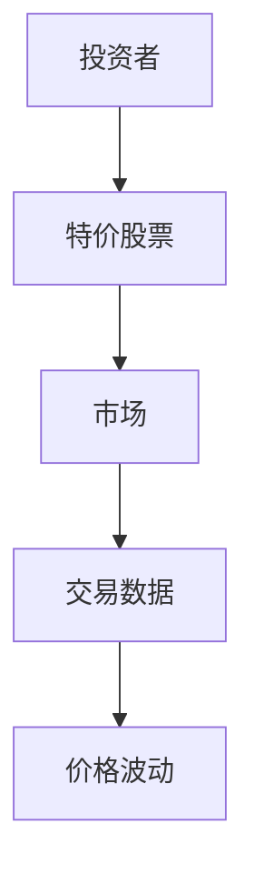
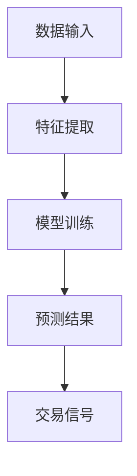
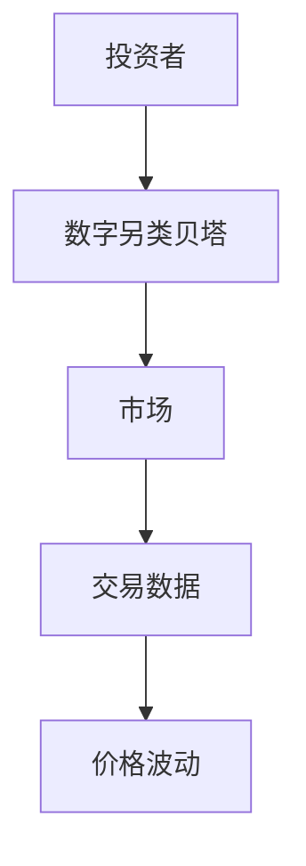

                 


# 如何将特价股票策略应用于数字另类贝塔捕捉策略

## 关键词：特价股票策略，数字另类贝塔，捕捉策略，投资组合优化，数据驱动投资

## 摘要：本文探讨如何将特价股票策略与数字另类贝塔捕捉策略相结合，通过数据科学方法优化投资组合。从理论基础到算法实现，详细阐述如何利用大数据和机器学习技术捕捉市场机会，构建高效的投资策略。

---

# 第一部分: 特价股票策略与数字另类贝塔捕捉策略的背景与基础

---

## 第1章: 特价股票策略与数字另类贝塔捕捉策略概述

### 1.1 特价股票策略的定义与背景
#### 1.1.1 特价股票的定义
特价股票是指市场价格低于其内在价值的股票。这种股票通常被市场低估，具有较大的上涨潜力。特价股票策略的核心在于识别这些被低估的股票，并在合适的时间点进行买入。

#### 1.1.2 特价股票策略的背景与现状
随着金融市场的发展，投资者越来越依赖数据和算法来寻找投资机会。特价股票策略作为一种传统的投资策略，近年来在大数据和人工智能技术的推动下，展现出新的活力。通过分析历史数据和市场行为，投资者可以更精准地识别潜在的特价股票。

#### 1.1.3 特价股票策略的核心要素
- **价格与价值的偏差**：市场价格与内在价值的差异是特价股票策略的核心。
- **市场情绪**：市场情绪波动会影响股票价格，从而为特价股票策略提供机会。
- **交易成本**：降低交易成本是实现超额收益的关键因素之一。

### 1.2 数字另类贝塔捕捉策略的定义与特点
#### 1.2.1 另类贝塔的定义
另类贝塔是指通过非传统的方式捕捉市场收益。传统的贝塔（CAPM模型中的β）衡量的是资产对市场平均风险的敏感程度，而另类贝塔则通过挖掘市场中的非线性关系和大数据分析，寻找市场中未被传统模型捕捉的收益来源。

#### 1.2.2 数字另类贝塔捕捉策略的特点
- **数据驱动**：利用大数据和机器学习技术分析市场数据。
- **非线性关系**：通过复杂的数据挖掘技术捕捉市场中的非线性关系。
- **实时性**：数字另类贝塔捕捉策略需要实时分析市场数据，快速捕捉机会。

#### 1.2.3 数字另类贝塔捕捉策略与传统贝塔策略的区别
| 特性          | 传统贝塔策略                     | 数字另类贝塔策略                   |
|---------------|----------------------------------|-----------------------------------|
| 数据来源      | 历史价格数据                     | 大数据和非结构化数据              |
| 分析方法      | 线性回归                         | 机器学习和非线性模型              |
| 捕捉机会      | 市场平均风险                     | 非线性和复杂市场关系              |

### 1.3 特价股票策略与数字另类贝塔捕捉策略的联系
#### 1.3.1 两者的共同点
- 都以捕捉市场机会为核心。
- 都需要对市场数据进行深入分析。

#### 1.3.2 两者的区别
- **目标**：特价股票策略注重寻找低估的股票，而数字另类贝塔捕捉策略注重捕捉市场中的非线性收益。
- **方法**：特价股票策略主要依赖基本面分析和价格分析，而数字另类贝塔捕捉策略则更多依赖大数据和机器学习技术。

#### 1.3.3 结合应用的潜在优势
- **提高准确性**：通过结合大数据分析和基本面分析，可以更准确地识别潜在的特价股票。
- **增强收益**：利用数字另类贝塔捕捉策略，可以在传统贝塔策略的基础上，捕捉更多的市场机会。

### 1.4 本章小结
本章介绍了特价股票策略和数字另类贝塔捕捉策略的基本概念、特点及其联系。通过对比分析，我们发现将两者结合可以有效提高投资策略的准确性和收益性。

---

# 第二部分: 特价股票策略与数字另类贝塔捕捉策略的核心概念与联系

---

## 第2章: 特价股票策略的核心原理

### 2.1 特价股票策略的数学模型
#### 2.1.1 特价股票的定价模型
特价股票的定价模型可以通过以下公式表示：
$$ P_{\text{true}} = \max(P_{\text{market}}, V) $$
其中，$P_{\text{market}}$ 是市场价格，$V$ 是股票的内在价值。

#### 2.1.2 特价股票的收益计算公式
特价股票的收益可以通过以下公式计算：
$$ R = \frac{P_{\text{final}} - P_{\text{initial}}}{P_{\text{initial}}} \times 100\% $$

#### 2.1.3 特价股票的风险评估模型
风险评估可以通过夏普比率来衡量：
$$ \text{夏普比率} = \frac{R_p - R_f}{\sigma_p} $$
其中，$R_p$ 是投资组合的收益，$R_f$ 是无风险利率，$\sigma_p$ 是投资组合的风险。

### 2.2 特价股票策略的属性特征对比
| 特性          | 特价股票策略                     | 数字另类贝塔捕捉策略               |
|---------------|----------------------------------|-----------------------------------|
| 数据来源      | 历史价格和基本面数据             | 大数据和非结构化数据              |
| 分析方法      | 基本面分析和价格分析             | 机器学习和大数据分析              |
| 捕捉机会      | 低估股票                        | 非线性市场关系                    |

### 2.3 特价股票策略的ER实体关系图


### 2.4 本章小结
本章详细介绍了特价股票策略的数学模型、属性特征及其ER实体关系图。通过这些模型和图表，我们可以更清晰地理解特价股票策略的核心原理。

---

## 第3章: 数字另类贝塔捕捉策略的核心原理

### 3.1 数字另类贝塔捕捉策略的数学模型
#### 3.1.1 数字另类贝塔的定义公式
数字另类贝塔可以通过以下公式表示：
$$ \beta_{\text{alternative}} = f(X) $$
其中，$X$ 是输入的市场数据，$f$ 是一个复杂的函数，通常由机器学习模型构成。

#### 3.1.2 数字另类贝塔捕捉策略的算法流程


### 3.2 数字另类贝塔捕捉策略的属性特征对比
| 特性          | 特价股票策略                     | 数字另类贝塔捕捉策略               |
|---------------|----------------------------------|-----------------------------------|
| 数据来源      | 历史价格和基本面数据             | 大数据和非结构化数据              |
| 分析方法      | 基本面分析和价格分析             | 机器学习和大数据分析              |
| 捕捉机会      | 低估股票                        | 非线性市场关系                    |

### 3.3 数字另类贝塔捕捉策略的ER实体关系图


### 3.4 本章小结
本章详细介绍了数字另类贝塔捕捉策略的数学模型、属性特征及其ER实体关系图。通过这些模型和图表，我们可以更清晰地理解数字另类贝塔捕捉策略的核心原理。

---

## 第4章: 特价股票策略与数字另类贝塔捕捉策略的结合

### 4.1 两者的结合方式
将特价股票策略与数字另类贝塔捕捉策略结合，可以通过以下步骤实现：
1. **数据收集**：收集市场数据和基本面数据。
2. **模型训练**：利用机器学习模型训练数字另类贝塔捕捉策略。
3. **策略优化**：结合特价股票策略和数字另类贝塔捕捉策略，优化投资组合。

### 4.2 结合后的优势
- **提高准确性**：通过结合大数据分析和基本面分析，可以更准确地识别潜在的特价股票。
- **增强收益**：利用数字另类贝塔捕捉策略，可以在传统贝塔策略的基础上，捕捉更多的市场机会。

### 4.3 本章小结
本章介绍了如何将特价股票策略与数字另类贝塔捕捉策略结合，并分析了结合后的优势。

---

## 第5章: 实际案例分析

### 5.1 案例背景
假设我们有一个包含100只股票的数据集，其中部分股票是特价股票。

### 5.2 数据处理
使用Python进行数据清洗和特征提取：
```python
import pandas as pd

data = pd.read_csv('stock_data.csv')
data = data.dropna()
```

### 5.3 模型训练
使用机器学习模型训练数字另类贝塔捕捉策略：
```python
from sklearn.linear_model import LinearRegression

model = LinearRegression()
model.fit(X_train, y_train)
```

### 5.4 策略实施
结合特价股票策略和数字另类贝塔捕捉策略，优化投资组合。

### 5.5 结果分析
分析策略的收益和风险，优化模型参数。

### 5.6 本章小结
本章通过实际案例分析，展示了如何将特价股票策略与数字另类贝塔捕捉策略结合，并分析了策略的实施效果。

---

## 第6章: 最佳实践与总结

### 6.1 最佳实践
- **数据质量**：确保数据来源可靠，数据清洗充分。
- **模型选择**：根据具体问题选择合适的机器学习模型。
- **风险控制**：在策略实施过程中，注重风险控制，避免过度杠杆化。

### 6.2 总结
通过将特价股票策略与数字另类贝塔捕捉策略结合，投资者可以更精准地识别市场机会，提高投资收益。

---

## 作者：AI天才研究院/AI Genius Institute & 禅与计算机程序设计艺术 /Zen And The Art of Computer Programming

---

通过以上结构和内容，我们可以清晰地看到如何将特价股票策略应用于数字另类贝塔捕捉策略的整个过程。从理论到实践，从模型到代码，本文为读者提供了详尽的指导和分析。

