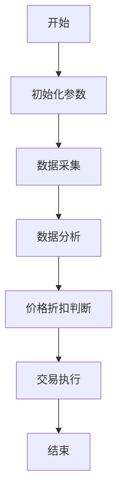
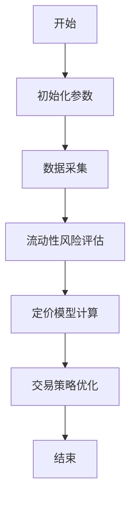
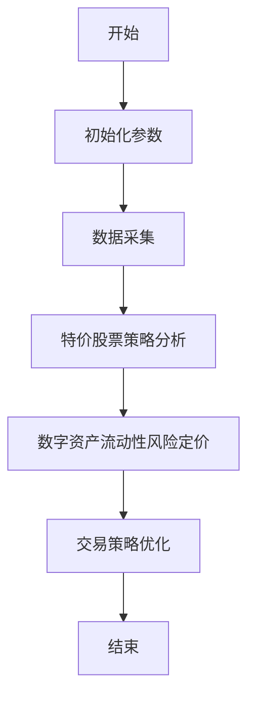
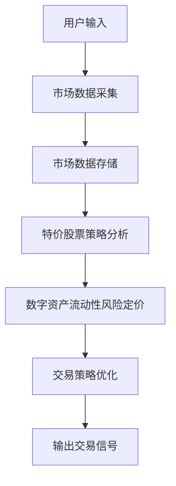
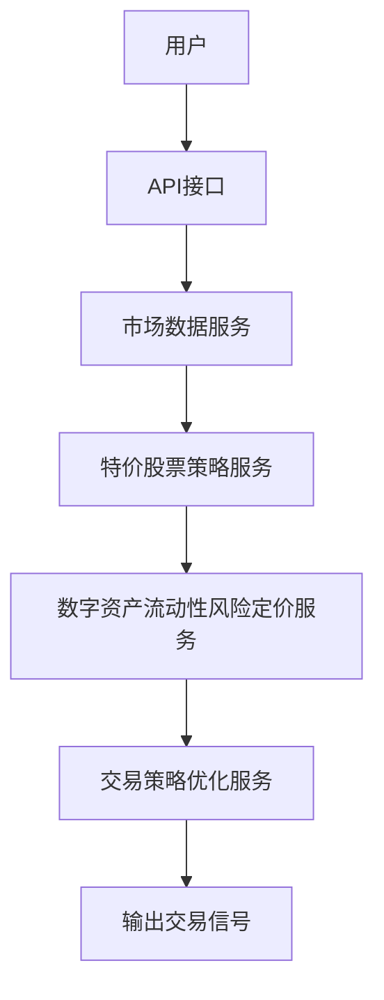
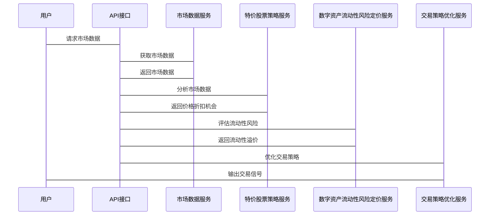

                 


# 如何将特价股票策略应用于数字资产流动性风险定价

> 关键词：特价股票策略，数字资产，流动性风险，定价模型，算法优化

> 摘要：本文详细探讨了如何将特价股票策略应用于数字资产流动性风险定价。首先，介绍了特价股票策略和数字资产的基本概念，分析了流动性风险在数字资产市场中的重要性。接着，深入解析了特价股票策略的核心原理和数字资产流动性风险定价的理论框架，对比了两者的异同点。然后，通过数学模型和算法优化，提出了将特价股票策略应用于数字资产流动性风险定价的具体方法。最后，结合实际案例，展示了如何在数字资产市场中实现这一策略，并总结了最佳实践和注意事项。

---

## 第一部分: 特价股票策略与数字资产流动性风险定价的背景介绍

### 第1章: 特价股票策略概述

#### 1.1 特价股票策略的定义与特点

- **1.1.1 特价股票策略的定义**  
  特价股票策略是一种通过在特定条件下以低于市场价购买股票的投资策略。其核心在于识别市场中的价格折扣机会，并在合适的时间点买入，以期在价格回升时获利。

- **1.1.2 特价股票策略的核心特点**  
  - 灵活性：可以根据市场变化迅速调整策略。  
  - 风险控制：通过价格折扣降低买入成本，减少市场波动对投资组合的影响。  
  - 高效性：依赖于算法和数据分析，能够在短时间内完成交易决策。

- **1.1.3 特价股票策略的应用场景**  
  - 市场低迷期：利用价格折扣的机会，买入被低估的股票。  
  - 事件驱动：公司公告、并购等事件可能导致股价短期波动，提供特价买入的机会。  
  - 高流动性市场：确保交易的即时性和低成本。

#### 1.2 数字资产的基本概念

- **1.2.1 数字资产的定义与分类**  
  数字资产是指以数字形式存在的资产，包括比特币、以太坊等加密货币，以及NFTs（非同质化代币）等。数字资产具有去中心化、匿名性和高波动性的特点。

- **1.2.2 数字资产市场的特点与发展趋势**  
  - 去中心化：交易不受传统金融机构的控制。  
  - 高波动性：价格波动剧烈，短期内可能产生较大的收益或损失。  
  - 技术驱动：区块链技术是数字资产的核心支撑。

- **1.2.3 数字资产交易的基本流程**  
  1. 创建数字钱包并获取数字资产。  
  2. 在交易所进行挂单或市价单交易。  
  3. 通过区块链网络完成交易确认。  

### 第2章: 流动性风险定价的背景与重要性

#### 2.1 流动性风险的定义与分类

- **2.1.1 流动性风险的定义**  
  流动性风险是指在不损失价值的情况下，快速将资产变现的能力。流动性越高，资产的变现能力越强。

- **2.1.2 流动性风险的分类**  
  - 系统性风险：整个市场流动性不足导致的广泛风险。  
  - 个体风险：特定资产或市场流动性不足导致的风险。

- **2.1.3 流动性风险的影响因素**  
  - 市场深度：市场中可交易的资产数量和买家需求。  
  - 买卖价差：买价与卖价之间的差距。  
  - 市场参与者的行为：投资者情绪和交易策略对流动性的影响。

#### 2.2 数字资产市场中的流动性风险

- **2.2.1 数字资产市场的流动性特点**  
  - 高波动性：价格波动剧烈，影响流动性。  
  - 市场深度有限：许多数字资产的交易量较小，市场深度不足。  
  - 去中心化交易所：交易集中在少数平台，可能导致流动性集中。

- **2.2.2 数字资产交易中的流动性风险表现**  
  - 大额交易导致的价格滑点。  
  - 市场深度不足导致的买卖价差扩大。  
  - 突然的价格下跌导致的流动性枯竭。

- **2.2.3 数字资产流动性风险的测量方法**  
  - 成交量分析：通过交易量判断市场深度。  
  - 买卖价差分析：通过买卖价差衡量流动性风险。  
  - 市场冲击分析：评估大额交易对市场价格的影响。

#### 2.3 特价股票策略与流动性风险定价的关系

- **2.3.1 特价股票策略对流动性风险的影响**  
  - 通过低价买入，减少市场波动对投资组合的影响。  
  - 提高资产的流动性，降低流动性风险。

- **2.3.2 流动性风险定价在数字资产中的应用**  
  - 通过流动性风险定价模型，评估数字资产的流动性风险。  
  - 优化交易策略，降低流动性风险对投资收益的影响。

- **2.3.3 特价股票策略与数字资产流动性风险定价的结合点**  
  - 利用特价股票策略，降低数字资产的买入成本，减少流动性风险。  
  - 通过流动性风险定价，优化数字资产交易策略，提高投资回报。

---

## 第二部分: 特价股票策略与数字资产流动性风险定价的核心概念与联系

### 第3章: 特价股票策略的核心原理

#### 3.1 特价股票策略的理论基础

- **3.1.1 市场有效性的假设**  
  假设市场是有效的，即价格反映所有可获取的信息。特价股票策略通过寻找市场中的价格折扣机会，利用短期价格波动获利。

- **3.1.2 投资者行为理论**  
  投资者行为理论认为，市场中的价格波动往往由投资者情绪和行为驱动。特价股票策略通过分析市场情绪，找到价格被低估的机会。

- **3.1.3 价格发现机制**  
  价格发现机制是指市场中通过买卖双方的交易，确定资产的市场价格。特价股票策略通过分析价格发现机制，找到价格折扣的机会。

#### 3.2 特价股票策略的关键要素

- **3.2.1 价格折扣机制**  
  特价股票策略的核心是通过价格折扣机制，以低于市场价买入股票。这需要对市场价和实际价值进行分析，找到价格折扣的机会。

- **3.2.2 时间窗口与交易频率**  
  特价股票策略需要确定合适的时间窗口，以在价格折扣期间完成交易。交易频率的高低直接影响策略的收益和风险。

- **3.2.3 市场深度与订单簿分析**  
  市场深度和订单簿分析是评估市场流动性的重要指标。通过分析订单簿，可以判断市场的买卖力量，找到价格折扣的机会。

### 第4章: 数字资产流动性风险定价的理论框架

#### 4.1 流动性风险定价的基本原理

- **4.1.1 流动性溢价的定义与计算**  
  流动性溢价是指由于资产流动性高，投资者愿意支付的溢价。流动性溢价的计算可以通过市场深度和买卖价差等因素进行。

- **4.1.2 市场深度与流动性风险的关系**  
  市场深度越大，流动性风险越小。市场深度浅的资产，流动性风险较高。

- **4.1.3 价格波动与流动性风险的关联**  
  价格波动大的资产，流动性风险较高。价格波动小的资产，流动性风险较低。

#### 4.2 数字资产流动性风险定价的关键指标

- **4.2.1 成交量与订单深度分析**  
  成交量和订单深度是衡量市场深度的重要指标。通过分析成交量和订单深度，可以判断市场的流动性情况。

- **4.2.2 买卖价差与滑点分析**  
  买卖价差和滑点是衡量交易成本的重要指标。买卖价差大，滑点高的市场，流动性风险较高。

- **4.2.3 市场冲击与交易成本**  
  市场冲击是指大额交易对市场价格的影响。市场冲击越大，交易成本越高，流动性风险也越高。

### 第5章: 特价股票策略与数字资产流动性风险定价的对比分析

#### 5.1 特价股票策略与数字资产流动性风险定价的异同点

- **5.1.1 价格形成机制的对比**  
  特价股票策略通过价格折扣机制形成价格，而数字资产流动性风险定价通过市场深度和买卖价差等因素形成价格。

- **5.1.2 风险管理策略的对比**  
  特价股票策略注重降低买入成本，减少市场波动的影响。数字资产流动性风险定价注重通过定价模型，优化交易策略，降低流动性风险。

- **5.1.3 市场参与者对比**  
  特价股票策略主要应用于传统股票市场，而数字资产流动性风险定价主要应用于数字资产市场，参与者包括机构投资者和个人投资者。

#### 5.2 特价股票策略在数字资产流动性风险定价中的应用潜力

- **5.2.1 数字资产市场的价格发现机制**  
  数字资产市场的价格发现机制与传统股票市场类似，但波动性更大。特价股票策略可以通过分析价格发现机制，找到价格折扣的机会。

- **5.2.2 特价股票策略在数字资产交易中的优化作用**  
  特价股票策略可以优化数字资产交易策略，降低买入成本，减少流动性风险。

- **5.2.3 数字资产流动性风险定价的未来发展趋势**  
  随着数字资产市场的不断发展，流动性风险定价将更加重要。特价股票策略的应用将推动数字资产流动性风险定价的发展。

---

## 第三部分: 特价股票策略与数字资产流动性风险定价的算法优化

### 第6章: 特价股票策略的算法优化

#### 6.1 特价股票策略的算法流程



- **6.1.1 数据采集**  
  从市场数据源获取实时价格、订单簿等信息。

- **6.1.2 数据分析**  
  通过算法分析数据，判断是否存在价格折扣机会。

- **6.1.3 价格折扣判断**  
  根据分析结果，判断是否满足价格折扣条件。

- **6.1.4 交易执行**  
  在满足条件时，执行交易。

### 第7章: 数字资产流动性风险定价的算法优化

#### 7.1 数字资产流动性风险定价的算法流程



- **7.1.1 数据采集**  
  从数字资产市场获取实时价格、订单簿等信息。

- **7.1.2 流动性风险评估**  
  通过算法评估数字资产的流动性风险。

- **7.1.3 定价模型计算**  
  使用定价模型计算数字资产的流动性溢价。

- **7.1.4 交易策略优化**  
  根据定价模型优化交易策略，降低流动性风险。

### 第8章: 特价股票策略与数字资产流动性风险定价的结合算法

#### 8.1 结合算法的流程



- **8.1.1 数据采集**  
  从数字资产市场获取实时价格、订单簿等信息。

- **8.1.2 特价股票策略分析**  
  分析数字资产的价格折扣机会。

- **8.1.3 数字资产流动性风险定价**  
  评估数字资产的流动性风险，并计算流动性溢价。

- **8.1.4 交易策略优化**  
  根据分析结果优化交易策略，降低流动性风险。

---

## 第四部分: 特价股票策略与数字资产流动性风险定价的系统架构与实现

### 第9章: 系统架构设计

#### 9.1 系统功能设计


- **9.1.1 功能模块设计**  
  - 特价股票策略模块：分析市场数据，判断价格折扣机会。  
  - 数字资产流动性风险定价模块：评估流动性风险，计算流动性溢价。  
  - 综合优化模块：结合特价股票策略和流动性风险定价，优化交易策略。

#### 9.2 系统架构设计



- **9.2.1 系统架构图**  
  通过Mermaid图展示系统架构，包括数据采集、数据存储、策略分析、策略定价和策略优化等模块。

### 第10章: 接口设计与交互流程

#### 10.1 系统接口设计



- **10.1.1 接口设计**  
  通过API接口实现市场数据采集、策略分析、策略定价和策略优化等服务。

#### 10.2 系统交互流程



---

## 第五部分: 特价股票策略与数字资产流动性风险定价的项目实战

### 第11章: 环境安装与配置

#### 11.1 环境要求

- 操作系统：Windows 10 或更高版本，或macOS 10.15 或更高版本。  
- Python：3.8 或更高版本。  
- 依赖库：Pandas、NumPy、Matplotlib、Scikit-learn。

#### 11.2 安装步骤

```bash
# 安装必要的依赖库
pip install pandas numpy matplotlib scikit-learn
```

### 第12章: 核心代码实现

#### 12.1 特价股票策略代码

```python
import pandas as pd
import numpy as np

def price_discount_strategy(data, threshold=0.05):
    # 计算价格折扣率
    discounted_prices = data['price'] * (1 - threshold)
    # 判断是否满足价格折扣条件
    buy_signals = data['price'] < discounted_prices
    return buy_signals

# 示例数据
data = {'price': [100, 90, 80, 70, 60]}
df = pd.DataFrame(data)
result = price_discount_strategy(df)
print(result)
```

#### 12.2 数字资产流动性风险定价代码

```python
import pandas as pd
import numpy as np

def liquidity_risk_pricing(data, window=30):
    # 计算移动平均价
    data['MA'] = data['price'].rolling(window).mean()
    # 计算流动性风险溢价
    risk_premium = data['price'] - data['MA']
    return risk_premium

# 示例数据
data = {'price': [100, 90, 80, 70, 60]}
df = pd.DataFrame(data)
result = liquidity_risk_pricing(df)
print(result)
```

### 第13章: 案例分析与实战

#### 13.1 案例分析

- **案例背景**  
  假设在数字资产市场中，某加密货币的价格波动较大，市场深度较浅。通过特价股票策略分析，找到价格折扣的机会，同时评估流动性风险，优化交易策略。

- **分析过程**  
  1. 数据采集：获取该加密货币的实时价格和订单簿数据。  
  2. 数据分析：计算价格折扣率和流动性风险溢价。  
  3. 交易策略优化：结合特价股票策略和流动性风险定价，优化交易策略。  
  4. 交易执行：在满足条件时，执行交易。

#### 13.2 实战总结

- **交易信号输出**  
  在价格折扣机会出现时，系统将发出买入信号。  
  在流动性风险较低时，系统将发出卖出信号。

- **风险管理**  
  通过流动性风险定价模型，优化交易策略，降低流动性风险对投资收益的影响。

---

## 第六部分: 最佳实践与注意事项

### 第14章: 最佳实践

#### 14.1 小结

- 特价股票策略和数字资产流动性风险定价的结合，可以有效降低流动性风险，提高交易收益。  
- 通过算法优化和系统设计，可以实现交易策略的自动化和高效化。

#### 14.2 注意事项

- 交易策略的制定需要结合市场实际情况，避免盲目跟从。  
- 系统设计需要考虑数据源的可靠性和算法的高效性。  
- 风险管理是关键，需要实时监控市场变化，及时调整交易策略。

#### 14.3 拓展阅读

- 推荐阅读《算法交易与量化投资》、《数字资产投资策略》等相关书籍。  
- 关注区块链技术和数字资产市场的最新动态，优化交易策略。

---

## 结语

通过本文的详细讲解，读者可以深入了解如何将特价股票策略应用于数字资产流动性风险定价。从理论分析到算法优化，再到系统实现和项目实战，本文为读者提供了全面的指导。未来，随着数字资产市场的不断发展，特价股票策略的应用潜力将进一步释放，为投资者带来更多机遇和挑战。

---

## 作者

作者：AI天才研究院/AI Genius Institute & 禅与计算机程序设计艺术/Zen And The Art of Computer Programming

