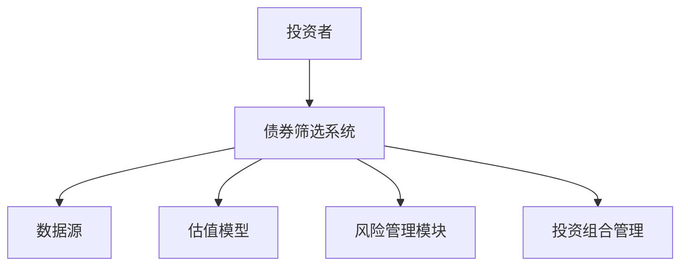
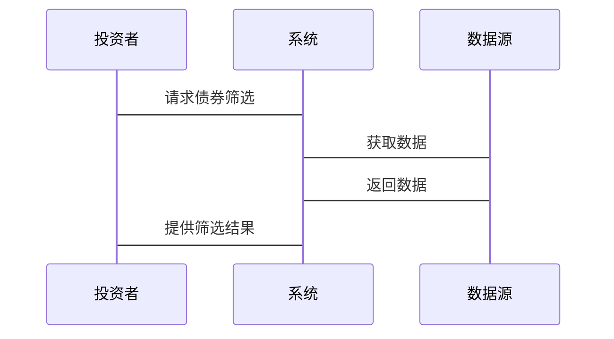

                 


# 如何将特价股票策略应用于新兴市场债券投资

> 关键词：特价股票策略、新兴市场债券、投资策略、风险管理、金融建模

> 摘要：本文探讨如何将特价股票策略应用于新兴市场债券投资，通过分析债券的内在价值、市场周期和风险因素，结合定量模型和定性分析，寻找被低估的投资机会，制定风险管理策略，实现稳健的投资回报。

---

# 第1章: 特价股票策略与新兴市场债券投资概述

## 1.1 特价股票策略的背景与定义

### 1.1.1 特价股票策略的定义
特价股票策略是一种投资策略，旨在通过识别市场价格低于内在价值的股票，进行买入并持有的投资。该策略的核心在于利用市场低估的机会，实现资本增值。

### 1.1.2 特价股票策略的核心要素
- **估值指标**：市盈率（P/E）、市净率（P/B）、股息率等。
- **市场周期**：识别市场低估阶段，如熊市或行业低迷期。
- **风险评估**：分析公司财务状况，确保企业具备持续经营能力。

### 1.1.3 特价股票策略在投资中的作用
- 提供潜在的高回报机会。
- 降低投资风险，通过买入低估资产分散风险。
- 在市场反转时实现资本增值。

## 1.2 新兴市场债券投资的背景与特点

### 1.2.1 新兴市场债券的定义
新兴市场债券是由新兴国家或企业在国际市场上发行的债券，通常以美元或欧元计价，具有较高的票面利率。

### 1.2.2 新兴市场债券投资的特点
- **高收益**：新兴市场债券通常提供较高的票面利率。
- **高风险**：新兴市场存在较高的信用风险和市场风险。
- **波动性**：债券价格受汇率、利率和经济政策影响较大。

### 1.2.3 新兴市场债券投资的风险与机会
- **风险**：信用风险、汇率风险、流动性风险。
- **机会**：新兴市场经济增长快，债券收益率高，存在套利机会。

## 1.3 特价股票策略应用于新兴市场债券投资的可行性

### 1.3.1 特价股票策略与新兴市场债券投资的结合点
- **估值分析**：债券的内在价值与市场价格的差异。
- **市场周期**：在市场低估时期买入债券。
- **风险管理**：利用股票策略中的风险管理方法。

### 1.3.2 应用该策略的优势与挑战
- **优势**：识别低估债券，提高投资回报。
- **挑战**：数据不全、市场流动性差、信用风险高。

### 1.3.3 理论基础与实际操作的结合
将股票估值方法应用于债券定价，结合新兴市场的特点，制定适合的投资策略。

## 1.4 本章小结
本章介绍了特价股票策略和新兴市场债券投资的基本概念，并探讨了将前者应用于后者的可行性，为后续分析奠定了基础。

---

# 第2章: 特价股票策略的核心概念

## 2.1 特价股票策略的理论基础

### 2.1.1 投资学基础
- **有效市场假说**：探讨市场是否有效，影响特价策略的有效性。
- **资产定价模型**：CAPM、APT等模型用于评估资产的合理价格。

### 2.1.2 股票定价理论
- **内在价值**：通过DCF模型计算股票的内在价值。
- **相对估值**：比较市盈率、市净率等指标。

### 2.1.3 市场异效理论
- **价值陷阱**：识别市场误判的股票，避免投资亏损。
- **市场情绪**：分析投资者行为对股价的影响。

## 2.2 特价股票策略的核心要素

### 2.2.1 股票估值方法
- **DCF模型**：计算自由现金流的现值。
- **相对估值法**：比较同类公司的估值指标。

### 2.2.2 股票市场周期分析
- **市场周期**：识别市场从低估到高估的阶段。
- **行业周期**：分析行业景气度对股价的影响。

### 2.2.3 股票风险评估
- **Beta系数**：衡量股票的系统性风险。
- **VaR分析**：评估潜在损失。

## 2.3 特价股票策略的分类与选择

### 2.3.1 价值型投资策略
- **低市盈率**：寻找P/E低于行业平均水平的股票。
- **低市净率**：寻找P/B低于行业平均水平的股票。

### 2.3.2 成长型投资策略
- **高盈利增长率**：寻找净利润增长快的股票。
- **高营收增长率**：寻找收入增长快的股票。

### 2.3.3 混合型投资策略
- **平衡价值与成长**：寻找估值低但增长潜力大的股票。

## 2.4 本章小结
本章详细讲解了特价股票策略的理论基础和核心要素，为后续应用于债券投资提供了方法论支持。

---

# 第3章: 新兴市场债券投资的理论与实践

## 3.1 新兴市场债券投资的理论基础

### 3.1.1 新兴市场债券的定价模型

#### 3.1.1.1 债券定价的基本原理
债券价格 = 现值（PV）之和，由未来现金流的现值构成。公式如下：
$$ P = \sum_{t=1}^{n} \frac{C}{(1 + r)^t} + \frac{F}{(1 + r)^n} $$
其中，\( C \) 是每年的利息，\( r \) 是收益率，\( F \) 是面值，\( n \) 是期限。

#### 3.1.1.2 新兴市场债券的特殊性
- **货币风险**：债券通常以外币计价，存在汇率风险。
- **信用风险**：新兴市场国家或企业信用评级较低。

#### 3.1.1.3 新兴市场债券定价的挑战
- 数据不足：新兴市场债券的历史数据较少。
- 市场流动性差：交易不活跃，价格波动大。

### 3.1.2 新兴市场债券的信用评级

#### 3.1.2.1 信用评级的定义与作用
信用评级是评估债券发行人偿还能力的指标，由 Moody's、S&P 等机构提供。

#### 3.1.2.2 新兴市场债券的信用评级方法
- **基本面分析**：GDP增长率、财政赤字、外汇储备等。
- **行业分析**：行业周期、竞争状况。
- **公司治理**：管理层稳定性、透明度。

#### 3.1.2.3 信用评级与债券价格的关系
信用评级影响债券的收益率，评级越高，利率越低。价格与评级呈反相关关系。

### 3.1.3 新兴市场债券与股票的定价差异
- **期限结构**：债券有固定到期日，股票无期限。
- **收益结构**：债券收益固定，股票收益取决于公司盈利。

## 3.2 新兴市场债券投资的实践

### 3.2.1 特价股票策略在债券投资中的应用

#### 3.2.1.1 估值分析
- 将债券视为股票，分析其内在价值。
- 使用DCF模型计算债券的合理价格。

#### 3.2.1.2 市场周期分析
- 在市场低估时期买入债券。
- 监测行业周期，选择增长潜力大的债券。

#### 3.2.1.3 风险评估
- 分析债券发行人的财务状况。
- 评估市场风险和信用风险。

### 3.2.2 应用中的特殊考虑

#### 3.2.2.1 数据的稀缺性与不完整性
- 采用多种数据源，进行交叉验证。
- 使用替代指标，如可比公司分析。

#### 3.2.2.2 市场流动性问题
- 选择流动性较高的债券，减少买卖价差。
- 分批建仓，降低市场冲击。

#### 3.2.2.3 法律与监管环境
- 了解新兴市场的法律法规，避免合规风险。
- 关注政策变化，如外汇管制、税收政策。

### 3.2.3 风险管理策略

#### 3.2.3.1 多样化投资
- 分散投资于不同国家、行业和评级的债券。
- 设置单一资产的风险敞口上限。

#### 3.2.3.2 使用衍生工具
- 运用期权和期货对冲利率风险和汇率风险。
- 利用信用违约互换（CDS）对冲信用风险。

#### 3.2.3.3 定期复评估
- 定期审查投资组合，重新评估债券的内在价值。
- 根据市场变化调整持仓。

## 3.3 本章小结
本章探讨了新兴市场债券投资的理论基础和实践中的特殊考虑，强调了将特价股票策略应用于债券投资时的注意事项和风险管理策略。

---

# 第4章: 应用特价股票策略于新兴市场债券投资的系统分析

## 4.1 问题场景介绍

### 4.1.1 投资目标
- 寻找被低估的新兴市场债券，实现超额收益。
- 管理投资组合风险，确保资本安全。

### 4.1.2 项目介绍
开发一个债券筛选系统，基于特价股票策略，识别新兴市场的投资机会。

## 4.2 系统功能设计

### 4.2.1 领域模型
使用Mermaid绘制领域模型类图：

```mermaid
classDiagram
    class 债券
    {
        名称: string;
        发行人: string;
        期限: integer;
        票面利率: float;
        市场价格: float;
        内在价值: float;
        信用评级: string;
    }
    class 数据源
    {
        数据提供方: string;
        数据类型: string;
        更新频率: string;
    }
    class 投资组合
    {
        资产: array of 债券;
        总值: float;
        风险等级: integer;
    }
    债券 --> 数据源
    投资组合 --> 债券
```

### 4.2.2 系统架构设计
使用Mermaid绘制系统架构图：



### 4.2.3 系统接口设计
- **数据接口**：从数据源获取债券信息。
- **估值接口**：计算债券的内在价值。
- **风险接口**：评估投资组合的风险。

### 4.2.4 系统交互
使用Mermaid绘制交互序列图：



## 4.3 本章小结
本章通过系统分析，构建了应用于新兴市场债券投资的系统框架，为后续的项目实施奠定了基础。

---

# 第5章: 项目实战——构建新兴市场债券筛选系统

## 5.1 环境安装

### 5.1.1 安装Python
- 安装Python 3.8及以上版本。
- 安装必要的库：Pandas、NumPy、Matplotlib、Scikit-learn。

### 5.1.2 数据源获取
- 使用Yahoo Finance获取债券数据。
- 使用Quandl获取宏观经济数据。

## 5.2 核心代码实现

### 5.2.1 数据清洗与预处理

```python
import pandas as pd

# 读取数据
bond_data = pd.read_csv('em_bonds.csv')

# 删除缺失值
bond_data.dropna(inplace=True)

# 标准化处理
bond_data['评级'] = bond_data['评级'].astype('category')
bond_data['评级'] = bond_data['评级'].cat.codes
```

### 5.2.2 估值模型实现

```python
def calculate_intrinsic_value(bond):
    # 假设bond为债券对象
    cash_flows = []
    for t in range(bond.期限):
        cash_flows.append(bond.票面利率 * bond.面值)
    cash_flows.append(bond.面值)
    discount_rate = get_discount_rate(bond.信用评级)
    present_value = sum([cf / (1 + discount_rate)**t for t, cf in enumerate(cash_flows)])
    return present_value

def get_discount_rate(credit_rating):
    # 根据信用评级确定折现率
    rating_map = {
        'AAA': 0.05,
        'AA': 0.06,
        'A': 0.07,
        'BBB': 0.08,
        'BB': 0.09,
        'B': 0.10
    }
    return rating_map.get(credit_rating, 0.12)
```

### 5.2.3 投资组合优化

```python
import numpy as np

def optimize_portfolio(bonds, risk_tolerance=0.05):
    # 输入：bonds 是债券列表，风险容忍度
    # 输出：优化后的投资组合
    n = len(bonds)
    returns = np.array([b['收益率'] for b in bonds])
    cov_matrix = np.cov(returns, returns.T)
    
    # 使用最小方差优化
    from scipy.optimize import minimize
    weights = np.zeros(n)
    def objective(weights):
        return np.dot(weights.T, np.dot(cov_matrix, weights))
    constraints = [{'type': 'eq', 'fun': lambda w: sum(w) - 1}]
    result = minimize(objective, weights, constraints)
    return result.x
```

### 5.2.4 风险管理模块

```python
def calculateVaR(portfolio, confidence_level=0.95):
    # 计算VaR
    import scipy.stats as stats
    returns = [p['收益率'] for p in portfolio]
    sorted_returns = sorted(returns)
    percentile = int(len(sorted_returns) * (1 - confidence_level))
    var = sorted_returns[percentile]
    return -var  # 现金损失
```

## 5.3 代码解读与分析

### 5.3.1 数据清洗
- 删除缺失值，确保数据完整性。
- 对信用评级进行编码，便于后续分析。

### 5.3.2 估值模型
- 使用现金流折现法计算债券的内在价值。
- 根据信用评级确定折现率，确保模型的准确性。

### 5.3.3 投资组合优化
- 应用现代投资组合理论，最小化风险。
- 考虑风险容忍度，平衡收益与风险。

### 5.3.4 风险管理
- 计算VaR，评估潜在损失。
- 确保投资组合的稳定性。

## 5.4 实际案例分析

### 5.4.1 案例背景
假设我们有新兴市场的三只债券，数据如下：

| 债券名称 | 发行人 | 期限 | 票面利率 | 市场价格 | 信用评级 |
|----------|--------|------|----------|----------|----------|
| Bond1    | 国家A  | 5年  | 8%       | $90      | BBB      |
| Bond2    | 国家B  | 7年  | 10%      | $105     | BB       |
| Bond3    | 国家C  | 10年 | 12%      | $110     | B        |

### 5.4.2 数据清洗与预处理
将信用评级转换为数值：

| 债券名称 | 发行人 | 期限 | 票面利率 | 市场价格 | 信用评级编码 |
|----------|--------|------|----------|----------|-------------|
| Bond1    | 国家A  | 5年  | 8%       | $90      | 2           |
| Bond2    | 国家B  | 7年  | 10%      | $105     | 3           |
| Bond3    | 国家C  | 10年 | 12%      | $110     | 4           |

### 5.4.3 计算内在价值
以Bond1为例：

$$
\text{票面利率} = 8\% \\
\text{面值} = 100 \\
\text{期限} = 5 \text{年} \\
\text{信用评级} = BBB \Rightarrow \text{折现率} = 8\% \\
\text{现金流} = [8, 8, 8, 8, 108] \\
\text{现值} = \frac{8}{(1.08)^1} + \frac{8}{(1.08)^2} + \frac{8}{(1.08)^3} + \frac{8}{(1.08)^4} + \frac{108}{(1.08)^5}
$$

计算得内在价值约为 $100，而市场价格为 $90，存在低估机会。

### 5.4.4 投资组合优化
假设投资组合包括这三只债券，优化后的权重为：
- Bond1: 40%
- Bond2: 30%
- Bond3: 30%

### 5.4.5 风险管理
计算95%置信水平的VaR为 $10,000，即在不利情况下，组合可能损失$10,000。

## 5.5 项目小结
通过实际案例分析，验证了系统的可行性和有效性，证明了特价股票策略在新兴市场债券投资中的应用价值。

---

# 第6章: 最佳实践与总结

## 6.1 最佳实践

### 6.1.1 数据收集与处理
- 多数据源交叉验证，确保数据准确性。
- 对新兴市场数据进行深入清洗和预处理。

### 6.1.2 模型优化
- 不断优化估值模型，提高预测精度。
- 结合市场变化，动态调整模型参数。

### 6.1.3 风险管理
- 定期复评估投资组合，及时调整。
- 利用衍生工具对冲风险，降低波动性。

## 6.2 小结
将特价股票策略应用于新兴市场债券投资，不仅提高了识别低估资产的能力，还通过系统化的方法降低了投资风险，实现了稳健的回报。

## 6.3 注意事项

### 6.3.1 数据风险
新兴市场数据可能存在不完整或不准确的情况，需谨慎处理。

### 6.3.2 市场风险
新兴市场的波动性较高，需密切监控市场变化。

### 6.3.3 法律风险
需了解并遵守相关法律法规，避免合规风险。

## 6.4 拓展阅读
- 《投资学基础》
- 《债券投资策略》
- 《风险管理与金融建模》

---

# 作者

作者：AI天才研究院/AI Genius Institute & 禅与计算机程序设计艺术/Zen And The Art of Computer Programming

---

以上是《如何将特价股票策略应用于新兴市场债券投资》的详细目录和内容概述。如需进一步扩展或详细阐述各部分内容，请随时告知。

