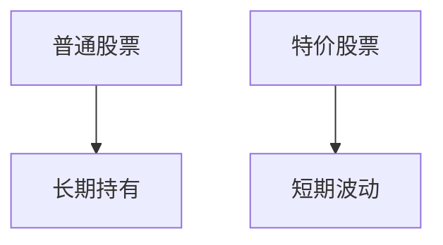
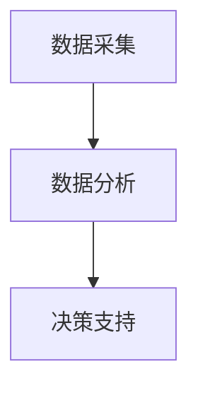

                 


```markdown
# 如何将特价股票策略应用于新兴市场基础设施债券投资

> 关键词：特价股票策略, 新兴市场, 基础设施债券, 投资策略, 数学模型, 系统架构

> 摘要：本文详细探讨了如何将特价股票策略应用于新兴市场中的基础设施债券投资。通过分析特价股票策略的核心原理、新兴市场的特点以及基础设施债券的属性，本文提出了将两者结合的具体方法和步骤。文章从背景介绍、核心概念、算法原理、系统架构、项目实战、风险管理等多个维度展开，结合数学模型、Mermaid图表和Python代码，全面解析了这一投资策略的实现过程。

---

# 第一部分: 特价股票策略与新兴市场基础设施债券投资背景

## 第1章: 特价股票策略的基本概念

### 1.1 特价股票的定义与特点

#### 1.1.1 特价股票的定义
特价股票是指价格低于其内在价值，且具有较大上涨潜力的股票。其核心在于“便宜”，即市场价格低于公允价值。

#### 1.1.2 特价股票的核心特点
| 特性 | 描述 |
|------|------|
| 低估值 | 市盈率、市净率等指标低于行业平均水平 |
| 高股息率 | 相对于市场价格，股息收益率较高 |
| 市场流动性 | 通常属于中小盘股，流动性相对较低 |
| 风险 | 投资者可能面临较高的市场波动风险 |

#### 1.1.3 特价股票与普通股票的区别
- 投资逻辑：普通股票基于成长性，特价股票基于估值修复。
- 投资期限：普通股票长期持有，特价股票短期波动较大。



---

## 第2章: 新兴市场的特点

### 2.1 新兴市场的定义与范围
新兴市场指经济发展水平较低但增长潜力较大的国家或地区，如中国、印度、巴西等。

### 2.2 新兴市场的经济特征
- 经济增长快，但波动性大。
- 市场流动性不足，价格波动剧烈。

### 2.3 新兴市场的投资机会与风险
- 机会：高增长行业的股票具有较大增值空间。
- 风险：政策风险、汇率风险、市场流动性风险。

---

## 第3章: 基础设施债券的基本概念

### 3.1 基础设施债券的定义
基础设施债券是指由政府或国有企业发行，用于基础设施建设的债券。

### 3.2 基础设施债券的发行主体
| 主体 | 描述 |
|------|------|
| 政府 | 主要发行主体 |
| 国有企业 | 受政府控制的大型企业 |

### 3.3 基础设施债券的收益与风险
- 收益：固定利息收入，风险较低。
- 风险：信用风险、流动性风险。

---

# 第二部分: 特价股票策略与新兴市场基础设施债券的结合

## 第4章: 特价股票策略在新兴市场的应用

### 4.1 特价股票策略在新兴市场的适用性

#### 4.1.1 新兴市场中特价股票的潜在收益
- 利用市场低估的机会，获取超额收益。

#### 4.1.2 新兴市场中特价股票的风险管理
- 分散投资，避免集中风险。

#### 4.1.3 新兴市场中特价股票的市场流动性分析
- 市场流动性不足可能导致买卖价差较大。

---

## 第5章: 基础设施债券的市场风险与特价股票策略的应对

### 5.1 基础设施债券的信用风险
- 发行人违约风险。

### 5.2 基础设施债券的流动性风险
- 市场波动导致债券价格下跌。

### 5.3 特价股票策略在风险管理中的应用
- 通过多元化的投资组合降低风险。

---

# 第三部分: 投资策略的数学模型与系统架构

## 第6章: 特价股票策略的核心原理

### 6.1 特价股票策略的数学模型
- 使用CAPM模型评估股票的公允价值。

$$
E(R_i) = R_f + \beta_i (R_m - R_f)
$$

### 6.2 特价股票的量化分析
- 使用Python代码实现量化分析。

```python
import pandas as pd
import matplotlib.pyplot as plt

# 示例数据
data = {'股票代码': ['A', 'B', 'C'],
        '股价': [10, 15, 20]}
df = pd.DataFrame(data)
plt.plot(df['股票代码'], df['股价'])
plt.show()
```

---

## 第7章: 系统分析与架构设计

### 7.1 系统功能设计
- 数据采集模块：收集股票和债券数据。
- 数据分析模块：评估股票的公允价值。
- 决策支持模块：生成投资建议。

### 7.2 系统架构设计


---

# 第四部分: 项目实战与案例分析

## 第8章: 项目实战

### 8.1 环境安装
- 安装Python、Pandas、Matplotlib等工具。

### 8.2 核心代码实现
- 数据清洗、分析和可视化。

### 8.3 实际案例分析
- 分析某新兴市场中的基础设施债券。

---

## 第9章: 投资风险管理

### 9.1 风险控制策略
- 分散投资、止损机制。

### 9.2 投资组合优化
- 使用数学模型优化投资组合。

---

# 第五部分: 未来展望与最佳实践

## 第10章: 未来展望

### 10.1 行业发展趋势
- 技术进步对投资策略的影响。

### 10.2 最佳实践
- 总结投资策略的有效性，提出改进建议。

---

# 附录

## 附录A: 数据来源与工具推荐

## 附录B: 术语表

## 附录C: 参考文献

---

作者：AI天才研究院 & 禅与计算机程序设计艺术
```

