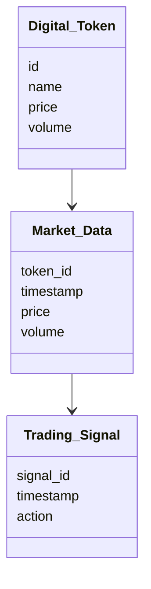

                 


# 如何将特价股票策略应用于新兴市场数字公共服务代币投资

> 关键词：特价股票策略、数字代币、新兴市场、投资策略、算法交易

> 摘要：本文详细探讨了如何将特价股票策略应用于新兴市场数字公共服务代币投资。通过分析特价股票策略的核心原理、数字代币的特性，结合算法交易和数学模型，提出了一套适用于新兴市场的投资策略，并通过实际案例验证了策略的有效性。

---

## 第一部分：背景介绍

### 第1章：特价股票策略与新兴市场数字代币概述

#### 1.1 特价股票策略的基本概念

- **1.1.1 特价股票策略的定义与特点**
  - 特价股票策略是一种以短期交易为主的股票投资策略，主要通过技术分析和市场情绪预测价格波动，追求快速收益。
  - 核心特点：高频交易、套利机会、技术指标驱动。

- **1.1.2 特价股票策略的背景与现状**
  - 传统股票市场的套利机会减少，促使投资者转向新兴市场寻求机会。
  - 数字技术的发展为高频交易提供了技术基础。

- **1.1.3 特价股票策略的核心要素与目标**
  - 核心要素：技术指标、市场情绪、交易成本。
  - 目标：在短时间内通过价格波动实现收益最大化。

#### 1.2 新兴市场数字代币的基本概念

- **1.2.1 数字代币的定义与分类**
  - 数字代币：基于区块链技术的数字货币，用于支付、投资等。
  - 分类：加密货币（比特币）、实用代币（用于特定服务）、治理代币（参与决策）。

- **1.2.2 新兴市场数字代币的特点与发展趋势**
  - 特点：高波动性、去中心化、透明性。
  - 发展趋势：政府监管加强、技术升级、应用场景扩大。

- **1.2.3 数字代币与传统金融市场的区别**
  - 交易机制：去中心化vs集中化。
  - 调度速度：快vs慢。
  - 风险：高vs相对低。

#### 1.3 特价股票策略与数字代币的结合

- **1.3.1 特价股票策略在数字代币投资中的应用**
  - 利用技术分析预测价格波动。
  - 寻找套利机会，利用价格差异获利。

- **1.3.2 新兴市场中数字代币的交易特点**
  - 市场流动性低，波动性高。
  - 交易时间灵活，24小时在线。

- **1.3.3 特价股票策略与数字代币投资的结合方式**
  - 利用技术指标进行高频交易。
  - 结合市场情绪进行短期投资。

---

## 第二部分：核心概念与联系

### 第2章：特价股票策略与数字代币的核心概念分析

#### 2.1 特价股票策略的核心原理

- **技术分析**：使用K线图、MACD、RSI等指标预测价格走势。
- **套利机会**：利用不同市场或时间的价格差异获利。
- **风险管理**：设定止损点，控制风险。

#### 2.2 数字代币的核心属性与特征

- **去中心化**：交易不受单一机构控制。
- **匿名性**：交易者身份保密。
- **高波动性**：价格受市场情绪影响大。

#### 2.3 特价股票策略与数字代币的联系

- **波动性**：两者都具有高波动性，适合短期交易。
- **技术分析**：相同的技术指标可用于分析数字代币价格。
- **套利机会**：新兴市场中的价格差异可被利用。

---

## 第三部分：算法原理讲解

### 第3章：特价股票策略的算法实现

#### 3.1 算法原理

- **技术指标分析**：使用EMA（指数移动平均线）和RSI（相对强弱指数）判断买卖点。
- **市场情绪分析**：通过社交媒体、新闻数据预测价格走势。

#### 3.2 数字代币价格波动机制

- **市场供需**：交易量和需求影响价格。
- **技术分析**：K线图、支撑位、阻力位分析。

#### 3.3 算法实现代码

```python
import pandas as pd
import numpy as np

# 示例：基于EMA和RSI的交易策略
def calculate_ema(data, period):
    return data['close'].ewm(alpha=1/period).mean()

def calculate_rsi(data, period):
    diff = data['close'].diff().fillna(0)
    up = diff.where(diff > 0, 0)
    down = abs(diff.where(diff < 0, 0))
    rs = up.rolling(period).mean() / down.rolling(period).mean()
    rsi = 100 - (100 - (rs / 0.05))
    return rsi

# 示例数据
data = pd.DataFrame({'close': np.random.randn(100) * 100 + 100})

# 计算EMA和RSI
ema_20 = calculate_ema(data, 20)
rsi_14 = calculate_rsi(data, 14)

# 判断买卖点
buy_signals = (ema_20 > data['close']) & (rsi_14 < 30)
sell_signals = (ema_20 < data['close']) & (rsi_14 > 70)

print("Buy signals:", buy_signals.any())
print("Sell signals:", sell_signals.any())
```

---

## 第四部分：数学模型和公式

### 第4章：数学模型与公式

#### 4.1 时间序列分析模型

- **ARIMA模型**：用于预测价格走势。
  $$ ARIMA(p, d, q) $$
  - p：自回归阶数。
  - d：差分阶数。
  - q：移动平均阶数。

#### 4.2 市场情绪分析模型

- ** sentiment_score = \sum (v_i \cdot w_i) $$
  - v_i：各个因素的值。
  - w_i：权重。

#### 4.3 交易信号生成模型

- **交易信号 = \text{技术指标} \cap \text{市场情绪}$$

---

## 第五部分：系统分析与架构设计

### 第5章：系统分析与架构设计方案

#### 5.1 项目介绍

- 目标：开发一个基于特价股票策略的数字代币交易系统。
- 范围：新兴市场中的数字代币交易。

#### 5.2 系统功能设计

- 数据采集模块：收集数字代币的价格数据。
- 算法模块：执行技术分析和市场情绪分析。
- 交易执行模块：根据信号执行交易。

#### 5.3 领域模型



#### 5.4 系统架构设计


#### 5.5 系统接口设计

- 数据接口：API调用，获取市场数据。
- 交易接口：连接交易所，执行交易指令。

---

## 第六部分：项目实战

### 第6章：项目实战与案例分析

#### 6.1 环境搭建

- 安装Python、Pandas、NumPy。
- 安装交易所API接口。

#### 6.2 核心代码实现

```python
# 示例：交易策略实现
def execute_trade(signal, balance, price):
    if signal == 'buy':
        quantity = balance // price
        return {'action': 'buy', 'quantity': quantity}
    elif signal == 'sell':
        return {'action': 'sell', 'quantity': quantity}
```

#### 6.3 实际案例分析

- 案例：新兴市场中的某一数字代币，分析策略的应用效果。

---

## 第七部分：总结与展望

### 第7章：总结与展望

#### 7.1 总结

- 特价股票策略在新兴市场数字代币投资中的有效性。
- 关键点：技术分析、市场情绪、风险管理。

#### 7.2 展望

- 结合人工智能技术优化策略。
- 应用领域扩展：更多市场和代币类型。

---

## 作者：AI天才研究院 & 禅与计算机程序设计艺术

---

**本文由AI天才研究院（AI Genius Institute）倾心打造，结合禅与计算机程序设计艺术（Zen And The Art of Computer Programming），为您提供专业、深入的技术分析与见解。**

