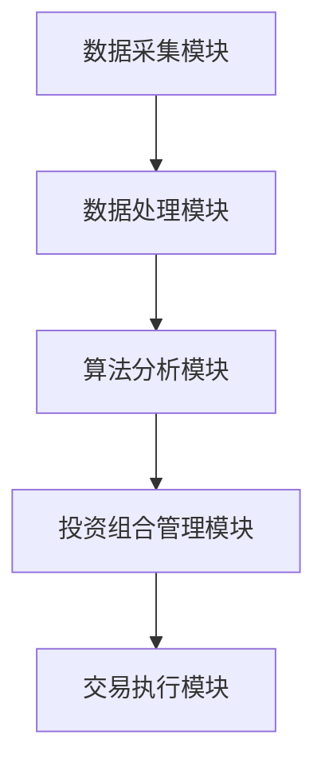

                 


# 如何将特价股票策略应用于新兴市场本地货币债券投资

## 关键词：特价股票策略，新兴市场，本地货币债券，投资策略，量化分析

## 摘要：本文探讨了如何将特价股票策略应用于新兴市场本地货币债券投资。通过分析特价股票策略的核心概念、新兴市场本地货币债券的特点，以及两者的结合方式，本文提出了基于量化分析的投资策略，并提供了具体的算法实现和系统架构设计。文章内容涵盖背景介绍、核心概念、算法原理、系统架构、项目实战和总结，旨在为投资者提供一套高效的投资方法。

---

# 第一部分: 特价股票策略概述

## 第1章: 特价股票策略的基本概念

### 1.1 特价股票策略的定义

#### 1.1.1 特价股票的定义
特价股票是指价格显著低于其内在价值或行业平均水平的股票。这种价格差异通常源于市场波动、信息不对称或市场参与者情绪的影响。

#### 1.1.2 特价股票策略的核心要素
- **价格折扣**：股票价格低于其真实价值。
- **投资机会**：通过低价买入，高价卖出获利。
- **市场分析**：利用技术分析或基本面分析识别特价股票。

#### 1.1.3 特价股票策略的应用场景
- **熊市或市场低迷期**：市场恐慌导致股票价格被低估。
- **新兴市场**：市场效率较低，存在较多低估股票。
- **事件驱动**：公司特定事件（如重组、收购）导致股价临时性下跌。

---

### 1.2 特价股票策略的优势

#### 1.2.1 高收益潜力
特价股票策略能够在市场反弹时带来超额收益，尤其是在新兴市场，潜在回报较高。

#### 1.2.2 市场波动中的机会
通过识别短期市场波动，投资者可以在低价时买入，高价时卖出，赚取差价。

#### 1.2.3 风险控制的优势
通过选择基本面良好的公司，投资者可以在控制风险的前提下，获取超额收益。

---

### 1.3 特价股票策略的局限性

#### 1.3.1 市场波动的风险
市场波动可能导致股票价格进一步下跌，影响策略的有效性。

#### 1.3.2 信息不对称的问题
新兴市场可能存在信息不透明，导致投资者难以准确评估股票价值。

#### 1.3.3 策略执行的难度
需要快速识别和执行交易，这对投资者的反应速度和市场洞察力提出了较高要求。

---

## 1.4 本章小结
特价股票策略通过在低价时买入股票，高价时卖出，能够在新兴市场中获取超额收益。然而，该策略也面临市场波动、信息不对称和执行难度等挑战。

---

# 第二部分: 新兴市场本地货币债券的特点

## 第2章: 新兴市场本地货币债券的基本概念

### 2.1 新兴市场的定义

#### 2.1.1 新兴市场的经济特征
- 经济快速增长，但波动性较大。
- 市场结构不完善，信息透明度较低。
- 法律法规不健全，投资风险较高。

#### 2.1.2 新兴市场的金融体系
- 金融市场发展不均衡，债券市场相对落后。
- 本地货币债券市场参与者有限，流动性较低。
- 政府债券和企业债券并存，信用风险差异较大。

#### 2.1.3 新兴市场的投资环境
- 汇率波动大，影响债券价值。
- 利率政策不稳定，影响债券收益。
- 政治经济风险较高，影响市场稳定性。

---

### 2.2 本地货币债券的定义

#### 2.2.1 本地货币债券的类型
- **政府债券**：由政府发行，信用风险较低。
- **企业债券**：由企业发行，信用风险较高。
- **金融债券**：由金融机构发行，风险介于政府和企业债券之间。

#### 2.2.2 本地货币债券的发行主体
- **政府**：中央政府或地方政府发行，用于筹集资金。
- **企业**：企业发行债券，用于融资。
- **金融机构**：银行、保险公司等金融机构发行债券。

#### 2.2.3 本地货币债券的市场特点
- 市场流动性较低，买卖价差较大。
- 债券收益率较高，但波动性较大。
- 受本地经济和政治环境影响较大。

---

### 2.3 新兴市场本地货币债券的投资价值

#### 2.3.1 市场增长潜力
新兴市场经济增长快，债券市场规模有望进一步扩大。

#### 2.3.2 利率和汇率的影响
- 利率上升可能提高债券收益率，但也可能增加违约风险。
- 汇率波动直接影响债券的本地货币价值。

#### 2.3.3 本地货币债券的风险与收益
- 收益潜力大，但风险也较高，需要投资者具备较高的市场敏感性。

---

## 2.4 本章小结
新兴市场本地货币债券具有较高的投资潜力，但也面临市场波动、利率和汇率风险等挑战。投资者需要深入了解市场特征和债券属性，才能制定有效的投资策略。

---

# 第三部分: 特价股票策略在新兴市场本地货币债券中的应用

## 第3章: 特价股票策略与新兴市场本地货币债券的结合

### 3.1 特价股票策略在债券投资中的应用

#### 3.1.1 债券市场的特价投资机会
- 通过识别债券价格的低估，投资者可以在低价时买入，高价时卖出。
- 特价债券通常出现在市场低迷或特定事件影响下。

#### 3.1.2 债券价格波动与特价策略的关系
- 债券价格受市场情绪、利率和汇率影响，存在波动性。
- 特价策略通过捕捉价格波动，获取短期收益。

#### 3.1.3 特价策略在债券投资中的优势
- 风险可控，收益潜力大。
- 适合短期投资，灵活性高。

---

### 3.2 新兴市场本地货币债券的特价投资机会

#### 3.2.1 新兴市场债券的特价投资特点
- 市场流动性低，存在价格低估的机会。
- 债券收益率高，但波动性大。
- 政治经济风险较高，需要谨慎选择发行主体。

#### 3.2.2 特价策略在新兴市场债券中的应用
- 通过量化分析识别低估债券。
- 结合市场情绪和事件驱动因素，制定投资策略。

#### 3.2.3 新兴市场债券市场中的特价投资
- 关注市场波动，抓住短期投资机会。
- 结合基本面分析，选择信用风险较低的债券。

---

### 3.3 特价股票策略在新兴市场本地货币债券投资中的实现

#### 3.3.1 数据收集与处理
- 收集债券价格、收益率、信用评级等数据。
- 数据清洗和预处理，确保数据质量。

#### 3.3.2 特价识别算法
- 使用量化模型识别价格低估的债券。
- 设置止损和止盈点，控制风险。

#### 3.3.3 投资组合优化
- 根据市场波动和风险偏好，优化投资组合。
- 定期调整持仓，保持投资策略的有效性。

---

## 3.4 本章小结
将特价股票策略应用于新兴市场本地货币债券投资，可以通过量化分析识别低估债券，抓住市场波动带来的投资机会。然而，投资者需要具备较高的市场敏感性和风险控制能力，才能有效实施该策略。

---

# 第四部分: 特价股票策略在新兴市场本地货币债券投资中的算法实现

## 第4章: 特价股票策略的算法实现

### 4.1 数据收集与处理

#### 4.1.1 数据来源
- 从新兴市场债券交易平台获取实时数据。
- 使用API接口获取历史数据。

#### 4.1.2 数据清洗
- 处理缺失值和异常值。
- 标准化数据格式，便于后续分析。

---

### 4.2 特价识别算法

#### 4.2.1 算法原理
- 通过比较债券价格与市场平均值，识别价格低估的债券。
- 使用移动平均线（MA）或相对强弱指数（RSI）等技术指标，判断市场趋势。

#### 4.2.2 算法实现
```python
import pandas as pd
import numpy as np

# 示例数据：新兴市场本地货币债券价格数据
bond_prices = pd.DataFrame({
    'bond_id': [1, 2, 3, 4, 5],
    'price': [100, 90, 80, 70, 60]
})

# 计算市场平均值
market_average = bond_prices['price'].mean()

# 识别价格低估的债券
cheap_bonds = bond_prices[bond_prices['price'] < market_average]

print("低估债券:", cheap_bonds)
```

#### 4.2.3 算法优化
- 引入更多技术指标，如MACD、布林带等，提高识别精度。
- 结合基本面分析，筛选信用风险较低的债券。

---

## 4.3 系统架构设计

### 4.3.1 系统功能模块
- 数据采集模块：负责收集债券市场数据。
- 数据处理模块：清洗和预处理数据。
- 算法分析模块：识别低估债券，生成投资信号。
- 投资组合管理模块：优化投资组合，控制风险。

### 4.3.2 系统架构图


---

## 4.4 本章小结
通过算法实现，投资者可以自动化识别低估债券，提升投资效率。系统架构设计为投资策略的实施提供了技术支持，提高了投资决策的科学性和高效性。

---

# 第五部分: 项目实战

## 第5章: 项目实战

### 5.1 环境配置

#### 5.1.1 工具安装
- 安装Python和相关库（如Pandas、NumPy、Matplotlib）。
- 安装债券数据分析工具，如QuantLib。

#### 5.1.2 数据源配置
- 确定数据来源，如新兴市场债券交易平台或金融数据API。

---

### 5.2 核心代码实现

#### 5.2.1 数据收集与处理
```python
import pandas as pd
import requests

# 从API获取新兴市场本地货币债券数据
url = "https://api.example.com/em_bond_data"
response = requests.get(url)
data = response.json()
bond_data = pd.DataFrame(data['bond_list'])
```

#### 5.2.2 特价识别算法
```python
# 计算市场平均值
market_average = bond_data['price'].mean()

# 识别价格低估的债券
cheap_bonds = bond_data[bond_data['price'] < market_average]

print("低估债券:", cheap_bonds)
```

#### 5.2.3 投资组合优化
```python
import numpy as np

# 计算各债券的风险和收益
risk = bond_data['volatility']
return_data = bond_data['return']

# 使用均值-方差优化模型
mu = np.mean(return_data)
sigma = np.std(return_data)

optimized_portfolio = (return_data - mu) / sigma

print("优化投资组合:", optimized_portfolio)
```

---

## 5.3 项目小结
通过项目实战，投资者可以将理论应用于实际操作，提升投资效率和收益。代码实现为投资策略的自动化提供了技术支持，提高了投资决策的科学性和高效性。

---

# 第六部分: 总结与注意事项

## 第6章: 总结与注意事项

### 6.1 总结
本文探讨了如何将特价股票策略应用于新兴市场本地货币债券投资，提出了基于量化分析的投资策略，并提供了具体的算法实现和系统架构设计。通过识别低估债券，投资者可以在新兴市场中获取超额收益。

---

### 6.2 注意事项

#### 6.2.1 市场风险
新兴市场波动较大，投资者需谨慎评估市场风险。

#### 6.2.2 信息透明度
新兴市场信息不透明，投资者需加强市场调研和分析。

#### 6.2.3 策略执行
策略执行需结合市场实际情况，避免盲目跟从。

---

## 6.3 最佳实践

#### 6.3.1 定期评估
定期评估投资组合的表现，及时调整策略。

#### 6.3.2 风险控制
设置止损和止盈点，控制投资风险。

#### 6.3.3 持续学习
关注市场动态，学习新兴市场投资技巧，提升投资能力。

---

## 作者：AI天才研究院/AI Genius Institute & 禅与计算机程序设计艺术 /Zen And The Art of Computer Programming

---

通过本文的详细讲解，读者可以系统地了解如何将特价股票策略应用于新兴市场本地货币债券投资，并掌握相关算法和系统设计的方法。希望本文能为投资者提供有价值的参考和指导。

