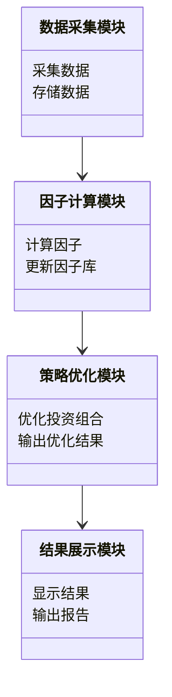
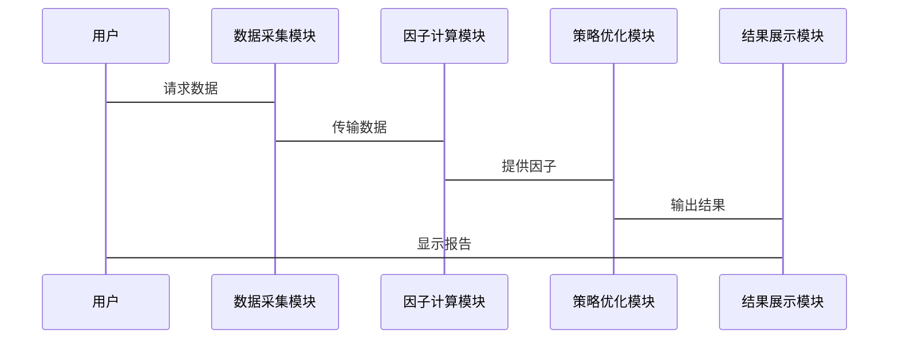
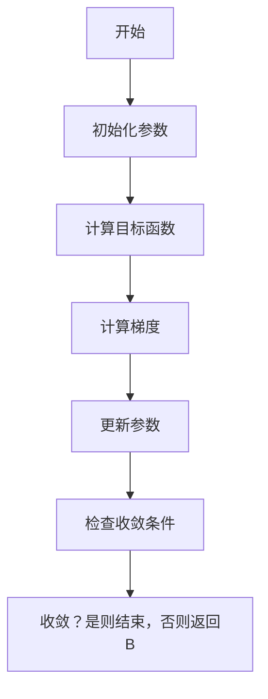

                 


# 如何将特价股票策略融入因子投资

## 关键词：特价股票策略、因子投资、量化交易、投资组合优化、数学模型

## 摘要：本文详细探讨了如何将特价股票策略与因子投资相结合，构建高效的量化投资模型。通过分析特价股票策略的核心要素，结合因子投资的数学模型和算法，提出了具体的实现方法和系统设计，最后通过项目实战验证了策略的有效性。

---

# 第1章：特价股票策略概述

## 1.1 特价股票策略的定义与特点

### 1.1.1 特价股票的定义

特价股票是指价格低于其内在价值，具有较大上涨潜力的股票。这些股票通常在市场低迷或公司遇到短期困难时被低估，为投资者提供了以较低价格买入优质资产的机会。

### 1.1.2 特价股票策略的核心特征

- **低估值**：股票价格低于其内在价值，通常表现为市盈率、市净率等估值指标显著低于行业平均水平。
- **高潜力**：公司基本面良好，具有较高的成长潜力，能够在市场回升时实现快速反弹。
- **短期性**：特价股票策略通常基于短期市场波动，寻找暂时被市场低估的机会。

### 1.1.3 特价股票策略的分类

- **绝对价值策略**：基于对公司内在价值的评估，寻找价格低于价值的股票。
- **相对价值策略**：比较不同股票或资产的相对估值，寻找价格偏离合理估值的股票。
- **事件驱动策略**：利用公司特定事件（如并购、重组）带来的短期价格波动，寻找廉价买入机会。

## 1.2 因子投资的基本概念

### 1.2.1 因子投资的定义

因子投资是一种通过识别和投资于特定风险因素（因子）来构建投资组合的方法。这些因子通常代表某种系统性风险或收益来源，如市值、价值、动量等。

### 1.2.2 因子投资的核心要素

- **因子选择**：选择能够解释股票收益的因子，如市值、价值、动量、质量等。
- **因子暴露**：通过投资组合的构建，使组合在特定因子上的暴露最大化。
- **因子权重**：根据因子的风险和收益特征，确定投资组合中各因子的权重。

### 1.2.3 因子投资的特点

- **系统性**：基于数学模型和统计分析，而非主观判断。
- **可量化**：通过量化方法识别因子并构建投资组合。
- **分散化**：通过多因子组合分散单一因子的风险。

---

# 第2章：因子投资的数学模型与算法原理

## 2.1 因子回归模型

### 2.1.1 因子回归模型的定义

因子回归模型是一种通过回归分析来解释股票收益的模型，假设股票收益可以由一组因子线性组合来解释。

$$ R_i = \beta_0 + \beta_1 F_1 + \beta_2 F_2 + \dots + \beta_n F_n + \epsilon $$

其中：
- $R_i$：股票i的收益
- $F_j$：因子j
- $\beta_j$：因子j的回归系数
- $\epsilon$：误差项

### 2.1.2 因子回归模型的实现步骤

1. **数据收集**：收集股票的历史收益数据和因子数据（如市值、市盈率等）。
2. **因子选择**：通过统计分析（如相关性分析、因子筛选）选择相关因子。
3. **回归分析**：使用回归模型确定各因子的回归系数。
4. **模型验证**：通过回测和风险调整验证模型的有效性。

### 2.1.3 因子回归模型的优缺点

- **优点**：
  - 能够量化因子对收益的贡献。
  - 可以通过组合因子降低投资风险。
- **缺点**：
  - 模型假设可能存在偏差（如线性关系假设）。
  - 回归系数可能随市场变化而变化。

## 2.2 特价股票策略的优化算法

### 2.2.1 特价股票策略的优化目标

- **收益最大化**：在风险可控的前提下，最大化投资组合的收益。
- **风险最小化**：通过分散投资降低非系统性风险。
- **交易成本最小化**：优化交易频率和规模，降低交易成本。

### 2.2.2 常用的优化算法

1. **均值-方差优化**：
   - 目标：最小化投资组合的方差，同时达到目标收益。
   - 方法：使用马科维茨均值-方差模型，通过求解优化问题确定各资产的权重。

2. **黑箱优化**：
   - 目标：最大化投资组合的夏普比率。
   - 方法：使用遗传算法、模拟退火等全局优化算法，在多因子约束下寻找最优解。

3. **约束优化**：
   - 目标：在满足流动性、交易成本等约束条件下，优化投资组合。
   - 方法：引入线性约束，使用二次规划等优化方法。

### 2.2.3 优化算法的实现步骤

1. **定义目标函数**：确定优化目标（如夏普比率最大化）。
2. **设定约束条件**：包括权重约束、交易成本约束等。
3. **选择优化算法**：根据问题特点选择合适的优化算法。
4. **求解优化问题**：使用优化工具或编程实现，得到最优权重。
5. **验证优化结果**：通过回测和风险分析验证优化效果。

---

# 第3章：系统架构与设计

## 3.1 系统功能模块划分

### 3.1.1 数据采集模块

- **功能**：从数据源（如数据库、API）获取股票价格、财务数据、因子数据等。
- **输入**：股票代码、时间范围。
- **输出**：结构化数据，如收盘价、市盈率、市净率等。

### 3.1.2 因子计算模块

- **功能**：根据历史数据计算各因子值。
- **输入**：原始数据，如收盘价、成交量、财务数据。
- **输出**：因子数据，如市值、价值因子、动量因子。

### 3.1.3 策略优化模块

- **功能**：根据因子数据和约束条件，优化投资组合。
- **输入**：因子数据、优化目标、约束条件。
- **输出**：最优权重、优化结果报告。

### 3.1.4 结果展示模块

- **功能**：展示优化结果，包括收益、风险指标、交易信号等。
- **输入**：优化结果数据。
- **输出**：可视化报告，如收益曲线、风险-收益图。

## 3.2 系统架构图



## 3.3 系统交互图



---

# 第4章：项目实战与实现

## 4.1 环境安装与配置

### 4.1.1 安装Python环境

- 安装Python 3.8或更高版本。
- 安装必要的库：`pandas`, `numpy`, `scipy`, `plotly`, `sklearn`.

### 4.1.2 数据源配置

- 数据来源：Yahoo Finance API或本地数据库。
- 数据格式：CSV或JSON。

## 4.2 数据采集与处理

### 4.2.1 数据采集代码

```python
import pandas as pd
from pandas_datareader import DataReader

# 采集数据
start_date = '2020-01-01'
end_date = '2023-12-31'
tickers = ['AAPL', 'MSFT', 'GOOGL']

# 从Yahoo Finance获取数据
data = DataReader(tickers, 'yahoo', start=start_date, end=end_date)
data.to_csv('stock_data.csv')
```

### 4.2.2 因子计算代码

```python
import pandas as pd

# 读取数据
data = pd.read_csv('stock_data.csv')

# 计算市值因子（Market Cap）
data['Market Cap'] = data['Close'] * data['Volume']

# 计算价值因子（P/E比率）
data['PE Ratio'] = data['Close'] / data['EPS']

# 计算动量因子（12月动量）
data['Momentum'] = data['Close'].pct_change(12).cumsum()
```

## 4.3 策略优化与实现

### 4.3.1 优化目标：最大化夏普比率

```python
import numpy as np
from scipy.optimize import minimize

# 定义目标函数：夏普比率最大化
def objective(weights, returns, cov_matrix):
    portfolio_return = np.dot(weights.T, returns)
    portfolio_risk = np.sqrt(np.dot(weights.T, np.dot(cov_matrix, weights)))
    return -portfolio_return / portfolio_risk

# 约束条件
def constraint(weights):
    return np.sum(weights) - 1

# 边界条件
bounds = [(0, 1) for _ in range(len(weights))]

# 求解优化问题
result = minimize(objective, initial_guess, args=(returns, cov_matrix), constraints={'type': 'eq', 'fun': constraint}, bounds=bounds)
```

### 4.3.2 优化结果展示

```python
import plotly.express as px

# 生成收益曲线
returns = np.random.normal(0.001, 0.02, 1000)
cumulative_returns = np.cumsum(returns)

fig = px.line(cumulative_returns, title='投资组合收益曲线')
fig.show()
```

---

# 第5章：最佳实践与总结

## 5.1 实践中的注意事项

### 5.1.1 数据质量的重要性

- 确保数据的完整性和准确性。
- 处理缺失值和异常值。

### 5.1.2 策略优化的常见问题

- **过拟合**：避免过度拟合历史数据，确保模型的泛化能力。
- **交易成本**：考虑实际交易中的佣金、滑点等成本。
- **流动性风险**：确保投资组合中的资产具有足够的流动性。

## 5.2 项目总结

### 5.2.1 项目的主要收获

- 掌握了如何将特价股票策略与因子投资相结合的方法。
- 学习了因子回归模型和优化算法的实现。

### 5.2.2 项目中的经验教训

- 数据预处理和清洗是关键步骤，直接影响模型效果。
- 优化算法的选择需要根据具体问题和数据特点来决定。

### 5.2.3 未来改进的方向

- 引入更多因子，如情绪因子、技术因子等。
- 增加回测和风险分析模块，评估策略的稳健性。
- 考虑动态再平衡策略，适应市场变化。

## 5.3 拓展阅读

### 5.3.1 推荐的书籍与资源

- 《因子投资入门》
- 《量化交易实战》
- 《投资学原理》

### 5.3.2 进一步学习的方向

- 学习高级因子模型（如多因子模型、风格模型）。
- 研究机器学习在因子投资中的应用。
- 探索高频交易策略。

---

# 附录：数学公式与算法流程图

## 附录A：因子回归模型的数学公式

$$ Y = X\beta + \epsilon $$

## 附录B：优化算法流程图



## 附录C：系统架构图


---

# 作者：AI天才研究院/AI Genius Institute & 禅与计算机程序设计艺术/Zen And The Art of Computer Programming

---

通过本文的详细讲解和系统分析，读者可以掌握如何将特价股票策略融入因子投资，并在实际项目中应用这些方法。希望本文能为量化投资者和程序员提供有价值的参考和启示。

