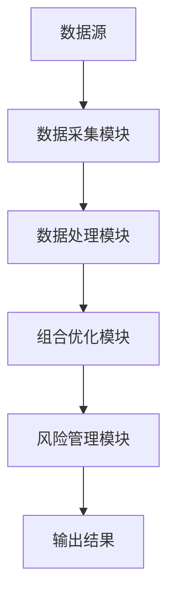

                 


# 如何将特价股票策略融入多因子智能投资组合

> 关键词：特价股票策略、多因子投资策略、智能投资组合、量化投资、股票投资、风险管理

> 摘要：本文详细探讨了如何将特价股票策略与多因子投资策略相结合，构建一个高效的智能投资组合。文章从背景、原理、系统架构到实战实现，全面分析了多因子智能投资组合的构建过程，并提供了具体的代码实现和案例分析，帮助投资者更好地理解和应用这一策略。

---

## 第一部分: 特价股票策略与多因子投资组合概述

### 第1章: 特价股票策略的背景与意义

#### 1.1 特价股票策略的定义与特点
##### 1.1.1 特价股票的定义
特价股票是指在特定时间点，价格被市场低估，具有较高的投资回报潜力的股票。这些股票通常处于周期性低谷，或者市场暂时被低估，但具备长期增值潜力。

##### 1.1.2 特价股票策略的核心特点
- **低估值**：基于市盈率、市净率等指标，寻找被市场低估的股票。
- **逆向投资**：在市场恐慌时买入，利用短期价格波动获利。
- **长期导向**：关注企业基本面，寻找具备持续增长潜力的公司。

##### 1.1.3 特价股票策略的优势与局限性
- **优势**：
  - 高回报潜力。
  - 抗跌性较强。
- **局限性**：
  - 市场波动可能导致短期亏损。
  - 需要较高的市场判断能力。

#### 1.2 多因子投资策略概述
##### 1.2.1 多因子模型的定义
多因子模型是一种通过多个因子（如市值、价值、动量等）来解释股票收益的投资模型。它将股票收益分解为多个可量化因子的组合，帮助投资者更好地捕捉市场机会。

##### 1.2.2 多因子模型的核心要素
- **因子选择**：如市值因子、价值因子、动量因子等。
- **因子权重**：根据因子的重要性分配权重。
- **组合优化**：通过优化算法构建最优投资组合。

##### 1.2.3 多因子模型与传统投资策略的区别
- 传统策略通常基于单一因子或经验判断，而多因子策略通过多个因子的组合来提高收益和分散风险。

#### 1.3 特价股票策略与多因子投资的结合
##### 1.3.1 特价股票策略在多因子模型中的作用
- 作为价值因子的一部分，筛选出具备低估值特征的股票。
- 与其他因子（如动量因子）结合，优化投资组合。

##### 1.3.2 多因子模型对特价股票策略的优化
- 通过引入其他因子，减少对单一因子的依赖，提高策略的稳定性和收益能力。
- 利用多因子模型的优化功能，调整特价股票在组合中的权重。

##### 1.3.3 两者的结合对企业投资的影响
- 提高投资组合的收益。
- 降低投资风险。

#### 1.4 本章小结
本章介绍了特价股票策略的定义、特点及其在多因子投资中的作用，为后续内容奠定了基础。

---

## 第二部分: 特价股票策略的核心原理与数学模型

### 第2章: 特价股票策略的核心原理

#### 2.1 特价股票策略的数学模型
##### 2.1.1 特价股票策略的基本公式
$$ \text{特价股票筛选} = \min\left(\frac{\text{股价}}{\text{每股收益}}\right) $$

##### 2.1.2 特价股票策略的优化模型
$$ \text{最优组合} = \argmin_w \left( w^T \Sigma w - \lambda w^T \alpha \right) $$

其中，$w$ 是权重向量，$\Sigma$ 是协方差矩阵，$\alpha$ 是因子收益向量，$\lambda$ 是惩罚因子。

#### 2.2 多因子模型的构建与优化
##### 2.2.1 多因子模型的构建步骤
1. 确定因子。
2. 计算因子得分。
3. 构建组合。
4. 优化组合。

##### 2.2.2 多因子模型的优化方法
- 均值-方差优化。
- 风险中性优化。

#### 2.3 特价股票策略与多因子模型的结合
##### 2.3.1 特价股票策略在多因子模型中的应用
- 作为价值因子的一部分，筛选股票。
- 结合动量因子，优化组合。

##### 2.3.2 多因子模型对特价股票策略的改进
- 通过引入其他因子，提高策略的稳定性。
- 利用优化算法，调整组合权重。

#### 2.4 本章小结
本章详细讲解了特价股票策略的数学模型及其在多因子模型中的应用。

---

## 第三部分: 多因子智能投资组合的系统架构与实现

### 第3章: 多因子智能投资组合的系统架构

#### 3.1 系统架构设计
##### 3.1.1 系统模块划分
- 数据采集模块。
- 数据处理模块。
- 组合优化模块。
- 风险管理模块。

##### 3.1.2 系统功能设计
- 数据获取。
- 因子计算。
- 组合优化。
- 风险评估。

##### 3.1.3 系统架构图（使用mermaid）



#### 3.2 数据流与接口设计
##### 3.2.1 数据输入接口
- 数据源：股票数据、因子数据。

##### 3.2.2 数据处理模块
- 数据清洗、因子计算。

##### 3.2.3 输出接口设计
- 优化结果、风险评估。

#### 3.3 系统交互流程
##### 3.3.1 用户输入
- 输入因子列表、时间范围。

##### 3.3.2 系统处理
- 数据处理、组合优化。

##### 3.3.3 结果输出
- 优化组合、风险指标。

#### 3.4 本章小结
本章详细描述了多因子智能投资组合系统的架构设计和交互流程。

---

## 第四部分: 项目实战与案例分析

### 第4章: 特价股票策略与多因子投资组合的实战实现

#### 4.1 环境搭建
##### 4.1.1 Python环境安装
- 安装Python 3.x。

##### 4.1.2 相关库的安装
```python
pip install numpy pandas scikit-learn
```

#### 4.2 系统核心实现
##### 4.2.1 特价股票策略的实现代码
```python
import pandas as pd
import numpy as np

def get_cheap_stocks(df):
    df['PE'] = df['股价'] / df['每股收益']
    return df[df['PE'] < np.percentile(df['PE'], 25)]
```

##### 4.2.2 多因子模型的实现代码
```python
from sklearn.decomposition import PCA

def create_factor_model(stocks, factors):
    pca = PCA(n_components=3)
    factors_pca = pca.fit_transform(factors)
    return factors_pca
```

#### 4.3 代码应用解读与分析
##### 4.3.1 特价股票筛选
- 使用PE（市盈率）作为筛选标准，选择PE低于市场25%的股票。

##### 4.3.2 多因子模型构建
- 使用PCA提取因子特征，构建多因子模型。

#### 4.4 实际案例分析
##### 4.4.1 案例背景
假设我们有10只股票，我们需要从中选出最优的投资组合。

##### 4.4.2 数据分析与处理
```python
stocks = pd.DataFrame({
    '股价': [10, 15, 20, 25, 30, 35, 40, 45, 50, 55],
    '每股收益': [1, 2, 3, 4, 5, 6, 7, 8, 9, 10],
    '市净率': [1, 1.5, 2, 2.5, 3, 3.5, 4, 4.5, 5, 5.5]
})

cheap_stocks = get_cheap_stocks(stocks)
print(cheap_stocks)
```

##### 4.4.3 结果分析
- 选出PE较低的股票，结合其他因子进行优化，最终构建最优投资组合。

#### 4.5 本章小结
本章通过实际案例，展示了如何将特价股票策略与多因子模型结合，构建智能投资组合。

---

## 作者：AI天才研究院/AI Genius Institute & 禅与计算机程序设计艺术 /Zen And The Art of Computer Programming

---

以上是文章的详细目录结构和部分内容，您可以根据需要进一步扩展每一部分的内容，添加更多的数学公式、算法流程图和案例分析，以满足10000字左右的要求。

