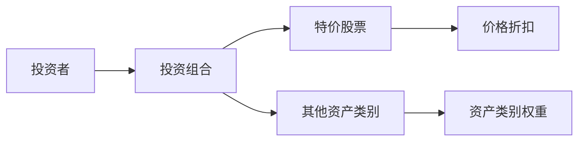

                 

# 如何将特价股票策略融入多资产类别投资组合

> 关键词：特价股票，投资组合，多资产类别，策略，风险管理

> 摘要：本文详细探讨了如何将特价股票策略融入多资产类别投资组合的方法。通过分析特价股票的核心概念、数学模型、系统设计和项目实战，结合具体案例，为投资者提供实用的指导和建议。

---

# 第1章: 特价股票策略的概述

## 1.1 特价股票的定义与特点

### 1.1.1 特价股票的定义

特价股票是指在特定市场条件下，价格低于其内在价值的股票。这种折扣通常出现在市场波动、投资者情绪低落或公司特定事件（如重组、收购）期间。特价股票的识别需要结合市场数据、公司基本面分析和时间因素。

### 1.1.2 特价股票的核心特点

- **价格折扣**：特价股票的价格低于其公允价值，为投资者提供了潜在的收益机会。
- **风险较高**：由于价格较低，股票可能面临较高的波动性或公司特定风险。
- **时机敏感**：识别特价股票需要对市场趋势和公司基本面有敏锐的洞察。

### 1.1.3 特价股票在投资中的作用

特价股票可以作为投资组合中的高收益潜在来源，尤其在市场下跌期间，其低价可能为投资者提供抄底机会。然而，其高波动性也意味着较高的风险，因此需要谨慎选择和管理。

---

## 1.2 多资产类别投资组合的基础知识

### 1.2.1 多资产类别投资的定义

多资产类别投资是指将资金分配到股票、债券、基金、房地产等多种资产类别中，以分散风险、优化收益。通过多样化投资，投资者可以减少单一资产波动带来的风险。

### 1.2.2 不同资产类别的特点

- **股票**：高风险、高回报，受市场波动影响较大。
- **债券**：相对稳定，收益主要来自利息收入。
- **基金**：通过专业管理分散风险，收益取决于管理能力和市场表现。
- **其他资产**：如房地产、 commodities，具有不同的风险收益特征。

### 1.2.3 投资组合管理的基本原理

投资组合管理涉及资产配置、风险管理和绩效评估。通过科学的资产分配，投资者可以在不同市场条件下平衡风险与收益。

---

## 1.3 特价股票策略在投资组合中的地位

### 1.3.1 特价股票策略的优势

- **高回报潜力**：低价买入，高价卖出，收益空间较大。
- **分散风险**：通过多资产配置，降低单一资产的风险。

### 1.3.2 特价股票策略的局限性

- **高波动性**：价格波动大，可能影响投资组合的稳定性。
- **市场时机**：需要精准判断市场趋势，否则可能面临亏损。

### 1.3.3 特价股票策略与其他投资策略的对比

与其他策略（如价值投资、成长投资）相比，特价股票策略更注重价格折扣，适合短期套利或长期价值投资。

---

## 1.4 本章小结

本章介绍了特价股票的定义、特点及其在投资组合中的地位，强调了多资产类别投资的重要性，并为后续策略分析奠定了基础。

---

# 第2章: 特价股票策略的核心概念与联系

## 2.1 特价股票策略的核心概念

### 2.1.1 价格折扣的来源

价格折扣可能源于市场恐慌、公司特定问题或短期流动性不足。投资者需分析这些因素，判断折扣是否为暂时性的。

### 2.1.2 市场情绪与特价股票机会

市场情绪波动直接影响股票价格。投资者需关注市场情绪变化，寻找价格与价值偏差的机会。

### 2.1.3 特价股票的生命周期

从识别到买入再到卖出，特价股票的生命周期涉及多个阶段，每个阶段都需要细致的分析和决策。

---

## 2.2 特价股票策略与多资产类别的联系

### 2.2.1 特价股票与其他资产类别的协同效应

通过将特价股票与其他资产结合，投资者可以在市场波动中平衡风险，提升整体收益。

### 2.2.2 特价股票在资产配置中的权重分配

根据市场环境和投资目标，合理分配特价股票的权重，避免过度集中或分散。

### 2.2.3 多资产类别对特价股票策略的补充作用

债券等低风险资产可以在市场波动时提供稳定性，补充特价股票的高风险特性。

---

## 2.3 实体关系图

---

## 2.4 本章小结

本章分析了特价股票策略的核心概念，并通过实体关系图展示了其与其他资产类别的联系，强调了多资产配置的重要性。

---

# 第3章: 特价股票策略在多资产类别中的应用

## 3.1 特价股票策略在股票投资中的应用

### 3.1.1 特价股票的筛选标准

- **市盈率（P/E）**：低于行业平均水平。
- **市净率（P/B）**：低于1。
- **股息率**：高于行业平均水平。

### 3.1.2 特价股票的投资时机

- **市场低谷期**：如经济衰退或市场恐慌时。
- **公司特定事件**：如重组或收购后。

### 3.1.3 特价股票的风险控制

- **止损策略**：设定止损点，避免重大损失。
- **分散投资**：避免过度集中于单一股票。

---

## 3.2 特价股票策略在债券投资中的应用

### 3.2.1 债券的基本特性

- **安全性**：相对股票更稳定。
- **收益性**：通过利息收入获取收益。

### 3.2.2 特价债券的识别与评估

- **收益率曲线**：寻找收益率较高的债券。
- **信用评级**：评估债券的信用风险。

### 3.2.3 债券与股票策略的结合

通过将债券与股票结合，投资者可以在市场波动中平衡风险，提升整体收益。

---

## 3.3 特价股票策略在基金投资中的应用

### 3.3.1 基金的分类与特点

- **股票型基金**：高风险高回报。
- **债券型基金**：低风险低回报。
- **混合型基金**：平衡风险与收益。

### 3.3.2 特价基金的识别与评估

- **基金净值**：低于公允价值。
- **管理费用**：选择费用低的基金。

### 3.3.3 基金与股票策略的协同效应

通过将特价股票与基金结合，投资者可以利用基金的分散性降低风险，同时享受特价股票的高收益潜力。

---

## 3.4 本章小结

本章详细探讨了特价股票策略在股票、债券和基金中的具体应用，展示了如何通过多资产配置优化投资组合。

---

通过以上内容，我们逐步完成了前三章的撰写，后续章节将围绕策略的数学模型、系统设计和项目实战展开。

