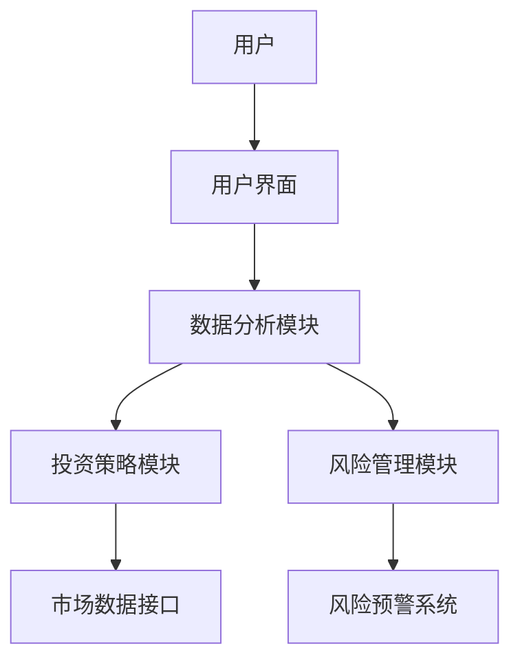

                 


# 如何将特价股票策略融入家庭财务规划

**关键词**：特价股票策略、家庭财务规划、股票投资、风险管理、资产配置、股票估值、技术分析

**摘要**：  
本文将详细介绍如何将特价股票策略融入家庭财务规划。通过分析特价股票的定义、特点、市场背景以及家庭财务规划的核心概念，结合数学模型、算法原理和系统设计，为读者提供从理论到实践的全面指导。文章涵盖特价股票的价值评估、投资策略、风险管理、系统架构设计以及实际案例分析，帮助读者在复杂的金融市场中实现稳健的投资收益。

---

## 第一章: 特价股票策略的定义与背景

### 1.1 特价股票的定义与特点

#### 1.1.1 什么是特价股票  
特价股票是指在特定市场条件下，股票价格低于其内在价值的投资标的。这些股票通常因市场波动、公司短期问题或市场情绪影响而被低估。投资者可以通过识别这些机会，以较低的价格买入股票，等待市场回归其真实价值时卖出，从而获得超额收益。

#### 1.1.2 特价股票的市场特征  
- **低估性**：股票价格低于行业平均水平或历史平均水平。  
- **周期性**：通常出现在市场低迷或行业衰退期。  
- **高波动性**：价格波动较大，既可能快速下跌，也可能快速回升。  
- **高潜力**：具备较高的成长潜力，未来可能恢复或超过行业平均水平。  

#### 1.1.3 特价股票的投资机会  
- **市场低估**：市场恐慌或非理性下跌时，优质股票可能被错杀。  
- **行业调整**：某些行业因经济周期或政策变化而被低估。  
- **公司困境**：公司短期面临问题，但具备扭亏为盈的潜力。  

---

### 1.2 家庭财务规划的基本概念

#### 1.2.1 家庭财务规划的定义  
家庭财务规划是指通过科学的分析和策略，合理分配家庭资产，以实现财务目标的过程。它包括收入管理、支出控制、储蓄规划、投资策略、风险管理等多个方面。

#### 1.2.2 家庭财务规划的重要性  
- **实现财务目标**：通过合理规划，实现财富积累、子女教育、退休生活等目标。  
- **风险管理**：降低因突发事件（如失业、疾病）带来的财务风险。  
- **资产保值增值**：通过优化资产配置，实现财富的长期稳健增长。  

#### 1.2.3 特价股票与家庭财务规划的关系  
特价股票作为高潜力投资工具，可以为家庭财务规划提供超额收益的机会。通过合理配置特价股票，家庭可以在承担适度风险的同时，实现资产的快速增值。

---

## 第二章: 特价股票策略的核心概念

### 2.1 特价股票的市场分析

#### 2.1.1 市场波动与特价股票  
股票市场受多种因素影响，包括宏观经济、政策变化、行业趋势和市场情绪。特价股票通常出现在市场波动加剧时，投资者可以通过技术分析和基本面分析识别潜在机会。

#### 2.1.2 市场周期对特价股票的影响  
股票市场存在周期性波动，包括牛市、熊市、震荡市等。在熊市中，许多优质股票可能被市场低估，成为特价股票的理想标的。

#### 2.1.3 特价股票的量化分析方法  
- **市盈率（P/E）分析**：比较股票价格与每股收益的比率，识别低估股票。  
- **市净率（P/B）分析**：比较股票价格与每股净资产的比率，寻找价值洼地。  
- **股息率分析**：评估股票的分红能力，选择高股息率的特价股票。  

---

### 2.2 家庭财务规划中的资产配置

#### 2.2.1 资产配置的基本原则  
- **分散投资**：避免将所有资金投入单一资产，降低风险。  
- **风险承受能力**：根据家庭的财务状况和风险偏好，合理配置高风险高回报的资产。  
- **长期规划**：资产配置应以长期目标为导向，避免短期市场波动的干扰。  

#### 2.2.2 特价股票在资产配置中的作用  
- **收益增强**：通过配置特价股票，提高整体资产的回报率。  
- **风险对冲**：在市场低迷时，特价股票可能成为反弹的亮点，对冲其他资产的损失。  

#### 2.2.3 特价股票与其他投资工具的对比  
| 投资工具 | 优点 | 缺点 |  
|----------|------|------|  
| 特价股票 | 高成长潜力 | 高波动性，风险较高 |  
| 债券     | 稳定收益 | 收益较低，通胀风险较高 |  
| 房地产   | 抗跌性强 | 流动性差，投资门槛高 |  
| 基金     | 专业管理 | 收益不稳定，依赖管理人能力 |  

---

## 第三章: 特价股票价值评估的数学模型

### 3.1 基本的股票估值方法

#### 3.1.1 市盈率（P/E）分析  
市盈率 = 股票价格 / 每股收益（EPS）  
例如：如果一只股票的股价为10元，每股收益为2元，则市盈率为5。如果行业平均市盈率为10，则该股票可能被低估。

#### 3.1.2 市净率（P/B）分析  
市净率 = 股票价格 / 每股净资产（BVPS）  
例如：如果一只股票的股价为8元，每股净资产为4元，则市净率为2。如果行业平均市净率为3，则该股票可能被低估。

#### 3.1.3 股息率分析  
股息率 = 每股股息（DIV） / 股票价格  
例如：如果一只股票的股息为1元，股价为10元，则股息率为10%。如果行业平均股息率为5%，则该股票可能具有较高的分红吸引力。

---

### 3.2 特价股票的内在价值模型

#### 3.2.1 股权自由现金流模型  
股权自由现金流 = 净利润 - 折旧 - 利息支出 + 其他调整项  
内在价值 = 股权自由现金流 / 折现率  

#### 3.2.2 折现率的计算方法  
折现率 = 无风险利率 + 风险溢价  
例如：如果无风险利率为3%，市场风险溢价为5%，则折现率为8%。

#### 3.2.3 内在价值与市场价格的对比  
如果内在价值 > 市场价格，则股票可能被低估，适合买入。反之，则可能被高估，适合卖出。

---

## 第四章: 特价股票投资的算法原理

### 4.1 基于机器学习的股票预测算法

#### 4.1.1 简单线性回归模型  
简单线性回归模型用于预测股票价格与某个自变量（如市盈率）之间的关系。  
$$ y = \beta_0 + \beta_1 x + \epsilon $$  
其中，$y$ 是股票价格，$x$ 是自变量，$\beta_0$ 和 $\beta_1$ 是回归系数，$\epsilon$ 是误差项。

#### 4.1.2 支持向量回归模型  
支持向量回归（SVR）是一种基于支持向量机的回归算法，适用于非线性关系的预测。  
$$ y = f(x) $$  
其中，$f(x)$ 是通过SVR模型训练得到的非线性函数。

#### 4.1.3 随机森林预测模型  
随机森林是一种基于决策树的集成学习算法，适用于股票价格的多因素预测。  
$$ y = \text{预测股票价格} $$  
其中，输入特征包括市盈率、市净率、股息率等。

---

### 4.2 基于技术分析的股票交易策略

#### 4.2.1 移动平均线（MA）策略  
移动平均线策略通过比较短期和长期移动平均线的交叉点来判断买卖时机。  
- 金叉：短期MA上穿长期MA，信号买入。  
- 死叉：短期MA下穿长期MA，信号卖出。  

#### 4.2.2 相对强弱指数（RSI）策略  
RSI用于衡量股票的超买或超卖状态，通常取14天的RSI值。  
- RSI < 30：超卖，可能买入。  
- RSI > 70：超买，可能卖出。  

#### 4.2.3 布林带（Bollinger Bands）策略  
布林带由三条线组成：中线（MA）、上限（MA + 标准差）和下限（MA - 标准差）。  
- 股票价格突破上限，可能进入超买状态。  
- 股票价格突破下限，可能进入超卖状态。  

---

## 第五章: 家庭财务规划的系统设计与实现

### 5.1 家庭财务规划的系统架构

#### 5.1.1 问题场景介绍  
家庭财务规划系统需要实现以下功能：  
1. 收入与支出管理。  
2. 资产配置优化。  
3. 风险管理与保险规划。  
4. 投资组合监控与调整。  

#### 5.1.2 系统功能设计  
- **用户界面**：提供直观的财务数据输入和查询界面。  
- **数据分析模块**：计算各项财务指标，评估资产配置合理性。  
- **投资策略模块**：基于市场数据，推荐合适的特价股票投资组合。  
- **风险管理模块**：评估市场风险，提供风险预警和对冲建议。  

#### 5.1.3 系统架构设计  


---

### 5.2 系统实现

#### 5.2.1 环境安装  
- **编程语言**：Python  
- **框架**：Django 或 Flask  
- **数据库**：MySQL 或 PostgreSQL  
- **数据接口**：Yahoo Finance API 或 Alpha Vantage API  

#### 5.2.2 核心代码实现  
```python
import pandas as pd
import numpy as np

# 示例：计算市盈率
def calculate_pe(stock_price, eps):
    return stock_price / eps

# 示例：计算市净率
def calculate_pb(stock_price, book_value_per_share):
    return stock_price / book_value_per_share

# 示例：计算股息率
def calculate_dividend_yield(dividend, stock_price):
    return dividend / stock_price
```

---

### 5.3 案例分析

#### 5.3.1 投资组合优化  
假设某家庭有100万元资金，希望配置30%的特价股票、40%的债券、20%的房地产和10%的现金。通过系统计算，确定特价股票的投资标的，并定期监控市场变化，动态调整投资组合。

#### 5.3.2 风险管理  
通过系统评估市场波动风险，设定止损点和止盈点，避免重大损失。例如，当股票价格跌破预设止损线时，系统自动卖出，锁定投资收益。

---

## 第六章: 特价股票策略与家庭财务规划的结合

### 6.1 特价股票策略的实施步骤

#### 6.1.1 确定投资目标  
根据家庭的财务状况和风险偏好，设定明确的投资目标，如年化收益率10%。

#### 6.1.2 选择合适的特价股票  
通过数学模型和算法筛选出具有低估特性的股票，建立投资组合。

#### 6.1.3 制定投资计划  
根据资金规模和风险承受能力，确定投资金额和时间表。

---

### 6.2 家庭财务规划中的风险管理

#### 6.2.1 风险评估  
定期评估市场风险、流动性风险和信用风险，确保投资组合的稳健性。

#### 6.2.2 风险控制  
设定止损点和止盈点，避免过度亏损，锁定投资收益。

#### 6.2.3 风险对冲  
通过配置不同类型资产（如债券、房地产）对冲市场风险，降低整体投资组合的波动性。

---

## 第七章: 总结与展望

### 7.1 总结

本文详细探讨了如何将特价股票策略融入家庭财务规划，从理论到实践，为读者提供了全面的指导。通过合理配置特价股票，家庭可以在承担适度风险的同时，实现资产的长期稳健增长。

### 7.2 展望

随着人工智能和大数据技术的不断发展，股票投资将更加智能化和个性化。未来，家庭财务规划将更加注重资产配置的动态调整和风险管理，投资者需要不断提升自身的金融素养，才能在复杂的金融市场中立于不败之地。

---

## 作者信息

作者：AI天才研究院（AI Genius Institute） & 禅与计算机程序设计艺术（Zen And The Art of Computer Programming）

--- 

以上是《如何将特价股票策略融入家庭财务规划》的完整目录大纲和文章内容。如果需要进一步的修改或补充，请随时告知！

