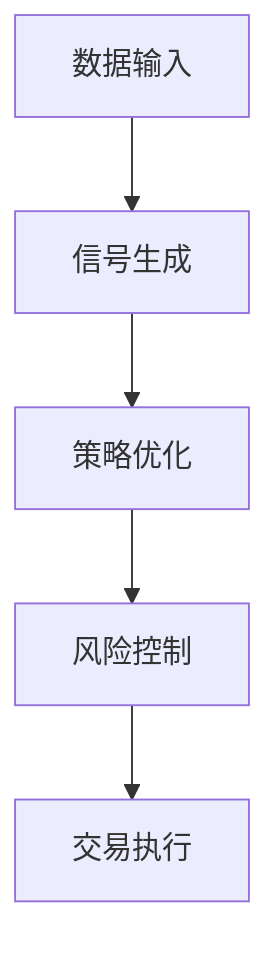
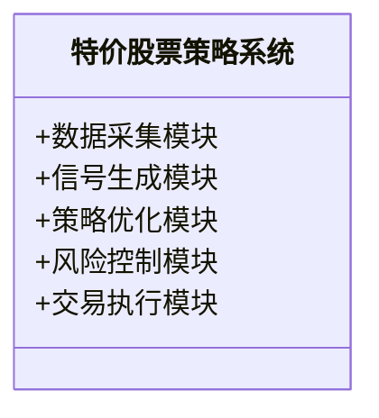
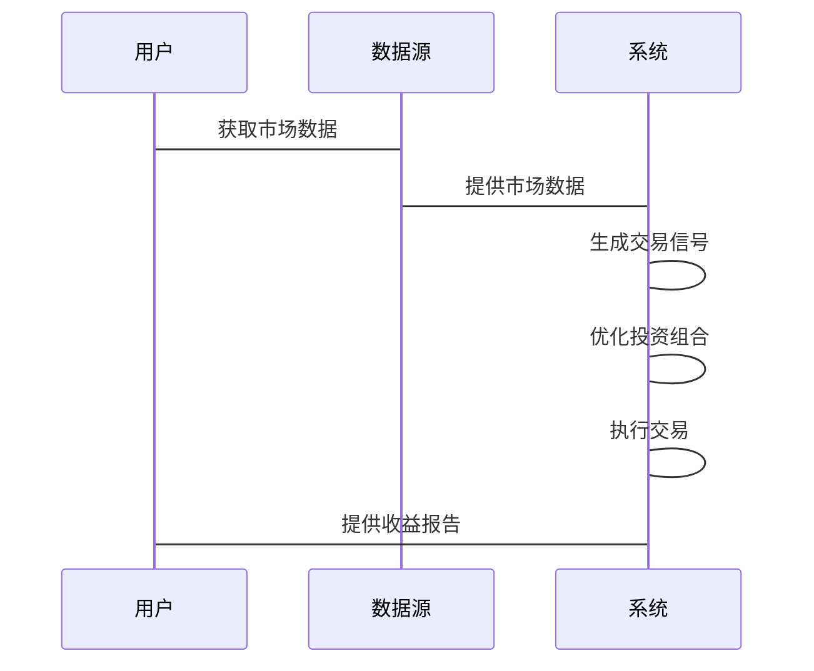

                 


# 如何将特价股票策略融入指数增强型投资

## 关键词：特价股票策略、指数增强型投资、算法、系统架构、项目实战

## 摘要：  
本文详细探讨了如何将特价股票策略融入指数增强型投资的策略与实现。通过分析特价股票策略的核心原理、指数增强型投资的数学模型，以及两者的结合方式，本文提出了一个完整的系统架构，并通过实际案例展示了如何实现这一策略。文章还提供了代码示例和系统设计图，帮助读者更好地理解和应用这一投资策略。

---

# 第一部分: 特价股票策略与指数增强型投资概述

## 第1章: 特价股票策略与指数增强型投资的背景介绍

### 1.1 什么是特价股票策略
#### 1.1.1 特价股票策略的定义
特价股票策略是一种基于短期价格波动的投资策略，旨在通过识别市场中的套利机会或价格异常来获取超额收益。这种策略通常依赖于高频交易和算法交易，能够在短时间内完成交易。

#### 1.1.2 特价股票策略的常见类型
- **套利策略**：利用不同市场或资产之间的价格差异进行交易。
- **事件驱动策略**：基于公司公告、并购等事件引发的价格波动进行交易。
- **高频交易策略**：通过算法和高频数据捕捉微小的价格波动。

#### 1.1.3 特价股票策略的核心目标
- 快速捕捉市场中的短期价格波动。
- 利用技术分析或统计套利方法识别交易机会。
- 通过高频交易实现快速进出市场，最大化收益。

### 1.2 什么是指数增强型投资
#### 1.2.1 指数增强型投资的定义
指数增强型投资是一种通过跟踪特定指数（如沪深300、标普500）并进行优化，以获得超越指数收益的投资策略。与传统被动投资不同，指数增强型投资通过主动管理（如股票筛选、权重调整）来获取超额收益（Alpha）。

#### 1.2.2 指数增强型投资的特点
- **被动性**：主要跟踪特定指数，减少对市场的主动偏离。
- **主动性**：通过优化模型调整持仓，追求超额收益。
- **风险控制**：严格控制与指数的偏离风险，确保投资组合的稳定性。

#### 1.2.3 指数增强型投资的收益来源
- **选股优化**：通过筛选优质股票或剔除表现不佳的股票。
- **权重调整**：根据个股表现动态调整持仓权重。
- **交易执行**：通过高效的交易策略降低交易成本。

### 1.3 特价股票策略与指数增强型投资的结合意义
#### 1.3.1 结合的背景与动机
- 特价股票策略能够在短期内捕捉市场波动，提供超额收益。
- 指数增强型投资通过长期跟踪指数，能够稳定收益并控制风险。
- 两者的结合可以利用特价策略的短期收益增强指数投资的长期收益。

#### 1.3.2 结合的目标与潜在优势
- 提高投资组合的收益表现。
- 利用特价策略的高频交易特性，降低整体投资组合的波动性。
- 通过指数增强模型的稳定性，控制特价策略的风险敞口。

#### 1.3.3 结合的可能风险与挑战
- 特价策略可能面临市场流动性不足的风险。
- 频繁的交易可能导致较高的交易成本。
- 市场异象可能不可持续，影响策略的有效性。

---

## 第2章: 特价股票策略与指数增强型投资的核心概念与联系

### 2.1 特价股票策略的核心原理
#### 2.1.1 市场异象与套利机会
市场异象指的是市场价格与内在价值的短期偏离，这种偏离为套利者提供了机会。例如，某公司的重大消息公布后，市场价格可能出现短期波动，套利者可以通过快速交易获利。

#### 2.1.2 时间序列分析与价格预测
时间序列分析是通过历史价格数据预测未来价格走势的方法。常用模型包括ARIMA、GARCH等，这些模型可以帮助识别价格趋势和波动性。

#### 2.1.3 交易信号的生成与筛选
交易信号是基于市场数据生成的买卖指令。通过统计套利、技术分析或机器学习方法，可以筛选出有效的交易信号，减少虚假信号的影响。

### 2.2 指数增强型投资的核心原理
#### 2.2.1 指数构建与权重分配
指数构建是根据选定的成分股及其权重构建投资组合。权重分配通常基于市值、流动性或其他指标。

#### 2.2.2 优化模型与风险控制
优化模型通过数学方法优化投资组合的收益与风险比。常用模型包括均值-方差优化和Black-Litterman模型，目标是最大化超额收益同时最小化跟踪误差。

#### 2.2.3 交易执行与成本控制
交易执行是将优化后的投资组合转化为实际交易的过程。高效的交易执行可以降低交易成本，如佣金、滑点和印花税。

### 2.3 两者的联系与区别
#### 2.3.1 联系：共同目标与数据基础
- 两者都依赖于市场数据，尤其是高频数据。
- 都追求超额收益（Alpha），通过优化模型实现收益最大化。

#### 2.3.2 区别：策略类型与风险偏好
- 特价策略属于短期、高频交易，风险较高。
- 指数增强策略属于中长期投资，风险相对较低。

#### 2.3.3 补充：如何在指数增强中融入特价策略
- 在指数增强模型中加入特价策略的交易信号。
- 根据指数成分股的特性，筛选适合特价策略的标的。
- 通过动态权重调整，平衡短期波动与长期收益。

---

## 第3章: 特价股票策略与指数增强型投资的数学模型与算法原理

### 3.1 特价股票策略的数学模型
#### 3.1.1 时间序列分析模型（ARIMA）
ARIMA模型用于预测未来价格走势，公式为：
$$ ARIMA(p, d, q) $$
其中，p为自回归阶数，d为差分阶数，q为移动平均阶数。

#### 3.1.2 事件驱动模型
事件驱动模型通过识别公司公告、并购等事件，预测价格波动。例如，某公司发布重大利好消息后，股价可能上涨。

#### 3.1.3 套利机会识别模型
套利机会识别模型通过比较不同市场或资产的价格差异，确定套利空间。例如，利用A股和H股的价格差异进行套利。

### 3.2 指数增强型投资的数学模型
#### 3.2.1 指数构建模型（CAPM）
CAPM模型用于计算资产的预期收益：
$$ E(R_i) = R_f + \beta_i (R_m - R_f) $$
其中，$R_f$是无风险利率，$R_m$是市场预期收益，$\beta_i$是资产的贝塔系数。

#### 3.2.2 优化模型（现代投资组合理论）
现代投资组合理论通过优化模型构建最优投资组合，公式为：
$$ \min_w \sigma^2 \quad \text{subject to} \quad \mu^T w = \text{target return} $$

#### 3.2.3 风险调整收益模型
风险调整收益模型通过夏普比率衡量投资收益的风险调整后表现：
$$ \text{夏普比率} = \frac{\mu - R_f}{\sigma} $$

### 3.3 算法流程图


---

## 第4章: 系统架构与实现方案

### 4.1 系统架构设计


### 4.2 功能模块设计
- **数据采集模块**：从多个数据源获取市场数据，包括股票价格、成交量等。
- **信号生成模块**：利用算法生成交易信号，筛选有效的交易机会。
- **策略优化模块**：根据指数增强模型优化投资组合，平衡短期与长期收益。
- **风险控制模块**：监控市场风险，调整投资组合以控制风险敞口。
- **交易执行模块**：将优化后的交易指令转化为实际交易，确保高效执行。

### 4.3 交互流程图


---

## 第5章: 项目实战与案例分析

### 5.1 环境安装
- 安装Python、Pandas、NumPy等工具。
- 使用QuantLib或Backtrader框架进行策略回测。

### 5.2 核心代码实现
```python
import pandas as pd
import numpy as np

def generate_signals(data):
    # 计算短期移动平均线
    data['SMA_20'] = data['收盘价'].rolling(20).mean()
    data['SMA_50'] = data['收盘价'].rolling(50).mean()
    # 生成交易信号
    data['信号'] = np.where(data['SMA_20'] > data['SMA_50'], 1, -1)
    return data

def optimize_portfolio(weights, data, target_return):
    # 使用均值-方差优化模型
    return np.argmax(weights * data.returns)

# 示例代码：将特价策略信号融入指数增强模型
data = pd.read_csv('market_data.csv')
signals = generate_signals(data)
optimized_weights = optimize_portfolio(signals, data, 0.05)
```

### 5.3 案例分析
- 选择一个市场环境（如A股市场）。
- 回测策略，分析其收益与风险表现。
- 根据回测结果优化参数，提高策略的有效性。

### 5.4 项目小结
- 总结策略的有效性。
- 提出改进建议，如引入机器学习方法优化信号生成。

---

## 第6章: 最佳实践与注意事项

### 6.1 最佳实践
- **数据清洗**：确保数据的完整性和准确性。
- **模型选择**：根据市场环境选择合适的算法。
- **风险控制**：设置止损点，控制最大回撤。

### 6.2 小结
- 本文详细介绍了如何将特价股票策略融入指数增强型投资。
- 提供了完整的系统架构和实现方案。
- 强调了数据清洗、模型选择和风险控制的重要性。

### 6.3 注意事项
- 特价策略可能面临市场流动性风险。
- 频繁交易可能导致较高的交易成本。
- 市场异象可能不可持续，需持续监控策略的有效性。

### 6.4 拓展阅读
- 《算法交易：从零到实战》
- 《指数投资与增强策略》

---

## 作者：AI天才研究院/AI Genius Institute & 禅与计算机程序设计艺术 /Zen And The Art of Computer Programming

