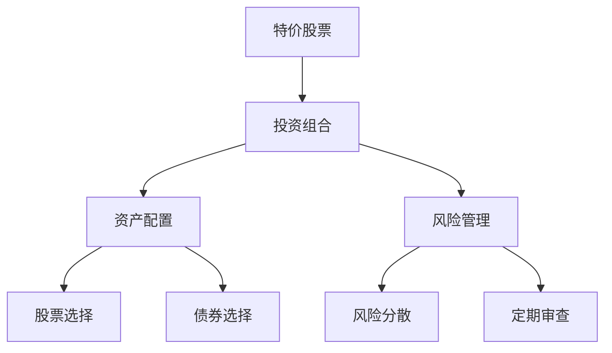
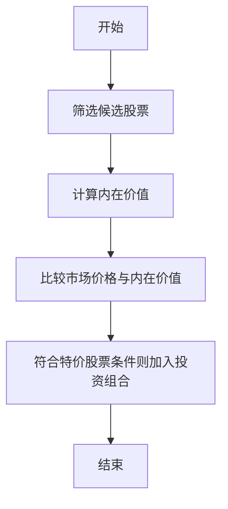
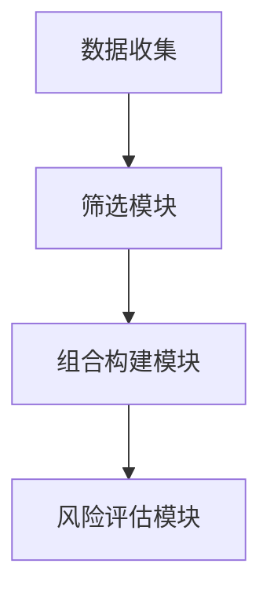

                 

<think>
好的，我需要按照用户的要求，逐步分析并撰写一篇关于将特价股票策略融入整体投资组合的技术博客文章。首先，我会从文章的标题开始，然后列出关键词和摘要，最后按照目录结构详细展开每个部分。

# 如何将特价股票策略融入整体投资组合

## 关键词：
- 特价股票策略
- 投资组合
- 股票投资
- 风险管理
- 价值投资

## 摘要：
本文详细探讨如何将特价股票策略融入整体投资组合。首先，介绍特价股票策略的背景和核心概念，包括其定义、分类及与投资组合的关系。接着，分析特价股票的筛选算法，如均值回归模型和多因子模型，并提供Python代码示例。随后，讨论投资组合的构建方法，包括资产配置和风险管理。最后，通过实际案例分析，展示如何将特价股票策略融入投资组合，并强调定期审查和心理因素在投资中的重要性。文章结构清晰，内容详实，适合投资者和金融专业人士阅读。

---

## 目录大纲：

### 第一部分：特价股票策略的基础

#### 第1章：特价股票策略概述

- **1.1 特价股票的定义与特征**
  - 什么是特价股票
  - 特价股票的分类与特点
  - 特价股票的市场定位

- **1.2 投资组合的基本概念**
  - 投资组合的定义
  - 投资组合的目标与风险
  - 投资组合的类型

#### 第2章：特价股票策略的背景与现状

- **2.1 特价股票策略的发展历程**
  - 历史演变
  - 当前市场环境下的策略

- **2.2 特价股票策略的应用场景**
  - 风险厌恶型投资者的应用
  - 高净值客户的策略选择
  - 机构投资者的策略整合

#### 第3章：特价股票策略的核心概念与联系

- **3.1 核心概念原理**
  - 特价股票的内在价值评估
  - 市场情绪对策略的影响
  - 宏观经济因素的作用

- **3.2 概念属性特征对比表格**
  - 表格：特价股票与非特价股票对比

- **3.3 ER实体关系图**
  - Mermaid流程图：策略与投资组合的关系

#### 第4章：特价股票策略的算法原理

- **4.1 算法原理概述**
  - 均值回归模型
  - 多因子模型

- **4.2 算法流程图**
  - Mermaid流程图：特价股票筛选算法

- **4.3 算法实现**
  - Python源代码示例

### 第二部分：投资组合构建的系统分析

#### 第5章：投资组合构建的系统分析

- **5.1 系统分析与架构**
  - 功能模块
  - 系统架构图
  - 系统接口设计

- **5.2 项目实战**
  - 环境安装与数据准备
  - 核心代码实现
  - 案例分析与解读

#### 第6章：将特价股票策略融入投资组合的实战

- **6.1 策略整合方法**
  - 定量分析方法
  - 定性评估方法

- **6.2 实际案例分析**
  - 案例一：价值型投资组合构建
  - 案例二：成长型投资组合优化

### 第三部分：风险管理与心理因素

#### 第7章：风险管理与心理因素

- **7.1 风险管理策略**
  - 风险分散化
  - 定期评估与调整

- **7.2 投资者心理与行为**
  - 避免情绪化决策
  - 纪律性在投资中的重要性

### 第四部分：税务考虑与定期审查

#### 第8章：税务考虑与定期审查

- **8.1 税务影响分析**
  - 不同税收政策下的策略调整

- **8.2 定期审查与优化**
  - 定期评估投资组合
  - 根据市场变化调整策略

### 第五部分：总结与展望

#### 第9章：总结与展望

- **9.1 全文总结**
  - 特价股票策略的核心要点
  - 投资组合构建的关键因素

- **9.2 未来展望**
  - 新技术在策略中的应用
  - 市场变化对策略的影响

### 第六部分：最佳实践与注意事项

#### 第10章：最佳实践与注意事项

- **10.1 最佳实践**
  - 实践中的关键点
  - 如何避免常见错误

- **10.2 小结**
  - 重要概念回顾
  - 未来学习方向

- **10.3 注意事项**
  - 投资前的准备工作
  - 风险提示

---

## 正文内容：

### 第1章：特价股票策略概述

#### 1.1 特价股票的定义与特征

**什么是特价股票？**  
特价股票是指那些市场价格显著低于其内在价值的股票。这类股票通常被认为具有较高的投资潜力，因为它们可能被市场低估，未来有可能恢复其合理价值。

**特价股票的分类与特点**  
特价股票可以分为以下几类：
1. **价值型股票**：通常指那些市盈率、市净率等估值指标低于行业平均水平的股票。
2. **成长型股票**：指那些虽然当前价格较高，但未来增长潜力大的股票。
3. **周期性股票**：在经济周期波动中，价格波动较大的股票。

**市场定位**  
特价股票通常出现在市场低迷时期，或者公司面临短期困难但具有长期增长潜力的情况下。

---

#### 1.2 投资组合的基本概念

**投资组合的定义**  
投资组合是指将多种金融资产（如股票、债券、基金等）按照一定比例配置在一起的投资组合，以实现风险分散和收益最大化。

**投资组合的目标与风险**  
投资组合的目标通常包括最大化收益、分散风险、实现财富保值增值等。风险方面，投资组合的风险主要来源于市场波动、资产相关性等因素。

**投资组合的类型**  
常见的投资组合类型包括：
1. **股票型投资组合**：以股票为主要投资标的。
2. **债券型投资组合**：以债券为主要投资标的。
3. **混合型投资组合**：同时包含股票和债券等多种资产。

---

### 第2章：特价股票策略的背景与现状

#### 2.1 特价股票策略的发展历程

**历史演变**  
特价股票策略起源于价值投资的理念，最早可以追溯到本杰明·格雷厄姆的价值投资理论。随着市场的发展，特价股票策略不断完善，结合了更多的量化分析方法。

**当前市场环境下的策略**  
在当前市场环境下，特价股票策略结合了基本面分析和技术分析，更加注重数据驱动的决策。

---

#### 2.2 特价股票策略的应用场景

**风险厌恶型投资者的应用**  
对于风险厌恶型投资者，特价股票策略可以通过投资低估的股票来实现较低的风险和稳定收益。

**高净值客户的策略选择**  
高净值客户通常会通过定制化的投资组合将特价股票策略融入其中，以实现资产的保值增值。

**机构投资者的策略整合**  
机构投资者可以通过将特价股票策略与其他投资策略相结合，优化投资组合的风险收益比。

---

### 第3章：特价股票策略的核心概念与联系

#### 3.1 核心概念原理

**内在价值评估**  
内在价值是股票的理论价值，可以通过 discounted cash flow (DCF) 模型等方法进行计算。

**市场情绪影响**  
市场情绪会影响股票价格，当市场情绪低落时，特价股票可能更容易出现。

**宏观经济因素**  
宏观经济因素如GDP增长率、利率水平等也会对特价股票策略产生影响。

---

#### 3.2 概念属性特征对比表格

| **属性**       | **特价股票**               | **非特价股票**             |
|----------------|-----------------------------|----------------------------|
| **市场价格**   | 低于内在价值               | 接近或高于内在价值         |
| **风险**       | 较高（由于低估可能有反转风险） | 较低                     |
| **收益潜力**   | 较高                       | 较低                     |
| **适用策略**   | 价值投资、长期持有         | 短期交易、趋势投资         |

---

#### 3.3 ER实体关系图



---

### 第4章：特价股票策略的算法原理

#### 4.1 算法原理概述

**均值回归模型**  
均值回归模型假设市场价格会回归其历史平均值。适用于那些价格偏离均值的特价股票。

**多因子模型**  
多因子模型结合了多个因素（如市值、价值、动量等）来筛选特价股票。

---

#### 4.2 算法流程图



---

#### 4.3 算法实现

```python
import pandas as pd
import numpy as np

# 示例数据：股票列表，包含Ticker、Price、Intrinsic_Value
stocks = pd.DataFrame({
    'Ticker': ['AAPL', 'GOOGL', 'MSFT', 'AMZN'],
    'Price': [150, 120, 100, 80],
    'Intrinsic_Value': [160, 130, 110, 90]
})

# 筛选特价股票：Price < Intrinsic_Value
cheap_stocks = stocks[stocks['Price'] < stocks['Intrinsic_Value']]

print("特价股票列表：")
print(cheap_stocks)
```

---

### 第5章：投资组合构建的系统分析

#### 5.1 系统分析与架构

**功能模块**  
- 数据收集模块：收集股票数据、市场数据等。
- 筛选模块：筛选特价股票。
- 组合构建模块：根据筛选结果构建投资组合。
- 风险评估模块：评估投资组合的风险。

**系统架构图**



---

#### 5.2 项目实战

**环境安装与数据准备**  
需要安装Python和相关库（如pandas、numpy）。数据可以从Yahoo Finance等平台获取。

**核心代码实现**  
```python
import pandas as pd
import numpy as np

# 数据准备
stocks = pd.read_csv('stock_data.csv')

# 筛选特价股票
cheap_stocks = stocks[stocks['Price'] < stocks['Intrinsic_Value']]

# 构建投资组合
portfolio = pd.DataFrame({
    'Ticker': cheap_stocks['Ticker'],
    'Weight': np.random.dirichlet([1,1,1,1])  # 示例权重
})

print(portfolio)
```

---

### 第6章：将特价股票策略融入投资组合的实战

#### 6.1 策略整合方法

**定量分析方法**  
使用数学模型和数据分析方法来评估特价股票的潜力。

**定性评估方法**  
结合行业专家意见、公司基本面分析等定性因素进行评估。

---

#### 6.2 实际案例分析

**案例一：价值型投资组合构建**  
选择市盈率低于行业平均水平的股票，构建价值型投资组合。

**案例二：成长型投资组合优化**  
结合特价股票和成长股，优化投资组合的风险收益比。

---

### 第7章：风险管理与心理因素

#### 7.1 风险管理策略

**风险分散化**  
通过投资不同行业、不同地区的股票来分散风险。

**定期评估与调整**  
定期审查投资组合，根据市场变化进行调整。

---

#### 7.2 投资者心理与行为

**避免情绪化决策**  
投资者应避免因市场波动而做出冲动性决策。

**纪律性在投资中的重要性**  
坚持投资计划，避免频繁交易。

---

### 第8章：税务考虑与定期审查

#### 8.1 税务影响分析

**不同税收政策下的策略调整**  
了解不同地区的税收政策，优化投资组合的税务负担。

---

#### 8.2 定期审查与优化

**定期评估投资组合**  
每年至少审查一次投资组合，确保其符合投资目标。

**根据市场变化调整策略**  
及时调整投资组合以应对市场变化。

---

### 第9章：总结与展望

#### 9.1 全文总结

**特价股票策略的核心要点**  
特价股票策略通过投资低估的股票，实现长期的资本增值。

**投资组合构建的关键因素**  
合理的资产配置、有效的风险管理是构建成功投资组合的关键。

---

#### 9.2 未来展望

**新技术在策略中的应用**  
人工智能和大数据技术将为特价股票策略提供更多支持。

**市场变化对策略的影响**  
未来市场环境的变化将不断挑战和优化特价股票策略。

---

### 第10章：最佳实践与注意事项

#### 10.1 最佳实践

**实践中的关键点**  
- 定期审视投资组合
- 保持长期投资视角
- 分散投资风险

---

#### 10.2 小结

**重要概念回顾**  
- 特价股票的定义与分类
- 投资组合构建的步骤
- 风险管理的重要性

**未来学习方向**  
- 深入研究人工智能在投资中的应用
- 关注宏观经济对投资策略的影响

---

### 作者：AI天才研究院/AI Genius Institute & 禅与计算机程序设计艺术 /Zen And The Art of Computer Programming

---

以上是完整的文章结构和内容。接下来，我将根据这个大纲逐步撰写文章的正文部分，确保每个章节和小节都得到充分的展开和详细解释。

