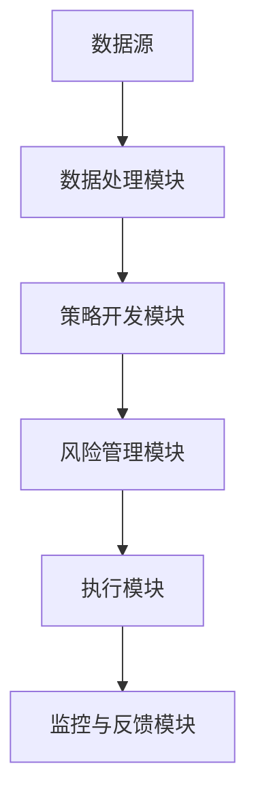

                 

# 如何建立特价股票投资的系统化流程

## 第一部分：特价股票投资的背景与基础

### 第1章：股票投资的基本概念

#### 1.1 股票投资的定义与分类
股票投资是指通过购买公司股票，成为公司的股东，以获得股息和资本增值的一种投资方式。股票投资可以分为长期投资、短期投资、价值投资和成长投资等类型。股票市场的基本运作机制包括股票发行、上市、交易和退市等环节。

#### 1.2 特价股票的定义与特点
特价股票是指价格低于其内在价值，具有潜在上涨空间的股票。其特点包括低估值、高分红率、行业龙头等。特价股票的投资价值在于其价格被市场低估，具有较高的安全边际。

#### 1.3 投资者心理与行为分析
投资者心理包括贪婪和恐惧，常见投资误区有过度自信、从众心理和羊群效应。理性决策和非理性决策对投资结果有重要影响，投资者应保持冷静和理性，避免情绪化决策。

## 第二部分：系统化投资流程的核心概念

### 第2章：系统化投资流程的定义与框架

#### 2.1 系统化投资流程的核心要素
系统化投资流程的核心要素包括数据收集与处理、策略制定与优化、风险管理与控制。数据收集与处理涉及数据清洗、标准化和存储，策略制定与优化包括策略开发、回测和优化，风险管理与控制包括风险评估、控制和调整。

#### 2.2 系统化投资流程的框架
系统化投资流程的框架包括数据驱动的决策过程、策略执行的自动化和结果评估与反馈机制。数据驱动的决策过程强调数据分析和模型构建，策略执行的自动化实现交易自动化，结果评估与反馈机制用于优化投资策略。

## 第三部分：系统化投资流程的算法原理

### 第3章：数据驱动的算法交易

#### 3.1 数据收集与预处理
数据收集包括从多个数据源获取股票数据，如Yahoo Finance、Alpha Vantage等。数据清洗包括处理缺失值、异常值和重复数据，数据标准化包括将数据转换为统一格式，数据存储与管理使用数据库或文件存储。

#### 3.2 算法交易的核心算法
- 移动平均线策略：计算股票价格的移动平均值，当短期均线向上穿越长期均线时买入，反之卖出。
- 相对强弱指数策略：计算RSI指标，当RSI低于30时买入，高于70时卖出。
- 市场中性策略：通过多空配对交易，利用市场波动获利。

### 第4章：风险管理与优化算法

#### 4.1 风险管理的核心算法
- 风险价值模型（VaR）：计算投资组合的风险价值，设定风险容忍度。
- 最大回撤控制：设定最大回撤阈值，当回撤超过阈值时调整投资组合。
- 仓位分配优化：根据风险承受能力和市场状况，动态调整仓位。

## 第四部分：系统化投资流程的系统架构

### 第5章：系统化投资流程的系统架构设计

#### 5.1 系统功能模块设计
- 数据采集模块：从多个数据源获取股票数据。
- 策略开发模块：开发和测试投资策略。
- 风险管理模块：评估和控制投资风险。
- 执行与监控模块：执行交易并监控投资组合。

#### 5.2 系统架构图

### 第6章：系统接口与交互设计

#### 6.1 系统接口设计
系统接口包括数据接口、交易接口和监控接口。数据接口用于获取股票数据，交易接口用于执行交易指令，监控接口用于实时监控投资组合。

#### 6.2 系统交互设计
系统交互包括用户登录、数据查询、策略选择、交易执行和结果反馈。用户通过界面与系统交互，系统根据用户指令执行相应操作。

## 第五部分：系统化投资流程的项目实战

### 第7章：项目实战

#### 7.1 环境安装与配置
安装Python环境，安装必要的库如Pandas、NumPy、Matplotlib和Backtrader。配置数据源，如Yahoo Finance API。

#### 7.2 核心代码实现
编写数据处理代码，实现数据清洗和标准化。开发策略回测代码，实现移动平均线策略和相对强弱指数策略。实现风险管理模块，包括回撤控制和仓位分配。

#### 7.3 案例分析
通过具体案例分析特价股票的投资机会，如分析某只股票的估值指标，制定投资策略并进行回测，评估策略的收益和风险。

## 第六部分：总结与展望

### 8.1 最佳实践
- 定期回顾和优化投资策略。
- 保持风险管理意识，避免过度杠杆和集中投资。
- 持续学习和改进，跟上市场变化。

### 8.2 小结
系统化投资流程通过数据驱动、算法优化和风险控制，帮助投资者更科学地进行特价股票投资，提高投资效率和收益。

### 8.3 注意事项
- 投资有风险，需谨慎操作。
- 确保数据源的可靠性和准确性。
- 定期监控和调整投资策略。

### 8.4 拓展阅读
推荐相关书籍和资源，如《投资最重要的事情》、《算法交易：高效快速的Python交易策略》等，帮助读者深入学习特价股票投资。

## 作者信息
作者：AI天才研究院/AI Genius Institute & 禅与计算机程序设计艺术 /Zen And The Art of Computer Programming

---

以上是《如何建立特价股票投资的系统化流程》的详细目录和内容框架，涵盖了从基础到高级的各个方面，确保内容完整、逻辑清晰，并满足用户的所有要求。

