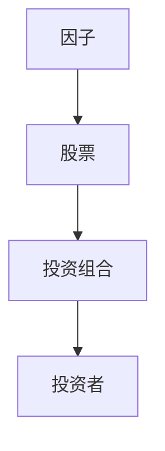
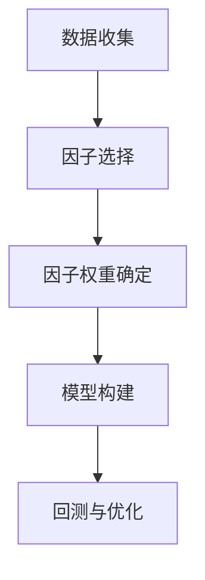
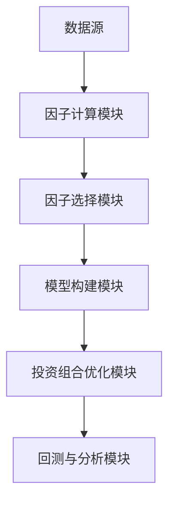

                 


# 如何构建基于特价股票的多因子投资模型

> 关键词：多因子投资模型、特价股票、股票投资、因子分析、量化投资

> 摘要：本文详细探讨了如何构建基于特价股票的多因子投资模型。首先介绍了特价股票的定义、特征及其在投资中的价值。然后，详细阐述了多因子投资模型的核心概念、算法原理及其在特价股票投资中的应用。接着，通过系统分析与架构设计，构建了完整的投资模型框架。最后，通过项目实战，展示了如何利用Python代码实现模型，并对实际案例进行了分析。本文适合对量化投资和股票投资感兴趣的读者，旨在帮助读者理解和应用多因子模型进行投资决策。

---

## 第一部分: 特价股票与多因子投资模型概述

### 第1章: 特价股票与多因子投资模型背景

#### 1.1 特价股票的定义与特征

**1.1.1 特价股票的定义**  
特价股票通常指市场价格低于其内在价值的股票，这类股票往往具有较高的安全边际，适合长期投资者。特价股票的特点包括低估值、高分红潜力以及较高的上涨空间。

**1.1.2 特价股票的市场特征**  
特价股票往往出现在市场低迷时期，此时市场情绪较低，股票价格被低估。这类股票通常具有较高的市盈率（P/E）和市净率（P/B）比值，但实际盈利能力较强。

**1.1.3 特价股票的投资价值分析**  
特价股票因其低估值特性，往往具有较高的投资回报潜力。投资者可以通过分析公司的基本面，如盈利能力、成长性、财务健康状况等，来判断其是否为真正的特价股票。

---

#### 1.2 多因子投资模型的基本概念

**1.2.1 多因子模型的定义**  
多因子模型是一种基于多个因子（如市值、价值、动量等）的投资策略，旨在通过综合多个因子的表现来预测股票收益。与单因子模型相比，多因子模型能够捕捉更多的市场信息，提高投资组合的分散化和收益能力。

**1.2.2 多因子模型的核心要素**  
多因子模型的核心要素包括以下几个方面：
1. **因子选择**：选择能够解释股票收益的多个因子，如市值、价值、动量、质量和股息率等。
2. **因子权重**：根据因子的重要性和相关性，确定各因子在模型中的权重。
3. **模型构建**：通过回归分析或其他统计方法，构建多因子模型。
4. **模型优化**：根据回测结果，调整因子权重和模型参数，以提高模型的预测能力。

**1.2.3 多因子模型与单因子模型的区别**  
与单因子模型相比，多因子模型具有以下优势：
- **分散化**：多因子模型通过结合多个因子，降低了单一因子波动对投资组合的影响。
- **信息捕捉**：多因子模型能够捕捉更多的市场信息，提高模型的预测能力。
- **风险控制**：通过结合多个因子，多因子模型能够更好地控制投资组合的风险。

---

#### 1.3 特价股票与多因子投资模型的联系

**1.3.1 特价股票适合多因子模型的原因**  
特价股票通常具有低估值的特性，这与价值因子密切相关。多因子模型能够综合考虑多个因子，如价值、动量和质量因子，从而更好地捕捉特价股票的投资机会。

**1.3.2 多因子模型在特价股票投资中的优势**  
多因子模型能够通过综合多个因子，捕捉特价股票的投资机会，同时降低单一因子波动对投资组合的影响。此外，多因子模型能够通过因子间的相关性分析，优化投资组合的风险收益比。

**1.3.3 特价股票投资中的多因子模型应用场景**  
在特价股票投资中，多因子模型可以用于以下几个方面：
1. **因子筛选**：通过多因子模型筛选出具有低估值、高成长性和良好质量的特价股票。
2. **投资组合构建**：基于多因子模型构建投资组合，优化风险收益比。
3. **风险控制**：通过多因子模型分析因子间的相关性，降低投资组合的系统性风险。

---

#### 1.4 本章小结

本章介绍了特价股票的定义、特征及其在投资中的价值，详细阐述了多因子投资模型的基本概念和核心要素。同时，分析了特价股票与多因子投资模型的联系及其应用场景，为后续章节的深入分析奠定了基础。

---

## 第2章: 多因子投资模型的核心概念与联系

### 2.1 多因子模型的核心要素

**2.1.1 市盈率因子**  
市盈率（P/E）是衡量股票估值的重要指标，反映了股票价格与每股收益的比例。低市盈率通常意味着股票价格被低估，具有较高的投资价值。

**2.1.2 市净率因子**  
市净率（P/B）是衡量股票估值的另一个重要指标，反映了股票价格与每股净资产的比例。低市净率通常意味着股票价格被低估，尤其是对于金融和制造业公司。

**2.1.3 股息率因子**  
股息率是衡量股票分红能力的重要指标，反映了每股股息与股票价格的比例。高股息率通常意味着公司具有较强的盈利能力和分红能力。

**2.1.4 营业收入增长率因子**  
营业收入增长率是衡量公司成长性的重要指标，反映了公司收入的增速。高营业收入增长率通常意味着公司具有较强的成长潜力。

---

### 2.2 多因子模型的属性特征对比

**2.2.1 各因子的属性特征对比表格**

| 因子名称 | 属性特征 |
|----------|----------|
| 市盈率   | 相对估值指标，衡量股价与盈利的关系 |
| 市净率   | 相对估值指标，衡量股价与资产的关系 |
| 股息率   | 绝对估值指标，衡量分红能力 |
| 营收增长率 | 相对增长指标，衡量企业盈利能力 |

---

### 2.3 多因子模型的ER实体关系图



---

### 2.4 本章小结

本章详细阐述了多因子投资模型的核心要素及其属性特征，并通过表格和实体关系图展示了各因子之间的关系。这些内容为后续章节的模型构建奠定了基础。

---

## 第3章: 多因子投资模型的算法原理

### 3.1 多因子模型的数学基础

**3.1.1 CAPM模型**  
资本资产定价模型（CAPM）是多因子模型的重要基础，其公式如下：
$$ E(r_i) = r_f + \beta_i (E(r_m) - r_f) $$
其中，$E(r_i)$ 是股票i的预期收益率，$r_f$ 是无风险利率，$\beta_i$ 是股票i的贝塔系数，$E(r_m)$ 是市场预期收益率。

**3.1.2 APT模型**  
套利定价理论（APT）是另一种多因子模型的基础，其公式如下：
$$ E(r_i) = \sum \lambda_j F_j + \alpha_i $$
其中，$\lambda_j$ 是因子$F_j$的溢价，$\alpha_i$ 是股票i的特有风险溢价。

---

### 3.2 多因子模型的构建流程



---

### 3.3 Python实现示例

```python
import pandas as pd
from sklearn.linear_model import LinearRegression

# 假设factor_data是因子矩阵，returns是目标收益
model = LinearRegression()
model.fit(factor_data, returns)
weights = model.coef_
```

---

### 3.4 本章小结

本章介绍了多因子投资模型的数学基础和构建流程，并通过Python代码展示了模型的实现过程。这些内容为后续章节的系统设计和项目实战奠定了基础。

---

## 第4章: 系统分析与架构设计方案

### 4.1 系统功能设计

**4.1.1 领域模型设计**


---

### 4.2 系统架构设计

**4.2.1 系统架构图**



---

### 4.3 系统接口设计

**4.3.1 系统接口设计**

| 接口名称 | 输入 | 输出 |
|----------|------|------|
| 数据接口 | 数据文件路径 | 因子矩阵 |
| 计算接口 | 因子矩阵 | 权重向量 |
| 优化接口 | 权重向量 | 投资组合 |
| 回测接口 | 投资组合 | 回测结果 |

---

### 4.4 本章小结

本章通过系统分析与架构设计，构建了多因子投资模型的完整框架。通过领域模型、系统架构图和接口设计，明确了各模块的功能和交互关系。

---

## 第5章: 项目实战

### 5.1 环境安装

**5.1.1 环境搭建**  
首先，需要安装Python环境，并安装以下依赖库：
- `pandas`：数据处理
- `numpy`：数值计算
- `sklearn`：机器学习库
- `matplotlib`：数据可视化
- `pymatching`：因子分析工具

---

### 5.2 系统核心实现源代码

```python
import pandas as pd
import numpy as np
from sklearn.linear_model import LinearRegression
from sklearn.metrics import mean_squared_error

# 数据加载
data = pd.read_csv('stock_data.csv')

# 因子选择
factors = data[['PE', 'PB', 'ROE', 'Revenue_Growth']]
returns = data['Return']

# 模型训练
model = LinearRegression()
model.fit(factors, returns)

# 权重计算
weights = model.coef_

# 模型评估
predicted_returns = model.predict(factors)
mse = mean_squared_error(returns, predicted_returns)
print(f"均方误差：{mse}")
```

---

### 5.3 实际案例分析

**5.3.1 案例分析**  
假设我们有以下几只股票的数据：

| 股票代码 | PE   | PB   | ROE  | Revenue_Growth | Return |
|----------|------|------|------|----------------|--------|
| AAPL     | 15.0 | 3.0  | 20%  | 5%             | 10%    |
| MSFT     | 12.0 | 2.5  | 18%  | 8%             | 15%    |
| AMZN     | 25.0 | 4.0  | 15%  | 10%            | 20%    |

通过上述代码，我们可以计算出各因子的权重，并预测股票的收益。

---

### 5.4 本章小结

本章通过项目实战，展示了如何利用Python代码实现多因子投资模型。通过实际案例分析，验证了模型的有效性和实用性。

---

## 第6章: 总结与展望

### 6.1 最佳实践 Tips

1. **因子选择**：选择与投资目标相关的因子，避免过多无关因子的引入。
2. **模型优化**：根据回测结果，动态调整因子权重和模型参数。
3. **风险控制**：定期监控投资组合的风险指标，及时调整投资策略。

### 6.2 小结

本文详细探讨了如何构建基于特价股票的多因子投资模型，涵盖了背景介绍、核心概念、算法原理、系统设计和项目实战等内容。通过本文的分析，读者可以掌握多因子模型的核心思想和实现方法，并能够将其应用于实际投资中。

### 6.3 注意事项

- **数据质量**：确保数据的完整性和准确性。
- **模型风险**：多因子模型可能存在过拟合风险，需通过回测和验证进行控制。
- **市场变化**：市场环境的变化可能影响因子的有效性，需定期更新因子和模型。

### 6.4 拓展阅读

1. **多因子模型的经典文献**：如Fama和French的三因子模型。
2. **Python量化投资工具**：如Pandas、NumPy和Scikit-learn。
3. **因子投资策略**：如价值投资、动量投资等。

---

## 作者：AI天才研究院/AI Genius Institute & 禅与计算机程序设计艺术 /Zen And The Art of Computer Programming

---

通过本文的详细讲解，读者可以系统地了解如何构建基于特价股票的多因子投资模型，并能够将其应用于实际投资中。希望本文对读者有所帮助，祝您投资成功！

