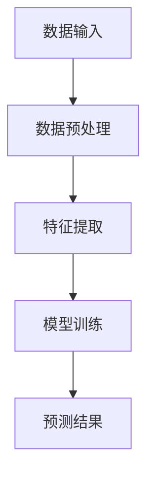
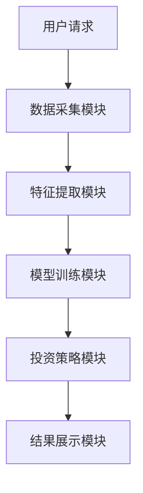

                 


# 如何构建基于特价股票的智能投顾系统

> 关键词：智能投顾系统，特价股票，机器学习，数据处理，算法原理

> 摘要：本文详细介绍了如何构建一个基于特价股票的智能投顾系统，从背景介绍、核心概念、算法原理到系统架构设计和项目实战，逐步分析了系统的构建过程，帮助读者理解并掌握智能投顾系统的核心技术。

---

## 第一章: 特价股票与智能投顾系统背景

### 1.1 特价股票的定义与特点
特价股票指的是在特定条件下价格低于市场价的股票，具有以下特点：
- 价格波动大
- 交易风险高
- 投资机会多

### 1.2 智能投顾系统的基本概念
智能投顾系统是一种利用算法和大数据分析为投资者提供投资建议的系统，具备以下核心功能：
- 数据采集与分析
- 投资策略生成
- 风险评估与预警

### 1.3 特价股票智能投顾系统的背景与意义
随着金融市场的快速发展，投资者对实时数据分析的需求日益增加，智能投顾系统在特价股票市场中具有重要意义：
- 提高投资效率
- 降低投资风险
- 帮助投资者抓住短期投资机会

---

## 第二章: 智能投顾系统的核心概念

### 2.1 数据处理与特征工程
#### 2.1.1 数据采集与清洗
- 数据来源：股票历史数据、市场新闻、财务报表
- 数据清洗：去除缺失值、异常值

#### 2.1.2 特征提取与选择
- 常用特征：股价趋势、成交量、波动率
- 特征选择方法：基于统计的特征选择、基于模型的特征选择

### 2.2 模型训练与策略生成
#### 2.2.1 机器学习模型的选择
- 监督学习模型：线性回归、支持向量机
- 非监督学习模型：聚类分析

#### 2.2.2 模型训练流程
1. 数据预处理
2. 模型训练
3. 模型评估

### 2.3 结果展示与用户交互
#### 2.3.1 结果可视化方法
- 使用Matplotlib进行数据可视化
- 制作交互式仪表盘

#### 2.3.2 用户交互界面设计
- 基于Web的界面设计
- 移动端适配

---

## 第三章: 智能投顾系统的算法原理

### 3.1 机器学习算法实现
#### 3.1.1 算法流程图



#### 3.1.2 Python代码实现

```python
import pandas as pd
from sklearn.linear_model import LinearRegression

# 数据加载
data = pd.read_csv('stock_data.csv')

# 特征提取
X = data[['open', 'high', 'low', 'volume']]
y = data['close']

# 模型训练
model = LinearRegression()
model.fit(X, y)

# 预测结果
predicted_price = model.predict(X)
```

### 3.2 数学模型与公式
#### 3.2.1 线性回归模型

$$ y = \beta_0 + \beta_1x + \epsilon $$

其中，$\beta_0$是截距，$\beta_1$是斜率，$\epsilon$是误差项。

#### 3.2.2 随机森林模型

随机森林是一种基于树的集成学习方法，公式如下：

$$ y = \sum_{i=1}^{n} Tree_i(x) $$

---

## 第四章: 智能投顾系统的架构设计

### 4.1 系统功能设计
#### 4.1.1 数据采集模块
- 数据源：API接口、数据库
- 功能：实时数据采集

#### 4.1.2 特征提取模块
- 功能：提取关键特征
- 技术：PCA（主成分分析）

#### 4.1.3 模型训练模块
- 功能：训练预测模型
- 技术：深度学习框架（如TensorFlow）

#### 4.1.4 投资策略模块
- 功能：生成投资策略
- 方法：基于模型预测结果生成买卖信号

#### 4.1.5 结果展示模块
- 功能：可视化结果
- 技术：D3.js、Plotly

### 4.2 系统架构图



---

## 第五章: 智能投顾系统的项目实战

### 5.1 环境安装
- 安装Python
- 安装相关库（numpy、pandas、scikit-learn、tensorflow）

### 5.2 核心代码实现

```python
import numpy as np
import pandas as pd
from sklearn.model_selection import train_test_split
from sklearn.ensemble import RandomForestRegressor

# 数据加载
data = pd.read_csv('stock_data.csv')

# 特征与标签分离
X = data.drop('target', axis=1)
y = data['target']

# 数据划分
X_train, X_test, y_train, y_test = train_test_split(X, y, test_size=0.2)

# 模型训练
model = RandomForestRegressor(n_estimators=100)
model.fit(X_train, y_train)

# 模型评估
score = model.score(X_test, y_test)
print(f'模型得分: {score}')
```

### 5.3 案例分析
通过实际数据，展示模型预测结果与实际价格的对比，分析模型的有效性。

---

## 第六章: 最佳实践与注意事项

### 6.1 小结
智能投顾系统通过数据处理、算法模型和系统架构设计，能够有效帮助投资者进行特价股票投资。

### 6.2 注意事项
- 数据质量：确保数据准确性和完整性
- 模型选择：根据实际需求选择合适模型
- 风险控制：建立有效的风险预警机制

### 6.3 拓展阅读
建议读者进一步学习时间序列分析、强化学习等技术，提升系统的预测能力。

---

## 作者信息

作者：AI天才研究院/AI Genius Institute & 禅与计算机程序设计艺术 /Zen And The Art of Computer Programming

