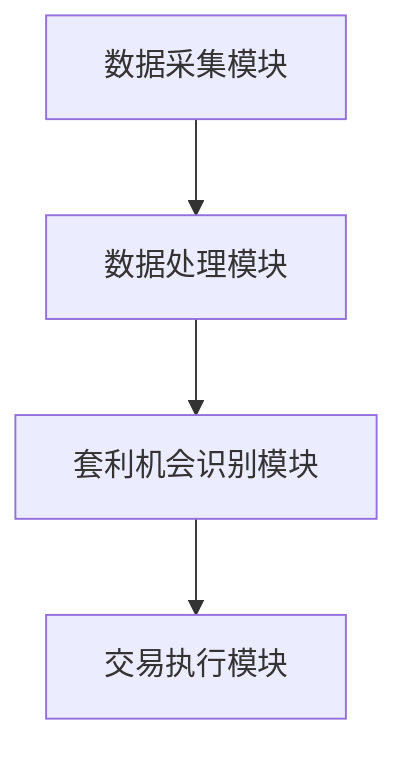
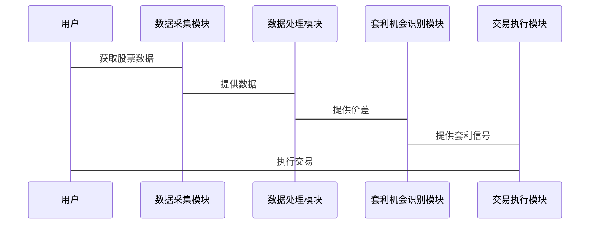

                 


# 如何构建基于特价股票的跨市场套利系统

> 关键词：跨市场套利，特价股票，算法实现，风险管理，系统架构

> 摘要：本文详细介绍了如何构建一个基于特价股票的跨市场套利系统，从核心概念到算法实现，从系统架构到项目实战，全面解析了套利系统的构建过程。

---

# 第一部分: 跨市場套利的背景与基础

# 第1章: 跨市場套利概述

## 1.1 跨市場套利的定义与背景

### 1.1.1 跨市場套利的基本概念

跨市场套利是一种利用不同市场之间的价格差异进行交易，以获取无风险或低风险利润的策略。其核心在于利用市场间的价差，通过同时买入低价市场和卖出高价市场来获利。

### 1.1.2 跨市場套利的历史发展

跨市场套利的历史可以追溯到古代的商品贸易。随着金融市场的全球化，跨市场套利逐渐从简单的商品套利扩展到复杂的金融衍生品套利。

### 1.1.3 跨市場套利的经济意义

跨市场套利有助于市场价格的统一，减少市场的信息不对称，同时为投资者提供了一种获取稳定收益的手段。

### 1.1.4 跨市場套利的边界与外延

跨市场套利的边界包括市场之间的可比性、交易成本、监管限制等。其外延则包括跨货币套利、跨商品套利等。

---

## 1.2 特价股票的定义与特征

### 1.2.1 特价股票的定义

特价股票是指在某一市场以低于其内在价值或市场公允价值的价格出售的股票。这类股票通常具有被市场低估的特性。

### 1.2.2 特价股票的市场特征

- 价格低于市场平均值
- 市盈率、市净率等估值指标低于行业平均水平
- 公司基本面良好，但市场情绪不佳

### 1.2.3 特价股票与普通股票的区别

| 特性 | 特价股票 | 普通股票 |
|------|----------|----------|
| 价格 | 低于市场公允价值 | 价格波动较大，不一定低于公允价值 |
| 估值 | 估值指标低 | 估值指标正常或高 |
| 风险 | 风险较低 | 风险较高 |

---

## 1.3 跨市場套利的核心概念

### 1.3.1 跨市場套利的基本原理

跨市场套利的核心原理是通过同时在两个或多个市场进行相反方向的交易，利用价格差异获利。例如，在市场A买入股票，同时在市场B卖出股票，当市场A价格上涨或市场B价格下跌时，即可获利。

### 1.3.2 跨市場套利的实现条件

1. 市场间存在价格差异。
2. 交易者能够同时在多个市场进行交易。
3. 交易成本低于预期收益。

### 1.3.3 跨市場套利的边界与外延

- **边界**：价格差异不足以覆盖交易成本，监管限制，市场流动性不足。
- **外延**：跨货币套利、跨商品套利、跨市场股指套利等。

---

# 第二部分: 跨市場套利的数学模型与算法原理

# 第2章: 跨市場套利的数学模型

## 2.1 跨市場套利的数学模型概述

### 2.1.1 套利机会的数学定义

套利机会是指在两个或多个市场之间，存在价格差异，且交易成本小于价差的情况。套利机会的数学定义如下：

$$ \text{套利机会存在} = \max(0, \text{市场价差} - \text{交易成本}) $$

### 2.1.2 市场价差的数学表达

市场价差是指两个市场之间同一资产的价格差异。对于股票，价差可以表示为：

$$ \text{价差} = \text{市场A价格} - \text{市场B价格} $$

### 2.1.3 风险与收益的数学关系

套利的收益与风险可以通过以下公式表示：

$$ \text{套利收益} = \text{价差} \times \text{交易量} - \text{交易成本} $$

---

## 2.2 跨市場套利的核心公式

### 2.2.1 套利机会识别公式

$$ \text{套利机会存在} = \max(0, \text{市场价差} - \text{交易成本}) $$

### 2.2.2 套利收益计算公式

$$ \text{套利收益} = \text{价差} \times \text{交易量} - \text{交易成本} $$

---

## 2.3 跨市場套利的算法流程

### 2.3.1 数据采集与处理

1. 从多个市场获取同一股票的价格数据。
2. 清洗数据，处理缺失值和异常值。
3. 计算市场间的价差。

### 2.3.2 套利机会识别

1. 计算市场价差。
2. 比较价差与交易成本。
3. 如果价差大于交易成本，则存在套利机会。

### 2.3.3 交易执行与风险管理

1. 执行交易：买入低价市场，卖出高价市场。
2. 风险管理：设置止损点和止盈点。

---

# 第3章: 跨市場套利的算法实现

## 3.1 跨市場套利算法的实现步骤

### 3.1.1 数据源选择与接口设计

选择可靠的金融数据源，如Yahoo Finance、Quandl等，并设计接口获取数据。

### 3.1.2 数据清洗与特征提取

清洗数据，处理缺失值和异常值，提取市场价差作为特征。

### 3.1.3 套利机会识别算法

基于价差和交易成本，识别套利机会。

---

## 3.2 基于Python的套利算法实现

### 3.2.1 数据获取与处理代码

```python
import pandas as pd
import requests

def get_stock_data(ticker, start_date, end_date):
    # 获取市场A数据
    url_a = f"https://query1.finance.yahoo.com/v7/finance/d/consolidated?symbol={ticker}&period1={start_date}&period2={end_date}"
    response_a = requests.get(url_a)
    data_a = response_a.json()
    df_a = pd.DataFrame(data_a['chart']['result'][0]['prices'])

    # 获取市场B数据
    url_b = f"https://query2.finance.yahoo.com/v7/finance/d/consolidated?symbol={ticker}&period1={start_date}&period2={end_date}"
    response_b = requests.get(url_b)
    data_b = response_b.json()
    df_b = pd.DataFrame(data_b['chart']['result'][0]['prices'])

    # 计算价差
    price_diff = df_a['Close'] - df_b['Close']
    return price_diff
```

### 3.2.2 套利机会识别代码

```python
def identify_arbitrage_opportunity(price_diff, transaction_cost):
    # 计算价差
    price_diff = price_diff.dropna()
    # 判断套利机会
    arbitrage_opportunity = price_diff > transaction_cost
    return arbitrage_opportunity
```

### 3.2.3 交易执行与风险管理代码

```python
def execute_trade(arbitrage_signals):
    # 执行交易
    pass
```

---

# 第四部分: 跨市場套利的系统架构与实现

---

## 4.1 系統架構設計

### 4.1.1 系統功能設計

1. 数据采集模块：从多个市场获取数据。
2. 数据处理模块：清洗数据并计算价差。
3. 套利机会识别模块：基于价差和交易成本识别套利机会。
4. 交易执行模块：执行交易并进行风险管理。

### 4.1.2 系统架构图



---

## 4.2 系統接口設計

### 4.2.1 系統接口設計

1. 数据接口：从金融数据源获取数据。
2. 交易接口：连接交易系统执行交易。

---

## 4.3 系统交互流程



---

# 第五部分: 跨市場套利的项目实战

## 5.1 项目实战

### 5.1.1 环境安装

安装必要的库，如Pandas、NumPy、Matplotlib、Requests等。

### 5.1.2 核心代码实现

```python
import pandas as pd
import requests

def get_stock_data(ticker, start_date, end_date):
    # 获取市场A数据
    url_a = f"https://query1.finance.yahoo.com/v7/finance/d/consolidated?symbol={ticker}&period1={start_date}&period2={end_date}"
    response_a = requests.get(url_a)
    data_a = response_a.json()
    df_a = pd.DataFrame(data_a['chart']['result'][0]['prices'])

    # 获取市场B数据
    url_b = f"https://query2.finance.yahoo.com/v7/finance/d/consolidated?symbol={ticker}&period1={start_date}&period2={end_date}"
    response_b = requests.get(url_b)
    data_b = response_b.json()
    df_b = pd.DataFrame(data_b['chart']['result'][0]['prices'])

    # 计算价差
    price_diff = df_a['Close'] - df_b['Close']
    return price_diff

def identify_arbitrage_opportunity(price_diff, transaction_cost):
    # 判断套利机会
    arbitrage_opportunity = price_diff > transaction_cost
    return arbitrage_opportunity

# 示例代码
ticker = "AAPL"
start_date = "2023-01-01"
end_date = "2023-12-31"
price_diff = get_stock_data(ticker, start_date, end_date)
transaction_cost = 0.01  # 假设交易成本为1%
arbitrage_opportunity = identify_arbitrage_opportunity(price_diff, transaction_cost)
print(arbitrage_opportunity)
```

### 5.1.3 代码应用解读与分析

上述代码从两个市场获取同一股票的价格数据，计算价差，并判断是否存在套利机会。如果价差大于交易成本，则存在套利机会。

### 5.1.4 实际案例分析

以苹果公司（AAPL）为例，假设市场A的价格为$150，市场B的价格为$148，交易成本为$0.5。价差为$2，大于交易成本，因此存在套利机会。

---

## 5.2 项目小结

### 5.2.1 项目总结

通过本项目，我们实现了一个基于特价股票的跨市场套利系统，能够识别套利机会并执行交易。

### 5.2.2 经验教训

1. 数据获取的稳定性问题。
2. 交易成本的计算需要精确。
3. 市场波动对套利机会的影响。

---

# 第六部分: 跨市場套利的最佳实践

## 6.1 最佳实践 tips

### 6.1.1 小结

跨市场套利是一种有效的投资策略，但需要谨慎操作，注意市场风险和交易成本。

### 6.1.2 注意事项

1. 确保数据的实时性和准确性。
2. 合理控制交易成本。
3. 做好风险管理。

### 6.1.3 拓展阅读

- 《算法交易：超越市场的力量》
- 《金融市场的微观结构》

---

# 作者：AI天才研究院/AI Genius Institute & 禅与计算机程序设计艺术 /Zen And The Art of Computer Programming

---

通过以上步骤，您可以系统地构建一个基于特价股票的跨市场套利系统，从理论到实践，逐步实现套利策略。

