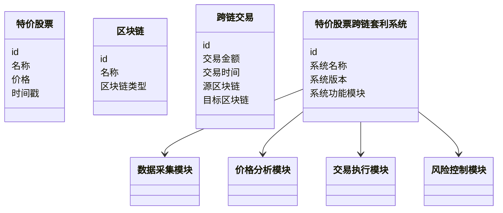
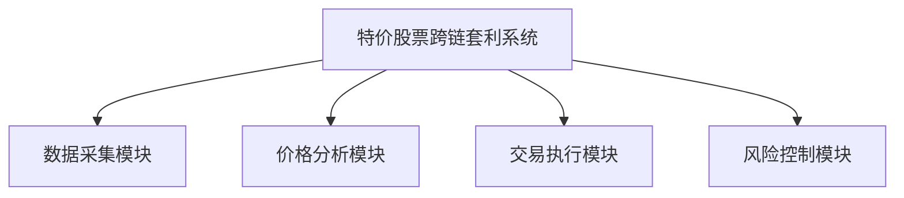
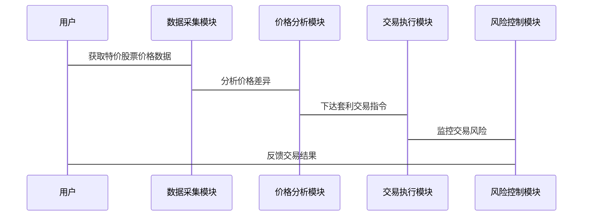

                 


# 如何构建基于特价股票的跨链套利系统

> 关键词：跨链套利，特价股票，区块链，DeFi，量化交易，系统架构

> 摘要：本文详细探讨了如何构建基于特价股票的跨链套利系统。从背景和概念入手，分析了跨链套利的原理、策略，详细讲解了系统设计与实现，包括技术基础、系统架构、模块设计、接口设计，通过项目实战展示了如何从环境配置到代码实现，最后总结了高级主题和注意事项。文章内容丰富，结构清晰，旨在为读者提供一套完整的跨链套利系统构建方案。

---

## 第一部分: 特价股票与跨链套利概述

### 第1章: 特价股票与跨链套利的概念

#### 1.1 特价股票的定义与特性
- **1.1.1 特价股票的定义**  
  特价股票是指在特定时间内价格波动较大、具有套利机会的股票。这类股票通常在市场波动剧烈或有重大消息时出现，价格差异较大，适合通过量化交易进行套利。

- **1.1.2 特价股票的特性**  
  - 价格波动频繁：特价股票的价格在短时间内可能大幅波动，为套利者提供机会。  
  - 市场流动性较高：特价股票通常交易活跃，能够快速买入或卖出。  
  - 套利机会短暂：由于市场参与者众多，套利机会往往转瞬即逝，需要高效的系统支持。

- **1.1.3 特价股票的市场特点**  
  特价股票的市场特点包括：  
  1. 高波动性：价格在短时间内波动较大。  
  2. 短暂性：套利机会短暂，需快速反应。  
  3. 市场参与者多样性：包括机构投资者和个人投资者。

#### 1.2 跨链套利的定义与原理
- **1.2.1 跨链套利的定义**  
  跨链套利是指在不同区块链之间利用价格差异进行套利交易。由于不同区块链上的资产价格可能存在差异，套利者可以在价格低的链上买入资产，在价格高的链上卖出，从而获利。

- **1.2.2 跨链套利的基本原理**  
  跨链套利的核心在于发现不同区块链之间的价格差异，并利用这种差异进行套利。具体步骤包括：  
  1. 监测不同区块链上的资产价格。  
  2. 发现价格差异。  
  3. 在低价链上买入资产。  
  4. 在高价链上卖出资产。  
  5. 获取差价收益。

- **1.2.3 跨链套利的市场机会**  
  跨链套利的市场机会主要体现在：  
  - 区块链技术的普及：越来越多的区块链平台上线，提供了丰富的套利机会。  
  - 资产多样性：不同区块链上的资产种类繁多，增加了套利的可能性。  
  - 市场不完善：某些区块链市场存在价格不一致的情况，为套利者提供了机会。

#### 1.3 特价股票与跨链套利的结合
- **1.3.1 特价股票在跨链套利中的作用**  
  特价股票作为跨链套利的标的资产，具有价格波动大、套利机会多的特点。  
  - 特价股票的价格波动为套利提供了空间。  
  - 特价股票的高流动性保证了套利的可行性。  
  - 特价股票的市场参与者多样性增加了套利的机会。

- **1.3.2 跨链套利对特价股票的影响**  
  跨链套利通过在不同区块链之间进行交易，可能对特价股票的价格产生影响：  
  - 套利者在低价链买入特价股票，可能推高该链的价格。  
  - 套利者在高价链卖出特价股票，可能压低该链的价格。  
  - 跨链套利的整体影响取决于市场参与者的行为和市场结构。

- **1.3.3 特价股票与跨链套利的结合方式**  
  特价股票与跨链套利的结合方式包括：  
  1. 在不同区块链上同时交易特价股票，利用价格差异进行套利。  
  2. 利用特价股票的价格波动特性，设计跨链套利策略。  
  3. 通过智能合约自动化执行跨链套利交易。

#### 1.4 本章小结  
本章介绍了特价股票和跨链套利的基本概念，分析了它们的特性和市场机会，为后续章节的系统设计奠定了基础。

---

### 第2章: 特价股票跨链套利的背景与现状

#### 2.1 特价股票市场的现状
- **2.1.1 特价股票市场的规模与发展趋势**  
  特价股票市场近年来发展迅速，市场规模不断扩大。随着区块链技术的普及，越来越多的投资者开始关注跨链套利机会。

- **2.1.2 特价股票市场的参与者分析**  
  参与者包括：  
  - 机构投资者：如基金公司、对冲基金等。  
  - 个人投资者：包括散户和专业交易者。  
  - 智能合约开发者：通过编写智能合约实现自动化交易。

- **2.1.3 特价股票市场的价格波动特点**  
  特价股票价格波动剧烈，通常与市场消息、投资者情绪等因素密切相关。价格波动为套利者提供了机会，但也增加了交易风险。

#### 2.2 跨链套利的背景
- **2.2.1 跨链技术的发展现状**  
  跨链技术近年来快速发展，多种跨链解决方案如Polkadot、Cosmos等逐渐成熟，为跨链套利提供了技术基础。

- **2.2.2 跨链套利的市场需求**  
  随着区块链技术的普及，跨链套利的需求日益增长。投资者希望通过跨链交易获取更多的套利机会。

- **2.2.3 跨链套利的行业趋势**  
  跨链套利正在从最初的理论研究逐步走向实际应用，越来越多的交易平台开始支持跨链交易。

#### 2.3 特价股票跨链套利的现状与挑战
- **2.3.1 特价股票跨链套利的现状**  
  当前，跨链套利在特价股票市场中已有一定的应用，但主要集中在少数主流区块链平台。

- **2.3.2 特价股票跨链套利的主要挑战**  
  - 技术挑战：跨链交易的技术复杂性较高，需要解决跨链通信、资产映射等问题。  
  - 市场挑战：部分市场参与者对跨链套利持谨慎态度，可能限制套利机会。  
  - 法律挑战：跨链套利涉及多个司法管辖区，可能面临法律风险。

- **2.3.3 特价股票跨链套利的未来发展趋势**  
  随着技术的进步和市场的成熟，跨链套利将在特价股票市场中发挥更大的作用，可能成为主流的套利方式。

#### 2.4 本章小结  
本章分析了特价股票跨链套利的背景和现状，探讨了其发展趋势和面临的挑战，为后续的系统设计提供了方向。

---

### 第3章: 特价股票跨链套利的核心概念与联系

#### 3.1 特价股票跨链套利的核心概念
- **3.1.1 特价股票的特性**  
  特价股票的价格波动大、流动性高，适合进行套利交易。

- **3.1.2 跨链套利的基本原理**  
  跨链套利通过在不同区块链之间利用价格差异进行套利，实现收益。

- **3.1.3 特价股票跨链套利的系统架构**  
  系统架构包括数据采集、价格分析、交易执行和风险控制等模块。

#### 3.2 核心概念的联系
- **3.2.1 特价股票与跨链技术的结合**  
  特价股票的价格波动特性与跨链技术的去中心化特性相结合，为套利提供了新的机会。

- **3.2.2 跨链套利与量化交易的关系**  
  跨链套利依赖于量化交易技术，通过算法和模型实现自动化的套利交易。

- **3.2.3 特价股票跨链套利的系统模块**  
  系统模块包括数据采集、价格分析、交易执行和风险控制，各模块相互关联，共同实现套利目标。

#### 3.3 核心概念的ER实体关系图
```
```mermaid
er
    entity 特价股票 {
        id
        名称
        价格
        时间戳
    }
    entity 区块链 {
        id
        名称
        区块链类型
    }
    entity 跨链交易 {
        id
        交易金额
        交易时间
        源区块链
        目标区块链
    }
    entity 特价股票跨链套利系统 {
        id
        系统名称
        系统版本
        系统功能模块
    }
```

#### 3.4 本章小结  
本章详细阐述了特价股票跨链套利的核心概念，分析了各概念之间的联系，并通过ER实体关系图展示了系统的整体架构。

---

## 第二部分: 技术基础

### 第4章: 区块链与DeFi基础

#### 4.1 区块链技术简介
- **4.1.1 区块链的基本概念**  
  区块链是一种分布式账本技术，通过去中心化的方式记录交易信息。

- **4.1.2 区块链的类型**  
  - 公有链：如比特币、以太坊。  
  - 私有链：仅限特定参与者使用。  
  - 联盟链：由多个机构共同维护。

- **4.1.3 区块链的核心特性**  
  - 去中心化：无须中心机构支持。  
  - 不可篡改：数据一旦写入区块链，无法修改。  
  - 可追溯性：交易记录可追溯。

#### 4.2 DeFi的概念与特点
- **4.2.1 DeFi的定义**  
  DeFi（Decentralized Finance）是基于区块链技术的去中心化金融系统。

- **4.2.2 DeFi的特点**  
  - 去中心化：交易无需通过传统金融机构。  
  - 开放性：任何人都可以参与。  
  - 透明性：所有交易记录公开。

- **4.2.3 DeFi的主要应用**  
  - 借贷：如Compound、Aave。  
  - 交易：如Uniswap。  
  - 抵押：如MakerDAO。

#### 4.3 量化交易与算法交易
- **4.3.1 量化交易的定义**  
  量化交易是通过数学模型和算法进行的交易方式，通常用于高频交易。

- **4.3.2 量化交易的核心要素**  
  - 数据采集：收集市场数据。  
  - 模型构建：设计交易模型。  
  - 系统实现：编写交易代码。

- **4.3.3 量化交易的优势**  
  - 高效性：快速响应市场变化。  
  - 精准性：通过模型实现精确交易。  
  - 自动化：减少人工干预。

#### 4.4 本章小结  
本章介绍了区块链、DeFi和量化交易的基本概念和技术特点，为后续的系统设计奠定了技术基础。

---

## 第三部分: 系统分析与架构设计

### 第5章: 特价股票跨链套利系统的架构设计

#### 5.1 问题场景介绍
- 特价股票跨链套利系统需要解决以下问题：  
  - 如何实时监控不同区块链上的特价股票价格。  
  - 如何发现价格差异并执行套利交易。  
  - 如何实现跨链交易的自动化。

#### 5.2 系统功能设计
- **功能模块**  
  - 数据采集模块：实时采集各区块链上的特价股票价格。  
  - 价格分析模块：分析价格差异，发现套利机会。  
  - 交易执行模块：根据分析结果，执行跨链交易。  
  - 风险控制模块：监控交易风险，确保系统安全。

- **领域模型（Mermaid类图）**  
```


#### 5.3 系统架构设计
- **架构类型**  
  采用微服务架构，各功能模块独立开发，便于维护和扩展。

- **系统架构图（Mermaid）**  
```


#### 5.4 系统接口设计
- **数据接口**  
  - 数据采集模块通过API接口获取各区块链上的特价股票价格数据。  
  - 交易执行模块通过智能合约接口进行跨链交易。

- **交易接口**  
  - 提供REST API接口，供外部系统调用交易功能。

#### 5.5 系统交互设计
- **交互流程（Mermaid序列图）**  
```


#### 5.6 本章小结  
本章详细设计了特价股票跨链套利系统的架构，包括功能模块、系统架构、接口设计和交互流程，为后续的系统实现提供了清晰的指导。

---

## 第四部分: 项目实战

### 第6章: 特价股票跨链套利系统的实现

#### 6.1 环境配置
- **开发环境**  
  - 操作系统：Linux/Windows/MacOS  
  - 开发工具：IDE（如VS Code）  
  - 区块链节点：需要部署多个区块链节点，如以太坊、波卡等。

- **依赖安装**  
  - Python：用于数据处理和算法实现。  
  - Web3.py：用于与区块链交互。  
  - Mermaid：用于绘制图表。

#### 6.2 核心实现源代码
- **数据采集模块**  
  ```python
  import web3
  from web3 import Web3

  # 连接以太坊节点
  w3 = Web3(Web3.HTTPProvider('http://localhost:8545'))

  # 获取特价股票价格
  def get_stock_price(stock_id):
      contract_address = '0x...'
      contract_abi = [...]  # 替换为实际ABI
      contract = w3.eth.contract(address=contract_address, abi=contract_abi)
      return contract.functions.getPrice(stock_id).call()
  ```

- **价格分析模块**  
  ```python
  def analyze_prices(prices):
      # 计算价格差异
      differences = [prices[i+1] - prices[i] for i in range(len(prices)-1)]
      # 发现套利机会
      opportunities = []
      for i in range(len(differences)):
          if differences[i] > 0.01:  # 假设差异超过1%即可套利
              opportunities.append((i, i+1))
      return opportunities
  ```

- **交易执行模块**  
  ```python
  def execute_trade(opportunity):
      source_chain = opportunity[0]
      target_chain = opportunity[1]
      # 在源链买入
      buy_price = get_stock_price(opportunity.stock_id, source_chain)
      # 在目标链卖出
      sell_price = get_stock_price(opportunity.stock_id, target_chain)
      # 执行交易
      trade_id = source_chain.buy(buy_price)
      trade_id = target_chain.sell(sell_price)
      return trade_id
  ```

#### 6.3 代码应用解读与分析
- **数据采集模块**  
  通过Web3.py连接区块链节点，获取特价股票的价格数据。

- **价格分析模块**  
  计算价格差异，发现套利机会，返回可套利的交易对。

- **交易执行模块**  
  根据分析结果，执行跨链交易，实现套利。

#### 6.4 实际案例分析
- **案例背景**  
  假设在以太坊和波卡上，某特价股票的价格分别为100和95美元，存在套利机会。

- **交易过程**  
  1. 在波卡上买入股票，价格为95美元。  
  2. 在以太坊上卖出股票，价格为100美元。  
  3. 获利5美元。

- **风险控制**  
  系统监控交易风险，确保交易过程中的资金安全。

#### 6.5 本章小结  
本章通过实际案例展示了如何实现特价股票跨链套利系统，从环境配置到代码实现，详细解读了系统的核心模块和交易过程。

---

## 第五部分: 高级主题

### 第7章: 风险管理与法律合规

#### 7.1 风险管理
- **市场风险**  
  套利机会可能消失，导致亏损。  
  - 对策：设置止损点，控制仓位。

- **技术风险**  
  系统故障可能导致交易失败。  
  - 对策：采用高可用性架构，部署备份系统。

- **操作风险**  
  交易指令错误可能导致损失。  
  - 对策：严格测试交易逻辑，确保准确性。

#### 7.2 法律合规
- **法律风险**  
  跨链套利可能涉及多个司法管辖区，需遵守相关法律法规。

- **合规建议**  
  - 确保交易行为合法合规。  
  - 了解目标市场的法律法规。  
  - 避免操纵市场行为。

#### 7.3 高性能优化
- **性能优化策略**  
  - 并行处理：同时处理多个交易请求。  
  - 分片技术：将交易请求分片处理，提高效率。  
  - 缓存优化：减少重复计算，提高响应速度。

#### 7.4 本章小结  
本章探讨了风险管理与法律合规的重要性，提出了相应的对策和优化策略，为系统的稳健运行提供了保障。

---

## 第六部分: 总结与展望

### 第8章: 总结与展望

#### 8.1 总结
- 本文详细探讨了如何构建基于特价股票的跨链套利系统，从背景、技术基础到系统设计，再到项目实战，全面覆盖了系统的各个方面。
- 通过系统的实现，展示了如何利用区块链技术和量化交易实现跨链套利。

#### 8.2 展望
- 随着区块链技术的不断发展，跨链套利将在未来发挥更大的作用。  
- 系统优化方向包括：提高交易效率、增强风险控制、拓展更多的区块链平台支持。

---

## 作者：AI天才研究院/AI Genius Institute & 禅与计算机程序设计艺术/Zen And The Art of Computer Programming

---

**注**：由于篇幅限制，以上内容为简化版本，实际完整文章需要根据每个部分展开详细论述，确保内容完整性和深度。

