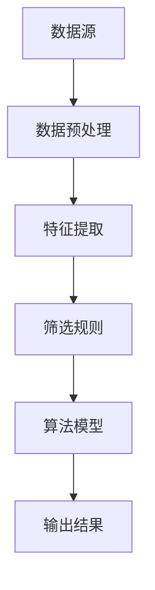

                 

# 如何构建高效的特价股票筛选模型

> 关键词：特价股票筛选，股票筛选模型，机器学习，数据分析，投资策略

> 摘要：本文将详细介绍如何构建一个高效的特价股票筛选模型，从背景介绍到算法实现，从系统设计到项目实战，一步步引导读者掌握构建此类模型的核心方法和技巧。文章内容涵盖数据特征分析、算法选择、模型优化、系统架构设计等关键环节，结合实际案例和代码实现，帮助读者深入理解如何利用技术手段在股票市场中寻找潜在的特价股票投资机会。

---

# 第一部分: 特价股票筛选模型的背景与核心概念

## 第1章: 特价股票筛选模型的背景介绍

### 1.1 问题背景与问题描述

#### 1.1.1 什么是特价股票
特价股票通常指那些价格显著低于其内在价值，或者价格相对市场指数处于历史低位的股票。这些股票可能是由于市场短期波动、公司特定事件或行业周期性调整而导致价格被低估的股票。

#### 1.1.2 特价股票的定义与特征
特价股票的定义可以参考以下几个关键特征：
1. **低估值**：市盈率（P/E）、市净率（P/B）等估值指标低于行业平均水平或历史平均水平。
2. **低价格**：股票价格处于近期低点或历史低点。
3. **高潜力**：公司基本面良好，未来有较大的增长潜力。
4. **流动性**：股票成交量较高，便于快速买卖。

#### 1.1.3 特价股票筛选的必要性
在股票市场中，投资者希望通过筛选特价股票来发现潜在的投资机会。这种筛选可以帮助投资者快速定位到那些被市场低估的股票，从而在市场反弹或公司基本面改善时获得超额收益。

---

### 1.2 问题解决与边界外延

#### 1.2.1 特价股票筛选的目标
特价股票筛选的目标可以分为以下几个方面：
1. **发现潜在投资机会**：通过筛选，找到那些价格被低估的股票。
2. **降低投资风险**：通过筛选，避免投资于高估值或基本面不佳的股票。
3. **提高投资效率**：通过自动化筛选，减少人工分析的时间和成本。

#### 1.2.2 特价股票筛选的边界
在实际应用中，特价股票筛选需要明确以下几个边界条件：
1. **时间范围**：筛选的时间范围是过去的一段时间，通常为最近几个月或几年。
2. **行业限制**：某些行业可能更适合寻找特价股票，例如周期性行业或受短期冲击的行业。
3. **数据范围**：筛选的数据范围包括历史价格、财务数据、市场情绪等。

#### 1.2.3 特价股票筛选的外延
特价股票筛选的外延包括以下几个方面：
1. **动态调整**：随着市场变化，定期更新筛选条件。
2. **多维度分析**：结合技术分析和基本面分析，全面评估股票的投资价值。
3. **风险管理**：结合止损策略，控制投资风险。

---

### 1.3 概念结构与核心要素

#### 1.3.1 特价股票筛选的核心要素
特价股票筛选的核心要素包括以下几个方面：
1. **数据源**：包括历史价格、财务数据、市场情绪等。
2. **筛选规则**：基于估值指标、价格指标等制定的筛选条件。
3. **算法模型**：用于自动筛选符合条件的股票。
4. **输出结果**：筛选出的潜在特价股票列表。

#### 1.3.2 各要素之间的关系
通过表格对比，我们可以更清晰地理解各要素之间的关系：

| 要素 | 描述 | 关系 |
|------|------|------|
| 数据源 | 筛选的基础数据 | 数据源的质量直接影响筛选结果 |
| 筛选规则 | 筛选的条件 | 筛选规则的合理性直接影响筛选结果的准确性 |
| 算法模型 | 筛选的工具 | 算法模型的性能直接影响筛选的效率和效果 |
| 输出结果 | 筛选的最终结果 | 输出结果的可解释性直接影响投资者的决策 |

#### 1.3.3 模型的核心架构
通过以下Mermaid图，我们可以更直观地理解模型的核心架构：

---

## 第2章: 特价股票筛选模型的核心概念

### 2.1 数据特征与筛选规则

#### 2.1.1 市场数据特征
市场数据特征包括以下几种：
- **历史价格**：包括开盘价、收盘价、最高价、最低价等。
- **成交量**：包括成交额、换手率等。
- **市场指数**：包括上证指数、恒生指数等。

#### 2.1.2 股票特征分析
股票特征分析包括以下几种：
- **估值指标**：市盈率（P/E）、市净率（P/B）、股息率等。
- **技术指标**：移动平均线（MA）、相对强弱指数（RSI）、MACD等。
- **财务指标**：净利润增长率、营业收入增长率、资产负债率等。

#### 2.1.3 筛选规则的制定
根据股票特征，我们可以制定以下几种筛选规则：
1. **低估值规则**：筛选市盈率低于行业平均水平的股票。
2. **低价位规则**：筛选价格低于近期最低价的股票。
3. **高增长规则**：筛选净利润增长率高于行业平均水平的股票。

---

### 2.2 算法选择与模型构建

#### 2.2.1 选择合适的算法
在选择算法时，我们需要考虑以下几个方面：
- **数据类型**：如果数据是分类数据，可以使用逻辑回归、随机森林等分类算法。
- **数据量**：如果数据量较小，可以使用线性回归、决策树等简单算法。
- **目标**：如果目标是分类问题，可以使用SVM、神经网络等算法。

---

（由于篇幅限制，后续章节内容将在后续思考中展开。）

