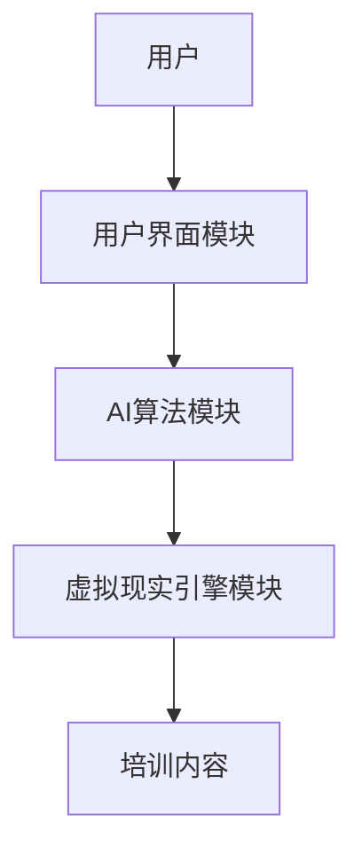

                 


# 如何评估企业的AI驱动的虚拟现实培训系统

> 关键词：AI, 虚拟现实, 企业培训, 系统评估, 技术实现, 算法优化

> 摘要：本文将详细探讨如何评估企业中的AI驱动的虚拟现实培训系统。通过系统化的评估方法和实际案例分析，帮助读者理解该系统的核心构成、工作原理以及如何优化其性能。我们将从背景介绍、核心概念、评估方法、系统架构到项目实战，全面解析这一技术的实现与应用。

---

## 第一部分: 背景与核心概念

### 第1章: 虚拟现实与人工智能的结合

#### 1.1 虚拟现实技术概述
- **1.1.1 虚拟现实的基本概念**
  - 虚拟现实（Virtual Reality，VR）是一种利用计算机生成的三维虚拟环境，通过特殊的设备（如头显、手柄等）让用户沉浸式地与虚拟世界互动。
  - VR的核心技术包括：图形渲染、实时交互、传感器技术等。

- **1.1.2 虚拟现实的核心技术**
  - 图形渲染：通过GPU实时渲染三维场景，实现高帧率和高质量的视觉效果。
  - 交互技术：通过手柄、手势识别等设备实现用户与虚拟环境的互动。
  - 传感器技术：利用加速度计、陀螺仪等传感器捕捉用户的动作，实现精准的实时定位。

- **1.1.3 虚拟现实的应用领域**
  - 教育培训：虚拟教室、虚拟实验室等。
  - 医疗模拟：手术模拟、解剖训练等。
  - 工业制造：设备操作培训、流程模拟等。
  - 娱乐：虚拟游戏、虚拟旅游等。

#### 1.2 人工智能在虚拟现实中的应用
- **1.2.1 AI驱动的虚拟现实系统**
  - AI通过分析用户行为数据，动态调整虚拟环境，提供个性化的培训内容。
  - 例如：根据用户的操作错误，实时生成纠正性提示或调整训练难度。

- **1.2.2 AI在虚拟现实中的主要功能**
  - 数据采集与分析：通过传感器和用户输入，收集用户的动作、反应时间等数据。
  - 决策与优化：基于AI算法，优化虚拟环境中的任务设置，提升培训效果。
  - 个性化推荐：根据用户的学习进度，推荐适合的培训内容。

- **1.2.3 AI与虚拟现实的结合优势**
  - 提高培训效率：AI可以根据用户的表现实时调整培训内容。
  - 增强沉浸感：AI驱动的虚拟角色可以与用户互动，提供更真实的体验。
  - 数据驱动的优化：通过分析大量用户数据，不断优化培训系统。

#### 1.3 企业培训系统的发展趋势
- **1.3.1 传统企业培训模式的局限性**
  - 成本高：需要场地、讲师、设备等大量投入。
  - 效率低：学员之间的互动有限，难以实现个性化教学。
  - 灵活性差：难以快速调整培训内容以适应变化。

- **1.3.2 虚拟现实技术在企业培训中的优势**
  - 成本降低：通过虚拟环境减少实体设备的需求。
  - 提高效率：支持多人同时参与，且可以根据个人需求调整内容。
  - 增强体验：通过沉浸式体验，提升学员的学习效果。

- **1.3.3 AI驱动的虚拟现实培训系统的出现**
  - 结合AI和VR的优势，实现智能化、个性化的培训。
  - 例如：AI驱动的虚拟导师可以实时指导学员操作，根据表现动态调整训练内容。

---

### 第2章: AI驱动的虚拟现实培训系统的核心概念

#### 2.1 系统组成与功能模块
- **2.1.1 虚拟现实硬件**
  - 头戴式显示器（HMD）：如Oculus Rift、HTC Vive等。
  - 手柄或控制器：用于用户与虚拟环境的交互。
  - 传感器：用于捕捉用户的动作和位置。

- **2.1.2 AI驱动的培训内容生成**
  - 数据采集：通过传感器和用户输入，收集用户的动作、反应时间等数据。
  - 数据分析：利用机器学习算法，分析用户的表现，生成个性化的培训内容。
  - 内容动态调整：根据用户的学习进度，实时优化培训任务。

- **2.1.3 培训效果评估模块**
  - 评估指标：如任务完成时间、操作准确性、学习进度等。
  - 数据可视化：通过图表或报告，展示用户的学习效果。
  - 反馈机制：根据评估结果，向用户或管理员提供改进建议。

#### 2.2 系统工作原理
- **2.2.1 用户行为数据的采集与分析**
  - 采集方式：通过传感器和用户输入，实时记录用户的动作数据。
  - 数据预处理：清洗、归一化等处理，确保数据质量。
  - 数据分析：利用机器学习算法，分析用户的行为模式，生成个性化的培训内容。

- **2.2.2 AI算法对培训内容的优化**
  - 算法选择：根据具体需求，选择合适的机器学习算法（如决策树、随机森林等）。
  - 算法实现：通过训练模型，优化虚拟环境中的任务设置，提升培训效果。
  - 动态调整：根据用户的表现，实时调整培训内容的难度和复杂度。

- **2.2.3 虚拟现实环境的动态调整**
  - 根据用户的操作，动态调整虚拟环境中的场景、任务等。
  - 例如：如果用户在某个任务中表现不佳，系统可以降低任务难度，或增加提示信息。

#### 2.3 系统的核心要素
- **2.3.1 数据采集与处理**
  - 数据来源：传感器、用户输入、系统日志等。
  - 数据处理：清洗、转换、存储等，确保数据可用性。

- **2.3.2 AI算法模型**
  - 算法选择：根据具体需求，选择合适的机器学习算法。
  - 模型训练：利用训练数据，训练模型，实现对用户行为的预测和分析。

- **2.3.3 虚拟现实引擎**
  - 引擎选择：如Unity、Unreal Engine等。
  - 引擎功能：图形渲染、物理模拟、交互设计等。

---

## 第二部分: 评估方法与系统架构

### 第3章: 评估方法论

#### 3.1 评估指标体系
- **3.1.1 系统性能指标**
  - 帧率：系统的渲染帧率，影响用户体验。
  - 响应时间：系统对用户输入的响应时间，影响交互的流畅性。
  - 系统稳定性：系统的运行稳定性，影响用户的使用体验。

- **3.1.2 用户体验指标**
  - 沉浸感：用户对虚拟环境的沉浸感体验。
  - 操作便捷性：用户对系统操作的满意度。
  - 系统易用性：用户对系统界面和操作流程的满意度。

- **3.1.3 培训效果指标**
  - 学习效果：用户在培训后的技能提升情况。
  - 培训效率：用户完成培训任务所需的时间。
  - 用户满意度：用户对培训效果的满意度。

#### 3.2 数据采集与分析方法
- **3.2.1 用户行为数据的采集**
  - 数据采集工具：如传感器、日志记录等。
  - 数据采集方法：实时采集用户的动作、反应时间等数据。

- **3.2.2 数据预处理与特征提取**
  - 数据清洗：去除噪声数据，确保数据质量。
  - 数据转换：将数据转换为适合算法处理的形式。
  - 特征提取：提取关键特征，如用户的反应时间、操作准确率等。

- **3.2.3 数据分析与评估模型构建**
  - 数据分析方法：统计分析、机器学习等。
  - 评估模型构建：基于数据，构建评估模型，预测用户的培训效果。

---

### 第4章: 系统架构设计

#### 4.1 系统功能模块设计
- **4.1.1 用户界面模块**
  - 用户登录与注册：用户可以通过用户名和密码登录系统。
  - 培训内容选择：用户可以选择不同的培训任务。
  - 培训记录：用户可以查看自己的培训记录和评估结果。

- **4.1.2 AI算法模块**
  - 数据采集与分析：实时采集用户的行为数据，并进行分析。
  - 内容生成：根据分析结果，生成个性化的培训内容。
  - 系统优化：根据评估结果，优化系统性能。

- **4.1.3 虚拟现实引擎模块**
  - 场景渲染：渲染三维虚拟场景。
  - 交互设计：实现用户与虚拟环境的互动。
  - 系统控制：控制系统的运行和状态。

#### 4.2 系统架构图


#### 4.3 系统接口设计
- **4.3.1 用户与系统交互接口**
  - 用户通过头显和手柄与系统互动。
  - 系统通过传感器采集用户的行为数据。

- **4.3.2 系统内部接口**
  - AI算法模块与虚拟现实引擎模块之间的数据传输接口。
  - 系统通过API实现模块之间的通信。

- **4.3.3 数据接口**
  - 数据采集接口：采集用户的动作数据。
  - 数据存储接口：存储用户的培训记录和评估结果。

---

### 第5章: 系统交互流程

#### 5.1 用户注册与登录
- **5.1.1 用户信息采集**
  - 用户输入姓名、邮箱、密码等信息。
  - 系统验证用户信息，完成注册或登录。

- **5.1.2 用户权限管理**
  - 根据用户角色（如管理员、普通用户）分配权限。
  - 权限管理模块控制用户的操作范围。

#### 5.2 培训内容生成
- **5.2.1 AI算法分析用户需求**
  - 系统根据用户的注册信息和历史数据，分析用户的需求。
  - 例如：根据用户的技能水平，生成适合的培训任务。

- **5.2.2 虚拟现实环境构建**
  - 根据AI算法生成的培训任务，构建虚拟环境。
  - 例如：生成一个模拟工厂的三维场景，用户可以在其中进行设备操作训练。

- **5.2.3 培训内容动态调整**
  - 根据用户的实时表现，动态调整培训内容。
  - 例如：如果用户在某个任务中表现不佳，系统可以降低任务难度或增加提示信息。

#### 5.3 培训效果评估
- **5.3.1 数据采集与分析**
  - 系统实时采集用户的动作数据，分析用户的操作表现。
  - 例如：记录用户的反应时间、操作准确率等。

- **5.3.2 评估结果反馈**
  - 系统根据分析结果，生成评估报告。
  - 例如：报告中包含用户的培训成绩、改进建议等。

- **5.3.3 系统优化建议**
  - 根据评估结果，优化系统性能或调整培训内容。
  - 例如：根据用户的反馈，优化虚拟环境中的任务设置。

---

## 第三部分: 项目实战与总结

### 第6章: 项目实战

#### 6.1 环境搭建
- **6.1.1 开发工具安装**
  - 安装虚拟现实开发平台（如Unity、Unreal Engine）。
  - 安装AI算法库（如TensorFlow、PyTorch）。

- **6.1.2 虚拟现实引擎配置**
  - 配置开发环境，选择合适的虚拟现实引擎。
  - 例如：在Unity中设置虚拟场景和交互逻辑。

- **6.1.3 AI算法库的安装与配置**
  - 安装机器学习库（如Scikit-learn、XGBoost）。
  - 配置开发环境，确保AI算法可以正常运行。

#### 6.2 系统核心实现
- **6.2.1 用户行为数据采集代码**
  ```python
  import numpy as np
  import pandas as pd
  import time

  # 数据采集函数
  def collect_user_data():
      data = []
      while True:
          # 模拟传感器数据
          timestamp = time.time()
          x = np.random.uniform(0, 1)
          y = np.random.uniform(0, 1)
          z = np.random.uniform(0, 1)
          data.append([timestamp, x, y, z])
          time.sleep(0.1)
      return data

  # 数据采集并存储
  def main():
      data = collect_user_data()
      df = pd.DataFrame(data, columns=['timestamp', 'x', 'y', 'z'])
      df.to_csv('user_data.csv', index=False)

  if __name__ == '__main__':
      main()
  ```

- **6.2.2 AI算法实现代码**
  ```python
  from sklearn.tree import DecisionTreeClassifier
  from sklearn.model_selection import train_test_split
  import pandas as pd

  # 加载数据
  df = pd.read_csv('user_data.csv')
  X = df[['x', 'y', 'z']]
  y = df['timestamp']

  # 数据分割
  X_train, X_test, y_train, y_test = train_test_split(X, y, test_size=0.2, random_state=42)

  # 模型训练
  clf = DecisionTreeClassifier()
  clf.fit(X_train, y_train)

  # 模型预测
  y_pred = clf.predict(X_test)

  # 模型评估
  accuracy = clf.score(X_test, y_test)
  print(f'Accuracy: {accuracy}')
  ```

#### 6.3 实际案例分析
- **6.3.1 案例背景**
  - 某企业希望优化员工的技能培训，引入AI驱动的虚拟现实培训系统。
  - 系统目标：提升员工的技能培训效率和效果。

- **6.3.2 系统实现**
  - 根据企业需求，设计并实现AI驱动的虚拟现实培训系统。
  - 系统功能：用户注册与登录、个性化培训内容生成、培训效果评估。

- **6.3.3 系统优化**
  - 根据用户的反馈，不断优化系统性能和用户体验。
  - 例如：根据用户的需求，增加更多的培训场景或任务类型。

#### 6.4 项目小结
- 通过实际案例分析，验证了AI驱动的虚拟现实培训系统的可行性和有效性。
- 系统可以根据用户的需求，实时调整培训内容，提升培训效果。
- 系统的评估方法可以为企业的培训优化提供科学依据。

---

## 第四部分: 总结与展望

### 第7章: 总结与展望

#### 7.1 评估总结
- AI驱动的虚拟现实培训系统通过结合虚拟现实技术和人工智能算法，可以实现智能化、个性化的培训。
- 通过系统化的评估方法，可以确保系统的性能和用户体验达到最佳状态。

#### 7.2 未来展望
- **技术优化方向**
  - 提高系统的渲染帧率，增强用户体验。
  - 引入更复杂的AI算法，如深度学习，进一步优化培训内容生成。
  - 研究更先进的传感器技术，提升数据采集的精度和效率。

- **应用拓展**
  - 将AI驱动的虚拟现实培训系统应用于更多领域，如医疗、教育、制造业等。
  - 探索系统的更多应用场景，如虚拟团队协作、虚拟会议等。

#### 7.3 最佳实践Tips
- 在系统设计和实现过程中，建议企业：
  - 确保数据的准确性和完整性，为系统的优化提供可靠的数据支持。
  - 定期评估系统的性能和用户体验，及时优化系统。
  - 加强用户的数据隐私保护，确保系统的安全性。

#### 7.4 项目小结
- 通过本文的详细讲解，读者可以全面了解如何评估和实现AI驱动的虚拟现实培训系统。
- 希望本文的内容能够为企业的培训优化提供有价值的参考和指导。

---

## 作者

作者：AI天才研究院/AI Genius Institute & 禅与计算机程序设计艺术/Zen And The Art of Computer Programming

