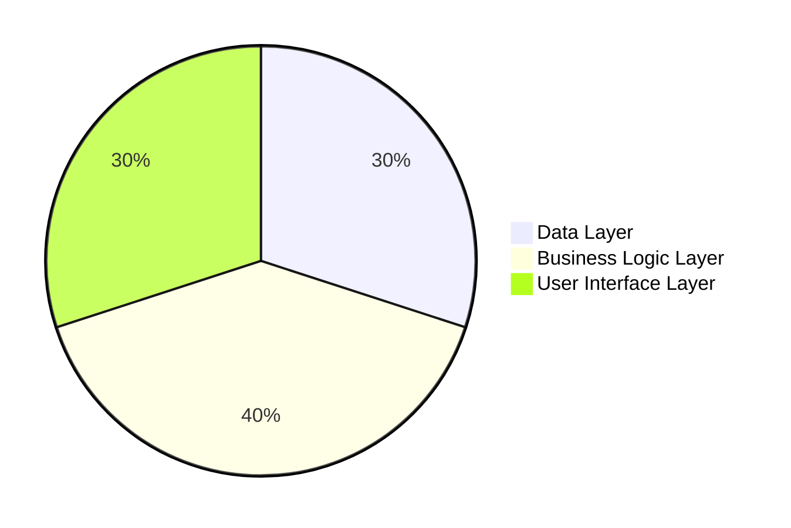

                 


# 如何评估企业的人工智能伦理标准

> 关键词：人工智能伦理、企业评估、公平性、透明性、隐私保护、责任追溯

> 摘要：本文将详细探讨如何评估企业的人工智能伦理标准，涵盖公平性、透明性、隐私保护和责任追溯等方面。通过系统化的分析和具体的案例，结合数学模型和算法原理，提供一个全面的评估框架，帮助企业在开发和应用AI系统时确保伦理合规。

---

## 第一部分：企业AI伦理评估背景

### 第1章：企业AI伦理评估背景

#### 1.1 AI技术的快速发展与伦理挑战

##### 1.1.1 AI技术的快速发展
人工智能（AI）技术近年来取得了显著的进步，从自然语言处理到计算机视觉，AI的应用场景不断扩展，涵盖了医疗、金融、教育、交通等多个领域。这些技术的快速发展为企业带来了巨大的商业价值和效率提升。

##### 1.1.2 AI技术带来的伦理问题
然而，随着AI技术的广泛应用，伦理问题也逐渐浮现。例如，AI系统可能因为训练数据中的偏见而产生不公平的决策；数据的收集和使用可能侵犯用户的隐私；AI的决策过程缺乏透明性，导致用户难以信任；此外，AI系统的错误可能引发法律责任问题。

##### 1.1.3 企业AI伦理评估的必要性
为了应对这些伦理挑战，企业需要建立一套完善的AI伦理评估体系，确保其AI系统在设计和应用过程中符合伦理标准。这不仅有助于提升企业的社会形象，还能规避法律风险，增强用户信任。

#### 1.2 企业AI伦理评估的定义与目标

##### 1.2.1 企业AI伦理评估的定义
企业AI伦理评估是指对企业开发和应用的AI系统进行系统化的检查和分析，以确保这些系统在公平性、透明性、隐私保护和责任追溯等方面的合规性。

##### 1.2.2 企业AI伦理评估的目标
- **确保公平性**：避免AI系统因数据偏见而产生不公平的决策。
- **提升透明性**：让用户了解AI系统的决策过程，增强信任。
- **保护隐私**：确保用户数据的安全和合规使用。
- **明确责任**：在AI系统出现错误或损害时，能够追溯责任，确保 accountability。

##### 1.2.3 企业AI伦理评估的意义
通过AI伦理评估，企业可以建立一个可持续发展的AI应用环境，提升企业的社会责任感，同时降低法律和声誉风险。

---

### 第2章：AI伦理评估的核心概念

#### 2.1 公平性

##### 2.1.1 公平性的定义
公平性是指AI系统在不同群体或个体之间的决策不应因种族、性别、年龄等因素而产生不公平的结果。

##### 2.1.2 公平性评估的方法
- **数据预处理**：对训练数据进行清洗，去除可能引入偏见的因素。
- **模型后处理**：在模型输出后进行调整，确保决策的公平性。
- **对照测试**：将AI系统的决策与人工决策进行对比，评估是否存在不公平现象。

##### 2.1.3 公平性评估的挑战
- 数据偏见难以完全消除。
- 不同场景下的公平性标准可能不同。
- 公平性评估可能需要大量的计算资源。

#### 2.2 透明性

##### 2.2.1 透明性的定义
透明性是指AI系统的决策过程对用户或利益相关者来说是可解释和可理解的。

##### 2.2.2 透明性评估的方法
- **模型解释性**：使用可解释的模型（如线性回归、决策树）替代复杂的黑箱模型（如深度神经网络）。
- **用户界面**：通过可视化工具向用户展示AI系统的决策过程。
- **文档记录**：详细记录AI系统的设计和决策逻辑，供相关人员查阅。

##### 2.2.3 透明性评估的挑战
- 高复杂度的模型通常难以解释。
- 用户的理解能力可能有限。
- 透明性可能与模型的准确性之间存在 trade-off。

#### 2.3 隐私保护

##### 2.3.1 隐私保护的定义
隐私保护是指在AI系统中，用户的数据不会被未经授权的第三方访问或滥用。

##### 2.3.2 隐私保护评估的方法
- **数据匿名化**：对敏感数据进行匿名化处理，确保无法回溯到个人。
- **数据最小化**：仅收集实现目标所需的最小数据量。
- **加密技术**：使用加密技术保护数据在传输和存储过程中的安全。

##### 2.3.3 隐私保护评估的挑战
- 数据匿名化可能导致数据质量下降。
- 加密技术可能增加计算开销。
- 难以平衡数据可用性和隐私保护之间的关系。

#### 2.4 责任与可追溯性

##### 2.4.1 责任的定义
责任是指在AI系统出现错误或损害时，能够明确相关方的责任归属。

##### 2.4.2 可追溯性评估的方法
- **日志记录**：详细记录AI系统的运行日志，包括输入、输出和决策过程。
- **责任分配**：明确企业在AI系统中的角色和责任，确保在出现问题时能够快速响应。
- **法律合规**：确保AI系统的开发和应用符合相关法律法规，特别是在数据保护和隐私方面。

##### 2.4.3 责任与可追溯性评估的挑战
- 跨界责任问题：AI系统可能涉及多个参与方，责任归属可能不明确。
- 技术复杂性：AI系统的决策过程可能难以追溯。
- 法律法规的不确定性：不同地区对AI责任的法律定义可能不同。

---

### 第3章：AI伦理评估的核心要素

#### 3.1 评估维度

##### 3.1.1 公平性
- **指标**：群体间决策差异、个体公平性评分。
- **方法**：对比不同群体的决策结果，计算差异程度。

##### 3.1.2 透明性
- **指标**：模型解释度、用户理解度。
- **方法**：通过用户调研和专家评估来衡量透明性。

##### 3.1.3 隐私保护
- **指标**：数据泄露风险、数据匿名化程度。
- **方法**：评估数据保护措施的有效性，检查是否存在数据泄露的漏洞。

##### 3.1.4 责任与可追溯性
- **指标**：责任分配清晰度、日志记录完整性。
- **方法**：审查企业的责任分配机制，检查日志记录的详细程度。

#### 3.2 评估指标

##### 3.2.1 公平性指标
- **群体公平性**：确保不同群体的决策结果无显著差异。
- **个体公平性**：确保每个个体的决策结果无偏见。

##### 3.2.2 透明性指标
- **模型可解释性**：模型的决策逻辑是否清晰易懂。
- **用户知情权**：用户是否被告知AI系统是如何做出决策的。

##### 3.2.3 隐私保护指标
- **数据保护措施**：数据是否被加密、匿名化处理。
- **数据使用范围**：数据是否仅用于预期目的。

##### 3.2.4 责任与可追溯性指标
- **责任分配**：是否明确了相关方的责任。
- **可追溯性**：是否能够通过日志记录追溯决策过程。

#### 3.3 评估框架

##### 3.3.1 框架的定义
评估框架是指一组用于系统化评估AI伦理标准的步骤和方法。

##### 3.3.2 框架的组成部分
- **数据收集**：收集与AI系统相关的数据和文档。
- **初步评估**：基于核心概念进行初步检查。
- **详细评估**：针对每个评估维度进行深入分析。
- **结果反馈**：将评估结果反馈给相关部门，并提出改进建议。

##### 3.3.3 框架的应用场景
- **新系统上线**：在AI系统正式投入使用前进行评估。
- **现有系统优化**：定期对现有AI系统进行伦理评估，确保其持续合规。
- **应对监管要求**：满足相关法律法规对AI伦理的要求。

---

## 第二部分：AI伦理评估的算法与数学模型

### 第4章：AI伦理评估算法原理

#### 4.1 偏见检测算法

##### 4.1.1 偏见检测的定义
偏见检测是指识别AI系统在决策过程中是否存在不公平的偏见。

##### 4.1.2 偏见检测算法的原理
- **数据预处理**：对训练数据进行清洗，去除可能引入偏见的因素。
- **模型训练**：使用无偏见的数据训练模型。
- **偏见检测**：通过对比不同群体的决策结果，检测是否存在偏见。

##### 4.1.3 偏见检测算法的实现
```python
import pandas as pd
from sklearn.metrics import accuracy_score

def detect_bias(model, X, y):
    # 按群体划分数据
    groups = X['group'].unique()
    accuracy = {}
    for group in groups:
        X_group = X[X['group'] == group]
        y_group = y[X['group'] == group]
        y_pred = model.predict(X_group)
        accuracy[group] = accuracy_score(y_group, y_pred)
    # 检测群体间的准确性差异
    max_accuracy = max(accuracy.values)
    min_accuracy = min(accuracy.values)
    bias = max_accuracy - min_accuracy
    return bias
```

#### 4.2 隐私保护算法

##### 4.2.1 隐私保护的定义
隐私保护是指在AI系统中，用户的数据不会被未经授权的第三方访问或滥用。

##### 4.2.2 隐私保护算法的原理
- **数据加密**：对敏感数据进行加密处理，确保数据在传输和存储过程中的安全性。
- **数据匿名化**：对数据进行匿名化处理，去除或模糊化个人身份信息。
- **隐私保护评估**：通过数学模型评估数据的隐私保护程度。

##### 4.2.3 隐私保护算法的实现
```python
import numpy as np
from sklearn.decomposition import PCA

def data_anonymization(X, sensitive_columns):
    # 删除敏感列
    X_anonymized = X.drop(columns=sensitive_columns)
    # 应用PCA进行数据降维
    pca = PCA(n_components=2)
    X_pca = pca.fit_transform(X_anonymized)
    return X_pca
```

#### 4.3 责任追溯算法

##### 4.3.1 责任追溯的定义
责任追溯是指在AI系统出现问题时，能够追溯决策过程并明确相关方的责任。

##### 4.3.2 责任追溯算法的原理
- **日志记录**：详细记录AI系统的运行日志，包括输入、输出和决策过程。
- **责任分配**：根据日志记录，明确相关方的责任。
- **可追溯性评估**：通过日志记录的完整性，评估系统的可追溯性。

##### 4.3.3 责任追溯算法的实现
```python
import logging
import datetime

def log_decision(model, X, y_true):
    # 记录日志
    logger = logging.getLogger(__name__)
    logger.setLevel(logging.INFO)
    handler = logging.StreamHandler()
    logger.addHandler(handler)
    
    y_pred = model.predict(X)
    log_entry = f"{datetime.datetime.now()}: Input: {X}, Prediction: {y_pred}, True: {y_true}"
    logger.info(log_entry)
```

### 第5章：AI伦理评估的数学模型

#### 5.1 偏见检测的数学模型

##### 5.1.1 偏见检测的公式
$$ \text{偏见} = \max(\text{accuracy}_i) - \min(\text{accuracy}_j) $$

##### 5.1.2 偏见检测的计算步骤
1. 对训练数据按群体进行划分。
2. 分别训练每个群体的模型，并计算准确率。
3. 计算群体间准确率的最大差值，作为偏见的衡量指标。

##### 5.1.3 偏见检测的实例分析
假设有一个招聘AI系统，训练数据中包含性别信息。计算男性和女性的通过率，如果通过率差异显著，则可能存在性别偏见。

#### 5.2 隐私保护的数学模型

##### 5.2.1 隐私保护的公式
$$ \text{隐私风险} = \frac{\text{数据泄露事件数}}{\text{数据总量}} $$

##### 5.2.2 隐私保护的计算步骤
1. 对敏感数据进行匿名化处理。
2. 计算数据泄露事件数。
3. 根据公式计算隐私风险。

##### 5.2.3 隐私保护的实例分析
假设有一个医疗AI系统，处理患者数据。通过数据匿名化处理，确保患者身份无法被识别，从而降低隐私泄露风险。

#### 5.3 责任追溯的数学模型

##### 5.3.1 责任追溯的公式
$$ \text{可追溯性} = \frac{\text{可追溯的决策数}}{\text{总决策数}} $$

##### 5.3.2 责任追溯的计算步骤
1. 对AI系统的决策过程进行日志记录。
2. 统计可追溯的决策数和总决策数。
3. 计算可追溯性。

##### 5.3.3 责任追溯的实例分析
假设有一个金融AI系统，记录每笔交易的决策日志。通过日志记录，可以追溯每笔交易的决策过程，确保责任明确。

---

## 第三部分：AI伦理评估的系统分析与架构设计

### 第6章：系统分析与架构设计

#### 6.1 系统功能设计

##### 6.1.1 系统功能模块
- **数据收集模块**：收集与AI系统相关的数据和文档。
- **初步评估模块**：基于核心概念进行初步检查。
- **详细评估模块**：针对每个评估维度进行深入分析。
- **结果反馈模块**：将评估结果反馈给相关部门，并提出改进建议。

##### 6.1.2 功能模块的交互
- 数据收集模块向初步评估模块提供数据。
- 初步评估模块根据数据进行初步检查，并将结果传递给详细评估模块。
- 详细评估模块对每个维度进行深入分析，并将结果反馈给结果反馈模块。
- 结果反馈模块将评估结果呈现给相关人员，并提出改进建议。

##### 6.1.3 功能模块的实现
```python
class AI_Ethics_Assessment:
    def __init__(self):
        self.dataCollector = DataCollector()
        self.initialAssessment = InitialAssessment()
        self.detailedAssessment = DetailedAssessment()
        self.resultFeedback = ResultFeedback()

    def assess(self):
        data = self.dataCollector.collect_data()
        initial_result = self.initialAssessment.check_initial(data)
        detailed_result = self.detailedAssessment.assess_detailed(data, initial_result)
        self.resultFeedback.display_results(detailed_result)
```

#### 6.2 系统架构设计

##### 6.2.1 系统架构的组成部分
- **数据层**：存储与AI系统相关的数据和文档。
- **业务逻辑层**：实现AI伦理评估的核心逻辑。
- **用户界面层**：提供直观的用户界面，方便用户进行评估和查看结果。

##### 6.2.2 系统架构的设计原则
- **模块化设计**：各功能模块相对独立，便于维护和扩展。
- **高可用性**：确保系统在高负载下的稳定运行。
- **安全性**：保护数据和系统的安全性，防止未经授权的访问。

##### 6.2.3 系统架构的实现


---

## 第四部分：项目实战

### 第7章：项目实战

#### 7.1 项目介绍

##### 7.1.1 项目背景
假设我们有一个招聘AI系统，用于自动筛选简历并推荐候选人。我们需要评估该系统的AI伦理标准，确保其公平性、透明性和隐私保护。

#### 7.2 环境安装

##### 7.2.1 环境要求
- Python 3.8+
- Jupyter Notebook
- Scikit-learn
- Mermaid
- Pandas

#### 7.3 核心实现

##### 7.3.1 数据收集
```python
import pandas as pd

def collect_data():
    data = pd.read_csv('resume.csv')
    return data
```

##### 7.3.2 偏见检测
```python
from sklearn.metrics import accuracy_score

def detect_bias(model, X, y):
    groups = X['gender'].unique()
    accuracy = {}
    for group in groups:
        X_group = X[X['gender'] == group]
        y_group = y[X['gender'] == group]
        y_pred = model.predict(X_group)
        accuracy[group] = accuracy_score(y_group, y_pred)
    bias = max(accuracy.values) - min(accuracy.values)
    return bias
```

##### 7.3.3 隐私保护
```python
from sklearn.decomposition import PCA

def data_anonymization(X, sensitive_columns):
    X_anonymized = X.drop(columns=sensitive_columns)
    pca = PCA(n_components=2)
    X_pca = pca.fit_transform(X_anonymized)
    return X_pca
```

##### 7.3.4 责任追溯
```python
import logging
import datetime

def log_decision(model, X, y_true):
    logger = logging.getLogger(__name__)
    logger.setLevel(logging.INFO)
    handler = logging.StreamHandler()
    logger.addHandler(handler)
    
    y_pred = model.predict(X)
    log_entry = f"{datetime.datetime.now()}: Input: {X}, Prediction: {y_pred}, True: {y_true}"
    logger.info(log_entry)
```

#### 7.4 代码应用解读与分析

##### 7.4.1 数据收集
我们从CSV文件中读取简历数据，包括候选人的性别、年龄、教育背景等信息。

##### 7.4.2 偏见检测
通过检测模型在不同性别群体中的准确率差异，评估是否存在性别偏见。

##### 7.4.3 隐私保护
对敏感数据（如性别、年龄）进行匿名化处理，确保数据安全。

##### 7.4.4 责任追溯
通过日志记录，记录每条决策的输入、预测结果和真实结果，确保在出现问题时能够追溯。

#### 7.5 实际案例分析和详细讲解剖析

##### 7.5.1 案例分析
我们发现招聘AI系统在女性群体中的准确率显著低于男性群体，说明系统存在性别偏见。

##### 7.5.2 问题解决
通过对训练数据进行清洗，去除性别信息，并重新训练模型，消除偏见。

#### 7.6 项目小结

##### 7.6.1 项目成果
- 识别并解决了招聘AI系统中存在的性别偏见问题。
- 建立了完整的数据匿名化和责任追溯机制。
- 提升了系统的透明性和用户信任。

##### 7.6.2 经验总结
- 在AI系统开发和应用中，必须重视伦理评估，确保系统公平、透明和合规。
- 定期进行伦理评估，及时发现和解决问题。
- 建立有效的隐私保护和责任追溯机制，提升系统的可信度。

---

## 第五部分：最佳实践与总结

### 第8章：最佳实践与总结

#### 8.1 最佳实践 tips

##### 8.1.1 定期进行伦理评估
- 建议每季度进行一次伦理评估，确保系统持续合规。
- 在系统上线前进行初始评估，发现问题及时修复。

##### 8.1.2 建立伦理委员会
- 组建由技术、法律和伦理专家组成的伦理委员会，负责监督和指导AI系统的开发和应用。
- 定期召开会议，评估系统伦理表现，制定改进措施。

##### 8.1.3 提高员工伦理意识
- 对员工进行AI伦理培训，提升他们的伦理意识和责任感。
- 建立举报机制，鼓励员工发现并报告伦理问题。

##### 8.1.4 采用可解释的模型
- 尽量使用可解释的模型（如线性回归、决策树）替代复杂的黑箱模型（如深度神经网络）。
- 提供模型解释工具，帮助用户理解AI决策过程。

##### 8.1.5 建立隐私保护机制
- 使用数据匿名化、加密等技术保护用户隐私。
- 明确数据使用范围，确保数据仅用于预期目的。

##### 8.1.6 建立责任追溯机制
- 详细记录AI系统的运行日志，确保在出现问题时能够追溯。
- 明确责任分配，确保每个决策都有相关人员负责。

#### 8.2 小结
通过本文的探讨，我们了解了如何评估企业的人工智能伦理标准，涵盖公平性、透明性、隐私保护和责任追溯等方面。通过系统化的分析和具体的案例，结合数学模型和算法原理，我们提供了一个全面的评估框架，帮助企业在开发和应用AI系统时确保伦理合规。

#### 8.3 注意事项
- 伦理评估是一个持续的过程，需要不断关注技术和法规的变化。
- 在实际应用中，可能需要根据具体场景调整评估方法和指标。
- 伦理评估的结果应当与企业的发展战略相结合，确保评估结果能够真正为企业带来价值。

#### 8.4 拓展阅读
- 《人工智能：一种现代的方法》
- 《机器学习实战》
- 《AI伦理与治理》

---

## 作者：AI天才研究院/AI Genius Institute & 禅与计算机程序设计艺术/Zen And The Art of Computer Programming

---

通过本文的系统化分析和详细讲解，我们希望能够帮助企业更好地评估和提升其AI系统的伦理标准，确保技术与伦理的协调发展。

