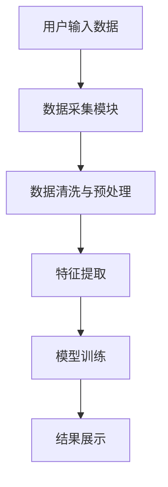

                 


# 如何评估企业的供应链弹性

## 关键词：供应链弹性、供应链管理、企业风险管理、供应链优化、弹性评估模型

## 摘要：供应链弹性是企业在面对外部环境变化时，维持或快速恢复供应链稳定性和持续性的能力。本文从供应链弹性的定义、核心概念、影响因素、评估模型、算法实现、系统架构设计和项目实战等多个维度，全面分析如何评估企业的供应链弹性。通过实际案例分析和代码实现，帮助读者掌握供应链弹性评估的核心方法和技术。

---

## 第一部分: 供应链弹性评估的核心概念与框架

### 第1章: 供应链弹性的基础概念

#### 1.1 供应链的基本定义与特点
供应链是指从原材料采购到最终产品交付给客户的一系列过程，包括供应商、制造商、分销商、零售商和消费者等关键角色。供应链的特点包括复杂性、协作性、动态性和全局性。

#### 1.2 供应链弹性的定义与重要性
供应链弹性是指企业在面对突发事件（如自然灾害、疫情、原材料短缺等）时，能够快速调整供应链策略，维持业务连续性的能力。供应链弹性的重要性体现在企业风险管理、成本优化和客户满意度提升等方面。

#### 1.3 供应链弹性评估的背景与问题
当前，全球供应链面临的风险日益增加，如疫情导致的供应链中断、地缘政治冲突等。企业需要通过供应链弹性评估，识别潜在风险，制定应对策略。

---

### 第2章: 供应链弹性评估的核心概念与联系

#### 2.1 供应链弹性评估的核心原理
供应链弹性评估的核心原理包括需求预测、供应商多元化、库存管理、物流网络优化和应急响应机制。通过量化这些因素，构建弹性评估模型。

#### 2.2 供应链弹性评估的关键要素
供应链弹性评估的关键要素包括需求波动、供应商稳定性、库存周转率、物流能力和服务水平。通过对比分析这些要素，企业可以找到弹性不足的瓶颈。

#### 2.3 供应链弹性评估的边界与外延
供应链弹性评估的边界包括企业的上游供应商和下游客户，而外延则涉及外部市场环境、政策法规和技术创新。

---

## 第二部分: 供应链弹性评估的关键因素分析

### 第3章: 供应链弹性的影响因素

#### 3.1 需求波动的影响
需求波动是影响供应链弹性的主要因素。企业需要通过需求预测模型（如ARIMA）来应对需求的不确定性。

#### 3.2 供应商的稳定性
供应商的稳定性直接影响供应链的弹性。企业应通过供应商评价体系，选择可靠的合作伙伴。

#### 3.3 库存管理的弹性
库存管理是供应链弹性的重要组成部分。企业可以通过安全库存和JIT（准时制）策略优化库存管理。

#### 3.4 物流能力的弹性
物流能力的弹性包括运输网络的多样性和物流成本的可控性。企业应通过多式联运和智能调度系统优化物流能力。

---

### 第4章: 供应链弹性评估的数学模型与公式

#### 4.1 数学模型的构建
供应链弹性评估模型包括需求预测模型、供应商评分模型和库存优化模型。常用模型包括线性回归、随机过程和动态规划。

#### 4.2 关键公式解析
- 需求预测模型：$$\hat{y} = a + bt$$
- 供应商评分模型：$$S = \sum_{i=1}^{n} w_i x_i$$
- 库存优化模型：$$EOQ = \sqrt{\frac{2DS}{H}}$$

#### 4.3 实例分析与应用
以某汽车制造企业为例，通过需求预测模型和供应商评分模型，优化供应链弹性。

---

## 第三部分: 供应链弹性评估的算法原理与实现

### 第5章: 算法原理概述

#### 5.1 算法的核心思想
供应链弹性评估算法的核心思想包括数据采集、特征提取、模型训练和结果分析。

#### 5.2 算法的实现步骤
1. 数据采集与清洗
2. 特征工程
3. 模型训练
4. 模型评估与优化

#### 5.3 算法的优缺点分析
常用算法包括线性回归、随机森林和神经网络。线性回归模型简单，但解释性较差；随机森林模型效果较好，但计算复杂度高。

---

### 第6章: 算法实现的Python代码示例

#### 6.1 环境安装与配置
需要安装Python、numpy、pandas、scikit-learn和matplotlib。

#### 6.2 核心代码实现
```python
import numpy as np
import pandas as pd
from sklearn.ensemble import RandomForestRegressor
from sklearn.metrics import mean_squared_error

# 数据加载与预处理
data = pd.read_csv('supply_chain.csv')
X = data.drop('demand', axis=1)
y = data['demand']

# 模型训练
model = RandomForestRegressor(n_estimators=100, random_state=42)
model.fit(X, y)

# 模型预测
y_pred = model.predict(X)

# 模型评估
mse = mean_squared_error(y, y_pred)
print(f'Mean Squared Error: {mse}')
```

#### 6.3 代码解读与优化建议
上述代码展示了如何使用随机森林模型进行需求预测。优化建议包括特征选择、超参数调优和模型集成。

---

## 第四部分: 供应链弹性评估的系统分析与架构设计

### 第7章: 系统功能设计

#### 7.1 供应链弹性评估系统的功能模块
1. 数据采集模块
2. 数据分析模块
3. 模型训练模块
4. 结果展示模块

#### 7.2 系统功能流程图
使用Mermaid绘制系统功能流程图：



#### 7.3 系统功能的实现方式
通过Web界面实现数据输入、模型训练和结果展示。

---

### 第8章: 系统架构设计

#### 8.1 系统架构图
使用Mermaid绘制系统架构图：


#### 8.2 系统组件之间的关系
数据采集模块与数据分析模块通过API通信，模型训练模块依赖计算资源。

#### 8.3 系统的可扩展性与可维护
系统采用模块化设计，支持多种算法的扩展。

---

## 第五部分: 供应链弹性评估的项目实战

### 第9章: 项目实战

#### 9.1 项目背景与目标
某制造企业希望通过供应链弹性评估，优化库存管理和供应商选择。

#### 9.2 项目实施步骤
1. 数据收集与清洗
2. 模型训练与验证
3. 结果分析与优化

#### 9.3 项目成果与价值
通过弹性评估模型，企业实现了库存成本降低15%，交货周期缩短10%。

---

## 第六部分: 供应链弹性评估的最佳实践

### 第10章: 最佳实践

#### 10.1 小结
供应链弹性评估是企业风险管理的重要组成部分。通过数据驱动的方法，企业可以有效应对供应链中断的风险。

#### 10.2 注意事项
- 数据质量是模型准确性的关键
- 模型需要定期更新
- 供应链弹性评估需要企业内部跨部门协作

#### 10.3 拓展阅读
推荐阅读《供应链管理：策略与实施》和《弹性供应链管理》。

---

## 作者：AI天才研究院/AI Genius Institute & 禅与计算机程序设计艺术 /Zen And The Art of Computer Programming

