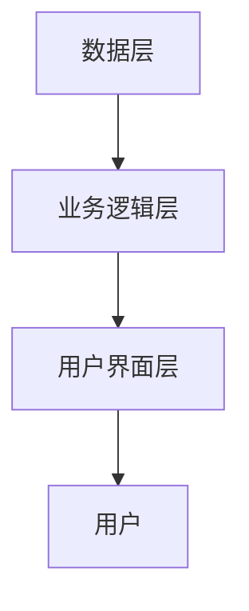
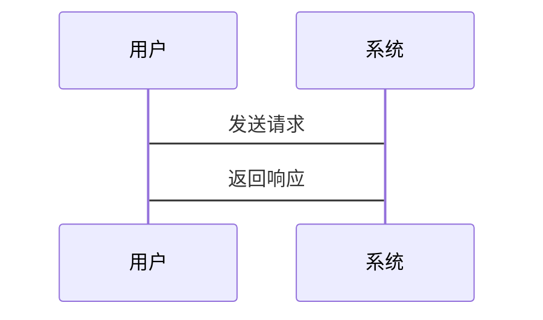

                 


# 如何评估企业的全球化战略执行力

> 关键词：全球化战略、战略执行力、企业评估、战略管理、跨国运营

> 摘要：本文详细探讨了如何评估企业的全球化战略执行力，从核心概念、评估框架、关键问题、评估方法、案例分析、系统架构到项目实战，提供了全面的分析与指导。通过系统的方法和实际案例，帮助读者理解并提升企业在全球化背景下的战略执行能力。

---

## 第一部分：全球化战略概述

### 第1章：背景介绍

#### 1.1 什么是全球化战略
- **全球化战略的定义**：全球化战略是指企业在全球范围内扩展业务，优化资源配置，以实现最大化的市场覆盖和竞争优势。  
- **全球化战略的核心目标**：通过跨国运营，实现更高的销售额、利润率和市场份额。  
- **全球化战略的背景与重要性**：随着经济一体化和信息技术的发展，企业必须考虑全球化战略以保持竞争力。

#### 1.2 全球化战略的背景
- **全球化趋势的驱动因素**：技术进步、贸易自由化、市场扩张、资源优化配置。  
- **全球化对企业的影响**：提升品牌形象、进入新市场、优化成本结构。  
- **全球化战略的演变**：从本地化到全球化，从单一市场到多元化市场。

---

### 第2章：全球化战略的核心概念

#### 2.1 全球化战略的定义与目标
- **全球化战略的定义**：全球化战略是指企业在多个市场进行业务拓展，通过整合资源和优化配置，实现全球范围内的竞争优势。  
- **全球化战略的核心目标**：市场扩张、成本优化、竞争优势。

#### 2.2 全球化战略的关键要素
- **市场分析**：识别目标市场、评估竞争环境、分析消费者需求。  
- **资源配置**：优化资金、技术、人力资源的分配。  
- **风险管理**：识别潜在风险，制定应对策略。

#### 2.3 全球化战略的影响因素
- **经济因素**：汇率波动、贸易政策、经济周期。  
- **政治因素**：政策变化、法律环境、政府监管。  
- **文化因素**：文化差异、消费习惯、商业习俗。

---

## 第二部分：全球化战略执行力的评估框架

### 第3章：全球化战略执行力的评估框架

#### 3.1 什么是全球化战略执行力
- **执行力的定义**：将战略转化为实际成果的能力。  
- **全球化战略执行力的特点**：复杂性、多样性、风险性。

#### 3.2 全球化战略执行力的评估指标
- **市场表现**：市场份额、增长率、客户满意度。  
- **经营效率**：成本控制、利润率、运营效率。  
- **资源配置**：资金使用效率、人力资源配置、技术应用。

#### 3.3 全球化战略执行力的评估模型
- **模型构建**：通过层次分析法（AHP）构建评估模型。  
- **模型应用**：根据权重评估各个指标的表现。

---

## 第三部分：全球化战略执行中的关键问题

### 第4章：全球化战略执行中的关键问题

#### 4.1 全球化战略执行中的文化差异
- **文化差异对企业的影响**：影响市场进入策略、团队协作、客户关系。  
- **如何克服文化差异**：跨文化培训、本地化策略、建立沟通机制。

#### 4.2 全球化战略执行中的法律法规
- **不同国家的法律差异**：劳动法、税法、知识产权法。  
- **如何应对法律挑战**：法律咨询、合规管理、政策跟踪。

#### 4.3 全球化战略执行中的资源配置
- **资源分配的挑战**：资金分配、技术转移、人员调配。  
- **如何优化资源配置**：制定统一标准、建立共享机制、动态调整。

---

## 第四部分：全球化战略执行力的评估方法

### 第5章：全球化战略执行力的评估方法

#### 5.1 评估方法概述
- **KPI分析法**：设定关键绩效指标，定期评估。  
- **SWOT分析法**：评估优势、劣势、机会、威胁。  
- **对标分析法**：与行业标杆对比，寻找差距。

#### 5.2 评估工具与技术
- **数据分析工具**：SPSS、Excel、Power BI。  
- **项目管理工具**：JIRA、Trello、Asana。  
- **评估模型**：层次分析法（AHP）、模糊综合评价法。

---

## 第五部分：全球化战略执行的案例分析

### 第6章：全球化战略执行的案例分析

#### 6.1 成功案例分析
- **某跨国公司的全球化战略执行经验**：通过本地化策略和高效资源配置实现全球扩张。  
- **成功的关键因素**：文化适应、法律合规、资源配置优化。

#### 6.2 失败案例分析
- **某企业在全球化中的失败教训**：忽视文化差异、法律不合规、资源配置不当。  
- **失败的教训**：全球化战略的复杂性要求企业进行全面的规划和风险控制。

---

## 第六部分：全球化战略执行力的系统架构与项目实战

### 第7章：全球化战略执行力的系统架构

#### 7.1 系统功能设计
- **领域模型设计**：定义核心业务领域，如市场分析、资源配置、风险管理。  
- **系统架构设计**：采用分层架构，包括数据层、业务逻辑层、用户界面层。

#### 7.2 系统架构图


#### 7.3 系统接口设计
- **API接口**：提供RESTful API，实现数据交互。  
- **接口设计**：定义请求参数、响应格式、错误处理。

#### 7.4 系统交互设计


### 第8章：项目实战

#### 8.1 环境安装
- **安装步骤**：安装Python、Jupyter Notebook、数据分析库（如Pandas、Matplotlib）。  
- **代码示例**：
  ```python
  import pandas as pd
  data = {'市场': ['A', 'B', 'C'], '销售额': [100, 200, 150]}
  df = pd.DataFrame(data)
  print(df)
  ```

#### 8.2 核心实现
- **代码实现**：使用Python和机器学习算法进行市场分析。  
- **代码示例**：
  ```python
  from sklearn import linear_model
  model = linear_model.LinearRegression()
  model.fit(df[['市场']], df['销售额'])
  print(model.predict([[市场]]))
  ```

#### 8.3 案例分析
- **实际案例**：分析某企业的全球化战略执行情况，应用上述方法进行评估。  
- **详细分析**：从市场表现、资源配置、风险管理等方面进行深入分析，提出改进建议。

---

## 第七部分：总结与展望

### 第9章：总结与展望

#### 9.1 总结
- **核心总结**：全球化战略执行力的评估需要综合考虑市场、资源、法律等多方面因素。  
- **主要收获**：系统的方法和工具能够有效提升评估的准确性和效率。

#### 9.2 展望
- **未来趋势**：随着技术的发展，全球化战略将更加依赖数据分析和人工智能。  
- **发展趋势**：企业将更加注重本地化和风险管理，以应对全球化带来的挑战。

---

## 附录

### 附录A：工具与模板

#### A.1 数据分析工具
- **Python库**：Pandas、NumPy、Matplotlib。  
- **可视化工具**：Tableau、Power BI。

#### A.2 项目管理工具
- **JIRA**：任务跟踪与管理。  
- **Trello**：看板式项目管理。

---

作者：AI天才研究院/AI Genius Institute & 禅与计算机程序设计艺术 /Zen And The Art of Computer Programming

