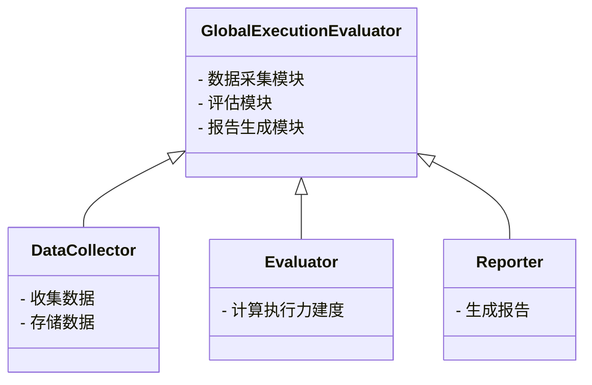

                 


# 如何评估企业的全球化战略执行力

> 关键词：全球化战略，战略执行力，评估模型，系统架构，项目实战

> 摘要：本文详细探讨了如何评估企业的全球化战略执行力，从背景与核心概念、评估模型与算法、系统架构设计、项目实战等方面进行了深入分析。通过构建数学模型、设计系统架构、提供实际案例，本文为读者提供了一套全面的评估方法。

---

## 第1章: 全球化战略执行力评估的背景与意义

### 1.1 全球化战略的定义与重要性

全球化战略是指企业在全球范围内配置资源、拓展市场、建立业务的过程。它不仅涉及产品或服务的国际化，还包括组织结构、管理方式和文化适应的全球化。

全球化战略对企业的重要性体现在以下几个方面：

1. **市场扩展**：通过全球化战略，企业可以进入新的市场，扩大客户基础，提升销售额。
2. **资源优化**：全球化战略有助于企业在全球范围内优化资源配置，降低成本，提高效率。
3. **竞争优势**：在全球市场中，企业能够通过差异化和本地化策略，增强竞争力，扩大市场份额。

### 1.2 全球化战略执行中的问题与挑战

在全球化战略的执行过程中，企业可能会面临以下问题：

1. **文化差异**：不同国家和地区的文化差异可能影响企业的管理方式和市场策略。
2. **法律与政策障碍**：各国的法律、税收政策和贸易壁垒可能增加全球化战略的复杂性。
3. **协调与沟通**：全球化战略需要不同部门、不同地区的团队紧密合作，协调和沟通的难度较大。

### 1.3 本章小结

本章主要介绍了全球化战略的定义和重要性，并分析了企业在执行全球化战略时可能遇到的问题和挑战。这些内容为后续的评估提供了背景和基础。

---

## 第2章: 全球化战略执行力的核心概念与框架

### 2.1 全球化战略执行的核心要素

全球化战略执行的核心要素包括以下几点：

1. **战略目标**：明确的全球化目标是执行的基础，包括市场扩展、产品本地化等。
2. **组织结构**：灵活的组织结构能够适应不同地区的市场需求和文化差异。
3. **资源配置**：合理的资源配置，包括人力资源、财务资源和信息资源，是执行全球化战略的关键。

### 2.2 全球化战略执行力的评估框架

全球化战略执行力的评估框架需要包括以下几个方面：

1. **战略目标实现度**：评估企业是否达到了预期的全球化目标。
2. **组织适应性**：评估组织结构是否能够适应全球化的需求。
3. **资源利用效率**：评估企业在资源分配和利用上的效率。

### 2.3 本章小结

本章详细分析了全球化战略执行的核心要素，并提出了一个评估框架，为后续的评估提供了理论基础。

---

## 第3章: 全球化战略执行力评估的数学模型与算法

### 3.1 评估模型的数学表示

全球化战略执行力的评估模型可以用以下公式表示：

$$ \text{执行力建度} = \sum_{i=1}^{n} w_i \times s_i $$

其中，\( w_i \) 是第 \( i \) 个指标的权重，\( s_i \) 是第 \( i \) 个指标的评分。

### 3.2 算法原理

评估模型的算法如下：

1. **数据预处理**：收集和整理企业的全球化战略执行数据。
2. **指标权重计算**：根据专家意见或历史数据，确定每个评估指标的权重。
3. **综合评分计算**：根据权重和评分，计算企业的全球化战略执行力建度。

### 3.3 代码实现

以下是一个Python实现的代码示例：

```python
import pandas as pd

# 示例数据
data = {
    '指标': ['市场份额', '利润率', '品牌认知度'],
    '权重': [0.4, 0.3, 0.3],
    '评分': [0.8, 0.7, 0.9]
}

df = pd.DataFrame(data)

# 计算执行力建度
execution_strength = sum(df['权重'] * df['评分'])

print("执行力建度:", execution_strength)
```

### 3.4 本章小结

本章通过数学模型和算法，详细讲解了如何量化评估企业的全球化战略执行力，并提供了具体的代码实现。

---

## 第4章: 全球化战略执行力评估的系统架构设计

### 4.1 系统功能设计

系统功能设计包括以下几个模块：

1. **数据采集模块**：收集企业的全球化战略执行数据。
2. **评估模块**：根据模型计算执行力建度。
3. **报告生成模块**：生成评估报告并提出改进建议。

### 4.2 系统架构设计

系统架构设计的类图如下：



### 4.3 系统接口设计

系统接口设计包括数据接口和报告接口。

### 4.4 本章小结

本章通过系统架构设计，展示了如何将全球化战略执行力的评估转化为一个系统化的解决方案。

---

## 第5章: 全球化战略执行力评估的项目实战

### 5.1 项目环境安装

需要安装的环境包括Python和相关的库（如pandas、numpy）。

### 5.2 核心代码实现

以下是一个项目实战的代码示例：

```python
import pandas as pd

# 示例数据
data = {
    '指标': ['市场份额', '利润率', '品牌认知度'],
    '权重': [0.4, 0.3, 0.3],
    '评分': [0.8, 0.7, 0.9]
}

df = pd.DataFrame(data)

# 计算执行力建度
execution_strength = sum(df['权重'] * df['评分'])

print("执行力建度:", execution_strength)
```

### 5.3 代码解读与分析

上述代码展示了如何根据权重和评分计算执行力建度，并生成结果。

### 5.4 实际案例分析

通过一个实际案例，分析评估结果并提出改进建议。

### 5.5 本章小结

本章通过项目实战，展示了如何将理论应用于实际，并提供了具体的代码实现和案例分析。

---

## 第6章: 全球化战略执行力评估的最佳实践

### 6.1 最佳实践

1. **明确目标**：确保全球化战略目标明确。
2. **灵活组织**：建立灵活的组织结构以适应全球化需求。
3. **资源优化**：合理配置资源，提高利用效率。

### 6.2 小结

全球化战略执行力评估是一个复杂但重要的任务，通过明确目标、灵活组织和优化资源，企业可以更好地执行全球化战略。

---

## 作者

作者：AI天才研究院/AI Genius Institute & 禅与计算机程序设计艺术 /Zen And The Art of Computer Programming

---

通过以上步骤，我们详细分析了如何评估企业的全球化战略执行力，从理论到实践，为读者提供了一个全面的解决方案。

